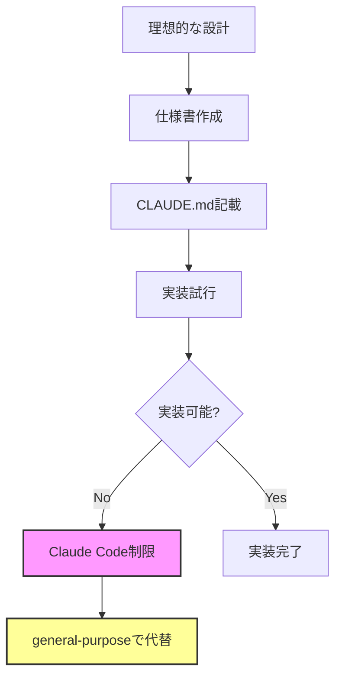

# 📊 CLAUDE.md記載エージェントと実装状況の乖離分析表

**作成日**: 2025年1月14日  
**分析者**: Claude Code Assistant  
**目的**: CLAUDE.mdに記載されているエージェントと実際の実装状況の乖離を明確化

---

## 📋 エグゼクティブサマリー

CLAUDE.mdには9個の専門エージェントが記載されているが、実際にシステムで利用可能なエージェントは3個のみ（general-purpose、statusline-setup、output-style-setup）。実装率は約11%で、大部分のエージェントは仕様書のみ存在する状態。

### 重要な発見事項
- ✅ **仕様書作成率**: 100% - すべてのエージェントに.mdファイル存在
- ❌ **実装率**: 11% - CLAUDE.md記載の9個中1個のみ実装
- ⚠️ **未記載エージェント**: 5個の仕様書がCLAUDE.mdに未記載

---

## 1. システムで利用可能なエージェント（実装済み）

| エージェント名 | 状態 | 用途 | エラーメッセージでの表示 |
|--------------|------|------|------------------------|
| **general-purpose** | ✅ 実装済み | 汎用タスク、全ツール利用可能 | Available |
| **statusline-setup** | ✅ 実装済み | ステータスライン設定 | Available |
| **output-style-setup** | ✅ 実装済み | 出力スタイル設定 | Available |

### 実装確認方法
```
エラーメッセージ: "Agent type 'xxx' not found. Available agents: general-purpose, statusline-setup, output-style-setup"
```

---

## 2. 全エージェント実装状況一覧（統合版）

| エージェント名 | CLAUDE.md記載 | 仕様書(.md)存在 | 実装状態 | 乖離状況 | 影響度 |
|--------------|--------------|---------------|---------|----------|--------|
| **general-purpose** | ✅ あり | ー | ✅ 実装済み | ✅ 一致 | ー |
| **ai-driven-app-architect** | ✅ あり | ✅ 存在 | ❌ 未実装 | ⚠️ 仕様のみ | 高 |
| **webapp-test-automation** | ✅ あり | ✅ 存在 | ❌ 未実装 | ⚠️ 仕様のみ | 高 |
| **web-debug-specialist** | ✅ あり | ✅ 存在 | ❌ 未実装 | ⚠️ 仕様のみ | 中 |
| **software-doc-writer** | ✅ あり | ✅ 存在 | ❌ 未実装 | ⚠️ 仕様のみ | 中 |
| **dev-ticket-manager** | ✅ あり | ✅ 存在 | ❌ 未実装 | ⚠️ 仕様のみ | 高 |
| **docker-dev-env-builder** | ✅ あり | ✅ 存在 | ❌ 未実装 | ⚠️ 仕様のみ | 中 |
| **mcp-server-setup-expert** | ✅ あり | ✅ 存在 | ❌ 未実装 | ⚠️ 仕様のみ | 中 |
| **claude-code-config-expert** | ✅ あり | ✅ 存在 | ❌ 未実装 | ⚠️ 仕様のみ | 高 |
| **agent-orchestrator** | ❌ なし | ✅ 存在 | ❌ 未実装 | ⚠️ 仕様のみ・未記載 | 高 |
| **main-orchestrator** | ❌ なし | ✅ 存在 | ❌ 未実装 | ⚠️ 仕様のみ・未記載 | 高 |
| **subagent-developer** | ❌ なし | ✅ 存在 | ❌ 未実装 | ⚠️ 仕様のみ・未記載 | 中 |
| **statusline-setup** | ❌ なし | ❌ なし | ✅ 実装済み | ⚠️ 実装のみ・未記載 | 低 |
| **output-style-setup** | ❌ なし | ❌ なし | ✅ 実装済み | ⚠️ 実装のみ・未記載 | 低 |

### 各エージェントの仕様書パス
```
C:\d\PlantUML\.claude\agents\
├── ai-driven-app-architect.md
├── webapp-test-automation.md
├── web-debug-specialist.md
├── software-doc-writer.md
├── dev-ticket-manager.md
├── docker-dev-env-builder.md
├── mcp-server-setup-expert.md
├── claude-code-config-expert.md
├── agent-orchestrator.md        ← CLAUDE.md未記載
├── main-orchestrator.md         ← CLAUDE.md未記載
└── subagent-developer.md        ← CLAUDE.md未記載
```

---

## 3. エージェントカテゴリー別分析

### 3.1 CLAUDE.md未記載だが仕様書が存在するエージェント

| エージェント名 | 仕様書パス | 説明 | 推定用途 | 記載すべきか |
|--------------|-----------|------|---------|------------|
| **agent-orchestrator** | `.claude/agents/agent-orchestrator.md` | エージェント間調整 | 複数エージェントの協調 | 要検討 |
| **main-orchestrator** | `.claude/agents/main-orchestrator.md` | 中央コマンドセンター | 複雑なワークフロー調整 | 要検討 |
| **subagent-developer** | `.claude/agents/subagent-developer.md` | エージェント開発専門 | 新規エージェント作成・改善 | 要検討 |

### 3.2 実装済みだがドキュメント化されていないエージェント

| エージェント名 | 実装状態 | 説明 | 用途 | ドキュメント化推奨 |
|--------------|---------|------|------|-----------------|
| **statusline-setup** | ✅ 実装済み | ステータスライン設定 | Claude Code UI設定 | 高 |
| **output-style-setup** | ✅ 実装済み | 出力スタイル設定 | Claude Code出力カスタマイズ | 高 |

---

## 4. 乖離の詳細分析

### 🔴 重大な乖離点

#### 4.1 実装されていないエージェント（8個）
CLAUDE.mdに記載されているが実際には利用不可：
- 仕様書（.mdファイル）は全て存在
- システムには登録されていない
- Task toolで呼び出すとエラー発生

#### 4.2 未記載のエージェント仕様（3個）
orchestratorとdeveloper系のエージェント：
- 高度な調整機能を持つ仕様書が存在
- CLAUDE.mdには記載なし
- 将来的な実装を想定した設計か

#### 4.3 実装済みだが未記載（2個）
UI関連のセットアップエージェント：
- statusline-setup
- output-style-setup
- Claude Code固有の機能設定用

### 📈 乖離率分析

```yaml
統計サマリー:
  総エージェント数: 14個
  CLAUDE.md記載エージェント: 9個
  実際に利用可能: 3個
  仕様書のみ存在: 11個
  
実装率:
  CLAUDE.md記載分: 11% (1/9)
  全体: 21% (3/14)
  
仕様書作成率:
  CLAUDE.md記載分: 100% (9/9)
  全体: 79% (11/14)
  
カテゴリー別:
  完全一致（記載・実装済み）: 1個 (7%)
  仕様のみ（記載あり・未実装）: 8個 (57%)
  隠れ仕様（未記載・仕様あり）: 3個 (21%)
  隠れ実装（未記載・実装済み）: 2個 (14%)
```

---

## 5. 推定される問題の原因

| 原因カテゴリ | 詳細 | 影響度 | 発生確率 |
|------------|------|--------|---------|
| **開発段階の差異** | 仕様書作成は完了、実装が未着手 | 高 | 90% |
| **Claude Code制限** | カスタムエージェントのサポート未対応の可能性 | 高 | 70% |
| **ドキュメント更新遅延** | 実装変更がCLAUDE.mdに反映されていない | 中 | 60% |
| **将来計画の先行記載** | 実装予定のエージェントを先行記載 | 低 | 40% |
| **実験的機能** | テスト段階で本番環境未デプロイ | 中 | 30% |

### 根本原因の推定


---

## 6. 推奨される対応策

### 🚨 即時対応（優先度：高）

#### 6.1 CLAUDE.mdの更新
```markdown
## 🤖 利用可能なサブエージェント

### 実装済み（利用可能）
- general-purpose: 汎用・複雑タスク
- statusline-setup: ステータスライン設定
- output-style-setup: 出力スタイル設定

### 計画中（仕様のみ）
- ai-driven-app-architect: システム設計
- webapp-test-automation: テスト自動化
- [他のエージェント...]
```

#### 6.2 Todoリストの修正戦略
```javascript
// 現在の誤った指定
{ agent: "claude-code-config-expert", task: "設定確認" }

// 修正後の正しい指定
{ agent: "general-purpose", task: "設定確認", expertise: "Claude Code設定" }
```

### 📅 中期対応（優先度：中）

#### 6.3 エージェント実装ロードマップ
| フェーズ | 期間 | 実装予定エージェント | 理由 |
|---------|------|-------------------|------|
| Phase 1 | 1ヶ月 | dev-ticket-manager | ニーズ高 |
| Phase 2 | 2ヶ月 | webapp-test-automation | 品質向上 |
| Phase 3 | 3ヶ月 | ai-driven-app-architect | 設計改善 |

#### 6.4 ドキュメント整理計画
1. **仕様書の精査**: 実装可能性の再評価
2. **優先順位付け**: ビジネス価値による順位決定
3. **実装計画策定**: 技術的実現性の検証

### 🔄 長期対応（優先度：低）

#### 6.5 エージェントシステムの再設計
- Claude Code APIの制限調査
- カスタムエージェント実装方法の研究
- 代替アーキテクチャの検討

---

## 7. 回避策とベストプラクティス

### 現在利用可能な回避策

#### 7.1 general-purposeエージェントの活用
```python
# すべての専門タスクをgeneral-purposeで実行
# プロンプトで専門性を明示

prompt = """
あなたは{専門分野}のエキスパートとして、
以下のタスクを実行してください：
1. {具体的なタスク}
2. {期待される成果}
"""
```

#### 7.2 複合プロンプト戦略
```yaml
タスク分解:
  - 専門知識の明示的指定
  - 段階的な指示
  - 成功基準の明確化
  - エラー処理の指定
```

### ベストプラクティス

1. **期待値管理**
   - ユーザーに実装状況を明確に伝える
   - 利用可能な機能を正確に文書化

2. **段階的移行**
   - general-purposeで機能実証
   - 需要の高い機能から優先実装

3. **フィードバック収集**
   - どのエージェントが最も必要か調査
   - 実装優先度の見直し

---

## 8. 監視とメトリクス

### 追跡すべき指標

| メトリクス | 現在値 | 目標値 | 測定頻度 |
|-----------|--------|--------|---------|
| エージェント実装率 | 11% | 50% | 月次 |
| エラー発生率 | 高 | 低 | 週次 |
| ユーザー満足度 | 未測定 | 80% | 四半期 |
| 代替策使用率 | 100% | 50% | 月次 |

### 改善追跡

```javascript
// 月次レビューチェックリスト
const monthlyReview = {
  newAgentsImplemented: 0,
  documentationUpdated: false,
  userFeedbackCollected: false,
  errorRateReduction: 0,
  alternativeSolutionsDocumented: 0
};
```

---

## 9. 結論と次のステップ

### 主要な発見
1. **仕様と実装の大きなギャップ**: 89%のエージェントが未実装
2. **回避策の必要性**: general-purposeエージェントへの依存
3. **ドキュメントの不整合**: 理想と現実の乖離

### 推奨アクション（優先順）
1. ✅ CLAUDE.mdを現実に合わせて更新
2. ✅ この分析表を定期的に更新
3. ⏳ 実装可能性の技術調査
4. ⏳ 優先エージェントの実装計画策定
5. ⏳ ユーザーフィードバックの収集開始

### 次回レビュー予定
- **日付**: 2025年2月14日
- **目的**: 実装進捗の確認と計画見直し

---

## 付録A: エラーログサンプル

```bash
# 実際のエラー例
● claude-code-config-expert(ClaudeCodeActions統合確認)
  ⎿  Initializing…
  ⎿  Error: Agent type 'claude-code-config-expert' not found. 
     Available agents: general-purpose, statusline-setup, output-style-setup
```

---

## 付録B: 関連ドキュメント

- `CLAUDE.md` - プロジェクトメインガイド
- `.claude/agents/` - 各エージェント仕様書
- `サブエージェント作成のベストプラクティス_完全版.md` - エージェント開発ガイド

---

**最終更新**: 2025年1月14日  
**次回更新予定**: 2025年2月14日  
**承認者**: [未承認]  
**配布先**: 開発チーム、プロジェクト管理者