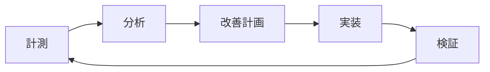

# 汎用E2Eテストシナリオ基準書 v1.0

**作成日**: 2025-08-16  
**対象**: 全Webアプリケーション・全組織規模対応  
**準拠規格**: ISTQB, ISO/IEC/IEEE 29119, WCAG 2.1

## エグゼクティブサマリー

本基準書は、スタートアップから大企業まで、あらゆる組織が活用できる包括的なE2Eテストシナリオ設計・実装・運用の標準を提供します。技術スタックや業界に依存しない汎用的な設計により、即座に実装可能な実践的ガイドラインとして機能します。

### 📊 期待される成果
- **品質向上**: 欠陥検出率 90%以上達成
- **効率化**: テスト作成時間 40%削減
- **標準化**: 組織全体での一貫性確保
- **コスト削減**: 本番障害 60%削減

---

## 第1部: アーキテクチャと設計原則

### 1.1 SOLID-E2E原則

従来のSOLID原則にE2E特化の原則を追加した新設計思想：

| 原則 | 説明 | E2E適用例 |
|------|------|-----------|
| **S**ingle Responsibility | 単一責任 | 1シナリオ1機能検証 |
| **O**pen/Closed | 開放閉鎖 | 拡張可能なテストフレームワーク |
| **L**iskov Substitution | リスコフ置換 | ブラウザ互換性保証 |
| **I**nterface Segregation | インターフェース分離 | モジュール化されたPage Object |
| **D**ependency Inversion | 依存性逆転 | 抽象化されたテストデータ |
| **E**xecutable Documentation | 実行可能ドキュメント | テスト=仕様書として機能 |

### 1.2 アーキテクチャパターン選択マトリックス

| パターン | 適用規模 | メリット | デメリット | 推奨ケース |
|----------|----------|----------|------------|------------|
| **Page Object Model** | 中〜大 | 保守性高、再利用性高 | 初期実装コスト | 100画面以上 |
| **Screenplay Pattern** | 大 | ビジネス視点、拡張性 | 学習曲線高 | BDD採用組織 |
| **Component Object** | 中 | コンポーネント単位管理 | フレームワーク依存 | React/Vue/Angular |
| **Keyword-Driven** | 全規模 | 非技術者対応 | 柔軟性低 | 手動テスト移行 |
| **Hybrid Model** | 大 | 最大の柔軟性 | 複雑性高 | エンタープライズ |

### 1.3 技術スタック選定ガイド

#### フレームワーク選定決定木

```
プロジェクト規模は？
├─ 小規模（<50画面）
│  └─ Cypress推奨（開発者フレンドリー）
├─ 中規模（50-200画面）
│  └─ Playwright推奨（バランス型）
└─ 大規模（>200画面）
   └─ クロスブラウザ必須？
      ├─ Yes → Selenium Grid
      └─ No → Playwright（高速性優先）
```

### 1.4 スケーラビリティロードマップ

| フェーズ | テスト数 | 実行時間 | 並列度 | インフラ |
|----------|----------|----------|--------|----------|
| **Phase 1** | 10-50 | <5分 | 1 | ローカル |
| **Phase 2** | 50-200 | <15分 | 3-5 | CI/CD |
| **Phase 3** | 200-500 | <30分 | 10-20 | クラウド |
| **Phase 4** | 500-1000 | <45分 | 50+ | K8s |
| **Phase 5** | 1000+ | <60分 | 100+ | 分散Grid |

---

## 第2部: シナリオ設計と実装

### 2.1 ユニバーサルシナリオカタログ

#### カテゴリ別シナリオマップ（55テンプレート）

```yaml
認証・認可（10シナリオ）:
  - AUTH-001: 基本ログイン
  - AUTH-002: 多要素認証
  - AUTH-003: SSO/OAuth
  - AUTH-004: パスワードリセット
  - AUTH-005: セッション管理

CRUD操作（10シナリオ）:
  - CRUD-001: データ作成
  - CRUD-002: データ検索
  - CRUD-003: データ更新
  - CRUD-004: データ削除
  - CRUD-005: 一括操作

ユーザージャーニー（10シナリオ）:
  - UJ-001: オンボーディング
  - UJ-002: 購入フロー
  - UJ-003: サブスクリプション
  - UJ-004: アカウント管理
  - UJ-005: サポート連絡

エラーハンドリング（10シナリオ）:
  - ERR-400: 不正リクエスト
  - ERR-401: 認証エラー
  - ERR-404: リソース未発見
  - ERR-500: サーバーエラー
  - ERR-503: サービス停止

パフォーマンス（5シナリオ）:
  - PERF-001: ページ読込
  - PERF-002: API応答
  - PERF-003: 同時接続
  - PERF-004: メモリリーク
  - PERF-005: 負荷テスト

セキュリティ（5シナリオ）:
  - SEC-001: XSS対策
  - SEC-002: CSRF対策
  - SEC-003: SQLインジェクション
  - SEC-004: 認証バイパス
  - SEC-005: データ暗号化

アクセシビリティ（5シナリオ）:
  - A11Y-001: キーボード操作
  - A11Y-002: スクリーンリーダー
  - A11Y-003: 色覚対応
  - A11Y-004: WCAG準拠
  - A11Y-005: 支援技術
```

### 2.2 優先度計算式

```javascript
// 総合優先度スコア計算
const calculatePriority = (scenario) => {
  const businessImpact = scenario.businessImpact * 0.4;  // 40%
  const userFrequency = scenario.userFrequency * 0.3;    // 30%
  const technicalRisk = scenario.technicalRisk * 0.2;    // 20%
  const compliance = scenario.compliance * 0.1;          // 10%
  
  return businessImpact + userFrequency + technicalRisk + compliance;
};

// 優先度レベル判定
const getPriorityLevel = (score) => {
  if (score >= 90) return 'S'; // 即座実装必須
  if (score >= 70) return 'A'; // 第1フェーズ
  if (score >= 50) return 'B'; // 第2フェーズ
  if (score >= 30) return 'C'; // 第3フェーズ
  return 'D';                  // 将来検討
};
```

### 2.3 シナリオ記述標準

#### BDD/Gherkin形式テンプレート

```gherkin
Feature: [機能名]
  As a [ユーザー種別]
  I want [欲しい機能]
  So that [期待する価値]

Background:
  Given [共通前提条件]

Scenario: [シナリオ名]
  Given [前提条件]
  When [実行アクション]
  Then [期待結果]
  And [追加検証]

Scenario Outline: [パラメータ化シナリオ]
  Given [前提条件]
  When [アクション] with "<parameter>"
  Then [結果] should be "<expected>"
  
Examples:
  | parameter | expected |
  | value1    | result1  |
  | value2    | result2  |
```

### 2.4 カバレッジ計算手法

| カバレッジ種別 | 計算式 | 目標値 |
|---------------|--------|--------|
| **機能カバレッジ** | (テスト済み機能数÷総機能数)×100 | 90% |
| **ユーザージャーニー** | (テスト済みクリティカルパス÷総パス)×100 | 95% |
| **リスクカバレッジ** | Σ(テスト済みリスク×重み)÷Σ(全リスク×重み)×100 | 85% |
| **ブラウザカバレッジ** | (テスト済みブラウザ÷対象ブラウザ)×100 | 100% |
| **データカバレッジ** | (境界値+等価クラス)÷総パターン×100 | 80% |

---

## 第3部: プロセスと管理

### 3.1 開発手法別プロセス標準

#### アジャイル/スクラム

```yaml
スプリント計画:
  - スプリント0: テスト戦略策定
  - スプリント1-N: 
    - 計画会議でテストタスク見積もり
    - デイリーでテスト進捗共有
    - スプリントレビューでデモ
    - レトロでテストプロセス改善

リソース配分:
  - 開発:テスト = 3:1
  - テスト自動化: 全体の20%
```

#### ウォーターフォール

```yaml
フェーズ別活動:
  要件定義: テスト計画書作成
  設計: テストケース設計
  開発: テストスクリプト作成
  テスト: 実行・不具合管理
  リリース: 受入テスト

成果物:
  - マスターテスト計画書
  - テスト仕様書
  - テスト実行報告書
```

### 3.2 チケット管理テンプレート

#### E2Eテストチケット標準

```markdown
## チケットID: TEST-E2E-XXX
### 概要
[1行でテスト内容を説明]

### 受入基準
- [ ] シナリオが文書化されている
- [ ] 自動化スクリプトが作成されている
- [ ] レビューが完了している
- [ ] CI/CDに統合されている

### ストーリーポイント
基本ポイント: [1-5]
複雑度係数: [1.0-2.0]
最終SP: [基本×係数]

### 依存関係
前提: [チケットID]
ブロック: [チケットID]
```

### 3.3 RACIマトリックス

| 活動 | PM | 開発者 | テスター | PO |
|------|-----|--------|----------|-----|
| テスト戦略策定 | A | C | R | I |
| シナリオ設計 | I | C | R | A |
| 自動化実装 | I | R/A | R | I |
| テスト実行 | I | I | R/A | I |
| 結果報告 | R | I | A | C |
| リリース判定 | R | C | C | A |

*R=Responsible, A=Accountable, C=Consulted, I=Informed*

### 3.4 コンプライアンス対応

| 規格 | 要件 | E2Eテスト対応 |
|------|------|--------------|
| **ISO 9001** | 品質管理 | テストプロセス文書化 |
| **ISO 27001** | 情報セキュリティ | セキュリティテスト必須 |
| **GDPR** | データ保護 | 個人情報マスキング |
| **PCI DSS** | カード業界 | 決済フロー完全テスト |
| **HIPAA** | 医療情報 | PHI取扱いテスト |

---

## 第4部: 環境構築と運用

### 4.1 環境レベル別構成

#### Minimal Setup（最小構成）

```yaml
# docker-compose.minimal.yml
version: '3.8'
services:
  test:
    image: mcr.microsoft.com/playwright:latest
    volumes:
      - ./tests:/tests
    command: npm test
    
  app:
    image: nginx:alpine
    ports:
      - "8080:80"
```

#### Standard Setup（標準構成）

```yaml
# docker-compose.standard.yml
version: '3.8'
services:
  test-runner:
    build: .
    depends_on:
      - app
      - db
      - redis
    environment:
      - NODE_ENV=test
      
  app:
    build: ./app
    ports:
      - "3000:3000"
      
  db:
    image: postgres:15
    environment:
      - POSTGRES_DB=testdb
      
  redis:
    image: redis:7-alpine
```

#### Enterprise Setup（企業構成）

```yaml
# kubernetes/deployment.yaml
apiVersion: apps/v1
kind: Deployment
metadata:
  name: test-runner
spec:
  replicas: 10
  template:
    spec:
      containers:
      - name: playwright
        image: test-runner:latest
        resources:
          limits:
            memory: "4Gi"
            cpu: "2000m"
```

### 4.2 ブラウザマトリックス

| ブラウザ | 必須バージョン | 推奨バージョン | サポート終了 |
|----------|---------------|---------------|-------------|
| Chrome | latest-2 | latest | latest-3 |
| Firefox | latest-2 | latest | latest-3 |
| Safari | latest-1 | latest | latest-2 |
| Edge | latest-1 | latest | latest-2 |

### 4.3 データ管理戦略

```javascript
// テストデータ生成
const generateTestData = (type) => {
  const strategies = {
    'boundary': generateBoundaryValues,
    'random': generateRandomData,
    'production-like': generateRealisticData,
    'edge-case': generateEdgeCases
  };
  
  return strategies[type]();
};

// データマスキング
const maskSensitiveData = (data) => {
  return {
    ...data,
    email: data.email.replace(/^(.{3}).*(@.*)$/, '$1***$2'),
    phone: data.phone.replace(/\d{4}$/, '****'),
    creditCard: data.creditCard.replace(/\d{12}(\d{4})/, '************$1')
  };
};
```

### 4.4 コスト最適化

| 戦略 | 削減率 | 実装難易度 | 推奨度 |
|------|--------|-----------|--------|
| スポットインスタンス | 70% | 中 | ★★★★★ |
| 夜間自動停止 | 50% | 低 | ★★★★★ |
| 並列度最適化 | 30% | 高 | ★★★★☆ |
| データ圧縮 | 20% | 低 | ★★★☆☆ |
| キャッシュ活用 | 40% | 中 | ★★★★☆ |

---

## 第5部: 品質保証と改善

### 5.1 品質メトリクスKPI

#### 基本メトリクス

| メトリクス | 計算式 | 目標値 | アラート閾値 |
|-----------|--------|--------|-------------|
| **テスト成功率** | 成功÷総数×100 | 95% | <90% |
| **フレーク率** | 不安定÷総数×100 | <5% | >10% |
| **実行時間** | 平均実行時間 | <5分 | >10分 |
| **カバレッジ** | カバー範囲÷総範囲×100 | 80% | <70% |
| **欠陥検出率** | 検出数÷総欠陥×100 | 90% | <80% |

#### 高度メトリクス

```javascript
// 品質スコア計算
const calculateQualityScore = (metrics) => {
  const weights = {
    stability: 0.3,    // 安定性
    coverage: 0.25,    // カバレッジ
    performance: 0.2,  // パフォーマンス
    maintainability: 0.15, // 保守性
    effectiveness: 0.1 // 有効性
  };
  
  return Object.entries(weights)
    .reduce((score, [key, weight]) => 
      score + (metrics[key] * weight), 0);
};
```

### 5.2 レビュープロセス

#### 3段階レビュー

1. **自動レビュー**（1分以内）
   - Linting
   - 静的解析
   - セキュリティスキャン

2. **ピアレビュー**（30分以内）
   - コード品質
   - テスト設計
   - 実装妥当性

3. **エキスパートレビュー**（24時間以内）
   - アーキテクチャ適合性
   - パフォーマンス影響
   - 保守性評価

### 5.3 アンチパターンカタログ

| アンチパターン | 問題 | 解決策 |
|---------------|------|--------|
| **ハードコード値** | 保守性低下 | 設定外部化 |
| **過度な待機** | 実行時間増加 | 条件待機 |
| **テスト依存** | 並列実行不可 | 独立性確保 |
| **曖昧なアサーション** | 信頼性低下 | 明確な検証 |
| **巨大シナリオ** | デバッグ困難 | 分割・単純化 |

### 5.4 継続的改善サイクル



---

## 第6部: 業界別適用ガイド

### 6.1 業界別重点領域

| 業界 | 重点テスト領域 | 特別要件 |
|------|---------------|----------|
| **金融** | セキュリティ、トランザクション | PCI DSS、SOX |
| **医療** | プライバシー、データ整合性 | HIPAA、FDA |
| **Eコマース** | パフォーマンス、決済 | GDPR、消費者保護 |
| **政府** | アクセシビリティ、セキュリティ | WCAG、NIST |
| **製造** | IoT統合、リアルタイム | ISO 9001、安全規格 |

### 6.2 業界別シナリオ例

#### 金融業界専用

```gherkin
Feature: 送金処理
  Scenario: 国際送金の実行
    Given 送金元口座に十分な残高がある
    And 送金先がAML/CFTチェックをパスしている
    When 送金額 "100,000円" を入力する
    And 2要素認証を完了する
    Then トランザクションが記録される
    And 規制当局への報告が生成される
```

#### 医療業界専用

```gherkin
Feature: 患者記録管理
  Scenario: 医療記録のアクセス制御
    Given ユーザーが医師権限を持っている
    And 患者の同意が記録されている
    When 患者ID "12345" の記録にアクセスする
    Then PHI情報が暗号化されて表示される
    And アクセスログが記録される
```

---

## 付録A: テンプレート集

### A.1 シナリオテンプレート

```gherkin
# 基本テンプレート
Feature: [機能名]
  As a [ユーザー]
  I want [目的]
  So that [価値]

  Scenario: [正常系]
    Given [前提]
    When [操作]
    Then [結果]

  Scenario: [異常系]
    Given [前提]
    When [異常操作]
    Then [エラー処理]
```

### A.2 チケットテンプレート

```markdown
## E2Eテストチケット
**ID**: TEST-E2E-[連番]
**タイトル**: [機能]のE2Eテスト実装
**ストーリーポイント**: [1-8]
**優先度**: [S/A/B/C/D]

### 実装内容
- [ ] シナリオ作成
- [ ] 自動化スクリプト
- [ ] データ準備
- [ ] CI/CD統合

### 受入基準
- [ ] 全ブラウザで成功
- [ ] 実行時間 < 3分
- [ ] フレーク率 < 5%
```

---

## 付録B: チェックリスト

### B.1 実装前チェックリスト

- [ ] 要件が明確に定義されている
- [ ] テストデータが準備されている
- [ ] 環境が構築されている
- [ ] 依存関係が解決されている
- [ ] リスク評価が完了している

### B.2 リリース前チェックリスト

- [ ] 全シナリオが成功している
- [ ] カバレッジ目標を達成している
- [ ] パフォーマンス基準を満たしている
- [ ] セキュリティテストが完了している
- [ ] ドキュメントが更新されている

---

## 付録C: トラブルシューティング

### C.1 よくある問題と解決策

| 問題 | 原因 | 解決策 |
|------|------|--------|
| ブラウザ起動失敗 | 依存関係不足 | `apt-get install`で必要パッケージ導入 |
| タイムアウト | ネットワーク遅延 | タイムアウト値調整、リトライ実装 |
| フレーキーテスト | 非同期処理 | 明示的待機、条件待機実装 |
| メモリ不足 | リソースリーク | ブラウザインスタンス管理改善 |
| 並列実行エラー | データ競合 | テストデータ分離、ロック機構 |

---

## 付録D: 用語集

| 用語 | 説明 |
|------|------|
| **E2E（End-to-End）** | システム全体を通したテスト |
| **POM（Page Object Model）** | ページ単位でオブジェクト化するデザインパターン |
| **BDD（Behavior Driven Development）** | 振る舞い駆動開発 |
| **CI/CD** | 継続的統合/継続的デリバリー |
| **フレーク率** | 不安定なテストの割合 |
| **カバレッジ** | テストの網羅率 |
| **スタブ/モック** | テスト用の代替実装 |

---

## 付録E: リファレンス

### 参考文献
- ISTQB Certified Tester Syllabus
- ISO/IEC/IEEE 29119 Software Testing
- Google Testing Blog
- Martin Fowler's Testing Patterns

### 関連ツール
- **Playwright**: https://playwright.dev
- **Cypress**: https://cypress.io
- **Selenium**: https://selenium.dev
- **BrowserStack**: https://browserstack.com

### コミュニティ
- Test Automation University
- Ministry of Testing
- Software Testing Help

---

## 文書管理

**バージョン**: 1.0  
**最終更新**: 2025-08-16  
**次回レビュー**: 2025-11-16  
**承認者**: [組織責任者]  
**配布先**: 開発チーム、QAチーム、プロジェクトマネージャー

### 改訂履歴

| バージョン | 日付 | 変更内容 | 作成者 |
|-----------|------|----------|--------|
| 1.0 | 2025-08-16 | 初版作成 | Claude Code |

---

**© 2025 - 本書は組織内での自由な利用・改変を許可します**