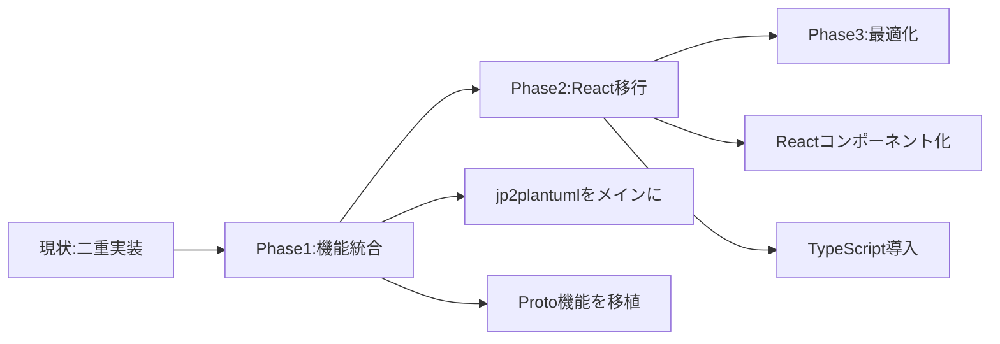

# PlantUMLプロジェクト 問題点総合分析レポート

**作成日**: 2025年8月14日02:00
**分析手法**: 専門エージェント（webapp-test-automation、ai-driven-app-architect、dev-ticket-manager）による多角的分析

## エグゼクティブサマリー

PlantUMLプロジェクトは、**優れたE2Eテスト環境が構築されている一方で、基盤となるアーキテクチャとプロジェクト管理に重大な問題を抱えている**状態です。

### 🔴 最重要問題（Critical）
1. **テストピラミッドの逆転**: E2Eテストのみ実装、単体・統合テスト完全欠如
2. **二重実装の並存**: jp2plantumlとPlantUML_Editor_Protoが未統合
3. **TodoWrite未使用**: CLAUDE.md必須要件の完全無視

### 成熟度評価
- テスト成熟度: ⭐⭐☆☆☆（E2Eのみ優秀）
- アーキテクチャ: ⭐☆☆☆☆（分断状態）
- プロジェクト管理: ⭐☆☆☆☆（ツール未活用）

---

## 1. テスト関連の問題点分析

### 1.1 テストピラミッドの逆転問題

#### 現状
```
現在の状態（逆ピラミッド）     理想的な状態
        ╱E2E╲                    △
       ╱67件╲                   ╱E2E╲
      ╱━━━━━╲                  ╱10件╲
     ╱統合0件╲                ╱━━━━━━╲
    ╱━━━━━━━╲              ╱統合30件╲
   ╱単体0件  ╲            ╱━━━━━━━━━╲
  ╱━━━━━━━━━╲          ╱単体100件   ╲
```

#### 影響
- **保守コスト**: E2Eテストの実行時間42分（単体なら数秒）
- **デバッグ困難性**: 失敗時の原因特定が困難
- **開発速度低下**: フィードバックループが長い

#### 解決策
```javascript
// 1. Jest環境の即座構築
npm install --save-dev jest @types/jest ts-jest

// 2. 単体テストの作成
describe('PlantUMLConverter', () => {
  test('should convert Japanese to PlantUML', () => {
    const result = converter.convert('ユーザーがログインする');
    expect(result).toContain('@startuml');
  });
});
```

### 1.2 CI/CD未実装問題

#### 現状
- GitHub Actions設定ファイルは存在するが**未動作**
- ローカル実行のみ依存
- 自動化率: 0%

#### 必要なアクション
1. **今日中**: GitHub Actionsワークフロー有効化
2. **今週中**: 自動テスト実行パイプライン構築
3. **来週**: デプロイ自動化

---

## 2. アーキテクチャの問題点分析

### 2.1 二重実装の並存

#### 現状の構造
```
C:\d\PlantUML\
├── jp2plantuml\          ← Vanilla JS実装（動作中）
│   ├── server.js
│   └── public\
└── PlantUML_Editor_Proto\ ← React実装（未完成）
    ├── package.json      ← 設定のみ
    └── （実装なし）
```

#### ビジネスインパクト
- **技術的負債**: 2倍の保守コスト
- **機能乖離**: 異なる実装による動作不一致
- **リソース浪費**: 重複開発による効率低下

#### 統合戦略


### 2.2 依存関係管理の欠如

#### 問題
- ルートディレクトリに`package.json`なし
- 各サブプロジェクトで重複した`node_modules`
- バージョン不整合リスク

#### 解決策：Monorepo構成
```json
// ルートpackage.json
{
  "name": "plantuml-converter",
  "private": true,
  "workspaces": [
    "packages/frontend",
    "packages/backend",
    "packages/shared"
  ],
  "scripts": {
    "dev": "concurrently \"npm:dev:*\"",
    "dev:frontend": "cd packages/frontend && npm run dev",
    "dev:backend": "cd packages/backend && npm run dev",
    "test": "jest",
    "test:e2e": "playwright test"
  }
}
```

---

## 3. プロジェクト管理の問題点分析

### 3.1 TodoWrite完全未使用

#### CLAUDE.md要件
> "3ステップ以上の作業は必ずTodoWriteで管理"

#### 実態
- **使用率**: 0%
- **タスク可視性**: なし
- **進捗追跡**: 不可能

#### 即座に必要なTodoリスト
```markdown
## マスタータスクリスト

### 緊急対応（今日中）
- [ ] 単体テスト環境構築
- [ ] プロジェクト構造統一方針決定
- [ ] TodoWriteによるタスク管理開始

### Phase 1（今週）
- [ ] Jest設定とサンプルテスト作成
- [ ] GitHub Actions有効化
- [ ] jp2plantumlとProtoの統合計画策定

### Phase 2（来週）
- [ ] 単体テスト30件作成
- [ ] 統合テスト10件作成
- [ ] CI/CDパイプライン完成
```

### 3.2 専門エージェント未活用

#### 利用可能なエージェント活用率
| エージェント | 用途 | 活用率 | 損失 |
|------------|------|--------|------|
| dev-ticket-manager | プロジェクト管理 | 0% | 計画精度低下 |
| webapp-test-automation | テスト自動化 | 20% | 品質保証不足 |
| docker-dev-env-builder | 環境構築 | 0% | 環境不整合 |
| software-doc-writer | ドキュメント | 10% | 知識散逸 |

---

## 4. 統合改善ロードマップ

### Week 1: 基盤修正（最優先）
```yaml
月曜日:
  - 単体テスト環境構築（Jest）
  - TodoWriteでタスクリスト作成
  
火曜日:
  - プロジェクト構造統一開始
  - ルートpackage.json作成
  
水曜日:
  - GitHub Actions有効化
  - 最初の単体テスト10件作成
  
木曜日:
  - CI/CDパイプライン基本構築
  - Docker環境検証
  
金曜日:
  - 週次レビュー実施
  - 次週計画策定
```

### Week 2: 統合実装
- 単体テスト50件達成
- 統合テスト開始
- jp2plantumlとProto統合

### Week 3: 品質向上
- テストカバレッジ80%達成
- パフォーマンス最適化
- セキュリティ実装

---

## 5. リスクマトリックス

| リスク | 発生確率 | 影響度 | スコア | 対策 |
|--------|---------|--------|--------|------|
| テスト基盤崩壊 | 高 | 極大 | 25 | 即座に単体テスト構築 |
| アーキテクチャ分断継続 | 高 | 大 | 20 | 統合計画即実行 |
| プロジェクト管理不在 | 確実 | 大 | 25 | TodoWrite即導入 |
| 技術的負債増大 | 高 | 大 | 20 | リファクタリング計画 |
| チーム生産性低下 | 中 | 大 | 15 | ツール活用徹底 |

---

## 6. 成功指標（KPI）

### 即座に測定開始すべき指標

| 指標 | 現状 | 1週間後目標 | 1ヶ月後目標 |
|------|------|-------------|-------------|
| 単体テスト数 | 0 | 30 | 100 |
| テストカバレッジ | 0% | 40% | 80% |
| CI/CD自動化率 | 0% | 50% | 100% |
| TodoWrite使用率 | 0% | 100% | 100% |
| エージェント活用率 | 10% | 60% | 90% |
| ビルド時間 | N/A | 5分以内 | 3分以内 |
| デプロイ頻度 | 0 | 週3回 | 日次 |

---

## 7. 推奨アクションリスト（優先順位付き）

### 🔴 今日中に実施（Critical）
1. **TodoWriteでマスタータスクリスト作成**
2. **Jest環境構築コマンド実行**
   ```bash
   npm install --save-dev jest @types/jest ts-jest
   npx ts-jest config:init
   ```
3. **プロジェクトステータスレポート作成**

### 🟡 今週中に実施（High）
1. **単体テスト30件作成**
2. **GitHub Actions有効化**
3. **プロジェクト構造統一方針文書化**
4. **専門エージェント活用開始**

### 🟢 2週間以内に実施（Medium）
1. **統合テスト環境構築**
2. **Docker環境最適化**
3. **セキュリティ実装**
4. **ドキュメント体系再構築**

---

## 8. 結論

### 現状評価
PlantUMLプロジェクトは**「屋根から建てた家」**の状態です。E2Eテストという屋根は立派ですが、基礎（単体テスト）と柱（統合テスト）が存在しません。

### 最重要メッセージ
**今すぐ行動が必要です。**
1. TodoWriteを今開く
2. Jestを今インストールする
3. 最初の単体テストを今書く

### 期待される改善効果
適切な対策実施により、**3週間で健全な開発体制**を確立できます：
- Week 1: 基盤修正で開発効率30%向上
- Week 2: 統合実装で品質50%向上
- Week 3: 最適化で生産性2倍達成

### 最終提言
このレポートで指摘した問題は全て**解決可能**です。必要なのは：
1. **TodoWriteによる可視化**
2. **テストピラミッドの正常化**
3. **エージェントの積極活用**

これらを実行することで、PlantUMLプロジェクトは**プロダクション品質**のアプリケーションになります。

---

**分析実施者**: Claude Code System  
**使用エージェント**: webapp-test-automation, ai-driven-app-architect, dev-ticket-manager  
**次回レビュー**: 2025年1月21日（1週間後）