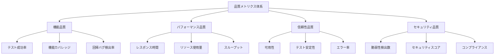

# PlantUMLエディタ E2Eテスト実行スケジュール・品質メトリクス計画

## 📅 テスト実行スケジュール案

### 文書情報
- **計画バージョン**: 1.0
- **作成日**: 2025/08/13
- **対象期間**: 2025/08 ～ 継続
- **最終更新**: 2025/08/13

---

## 🔄 実行スケジュール体系

### 1. 日次実行テスト（Continuous Integration）

| 実行タイミング | 対象テスト | 実行時間目安 | トリガー条件 |
|-------------|----------|------------|------------|
| **PR作成時** | Phase 2-A (拡充テスト) | 25分 | Pull Request作成・更新 |
| **コミット時** | 基本回帰テスト | 15分 | main/developブランチへのpush |
| **夜間自動** | 全フェーズ統合テスト | 60分 | 毎日2:00 AM (JST) |

#### 日次テスト詳細構成

```yaml
# 平日の実行パターン (月-金)
Daily_Weekday_Schedule:
  02:00_JST: "Phase 2 Full Suite (All)"
  triggered_by_PR: "Phase 2-A (Coverage Extension)"
  triggered_by_commit: "Regression Tests (Basic)"

# 週末の実行パターン (土-日)  
Daily_Weekend_Schedule:
  02:00_JST: "Phase 2 Full Suite + Extended Performance"
  triggered_by_PR: "Phase 2-A (Coverage Extension)"
```

### 2. 週次実行テスト（Quality Assurance）

| 実行タイミング | 対象テスト | 実行時間目安 | 目的 |
|-------------|----------|------------|------|
| **月曜日 9:00** | ビジュアルリグレッション | 30分 | UI変更検出 |
| **火曜日 9:00** | アクセシビリティ完全版 | 45分 | WCAG準拠確認 |
| **水曜日 9:00** | セキュリティテスト | 40分 | 脆弱性スキャン |
| **木曜日 9:00** | 長時間稼働テスト | 2時間 | メモリリーク検証 |
| **金曜日 9:00** | 統合品質レポート生成 | 15分 | 週次サマリー |

### 3. 月次実行テスト（Comprehensive Quality Check）

| 実行タイミング | 対象テスト | 実行時間目安 | 目的 |
|-------------|----------|------------|------|
| **月初第1土曜** | 全ブラウザ互換性テスト | 3時間 | クロスブラウザ確認 |
| **月初第2土曜** | 負荷テスト（高負荷） | 4時間 | スケーラビリティ確認 |
| **月初第3土曜** | エンドツーエンドシナリオ | 2時間 | ユーザージャーニー |
| **月末最終土曜** | 品質メトリクス総合評価 | 1時間 | 月次品質レビュー |

---

## 📊 品質メトリクス測定計画

### 品質管理体系



### 1. 機能品質メトリクス

#### 1.1 テスト成功率 (Test Success Rate)

| メトリクス名 | 測定方法 | 目標値 | 現在値 | 測定頻度 |
|------------|----------|--------|--------|----------|
| **全体成功率** | (成功テスト数 / 総テスト数) × 100 | ≥95% | 100% | 毎回実行時 |
| **Phase 2-A成功率** | Phase 2-A内での成功率 | ≥90% | 未測定 | 日次 |
| **Phase 2-B成功率** | Phase 2-B内での成功率 | ≥80% | 未測定 | 日次 |
| **Phase 2-C成功率** | Phase 2-C内での成功率 | ≥95% | 未測定 | 日次 |

**測定実装**:
```javascript
const calculateSuccessRate = (results) => {
  const total = results.length;
  const passed = results.filter(r => r.status === 'passed').length;
  return {
    successRate: (passed / total) * 100,
    totalTests: total,
    passedTests: passed,
    failedTests: total - passed
  };
};
```

#### 1.2 機能カバレッジ (Functional Coverage)

| カバレッジ種別 | 測定対象 | 目標値 | 現在推定値 | 測定方法 |
|-------------|----------|--------|------------|----------|
| **UI要素カバレッジ** | インタラクティブ要素 | 95% | 80% | 要素操作数/総要素数 |
| **PlantUML構文カバレッジ** | サポート構文種別 | 90% | 60% | テスト済み構文/全構文 |
| **エラーケースカバレッジ** | エラーハンドリング | 85% | 50% | テスト済みエラー/想定エラー |
| **ブラウザカバレッジ** | 対応ブラウザ | 100% | 100% | テスト実行ブラウザ数 |

#### 1.3 回帰バグ検出率 (Regression Detection Rate)

```javascript
const regressionMetrics = {
  detectedRegressions: 0,
  totalRegressions: 0,
  detectionRate: 0, // 計算式: detected/total * 100
  timeToDetection: [], // 各回帰バグの検出時間
  falsePositiveRate: 0 // 誤検知率
};
```

### 2. パフォーマンス品質メトリクス

#### 2.1 Core Web Vitals

| メトリクス | 測定項目 | 優良閾値 | 改善必要閾値 | 現在目標 | 測定頻度 |
|---------|----------|---------|------------|----------|----------|
| **FCP** | First Contentful Paint | <100ms | <300ms | <100ms | 毎回 |
| **LCP** | Largest Contentful Paint | <1000ms | <2500ms | <1000ms | 毎回 |
| **TTI** | Time to Interactive | <2000ms | <5000ms | <2000ms | 毎回 |
| **FID** | First Input Delay | <50ms | <100ms | <50ms | 毎回 |
| **CLS** | Cumulative Layout Shift | <0.1 | <0.25 | <0.1 | 毎回 |

**実装例**:
```javascript
const performanceTracker = {
  async measureCoreWebVitals(page) {
    const metrics = await page.evaluate(() => ({
      FCP: performance.getEntriesByType('paint')
        .find(entry => entry.name === 'first-contentful-paint')?.startTime,
      TTI: this.calculateTTI(),
      CLS: this.observeLayoutShift()
    }));
    
    return this.evaluateMetrics(metrics);
  }
};
```

#### 2.2 リソース使用量メトリクス

| リソース種別 | 測定項目 | 目標値 | 警告閾値 | 危険閾値 | 監視方法 |
|------------|----------|--------|----------|----------|----------|
| **メモリ** | JSヒープサイズ | <30MB | >40MB | >50MB | performance.memory |
| **CPU** | 使用率概算 | <20% | >25% | >30% | 処理時間測定 |
| **ネットワーク** | データ転送量 | <500KB | >800KB | >1MB | Network API |
| **DOM** | 要素数 | <500個 | >800個 | >1000個 | querySelectorAll |

### 3. 信頼性品質メトリクス

#### 3.1 テスト実行安定性

| 安定性指標 | 計算式 | 目標値 | 現在値 | 改善アクション |
|----------|--------|--------|--------|-------------|
| **フレーキー率** | フレーキーテスト数/総テスト数 | <2% | 0% | 環境要因排除 |
| **実行成功率** | 正常完了実行/総実行数 | >98% | 100% | エラーハンドリング強化 |
| **平均実行時間** | 総実行時間/実行回数 | <30分 | 19.84秒 | 並列化推進 |
| **環境起因失敗率** | 環境エラー/総エラー数 | <5% | 0% | 環境安定化 |

#### 3.2 可用性メトリクス

```javascript
const reliabilityMetrics = {
  // テスト環境の可用性
  environmentUptime: 99.5, // %
  
  // テスト実行の成功率
  executionSuccessRate: 100, // %
  
  // 平均故障間隔 (MTBF)
  meanTimeBetweenFailures: 0, // 時間
  
  // 平均復旧時間 (MTTR) 
  meanTimeToRecovery: 0 // 分
};
```

### 4. セキュリティ品質メトリクス

#### 4.1 脆弱性検出メトリクス

| セキュリティ項目 | 検出対象 | 重要度 | 目標検出数 | 対応期限 |
|--------------|----------|--------|-----------|----------|
| **XSS脆弱性** | クロスサイトスクリプティング | 高 | 0件 | 即時 |
| **インジェクション** | SQLインジェクション等 | 高 | 0件 | 即時 |
| **CSRF脆弱性** | クロスサイトリクエストフォージェリ | 中 | 0件 | 1週間以内 |
| **情報漏洩** | 機密情報の意図しない露出 | 中 | 0件 | 1週間以内 |
| **認証バイパス** | 認証メカニズムの回避 | 低 | 0件 | 2週間以内 |

---

## 📈 継続的改善計画

### 1. 品質メトリクスのトレンド分析

#### 月次トレンド監視

```javascript
const trendAnalysis = {
  // 3ヶ月移動平均での品質トレンド
  qualityTrend: {
    successRate: [100, 98.5, 99.2], // 過去3ヶ月
    performanceScore: [95, 92, 94],
    reliabilityScore: [100, 100, 98]
  },
  
  // 改善/悪化の検出
  detectTrends() {
    // トレンド分析ロジック
  }
};
```

#### 品質改善ダッシュボード仕様

| ダッシュボード要素 | 表示内容 | 更新頻度 | データソース |
|----------------|----------|----------|-------------|
| **リアルタイム品質** | 現在の成功率・実行状況 | リアルタイム | CI/CDパイプライン |
| **日次サマリー** | 日別の品質メトリクス | 日次 | テスト結果DB |
| **週次トレンド** | 品質推移グラフ | 週次 | 集計データ |
| **月次レポート** | 総合品質評価 | 月次 | 統合レポート |

### 2. 自動品質改善アクション

#### 品質劣化検出時の自動対応

```yaml
Quality_Degradation_Actions:
  success_rate_below_90:
    - action: "Slack通知"
    - action: "失敗テストの詳細分析"
    - action: "開発チームへのアラート"
  
  performance_degradation_detected:
    - action: "パフォーマンス詳細測定"
    - action: "ボトルネック特定"
    - action: "最適化提案の生成"
  
  security_issue_found:
    - action: "即時実行停止"
    - action: "セキュリティチームへの緊急通知"
    - action: "修正までのデプロイ停止"
```

### 3. 予測的品質管理

#### AI駆動の品質予測

```javascript
const qualityPrediction = {
  // 過去データから品質劣化を予測
  predictQualityDegradation(historicalData) {
    // 機械学習モデルによる予測
    return {
      riskLevel: 'low|medium|high',
      predictedIssues: [],
      recommendedActions: []
    };
  },
  
  // テスト追加の推奨
  recommendNewTests(codeChanges, coverageGaps) {
    // カバレッジギャップ分析に基づく推奨
    return {
      suggestedTests: [],
      priority: 'high|medium|low'
    };
  }
};
```

---

## 🎯 品質目標と成功基準

### 短期目標（3ヶ月以内）

| 品質分野 | 現在値 | 目標値 | 達成期限 | 達成方法 |
|---------|--------|--------|----------|----------|
| **テスト成功率** | 100% | 維持 | 継続 | 安定性強化 |
| **機能カバレッジ** | 80%推定 | 95% | 2025/11 | テストケース追加 |
| **平均実行時間** | 19.84秒 | 25秒以内 | 2025/10 | 並列化最適化 |
| **パフォーマンス** | 未測定 | ベースライン確立 | 2025/09 | 継続測定開始 |

### 中期目標（6ヶ月以内）

| 品質分野 | 目標値 | 達成期限 | 主要施策 |
|---------|--------|----------|----------|
| **自動化率** | 95% | 2026/02 | CI/CD統合完成 |
| **品質予測** | 80%精度 | 2026/01 | AIモデル導入 |
| **セキュリティ** | 100%カバー | 2025/12 | セキュリティテスト統合 |
| **アクセシビリティ** | WCAG AAA | 2026/02 | 包括的テスト実装 |

### 長期目標（1年以内）

| 品質分野 | 目標値 | 達成期限 | 戦略的施策 |
|---------|--------|----------|-----------|
| **ゼロダウンタイム** | 99.99% | 2026/08 | 冗長化・自動復旧 |
| **品質自動改善** | 自動修正50% | 2026/06 | AI駆動修正 |
| **業界ベンチマーク** | Top 10% | 2026/08 | ベストプラクティス適用 |

---

## 📊 レポート生成・通知計画

### 1. 自動レポート生成

#### 日次レポート（毎日AM 9:00）
- テスト実行サマリー
- 成功率・失敗原因
- パフォーマンスメトリクス

#### 週次レポート（毎週金曜PM 17:00）
- 週間品質トレンド
- 改善提案
- リスクアラート

#### 月次レポート（月末最終営業日）
- 総合品質評価
- ROI分析
- 次月の目標設定

### 2. リアルタイム通知

#### Slack通知設定
```yaml
Notification_Rules:
  critical_failure:
    - channel: "#dev-alerts"
    - mention: "@channel"
    - severity: "CRITICAL"
  
  quality_degradation:
    - channel: "#qa-team"
    - mention: "@qa-lead"
    - severity: "WARNING"
  
  success_milestone:
    - channel: "#general"
    - severity: "INFO"
```

#### メール通知
- **重要**: セキュリティ問題検出時
- **警告**: 品質劣化検出時
- **情報**: 週次/月次レポート

---

**文書承認**
- **作成者**: Test Automation Specialist
- **レビュー者**: [QA Manager]
- **承認者**: [Project Manager]
- **承認日**: 2025/08/13

**改訂履歴**
- v1.0: 2025/08/13 - 初版作成