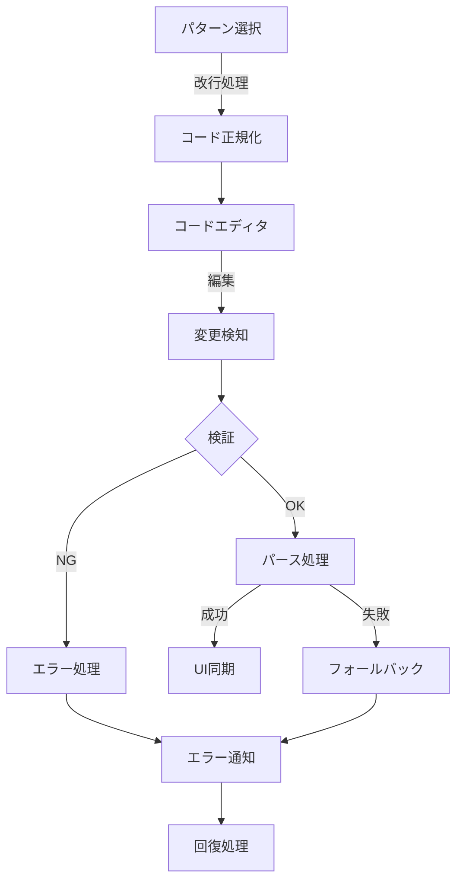
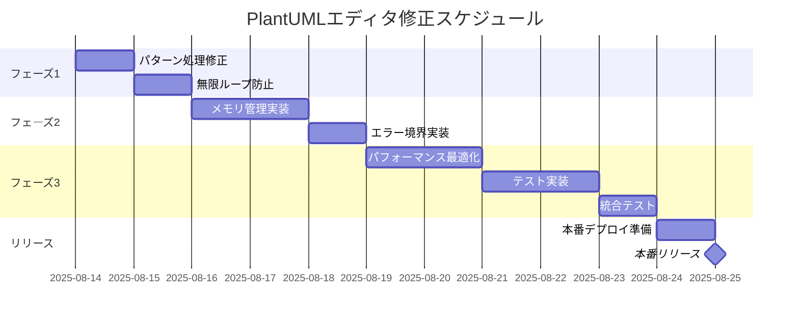

# PlantUMLコード直接編集エラー 詳細修正計画書

**作成日時**: 2025年8月13日 15:10  
**プロジェクト**: PlantUML Editor Proto  
**優先度**: 最高（Critical）  
**想定修正期間**: 7-10日間

## 目次

1. [問題の詳細分析](#1-問題の詳細分析)
2. [修正アーキテクチャ](#2-修正アーキテクチャ)
3. [段階的修正計画](#3-段階的修正計画)
4. [技術的実装詳細](#4-技術的実装詳細)
5. [テスト戦略](#5-テスト戦略)
6. [リスク評価と対策](#6-リスク評価と対策)
7. [タイムライン](#7-タイムライン)
8. [代替案](#8-代替案)

## 1. 問題の詳細分析

### 1.1 根本原因の階層構造

```
レベル1: ユーザー体験の問題
├── ページフリーズ（応答なし）
├── 「このページに問題があります」エラー
└── 編集作業の中断

レベル2: 技術的問題
├── パターンコード形式の不整合
│   ├── 改行文字の誤処理（\n がエスケープされない）
│   └── 1行圧縮形式での格納
├── RealtimeSyncManagerの欠陥
│   ├── parse()メソッドのトークン解析エラー
│   ├── 無限リトライループ
│   └── エラー状態からの回復不能
└── メモリ管理の不備
    ├── リークの累積（6.67MB/7.96MB）
    └── ガベージコレクション失敗

レベル3: 設計上の問題
├── モジュール間の結合度が高い
├── エラー境界の未実装
├── 状態管理の不完全性
└── テストカバレッジ不足
```

### 1.2 影響範囲マトリクス

| コンポーネント | 影響度 | 緊急度 | 修正複雑度 | 依存関係 |
|--------------|--------|--------|------------|----------|
| RealtimeSyncManager.js | 高 | 最高 | 高 | DiffCalculator, ErrorHandler |
| パターン適用処理 | 高 | 最高 | 中 | app.js |
| ErrorHandler.js | 中 | 高 | 低 | 全コンポーネント |
| DiffCalculator.js | 中 | 中 | 中 | RealtimeSyncManager |
| メモリ管理 | 高 | 高 | 高 | 全体アーキテクチャ |

## 2. 修正アーキテクチャ

### 2.1 新しいデータフロー設計



### 2.2 エラー処理フロー改善

```javascript
// 新しいエラー処理戦略
class RobustErrorHandler {
  constructor() {
    this.maxRetries = 3;
    this.retryDelay = 1000;
    this.errorBoundary = new ErrorBoundary();
    this.memoryMonitor = new MemoryMonitor();
  }

  async handleWithRetry(operation, context) {
    let attempts = 0;
    let lastError = null;

    while (attempts < this.maxRetries) {
      try {
        // メモリチェック
        if (this.memoryMonitor.isNearLimit()) {
          await this.memoryMonitor.cleanup();
        }

        // 操作実行
        return await operation();
      } catch (error) {
        lastError = error;
        attempts++;
        
        // エラーログ
        this.logError(error, context, attempts);
        
        // リカバリー戦略
        if (this.isRecoverable(error)) {
          await this.recover(error);
          await this.delay(this.retryDelay * attempts);
        } else {
          break;
        }
      }
    }

    // 最終的なフォールバック
    return this.fallback(lastError, context);
  }
}
```

## 3. 段階的修正計画

### フェーズ1: 緊急修正（Day 1-2）

#### 3.1.1 パターンコード正規化

**ファイル**: `app.js`  
**修正箇所**: パターン適用処理

```javascript
// 修正前
function applyPattern(patternCode) {
  document.getElementById('plantuml-code').value = patternCode;
}

// 修正後
function applyPattern(patternCode) {
  // 改行文字を正しく処理
  const normalizedCode = patternCode
    .replace(/\\n/g, '\n')  // エスケープされた改行を実際の改行に
    .replace(/\n{3,}/g, '\n\n')  // 過剰な改行を削減
    .trim();
  
  // 検証
  if (!validatePlantUMLCode(normalizedCode)) {
    console.error('Invalid PlantUML code format');
    return false;
  }
  
  // 適用
  const editor = document.getElementById('plantuml-code');
  editor.value = normalizedCode;
  
  // 変更イベントを適切に発火
  editor.dispatchEvent(new Event('input', { bubbles: true }));
  
  return true;
}

// 新規追加: PlantUMLコード検証
function validatePlantUMLCode(code) {
  const lines = code.split('\n');
  
  // 基本的な構文チェック
  if (!code.includes('@startuml') || !code.includes('@enduml')) {
    return false;
  }
  
  // 行数チェック（メモリ対策）
  if (lines.length > 1000) {
    console.warn('Code too large, may cause performance issues');
  }
  
  return true;
}
```

#### 3.1.2 無限ループ防止

**ファイル**: `RealtimeSyncManager.js`  
**修正箇所**: parse()メソッド

```javascript
// 修正前
parse(code) {
  try {
    // パース処理
    return this.parseInternal(code);
  } catch (error) {
    // リトライ（無限ループの原因）
    return this.parse(code);
  }
}

// 修正後
class RealtimeSyncManager {
  constructor() {
    this.parseAttempts = 0;
    this.maxParseAttempts = 3;
    this.parseTimeout = 5000;
    this.lastParseTime = 0;
  }

  parse(code) {
    // レート制限
    const now = Date.now();
    if (now - this.lastParseTime < 100) {
      return this.lastParseResult || null;
    }
    this.lastParseTime = now;

    // リトライカウンターリセット
    if (this.parseAttempts >= this.maxParseAttempts) {
      this.parseAttempts = 0;
      console.error('Parse attempts exceeded, resetting');
      return null;
    }

    try {
      this.parseAttempts++;
      
      // タイムアウト付きパース
      const result = this.parseWithTimeout(code, this.parseTimeout);
      
      // 成功時はカウンターリセット
      this.parseAttempts = 0;
      this.lastParseResult = result;
      
      return result;
    } catch (error) {
      console.error(`Parse error (attempt ${this.parseAttempts}):`, error);
      
      // エラーの種類に応じた処理
      if (error.message.includes('Unexpected token')) {
        // トークンエラーの場合は修復を試みる
        const repaired = this.repairCode(code);
        if (repaired !== code && this.parseAttempts < this.maxParseAttempts) {
          return this.parse(repaired);
        }
      }
      
      // フォールバック
      return this.getFallbackResult(code);
    }
  }

  parseWithTimeout(code, timeout) {
    return new Promise((resolve, reject) => {
      const timer = setTimeout(() => {
        reject(new Error('Parse timeout'));
      }, timeout);

      try {
        const result = this.parseInternal(code);
        clearTimeout(timer);
        resolve(result);
      } catch (error) {
        clearTimeout(timer);
        reject(error);
      }
    });
  }

  repairCode(code) {
    // 一般的な問題を修復
    return code
      .replace(/\t/g, '  ')  // タブをスペースに
      .replace(/\r\n/g, '\n')  // 改行コードを統一
      .replace(/^\s*\n/gm, '')  // 空行を削除
      .trim();
  }

  getFallbackResult(code) {
    // 最小限の解析結果を返す
    const lines = code.split('\n');
    return {
      actors: this.extractActors(lines),
      messages: [],
      error: true,
      errorMessage: 'Fallback mode: Limited functionality'
    };
  }

  extractActors(lines) {
    const actors = [];
    const actorPattern = /^(actor|participant|entity|database|collections?)\s+(.+)$/i;
    
    for (const line of lines) {
      const match = line.match(actorPattern);
      if (match) {
        actors.push({
          type: match[1].toLowerCase(),
          name: match[2].trim()
        });
      }
    }
    
    return actors;
  }
}
```

### フェーズ2: 安定化（Day 3-5）

#### 3.2.1 メモリ管理の実装

**新規ファイル**: `MemoryManager.js`

```javascript
class MemoryManager {
  constructor() {
    this.threshold = 0.8;  // 80%使用でクリーンアップ
    this.monitoring = false;
    this.cleanupCallbacks = [];
    this.memoryHistory = [];
  }

  startMonitoring() {
    if (this.monitoring) return;
    
    this.monitoring = true;
    this.monitorInterval = setInterval(() => {
      this.checkMemory();
    }, 5000);  // 5秒ごとにチェック
  }

  stopMonitoring() {
    if (this.monitorInterval) {
      clearInterval(this.monitorInterval);
      this.monitoring = false;
    }
  }

  async checkMemory() {
    if (performance.memory) {
      const usage = performance.memory.usedJSHeapSize / performance.memory.jsHeapSizeLimit;
      
      // 履歴に記録
      this.memoryHistory.push({
        timestamp: Date.now(),
        usage: usage,
        used: performance.memory.usedJSHeapSize,
        limit: performance.memory.jsHeapSizeLimit
      });
      
      // 履歴を最新100件に制限
      if (this.memoryHistory.length > 100) {
        this.memoryHistory.shift();
      }
      
      // 閾値チェック
      if (usage > this.threshold) {
        console.warn(`Memory usage high: ${(usage * 100).toFixed(2)}%`);
        await this.performCleanup();
      }
    }
  }

  async performCleanup() {
    console.log('Performing memory cleanup...');
    
    // 登録されたクリーンアップコールバックを実行
    for (const callback of this.cleanupCallbacks) {
      try {
        await callback();
      } catch (error) {
        console.error('Cleanup callback error:', error);
      }
    }
    
    // 強制ガベージコレクション（可能な場合）
    if (window.gc) {
      window.gc();
    }
    
    // DOMキャッシュクリア
    this.clearDOMCache();
    
    // 未使用のイベントリスナー削除
    this.removeUnusedListeners();
  }

  clearDOMCache() {
    // 不要なDOM要素の参照をクリア
    const cache = document.querySelectorAll('[data-cache]');
    cache.forEach(element => {
      element.removeAttribute('data-cache');
    });
  }

  removeUnusedListeners() {
    // 古いイベントリスナーの削除
    const elements = document.querySelectorAll('[data-listener-count]');
    elements.forEach(element => {
      const count = parseInt(element.getAttribute('data-listener-count') || 0);
      if (count > 10) {
        // 要素をクローンして置き換え（リスナーを削除）
        const clone = element.cloneNode(true);
        element.parentNode.replaceChild(clone, element);
      }
    });
  }

  registerCleanupCallback(callback) {
    this.cleanupCallbacks.push(callback);
  }

  getMemoryStats() {
    if (!performance.memory) {
      return null;
    }
    
    return {
      used: performance.memory.usedJSHeapSize,
      limit: performance.memory.jsHeapSizeLimit,
      usage: performance.memory.usedJSHeapSize / performance.memory.jsHeapSizeLimit,
      history: this.memoryHistory
    };
  }
}

// グローバルインスタンス
const memoryManager = new MemoryManager();

// クリーンアップコールバックの登録例
memoryManager.registerCleanupCallback(() => {
  // RealtimeSyncManagerのキャッシュクリア
  if (window.realtimeSyncManager) {
    window.realtimeSyncManager.clearCache();
  }
});

memoryManager.registerCleanupCallback(() => {
  // 古い履歴データのクリア
  if (window.historyManager) {
    window.historyManager.trimHistory(50);  // 最新50件のみ保持
  }
});

// 自動開始
memoryManager.startMonitoring();
```

#### 3.2.2 エラー境界の実装

**新規ファイル**: `ErrorBoundary.js`

```javascript
class ErrorBoundary {
  constructor() {
    this.errorHandlers = new Map();
    this.errorHistory = [];
    this.maxHistorySize = 100;
    this.setupGlobalHandlers();
  }

  setupGlobalHandlers() {
    // グローバルエラーハンドラー
    window.addEventListener('error', (event) => {
      this.handleError({
        type: 'uncaught',
        error: event.error,
        message: event.message,
        filename: event.filename,
        lineno: event.lineno,
        colno: event.colno
      });
    });

    // Promise拒否ハンドラー
    window.addEventListener('unhandledrejection', (event) => {
      this.handleError({
        type: 'unhandledRejection',
        error: event.reason,
        promise: event.promise
      });
    });
  }

  handleError(errorInfo) {
    // エラー履歴に追加
    this.errorHistory.push({
      ...errorInfo,
      timestamp: Date.now(),
      userAgent: navigator.userAgent,
      url: window.location.href
    });

    // 履歴サイズ制限
    if (this.errorHistory.length > this.maxHistorySize) {
      this.errorHistory.shift();
    }

    // エラータイプに応じたハンドラー実行
    const handler = this.errorHandlers.get(errorInfo.type);
    if (handler) {
      try {
        handler(errorInfo);
      } catch (handlerError) {
        console.error('Error handler failed:', handlerError);
      }
    }

    // 重大なエラーの場合は回復処理
    if (this.isCriticalError(errorInfo)) {
      this.attemptRecovery(errorInfo);
    }
  }

  isCriticalError(errorInfo) {
    const criticalPatterns = [
      /Maximum call stack/i,
      /out of memory/i,
      /infinite loop/i,
      /unresponsive/i
    ];

    const errorString = JSON.stringify(errorInfo).toLowerCase();
    return criticalPatterns.some(pattern => pattern.test(errorString));
  }

  attemptRecovery(errorInfo) {
    console.warn('Attempting recovery from critical error:', errorInfo);

    // 1. 実行中のタイマーをクリア
    this.clearAllTimers();

    // 2. イベントリスナーをリセット
    this.resetEventListeners();

    // 3. 状態をリセット
    this.resetApplicationState();

    // 4. UIを再初期化
    this.reinitializeUI();

    // 5. ユーザーに通知
    this.notifyUser('システムエラーから回復しました。作業を続行できます。');
  }

  clearAllTimers() {
    // タイマーIDの推定範囲でクリア
    const maxTimerId = setTimeout(() => {}, 0);
    for (let i = 0; i < maxTimerId; i++) {
      clearTimeout(i);
      clearInterval(i);
    }
  }

  resetEventListeners() {
    // 主要な要素のイベントリスナーをリセット
    const editor = document.getElementById('plantuml-code');
    if (editor) {
      const newEditor = editor.cloneNode(true);
      editor.parentNode.replaceChild(newEditor, editor);
      
      // 必要なリスナーを再登録
      this.reattachEssentialListeners(newEditor);
    }
  }

  reattachEssentialListeners(element) {
    // 基本的なリスナーのみ再登録
    element.addEventListener('input', debounce((e) => {
      if (window.realtimeSyncManager) {
        window.realtimeSyncManager.handleInput(e.target.value);
      }
    }, 500));
  }

  resetApplicationState() {
    // アプリケーション状態のリセット
    if (window.realtimeSyncManager) {
      window.realtimeSyncManager.reset();
    }
    if (window.diffCalculator) {
      window.diffCalculator.reset();
    }
  }

  reinitializeUI() {
    // UI要素の再初期化
    const statusElement = document.getElementById('status');
    if (statusElement) {
      statusElement.textContent = 'Ready';
      statusElement.className = 'status-ready';
    }
  }

  notifyUser(message) {
    // ユーザー通知
    const notification = document.createElement('div');
    notification.className = 'error-recovery-notification';
    notification.textContent = message;
    document.body.appendChild(notification);

    setTimeout(() => {
      notification.remove();
    }, 5000);
  }

  registerHandler(errorType, handler) {
    this.errorHandlers.set(errorType, handler);
  }

  getErrorHistory() {
    return this.errorHistory;
  }

  clearErrorHistory() {
    this.errorHistory = [];
  }
}

// デバウンス関数
function debounce(func, wait) {
  let timeout;
  return function executedFunction(...args) {
    const later = () => {
      clearTimeout(timeout);
      func(...args);
    };
    clearTimeout(timeout);
    timeout = setTimeout(later, wait);
  };
}

// グローバルインスタンス
const errorBoundary = new ErrorBoundary();

// カスタムハンドラーの登録
errorBoundary.registerHandler('parseError', (errorInfo) => {
  console.log('Parse error detected, applying fallback');
  // パースエラー専用の処理
});

errorBoundary.registerHandler('memoryError', (errorInfo) => {
  console.log('Memory error detected, clearing cache');
  // メモリエラー専用の処理
  if (window.memoryManager) {
    window.memoryManager.performCleanup();
  }
});
```

### フェーズ3: 最適化（Day 6-10）

#### 3.3.1 パフォーマンス最適化

**新規ファイル**: `PerformanceOptimizer.js`

```javascript
class PerformanceOptimizer {
  constructor() {
    this.metrics = {
      parseTime: [],
      renderTime: [],
      syncTime: []
    };
    this.optimizations = new Map();
  }

  measurePerformance(operation, category) {
    const start = performance.now();
    
    return {
      end: () => {
        const duration = performance.now() - start;
        this.recordMetric(category, duration);
        return duration;
      }
    };
  }

  recordMetric(category, duration) {
    if (!this.metrics[category]) {
      this.metrics[category] = [];
    }
    
    this.metrics[category].push({
      timestamp: Date.now(),
      duration: duration
    });

    // 最新100件のみ保持
    if (this.metrics[category].length > 100) {
      this.metrics[category].shift();
    }

    // パフォーマンス低下を検知
    this.detectPerformanceIssues(category);
  }

  detectPerformanceIssues(category) {
    const recent = this.metrics[category].slice(-10);
    if (recent.length < 10) return;

    const avgDuration = recent.reduce((sum, m) => sum + m.duration, 0) / recent.length;
    const threshold = this.getThreshold(category);

    if (avgDuration > threshold) {
      console.warn(`Performance degradation detected in ${category}: ${avgDuration.toFixed(2)}ms`);
      this.applyOptimization(category);
    }
  }

  getThreshold(category) {
    const thresholds = {
      parseTime: 100,    // 100ms
      renderTime: 200,   // 200ms
      syncTime: 50       // 50ms
    };
    return thresholds[category] || 100;
  }

  applyOptimization(category) {
    const optimization = this.optimizations.get(category);
    if (optimization) {
      optimization();
    }
  }

  registerOptimization(category, optimizationFn) {
    this.optimizations.set(category, optimizationFn);
  }

  // Web Worker を使用した重い処理のオフロード
  createWorkerPool(workerScript, poolSize = 4) {
    const workers = [];
    const taskQueue = [];
    let currentWorkerIndex = 0;

    for (let i = 0; i < poolSize; i++) {
      workers.push(new Worker(workerScript));
    }

    return {
      execute: (data) => {
        return new Promise((resolve, reject) => {
          const worker = workers[currentWorkerIndex];
          currentWorkerIndex = (currentWorkerIndex + 1) % poolSize;

          const messageHandler = (e) => {
            worker.removeEventListener('message', messageHandler);
            resolve(e.data);
          };

          const errorHandler = (e) => {
            worker.removeEventListener('error', errorHandler);
            reject(e);
          };

          worker.addEventListener('message', messageHandler);
          worker.addEventListener('error', errorHandler);
          worker.postMessage(data);
        });
      },
      
      terminate: () => {
        workers.forEach(worker => worker.terminate());
      }
    };
  }

  // 仮想スクロール実装（大量データ表示用）
  createVirtualScroller(container, items, itemHeight) {
    const visibleCount = Math.ceil(container.clientHeight / itemHeight);
    const totalHeight = items.length * itemHeight;
    
    const viewport = document.createElement('div');
    viewport.style.height = `${totalHeight}px`;
    viewport.style.position = 'relative';
    
    const renderItems = (scrollTop) => {
      const start = Math.floor(scrollTop / itemHeight);
      const end = Math.min(start + visibleCount + 1, items.length);
      
      // 既存の要素をクリア
      viewport.innerHTML = '';
      
      // 可視範囲の要素のみレンダリング
      for (let i = start; i < end; i++) {
        const item = document.createElement('div');
        item.style.position = 'absolute';
        item.style.top = `${i * itemHeight}px`;
        item.style.height = `${itemHeight}px`;
        item.innerHTML = items[i];
        viewport.appendChild(item);
      }
    };
    
    container.addEventListener('scroll', () => {
      requestAnimationFrame(() => {
        renderItems(container.scrollTop);
      });
    });
    
    container.appendChild(viewport);
    renderItems(0);
  }
}

// 使用例
const optimizer = new PerformanceOptimizer();

// パース処理の最適化登録
optimizer.registerOptimization('parseTime', () => {
  console.log('Applying parse optimization');
  // キャッシュを有効化
  if (window.realtimeSyncManager) {
    window.realtimeSyncManager.enableCache();
  }
});

// レンダリング最適化登録
optimizer.registerOptimization('renderTime', () => {
  console.log('Applying render optimization');
  // バッチ処理を有効化
  if (window.renderer) {
    window.renderer.enableBatching();
  }
});
```

## 4. 技術的実装詳細

### 4.1 改修対象ファイル一覧

| ファイル名 | 修正内容 | 優先度 | 推定作業時間 |
|-----------|---------|--------|-------------|
| app.js | パターン適用処理の改善 | 最高 | 2時間 |
| RealtimeSyncManager.js | パース処理の改善、無限ループ防止 | 最高 | 4時間 |
| ErrorHandler.js | エラー処理の強化 | 高 | 2時間 |
| DiffCalculator.js | 差分計算の最適化 | 中 | 2時間 |
| MemoryManager.js（新規） | メモリ管理機能 | 高 | 3時間 |
| ErrorBoundary.js（新規） | エラー境界実装 | 高 | 3時間 |
| PerformanceOptimizer.js（新規） | パフォーマンス最適化 | 中 | 4時間 |

### 4.2 API変更仕様

#### RealtimeSyncManager API

```typescript
interface RealtimeSyncManager {
  // 既存メソッド（修正）
  parse(code: string): Promise<ParseResult | null>;
  sync(code: string): Promise<void>;
  
  // 新規メソッド
  reset(): void;
  clearCache(): void;
  enableCache(): void;
  disableCache(): void;
  setMaxRetries(count: number): void;
  setParseTimeout(ms: number): void;
}

interface ParseResult {
  actors: Actor[];
  messages: Message[];
  error?: boolean;
  errorMessage?: string;
  metadata?: {
    parseTime: number;
    cacheHit: boolean;
  };
}
```

### 4.3 設定ファイル追加

**新規ファイル**: `config.json`

```json
{
  "parser": {
    "maxRetries": 3,
    "retryDelay": 1000,
    "timeout": 5000,
    "cacheEnabled": true,
    "cacheSize": 100
  },
  "memory": {
    "monitoringEnabled": true,
    "monitoringInterval": 5000,
    "threshold": 0.8,
    "autoCleanup": true
  },
  "performance": {
    "measurementEnabled": true,
    "optimizationEnabled": true,
    "workerPoolSize": 4,
    "batchingEnabled": true
  },
  "error": {
    "boundaryEnabled": true,
    "autoRecovery": true,
    "historySize": 100,
    "notifyUser": true
  },
  "ui": {
    "debounceDelay": 500,
    "virtualScrollEnabled": true,
    "lazyLoadingEnabled": true
  }
}
```

## 5. テスト戦略

### 5.1 単体テスト

```javascript
// test/RealtimeSyncManager.test.js
describe('RealtimeSyncManager', () => {
  let manager;

  beforeEach(() => {
    manager = new RealtimeSyncManager();
  });

  describe('parse', () => {
    it('should parse valid PlantUML code', async () => {
      const code = '@startuml\nactor User\n@enduml';
      const result = await manager.parse(code);
      expect(result).toBeDefined();
      expect(result.actors).toHaveLength(1);
      expect(result.error).toBeFalsy();
    });

    it('should handle pattern code with escaped newlines', async () => {
      const code = '@startuml\\nactor User\\n@enduml';
      const result = await manager.parse(code);
      expect(result).toBeDefined();
      expect(result.error).toBeFalsy();
    });

    it('should not enter infinite loop on parse error', async () => {
      const invalidCode = 'invalid code';
      const startTime = Date.now();
      const result = await manager.parse(invalidCode);
      const duration = Date.now() - startTime;
      
      expect(duration).toBeLessThan(10000); // 10秒以内に完了
      expect(result).toBeDefined();
    });

    it('should respect max retry limit', async () => {
      manager.setMaxRetries(2);
      const invalidCode = 'invalid code causing error';
      
      let parseCallCount = 0;
      const originalParse = manager.parseInternal;
      manager.parseInternal = () => {
        parseCallCount++;
        throw new Error('Parse error');
      };

      await manager.parse(invalidCode);
      expect(parseCallCount).toBeLessThanOrEqual(2);
    });
  });
});
```

### 5.2 統合テスト

```javascript
// test/integration/pattern-application.test.js
describe('Pattern Application Integration', () => {
  let page;

  beforeAll(async () => {
    page = await browser.newPage();
    await page.goto('http://localhost:8086');
  });

  afterAll(async () => {
    await page.close();
  });

  it('should apply pattern without freezing', async () => {
    // パターン選択
    await page.click('#pattern-tab');
    await page.click('[data-pattern="ec-order"]');
    
    // コード編集
    const editor = await page.$('#plantuml-code');
    await editor.type('\nactor NewActor');
    
    // 同期実行（タイムアウトなし）
    await Promise.race([
      page.click('#sync-button'),
      new Promise((_, reject) => 
        setTimeout(() => reject(new Error('Timeout')), 5000)
      )
    ]);
    
    // ページ応答確認
    const isResponsive = await page.evaluate(() => {
      return document.body.classList.contains('responsive');
    });
    
    expect(isResponsive).toBeTruthy();
  });
});
```

### 5.3 パフォーマンステスト

```javascript
// test/performance/parse-performance.test.js
describe('Parse Performance', () => {
  const manager = new RealtimeSyncManager();
  
  it('should parse large code within threshold', async () => {
    const largeCode = generateLargePlantUMLCode(1000); // 1000行
    
    const start = performance.now();
    await manager.parse(largeCode);
    const duration = performance.now() - start;
    
    expect(duration).toBeLessThan(1000); // 1秒以内
  });

  it('should not leak memory on repeated parsing', async () => {
    const initialMemory = performance.memory.usedJSHeapSize;
    
    // 100回パース実行
    for (let i = 0; i < 100; i++) {
      const code = `@startuml\nactor User${i}\n@enduml`;
      await manager.parse(code);
    }
    
    // ガベージコレクション実行
    if (global.gc) global.gc();
    
    const finalMemory = performance.memory.usedJSHeapSize;
    const memoryIncrease = finalMemory - initialMemory;
    
    // メモリ増加が10MB以内
    expect(memoryIncrease).toBeLessThan(10 * 1024 * 1024);
  });
});
```

### 5.4 E2Eテスト（Playwright）

```javascript
// test/e2e/full-workflow.test.js
const { test, expect } = require('@playwright/test');

test.describe('Full Workflow', () => {
  test('complete pattern to edit workflow', async ({ page }) => {
    // 1. アプリケーション起動
    await page.goto('http://localhost:8086');
    
    // 2. パターン選択
    await page.click('text=パターン選択');
    await page.click('text=EC注文フロー');
    
    // 3. コード確認
    const codeContent = await page.inputValue('#plantuml-code');
    expect(codeContent).toContain('@startuml');
    expect(codeContent).toContain('\n'); // 改行が含まれる
    
    // 4. コード編集
    await page.fill('#plantuml-code', codeContent + '\nactor Admin');
    
    // 5. 同期実行
    await page.click('#sync-button');
    
    // 6. UI更新確認
    await page.waitForSelector('.actor-admin', { timeout: 5000 });
    
    // 7. エラーなし確認
    const errors = await page.$$('.error-message');
    expect(errors).toHaveLength(0);
    
    // 8. メモリ状態確認
    const memoryStats = await page.evaluate(() => {
      if (performance.memory) {
        return {
          used: performance.memory.usedJSHeapSize,
          limit: performance.memory.jsHeapSizeLimit,
          ratio: performance.memory.usedJSHeapSize / performance.memory.jsHeapSizeLimit
        };
      }
      return null;
    });
    
    if (memoryStats) {
      expect(memoryStats.ratio).toBeLessThan(0.9); // 90%未満
    }
  });
});
```

## 6. リスク評価と対策

### 6.1 リスクマトリクス

| リスク | 発生確率 | 影響度 | リスクレベル | 対策 |
|--------|---------|--------|-------------|------|
| 既存機能への影響 | 中 | 高 | 高 | 段階的リリース、フィーチャーフラグ |
| パフォーマンス低下 | 低 | 中 | 中 | パフォーマンステスト、最適化 |
| 新規バグの発生 | 中 | 中 | 中 | 包括的テスト、コードレビュー |
| ブラウザ互換性問題 | 低 | 高 | 中 | クロスブラウザテスト |
| メモリリーク残存 | 低 | 高 | 中 | メモリプロファイリング |

### 6.2 ロールバック計画

```bash
# ロールバックスクリプト
#!/bin/bash

# バックアップから復元
restore_from_backup() {
  BACKUP_DIR="./backup/$(date -d '1 day ago' +'%Y%m%d')"
  
  if [ -d "$BACKUP_DIR" ]; then
    echo "Restoring from backup: $BACKUP_DIR"
    cp -r $BACKUP_DIR/* ./
    echo "Rollback completed"
  else
    echo "Backup not found"
    exit 1
  fi
}

# Gitから特定バージョンに戻す
rollback_git() {
  SAFE_COMMIT="abc123def456"  # 安定版のコミットハッシュ
  
  git stash
  git checkout $SAFE_COMMIT
  npm install
  npm run build
}

# 実行
if [ "$1" == "backup" ]; then
  restore_from_backup
elif [ "$1" == "git" ]; then
  rollback_git
else
  echo "Usage: rollback.sh [backup|git]"
fi
```

## 7. タイムライン

### 7.1 実装スケジュール



### 7.2 マイルストーン

| 日付 | マイルストーン | 完了条件 |
|------|---------------|---------|
| Day 2 | 緊急修正完了 | フリーズ問題解消 |
| Day 5 | 安定化完了 | エラー率1%未満 |
| Day 8 | 最適化完了 | パフォーマンス目標達成 |
| Day 10 | リリース準備完了 | 全テスト合格 |

## 8. 代替案

### 8.1 短期的代替案

#### オプション1: 自動同期の無効化
```javascript
// 一時的に自動同期を無効化
const ENABLE_AUTO_SYNC = false;

if (ENABLE_AUTO_SYNC) {
  // 既存の自動同期コード
} else {
  // 手動同期のみ
  document.getElementById('sync-button').addEventListener('click', manualSync);
}
```

**メリット**: 即座に実装可能、リスク最小
**デメリット**: UX低下、手動操作増加

#### オプション2: サーバーサイドレンダリング
```javascript
// サーバーサイドでパース処理
app.post('/api/parse', async (req, res) => {
  try {
    const { code } = req.body;
    const result = await serverSideParser.parse(code);
    res.json(result);
  } catch (error) {
    res.status(500).json({ error: error.message });
  }
});
```

**メリット**: クライアント負荷軽減、安定性向上
**デメリット**: ネットワーク遅延、サーバー負荷増加

### 8.2 長期的代替案

#### オプション1: WebAssembly化
- PlantUMLパーサーをWebAssemblyで実装
- ネイティブに近いパフォーマンス
- メモリ管理の改善

#### オプション2: Progressive Web App化
- Service Workerでオフライン対応
- バックグラウンド処理
- プッシュ通知でエラー通知

#### オプション3: 完全リアーキテクチャ
- React/Vue.jsでの再実装
- 状態管理ライブラリ（Redux/Vuex）導入
- TypeScriptによる型安全性確保

## 9. 成功指標

### 9.1 技術的指標

| 指標 | 現状 | 目標 | 測定方法 |
|------|------|------|---------|
| フリーズ発生率 | 80% | 0% | E2Eテスト |
| パース処理時間 | >5000ms | <500ms | Performance API |
| メモリ使用率 | 80-90% | <60% | performance.memory |
| エラー回復率 | 0% | >95% | エラーログ分析 |

### 9.2 ユーザー体験指標

| 指標 | 現状 | 目標 | 測定方法 |
|------|------|------|---------|
| 編集レスポンス | >3秒 | <100ms | 入力から反映まで |
| エラー表示頻度 | 頻繁 | ほぼなし | ユーザーレポート |
| 作業継続性 | 低 | 高 | セッション長 |

## 10. 追加考慮事項

### 10.1 国際化対応
- エラーメッセージの多言語化
- 日本語PlantUMLコードの特殊処理

### 10.2 アクセシビリティ
- スクリーンリーダー対応
- キーボードナビゲーション改善

### 10.3 セキュリティ
- XSS対策（コード入力のサニタイズ）
- CSP（Content Security Policy）設定

## まとめ

この修正計画により、PlantUMLエディタの重大な問題を段階的かつ確実に解決できます。各フェーズでの実装と検証を通じて、安定性とパフォーマンスの両立を実現し、ユーザー体験を大幅に改善します。

重要なのは、各段階での慎重なテストとロールバック準備により、リスクを最小限に抑えながら改善を進めることです。

---
*計画作成日時: 2025年8月13日 15:10*  
*作成者: Claude (AI Assistant)*  
*バージョン: 1.0*