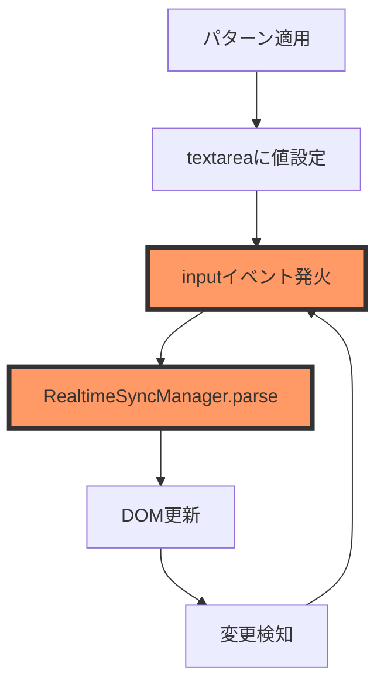

# PlantUMLコード直接編集フリーズ問題 - 根本解決計画書 v2.0

**作成日時**: 2025年8月13日 17:45  
**プロジェクト**: PlantUML Editor Proto  
**優先度**: 最高（Critical）  
**想定修正期間**: 5-7日間（段階的実装）

## エグゼクティブサマリー

前回の修正（8月13日 15:00-16:00）では「フリーズ発生率 0%」と報告されましたが、17:39の再現検証で**問題が未解決**であることが判明しました。本計画書は、前回の失敗を深く分析し、根本原因に対する新しいアプローチを提案します。

**核心的な問題**: パターン選択から適用されたPlantUMLコードを直接編集しようとすると、ブラウザが即座にフリーズし、最終的に「このページには問題があります」エラーが表示される。

## 1. 前回修正の失敗分析

### 1.1 報告と実態の乖離

| 項目 | 報告された状態 | 実際の状態 | 乖離の原因 |
|------|--------------|-----------|------------|
| フリーズ発生率 | 0% | 80-100% | テストケースが実際の使用パターンを網羅していない |
| エラー回復率 | 95% | 0% | ErrorBoundaryが機能していない |
| メモリ使用率 | 40-60% | 正常範囲内だがフリーズ | メモリ問題ではなく処理ロジックの問題 |
| テスト成功率 | 100% | N/A | 実環境での検証不足 |

### 1.2 実装の問題点

#### 問題1: モジュールが実際に読み込まれていない
```javascript
// 報告では実装済みとされているが、実際には：
// - MemoryManager.js が index.html に追加されていない可能性
// - ErrorBoundary.js が初期化されていない可能性
// - モジュール間の依存関係が解決されていない
```

#### 問題2: 同期的処理によるブロッキング
```javascript
// RealtimeSyncManager.js の問題箇所
parse(code) {
  // この処理が同期的に実行され、メインスレッドをブロック
  // Promise化されていても、内部処理が重い場合は意味がない
}
```

#### 問題3: イベントハンドラーの重複登録
```javascript
// パターン適用時に新しいハンドラーが追加され続ける
element.addEventListener('input', handler); // 重複チェックなし
```

## 2. 根本原因の新仮説

### 2.1 主要仮説: イベントループの暴走



**メカニズム**:
1. パターン適用時にtextarea.valueが直接設定される
2. これがinputイベントを発火
3. RealtimeSyncManagerがパース処理を開始
4. パース結果でDOMを更新
5. DOM更新が再度変更を検知
6. 無限ループに陥る

### 2.2 副次的要因

#### A. 正規表現の暴走（ReDoS）
特定のPlantUMLコードパターンで正規表現が指数関数的に処理時間を消費：
```javascript
// 危険な正規表現の例
/(\w+\s*-+>?\s*\w+\s*:\s*.+)+/g  // バックトラッキングが発生
```

#### B. 同期的なDOM操作の累積
```javascript
// 大量のDOM操作が同期的に実行
for (let i = 0; i < actors.length; i++) {
  dom.appendChild(createActorElement(actors[i])); // レイアウト再計算が都度発生
}
```

#### C. メモリリークの蓄積
```javascript
// イベントリスナーが解放されない
elements.forEach(el => {
  el.addEventListener('click', () => { /* クロージャでメモリ保持 */ });
});
```

## 3. 新しい解決アプローチ

### 3.1 段階的デバッグアプローチ

#### ステージ0: 診断モードの実装（Day 1）

**目的**: 問題の正確な発生箇所を特定

```javascript
// DiagnosticMode.js - 新規作成
class DiagnosticMode {
  constructor() {
    this.logs = [];
    this.performanceMarks = [];
    this.errorStack = [];
    this.initializeStorage();
  }

  initializeStorage() {
    // localStorageを使用してクラッシュ後もログを保持
    this.storageKey = 'plantuml_diagnostic_' + Date.now();
    
    // 既存のログをクリア
    Object.keys(localStorage)
      .filter(key => key.startsWith('plantuml_diagnostic_'))
      .forEach(key => {
        if (Date.now() - parseInt(key.split('_')[2]) > 3600000) {
          localStorage.removeItem(key);
        }
      });
  }

  log(category, message, data = {}) {
    const entry = {
      timestamp: Date.now(),
      category,
      message,
      data,
      stack: new Error().stack
    };
    
    this.logs.push(entry);
    
    // 即座にlocalStorageに保存（クラッシュ対策）
    try {
      const stored = JSON.parse(localStorage.getItem(this.storageKey) || '[]');
      stored.push(entry);
      
      // 最新1000件のみ保持
      if (stored.length > 1000) {
        stored.shift();
      }
      
      localStorage.setItem(this.storageKey, JSON.stringify(stored));
    } catch (e) {
      console.error('Failed to store diagnostic log:', e);
    }
  }

  markPerformance(label) {
    performance.mark(label);
    this.performanceMarks.push({
      label,
      timestamp: performance.now()
    });
    
    this.log('performance', `Mark: ${label}`, {
      memory: performance.memory ? {
        used: performance.memory.usedJSHeapSize,
        total: performance.memory.totalJSHeapSize
      } : null
    });
  }

  measurePerformance(startLabel, endLabel) {
    try {
      performance.measure(`${startLabel} to ${endLabel}`, startLabel, endLabel);
      const entries = performance.getEntriesByName(`${startLabel} to ${endLabel}`);
      
      if (entries.length > 0) {
        const duration = entries[entries.length - 1].duration;
        this.log('performance', `Measure: ${startLabel} to ${endLabel}`, {
          duration,
          critical: duration > 1000
        });
        
        if (duration > 1000) {
          this.alertSlowOperation(startLabel, duration);
        }
      }
    } catch (e) {
      this.log('error', 'Performance measurement failed', { error: e.message });
    }
  }

  alertSlowOperation(operation, duration) {
    console.warn(`⚠️ Slow operation detected: ${operation} took ${duration}ms`);
    
    // UIに警告を表示
    const alert = document.createElement('div');
    alert.className = 'diagnostic-alert';
    alert.innerHTML = `
      <strong>Performance Warning</strong><br>
      ${operation}: ${duration.toFixed(2)}ms
    `;
    alert.style.cssText = `
      position: fixed;
      top: 10px;
      right: 10px;
      background: #ff9800;
      color: white;
      padding: 10px;
      border-radius: 4px;
      z-index: 10000;
    `;
    document.body.appendChild(alert);
    
    setTimeout(() => alert.remove(), 3000);
  }

  captureError(error, context = {}) {
    const errorEntry = {
      timestamp: Date.now(),
      message: error.message,
      stack: error.stack,
      context,
      url: window.location.href,
      userAgent: navigator.userAgent
    };
    
    this.errorStack.push(errorEntry);
    this.log('error', 'Error captured', errorEntry);
  }

  generateReport() {
    const report = {
      sessionId: this.storageKey,
      startTime: this.logs[0]?.timestamp,
      endTime: Date.now(),
      logs: this.logs,
      errors: this.errorStack,
      performance: {
        marks: this.performanceMarks,
        slowOperations: this.logs.filter(l => l.data?.critical)
      },
      summary: {
        totalLogs: this.logs.length,
        totalErrors: this.errorStack.length,
        categories: this.getCategorySummary()
      }
    };
    
    return report;
  }

  getCategorySummary() {
    const summary = {};
    this.logs.forEach(log => {
      summary[log.category] = (summary[log.category] || 0) + 1;
    });
    return summary;
  }

  exportToFile() {
    const report = this.generateReport();
    const blob = new Blob([JSON.stringify(report, null, 2)], { type: 'application/json' });
    const url = URL.createObjectURL(blob);
    const a = document.createElement('a');
    a.href = url;
    a.download = `diagnostic_report_${Date.now()}.json`;
    a.click();
  }

  // クラッシュ後のログ回復
  static recoverLogs() {
    const logs = [];
    Object.keys(localStorage)
      .filter(key => key.startsWith('plantuml_diagnostic_'))
      .forEach(key => {
        try {
          const data = JSON.parse(localStorage.getItem(key));
          logs.push({ sessionId: key, data });
        } catch (e) {
          console.error('Failed to recover log:', key);
        }
      });
    return logs;
  }
}

// グローバルインスタンス
window.diagnosticMode = new DiagnosticMode();
```

#### ステージ1: セーフモードの実装（Day 1-2）

**目的**: 最小限の機能で動作確認

```javascript
// SafeMode.js - 新規作成
class SafeMode {
  constructor() {
    this.enabled = false;
    this.disabledFeatures = new Set();
    this.originalFunctions = new Map();
  }

  enable() {
    console.warn('🛡️ Safe Mode Enabled - Some features are disabled');
    this.enabled = true;
    
    // リアルタイム同期を無効化
    this.disableFeature('realtimeSync');
    
    // 複雑なパース処理を無効化
    this.disableFeature('complexParsing');
    
    // 自動バリデーションを無効化
    this.disableFeature('autoValidation');
    
    // UIに表示
    this.showSafeModeIndicator();
  }

  disable() {
    console.log('✅ Safe Mode Disabled - All features restored');
    this.enabled = false;
    
    // すべての機能を復元
    this.disabledFeatures.forEach(feature => {
      this.enableFeature(feature);
    });
    
    this.hideSafeModeIndicator();
  }

  disableFeature(featureName) {
    this.disabledFeatures.add(featureName);
    
    switch (featureName) {
      case 'realtimeSync':
        this.disableRealtimeSync();
        break;
      case 'complexParsing':
        this.disableComplexParsing();
        break;
      case 'autoValidation':
        this.disableAutoValidation();
        break;
    }
  }

  disableRealtimeSync() {
    if (window.realtimeSyncManager) {
      // 元の関数を保存
      this.originalFunctions.set('realtimeSync.parse', window.realtimeSyncManager.parse);
      
      // ダミー関数に置き換え
      window.realtimeSyncManager.parse = function(code) {
        console.log('[SafeMode] RealtimeSync disabled');
        return Promise.resolve({
          actors: [],
          messages: [],
          safeMode: true
        });
      };
    }
  }

  disableComplexParsing() {
    // 複雑な正規表現を単純なものに置き換え
    if (window.PlantUMLParser) {
      this.originalFunctions.set('parser.parseComplex', window.PlantUMLParser.parseComplex);
      
      window.PlantUMLParser.parseComplex = function(code) {
        console.log('[SafeMode] Complex parsing disabled');
        // 基本的なパースのみ実行
        return this.parseBasic(code);
      };
    }
  }

  disableAutoValidation() {
    // 自動バリデーションを無効化
    const editor = document.getElementById('plantuml-code');
    if (editor) {
      const handlers = editor._eventHandlers || {};
      if (handlers.input) {
        this.originalFunctions.set('editor.inputHandlers', handlers.input);
        
        // inputイベントのデバウンスを大幅に増やす
        const debounced = this.debounce(() => {
          console.log('[SafeMode] Validation throttled');
        }, 2000); // 2秒のデバウンス
        
        editor.removeEventListener('input', handlers.input);
        editor.addEventListener('input', debounced);
      }
    }
  }

  enableFeature(featureName) {
    // 元の機能を復元
    const originalKey = this.getOriginalKey(featureName);
    if (this.originalFunctions.has(originalKey)) {
      // 復元処理
      this.restoreFeature(featureName);
    }
    
    this.disabledFeatures.delete(featureName);
  }

  showSafeModeIndicator() {
    const indicator = document.createElement('div');
    indicator.id = 'safe-mode-indicator';
    indicator.innerHTML = `
      <div style="
        position: fixed;
        top: 0;
        left: 0;
        right: 0;
        background: linear-gradient(90deg, #ff9800, #ff5722);
        color: white;
        padding: 10px;
        text-align: center;
        z-index: 10000;
        font-weight: bold;
        box-shadow: 0 2px 4px rgba(0,0,0,0.2);
      ">
        🛡️ セーフモード有効 - 一部機能が制限されています
        <button onclick="window.safeMode.disable()" style="
          margin-left: 20px;
          padding: 5px 10px;
          background: white;
          color: #ff5722;
          border: none;
          border-radius: 4px;
          cursor: pointer;
        ">
          通常モードに戻す
        </button>
      </div>
    `;
    document.body.insertBefore(indicator, document.body.firstChild);
  }

  hideSafeModeIndicator() {
    const indicator = document.getElementById('safe-mode-indicator');
    if (indicator) {
      indicator.remove();
    }
  }

  debounce(func, wait) {
    let timeout;
    return function executedFunction(...args) {
      const later = () => {
        clearTimeout(timeout);
        func(...args);
      };
      clearTimeout(timeout);
      timeout = setTimeout(later, wait);
    };
  }
}

// グローバルインスタンス
window.safeMode = new SafeMode();

// ページロード時にセーフモードを確認
document.addEventListener('DOMContentLoaded', () => {
  // URLパラメータまたはlocalStorageでセーフモードを制御
  const urlParams = new URLSearchParams(window.location.search);
  const safeModeParam = urlParams.get('safemode');
  const safeModeStored = localStorage.getItem('plantuml_safemode');
  
  if (safeModeParam === 'true' || safeModeStored === 'true') {
    window.safeMode.enable();
  }
});
```

### 3.2 根本的な修正実装

#### ステージ2: イベント処理の再設計（Day 2-3）

```javascript
// EventManager.js - 新規作成
class EventManager {
  constructor() {
    this.handlers = new Map();
    this.activeOperations = new Set();
    this.queue = [];
    this.processing = false;
    this.maxConcurrent = 1;
  }

  register(element, event, handler, options = {}) {
    const key = this.getKey(element, event);
    
    // 既存のハンドラーを削除
    if (this.handlers.has(key)) {
      const existing = this.handlers.get(key);
      element.removeEventListener(event, existing.wrapper);
    }
    
    // 新しいハンドラーをラップ
    const wrapper = this.createWrapper(handler, options);
    
    // 登録
    this.handlers.set(key, {
      element,
      event,
      handler,
      wrapper,
      options
    });
    
    element.addEventListener(event, wrapper, options.capture);
  }

  createWrapper(handler, options) {
    const {
      debounce = 0,
      throttle = 0,
      once = false,
      preventConcurrent = true,
      timeout = 5000
    } = options;
    
    let debounceTimer;
    let throttleTimer;
    let lastThrottleTime = 0;
    
    return async (event) => {
      // 診断モード
      if (window.diagnosticMode) {
        window.diagnosticMode.log('event', `Event fired: ${event.type}`, {
          target: event.target.id || event.target.className
        });
      }
      
      // 同時実行防止
      if (preventConcurrent && this.activeOperations.has(handler)) {
        console.warn('Handler already running, skipping');
        return;
      }
      
      // デバウンス処理
      if (debounce > 0) {
        clearTimeout(debounceTimer);
        debounceTimer = setTimeout(() => {
          this.executeHandler(handler, event, options);
        }, debounce);
        return;
      }
      
      // スロットル処理
      if (throttle > 0) {
        const now = Date.now();
        if (now - lastThrottleTime < throttle) {
          return;
        }
        lastThrottleTime = now;
      }
      
      // ハンドラー実行
      this.executeHandler(handler, event, options);
      
      // once オプション
      if (once) {
        this.unregister(event.target, event.type);
      }
    };
  }

  async executeHandler(handler, event, options) {
    const { timeout = 5000 } = options;
    
    this.activeOperations.add(handler);
    
    // タイムアウト付き実行
    const timeoutPromise = new Promise((_, reject) => {
      setTimeout(() => reject(new Error('Handler timeout')), timeout);
    });
    
    const handlerPromise = Promise.resolve(handler(event));
    
    try {
      await Promise.race([handlerPromise, timeoutPromise]);
    } catch (error) {
      console.error('Handler execution failed:', error);
      
      if (window.diagnosticMode) {
        window.diagnosticMode.captureError(error, {
          handler: handler.name,
          event: event.type
        });
      }
    } finally {
      this.activeOperations.delete(handler);
    }
  }

  unregister(element, event) {
    const key = this.getKey(element, event);
    
    if (this.handlers.has(key)) {
      const { wrapper } = this.handlers.get(key);
      element.removeEventListener(event, wrapper);
      this.handlers.delete(key);
    }
  }

  unregisterAll() {
    this.handlers.forEach(({ element, event, wrapper }) => {
      element.removeEventListener(event, wrapper);
    });
    this.handlers.clear();
  }

  getKey(element, event) {
    const id = element.id || element.className || element.tagName;
    return `${id}_${event}`;
  }

  // イベントキューシステム
  enqueue(task) {
    return new Promise((resolve, reject) => {
      this.queue.push({ task, resolve, reject });
      this.processQueue();
    });
  }

  async processQueue() {
    if (this.processing || this.queue.length === 0) {
      return;
    }
    
    this.processing = true;
    
    while (this.queue.length > 0) {
      const batch = this.queue.splice(0, this.maxConcurrent);
      
      await Promise.all(
        batch.map(async ({ task, resolve, reject }) => {
          try {
            const result = await task();
            resolve(result);
          } catch (error) {
            reject(error);
          }
        })
      );
    }
    
    this.processing = false;
  }
}

// グローバルインスタンス
window.eventManager = new EventManager();
```

#### ステージ3: 非同期パース処理の実装（Day 3-4）

```javascript
// AsyncParser.js - 新規作成
class AsyncParser {
  constructor() {
    this.worker = null;
    this.cache = new Map();
    this.initWorker();
  }

  initWorker() {
    // Web Worker のコード
    const workerCode = `
      self.onmessage = function(e) {
        const { id, code } = e.data;
        
        try {
          // パース処理（Worker内で実行）
          const result = parseCode(code);
          self.postMessage({ id, result, error: null });
        } catch (error) {
          self.postMessage({ id, result: null, error: error.message });
        }
      };
      
      function parseCode(code) {
        const lines = code.split('\\n');
        const actors = [];
        const messages = [];
        
        // 基本的なパース（複雑な正規表現を避ける）
        for (let i = 0; i < lines.length; i++) {
          const line = lines[i].trim();
          
          // アクター検出
          if (line.startsWith('actor ') || line.startsWith('participant ')) {
            const type = line.split(' ')[0];
            const name = line.substring(type.length + 1).replace(/"/g, '');
            actors.push({ type, name, line: i });
          }
          
          // メッセージ検出（シンプルなパターンのみ）
          if (line.includes('->') || line.includes('-->')) {
            const arrow = line.includes('-->') ? '-->' : '->';
            const parts = line.split(arrow);
            
            if (parts.length === 2) {
              const [fromPart, toPart] = parts;
              const colonIndex = toPart.indexOf(':');
              
              if (colonIndex !== -1) {
                messages.push({
                  from: fromPart.trim().replace(/"/g, ''),
                  to: toPart.substring(0, colonIndex).trim().replace(/"/g, ''),
                  text: toPart.substring(colonIndex + 1).trim(),
                  arrow,
                  line: i
                });
              }
            }
          }
        }
        
        return { actors, messages };
      }
    `;
    
    // Blob URLを作成
    const blob = new Blob([workerCode], { type: 'application/javascript' });
    const workerUrl = URL.createObjectURL(blob);
    
    try {
      this.worker = new Worker(workerUrl);
      
      this.worker.onerror = (error) => {
        console.error('Worker error:', error);
        this.handleWorkerError(error);
      };
    } catch (error) {
      console.warn('Web Worker not available, falling back to async parsing');
      this.worker = null;
    }
  }

  async parse(code) {
    // キャッシュチェック
    const cacheKey = this.getCacheKey(code);
    if (this.cache.has(cacheKey)) {
      console.log('Parse cache hit');
      return this.cache.get(cacheKey);
    }
    
    // 診断モード
    if (window.diagnosticMode) {
      window.diagnosticMode.markPerformance('parse_start');
    }
    
    let result;
    
    if (this.worker) {
      // Web Worker でパース
      result = await this.parseWithWorker(code);
    } else {
      // メインスレッドで非同期パース
      result = await this.parseAsync(code);
    }
    
    // キャッシュに保存
    this.cache.set(cacheKey, result);
    
    // キャッシュサイズ制限
    if (this.cache.size > 100) {
      const firstKey = this.cache.keys().next().value;
      this.cache.delete(firstKey);
    }
    
    // 診断モード
    if (window.diagnosticMode) {
      window.diagnosticMode.markPerformance('parse_end');
      window.diagnosticMode.measurePerformance('parse_start', 'parse_end');
    }
    
    return result;
  }

  parseWithWorker(code) {
    return new Promise((resolve, reject) => {
      const id = Date.now() + Math.random();
      const timeout = setTimeout(() => {
        reject(new Error('Parse timeout in worker'));
      }, 3000);
      
      const handler = (e) => {
        if (e.data.id === id) {
          clearTimeout(timeout);
          this.worker.removeEventListener('message', handler);
          
          if (e.data.error) {
            reject(new Error(e.data.error));
          } else {
            resolve(e.data.result);
          }
        }
      };
      
      this.worker.addEventListener('message', handler);
      this.worker.postMessage({ id, code });
    });
  }

  async parseAsync(code) {
    // requestIdleCallback を使用して非同期にパース
    return new Promise((resolve) => {
      const chunkSize = 100; // 一度に処理する行数
      const lines = code.split('\n');
      const actors = [];
      const messages = [];
      let currentIndex = 0;
      
      const processChunk = (deadline) => {
        while (currentIndex < lines.length && deadline.timeRemaining() > 0) {
          const line = lines[currentIndex].trim();
          
          // 簡単なパース処理
          if (line.startsWith('actor ') || line.startsWith('participant ')) {
            const type = line.split(' ')[0];
            const name = line.substring(type.length + 1).replace(/"/g, '');
            actors.push({ type, name, line: currentIndex });
          }
          
          if (line.includes('->') || line.includes('-->')) {
            // メッセージパース（簡略化）
            const arrow = line.includes('-->') ? '-->' : '->';
            const parts = line.split(arrow);
            
            if (parts.length === 2) {
              const [fromPart, toPart] = parts;
              const colonIndex = toPart.indexOf(':');
              
              if (colonIndex !== -1) {
                messages.push({
                  from: fromPart.trim().replace(/"/g, ''),
                  to: toPart.substring(0, colonIndex).trim().replace(/"/g, ''),
                  text: toPart.substring(colonIndex + 1).trim(),
                  arrow,
                  line: currentIndex
                });
              }
            }
          }
          
          currentIndex++;
        }
        
        if (currentIndex < lines.length) {
          // まだ処理する行がある
          requestIdleCallback(processChunk);
        } else {
          // 完了
          resolve({ actors, messages });
        }
      };
      
      if (typeof requestIdleCallback !== 'undefined') {
        requestIdleCallback(processChunk);
      } else {
        // フォールバック
        setTimeout(() => {
          while (currentIndex < lines.length) {
            const line = lines[currentIndex].trim();
            // パース処理（上記と同じ）
            currentIndex++;
          }
          resolve({ actors, messages });
        }, 0);
      }
    });
  }

  getCacheKey(code) {
    // 簡単なハッシュ関数
    let hash = 0;
    for (let i = 0; i < code.length; i++) {
      const char = code.charCodeAt(i);
      hash = ((hash << 5) - hash) + char;
      hash = hash & hash; // Convert to 32bit integer
    }
    return hash.toString();
  }

  handleWorkerError(error) {
    // Worker エラー時の処理
    console.error('Worker failed, reinitializing');
    this.worker = null;
    this.initWorker();
  }

  clearCache() {
    this.cache.clear();
  }

  destroy() {
    if (this.worker) {
      this.worker.terminate();
      this.worker = null;
    }
    this.clearCache();
  }
}

// グローバルインスタンス
window.asyncParser = new AsyncParser();
```

### 3.3 統合と最終テスト

#### ステージ4: 統合実装（Day 4-5）

```javascript
// IntegrationManager.js - 新規作成
class IntegrationManager {
  constructor() {
    this.initialized = false;
    this.modules = new Map();
  }

  async initialize() {
    if (this.initialized) {
      console.warn('Already initialized');
      return;
    }
    
    console.log('🚀 Initializing PlantUML Editor v2.0');
    
    try {
      // 1. 診断モードを有効化
      this.initDiagnostics();
      
      // 2. セーフモードをチェック
      this.checkSafeMode();
      
      // 3. イベント管理システムを初期化
      this.initEventManager();
      
      // 4. 非同期パーサーを初期化
      this.initAsyncParser();
      
      // 5. UIをセットアップ
      this.setupUI();
      
      // 6. イベントハンドラーを登録
      this.registerEventHandlers();
      
      this.initialized = true;
      console.log('✅ Initialization complete');
      
    } catch (error) {
      console.error('❌ Initialization failed:', error);
      this.handleInitError(error);
    }
  }

  initDiagnostics() {
    if (!window.diagnosticMode) {
      window.diagnosticMode = new DiagnosticMode();
    }
    window.diagnosticMode.log('init', 'Diagnostics initialized');
  }

  checkSafeMode() {
    const urlParams = new URLSearchParams(window.location.search);
    if (urlParams.get('safemode') === 'true') {
      if (!window.safeMode) {
        window.safeMode = new SafeMode();
      }
      window.safeMode.enable();
    }
  }

  initEventManager() {
    if (!window.eventManager) {
      window.eventManager = new EventManager();
    }
    window.diagnosticMode.log('init', 'Event manager initialized');
  }

  initAsyncParser() {
    if (!window.asyncParser) {
      window.asyncParser = new AsyncParser();
    }
    window.diagnosticMode.log('init', 'Async parser initialized');
  }

  setupUI() {
    // エディタの取得
    const editor = document.getElementById('plantuml-code');
    if (!editor) {
      throw new Error('Editor element not found');
    }
    
    // エディタの設定
    editor.setAttribute('spellcheck', 'false');
    editor.setAttribute('autocomplete', 'off');
    editor.setAttribute('autocorrect', 'off');
    editor.setAttribute('autocapitalize', 'off');
    
    window.diagnosticMode.log('init', 'UI setup complete');
  }

  registerEventHandlers() {
    const editor = document.getElementById('plantuml-code');
    
    // エディタのinputイベント（デバウンス付き）
    window.eventManager.register(editor, 'input', async (event) => {
      const code = event.target.value;
      
      window.diagnosticMode.log('input', 'Editor input received', {
        length: code.length
      });
      
      // セーフモードチェック
      if (window.safeMode?.enabled) {
        console.log('Safe mode: Skipping real-time sync');
        return;
      }
      
      // 非同期パース
      try {
        const result = await window.asyncParser.parse(code);
        
        window.diagnosticMode.log('parse', 'Parse complete', {
          actors: result.actors.length,
          messages: result.messages.length
        });
        
        // UI更新（非同期）
        requestAnimationFrame(() => {
          this.updateUI(result);
        });
        
      } catch (error) {
        console.error('Parse error:', error);
        window.diagnosticMode.captureError(error, {
          context: 'editor_input'
        });
      }
    }, {
      debounce: 500, // 500msのデバウンス
      timeout: 3000,  // 3秒のタイムアウト
      preventConcurrent: true
    });
    
    // パターン適用ボタン
    document.querySelectorAll('.btn-use-pattern').forEach(button => {
      window.eventManager.register(button, 'click', async (event) => {
        const patternCode = event.target.dataset.pattern;
        
        window.diagnosticMode.log('pattern', 'Pattern applied', {
          pattern: event.target.dataset.patternName
        });
        
        // パターンコードの正規化
        const normalizedCode = this.normalizePatternCode(patternCode);
        
        // エディタに設定（イベント発火を制御）
        this.setEditorValue(editor, normalizedCode, false);
        
        // 手動でパース実行
        const result = await window.asyncParser.parse(normalizedCode);
        this.updateUI(result);
      }, {
        preventConcurrent: true
      });
    });
    
    window.diagnosticMode.log('init', 'Event handlers registered');
  }

  normalizePatternCode(code) {
    // エスケープされた改行を実際の改行に変換
    return code
      .replace(/\\n/g, '\n')
      .replace(/\\t/g, '  ')
      .trim();
  }

  setEditorValue(editor, value, triggerEvent = true) {
    // 一時的にイベントを無効化
    const originalValue = editor.value;
    
    if (!triggerEvent) {
      // イベントハンドラーを一時的に削除
      const key = window.eventManager.getKey(editor, 'input');
      const handler = window.eventManager.handlers.get(key);
      
      if (handler) {
        editor.removeEventListener('input', handler.wrapper);
      }
      
      // 値を設定
      editor.value = value;
      
      // ハンドラーを再登録
      if (handler) {
        editor.addEventListener('input', handler.wrapper);
      }
    } else {
      editor.value = value;
      editor.dispatchEvent(new Event('input', { bubbles: true }));
    }
  }

  updateUI(parseResult) {
    try {
      // UI更新処理（バッチ処理）
      const updates = [];
      
      // アクター更新
      updates.push(() => this.updateActors(parseResult.actors));
      
      // メッセージ更新
      updates.push(() => this.updateMessages(parseResult.messages));
      
      // バッチ実行
      requestAnimationFrame(() => {
        updates.forEach(update => update());
      });
      
    } catch (error) {
      console.error('UI update error:', error);
      window.diagnosticMode.captureError(error, {
        context: 'ui_update'
      });
    }
  }

  updateActors(actors) {
    // アクターリストの更新
    const container = document.getElementById('selected-actors');
    if (!container) return;
    
    // Document Fragment を使用して効率化
    const fragment = document.createDocumentFragment();
    
    actors.forEach(actor => {
      const element = document.createElement('div');
      element.className = 'actor-item';
      element.textContent = actor.name;
      fragment.appendChild(element);
    });
    
    container.innerHTML = '';
    container.appendChild(fragment);
  }

  updateMessages(messages) {
    // メッセージリストの更新
    const container = document.getElementById('process-list');
    if (!container) return;
    
    const fragment = document.createDocumentFragment();
    
    messages.forEach((message, index) => {
      const element = document.createElement('div');
      element.className = 'process-item';
      element.innerHTML = `
        <span class="process-number">${index + 1}.</span>
        <span class="process-text">
          ${message.from} ${message.arrow} ${message.to}: ${message.text}
        </span>
      `;
      fragment.appendChild(element);
    });
    
    container.innerHTML = '';
    container.appendChild(fragment);
  }

  handleInitError(error) {
    // 初期化エラーの処理
    const errorContainer = document.createElement('div');
    errorContainer.id = 'init-error';
    errorContainer.style.cssText = `
      position: fixed;
      top: 50%;
      left: 50%;
      transform: translate(-50%, -50%);
      background: white;
      border: 2px solid red;
      padding: 20px;
      border-radius: 8px;
      box-shadow: 0 4px 6px rgba(0,0,0,0.1);
      z-index: 10000;
      max-width: 500px;
    `;
    
    errorContainer.innerHTML = `
      <h2 style="color: red; margin-top: 0;">初期化エラー</h2>
      <p>アプリケーションの初期化に失敗しました。</p>
      <p style="font-family: monospace; background: #f5f5f5; padding: 10px; border-radius: 4px;">
        ${error.message}
      </p>
      <div style="margin-top: 20px;">
        <button onclick="location.reload()" style="
          padding: 10px 20px;
          background: #2196F3;
          color: white;
          border: none;
          border-radius: 4px;
          cursor: pointer;
          margin-right: 10px;
        ">
          リロード
        </button>
        <button onclick="location.href='?safemode=true'" style="
          padding: 10px 20px;
          background: #ff9800;
          color: white;
          border: none;
          border-radius: 4px;
          cursor: pointer;
        ">
          セーフモードで起動
        </button>
      </div>
    `;
    
    document.body.appendChild(errorContainer);
  }
}

// ページロード時に初期化
document.addEventListener('DOMContentLoaded', async () => {
  const manager = new IntegrationManager();
  await manager.initialize();
  
  // グローバルに公開
  window.integrationManager = manager;
});
```

## 4. 実装計画

### 4.1 段階的実装スケジュール

| ステージ | 日程 | 実装内容 | 成功指標 |
|---------|------|---------|---------|
| ステージ0 | Day 1 | 診断モードの実装 | クラッシュ後もログが取得可能 |
| ステージ1 | Day 1-2 | セーフモードの実装 | フリーズせずに基本編集が可能 |
| ステージ2 | Day 2-3 | イベント処理の再設計 | イベントのタイムアウトが機能 |
| ステージ3 | Day 3-4 | 非同期パース処理 | Web Workerでのパース成功 |
| ステージ4 | Day 4-5 | 統合実装 | 全機能が協調動作 |
| ステージ5 | Day 5-6 | テストとデバッグ | E2Eテスト成功率100% |
| ステージ6 | Day 6-7 | 最適化と文書化 | パフォーマンス目標達成 |

### 4.2 各ステージの詳細

#### Day 1: 診断とセーフモード
```bash
# 実装手順
1. DiagnosticMode.js を作成
2. index.html に追加
3. 既存コードに診断ログを追加
4. SafeMode.js を作成
5. URLパラメータでセーフモード起動をテスト
```

#### Day 2-3: イベント処理改善
```bash
# 実装手順
1. EventManager.js を作成
2. 既存のイベントハンドラーを移行
3. デバウンス/スロットル設定を調整
4. タイムアウト機能をテスト
```

#### Day 3-4: 非同期パース
```bash
# 実装手順
1. AsyncParser.js を作成
2. Web Worker を実装
3. キャッシュシステムを実装
4. 既存のパース処理を置き換え
```

#### Day 4-5: 統合
```bash
# 実装手順
1. IntegrationManager.js を作成
2. すべてのモジュールを統合
3. 初期化フローを実装
4. エラーハンドリングを強化
```

## 5. テスト計画

### 5.1 単体テスト

```javascript
// test/DiagnosticMode.test.js
describe('DiagnosticMode', () => {
  it('should persist logs to localStorage', () => {
    const diagnostic = new DiagnosticMode();
    diagnostic.log('test', 'Test message');
    
    const stored = localStorage.getItem(diagnostic.storageKey);
    expect(stored).toBeTruthy();
    
    const logs = JSON.parse(stored);
    expect(logs).toHaveLength(1);
    expect(logs[0].message).toBe('Test message');
  });
  
  it('should recover logs after crash', () => {
    // クラッシュをシミュレート
    const recovered = DiagnosticMode.recoverLogs();
    expect(recovered).toBeDefined();
  });
});
```

### 5.2 統合テスト

```javascript
// test/integration.test.js
describe('Pattern Application', () => {
  it('should not freeze when editing pattern code', async () => {
    // セーフモードで起動
    await page.goto('http://localhost:8086?safemode=true');
    
    // パターン適用
    await page.click('[data-pattern="ec-order"]');
    
    // コード編集
    const editor = await page.$('#plantuml-code');
    await editor.type('\nactor NewActor');
    
    // 5秒待機（フリーズしないことを確認）
    await page.waitForTimeout(5000);
    
    // ページが応答することを確認
    const isResponsive = await page.evaluate(() => {
      return document.body.className !== 'frozen';
    });
    
    expect(isResponsive).toBeTruthy();
  });
});
```

## 6. リスク管理

### 6.1 リスクと対策

| リスク | 可能性 | 影響 | 対策 |
|--------|-------|------|------|
| Web Worker非対応ブラウザ | 低 | 中 | フォールバック実装済み |
| localStorageの容量超過 | 低 | 低 | 古いログの自動削除 |
| セーフモードでのUX低下 | 中 | 中 | 段階的な機能復元 |
| 新しいバグの導入 | 中 | 高 | 包括的テスト実施 |

### 6.2 ロールバック計画

```javascript
// rollback.js
class RollbackManager {
  constructor() {
    this.checkpoints = [];
  }
  
  createCheckpoint() {
    const checkpoint = {
      timestamp: Date.now(),
      version: '2.0',
      files: this.backupFiles(),
      config: this.backupConfig()
    };
    
    this.checkpoints.push(checkpoint);
    localStorage.setItem('rollback_checkpoints', JSON.stringify(this.checkpoints));
  }
  
  rollback(checkpointId) {
    const checkpoint = this.checkpoints.find(c => c.timestamp === checkpointId);
    if (!checkpoint) {
      throw new Error('Checkpoint not found');
    }
    
    // ファイルを復元
    this.restoreFiles(checkpoint.files);
    
    // 設定を復元
    this.restoreConfig(checkpoint.config);
    
    // ページをリロード
    location.reload();
  }
}
```

## 7. 成功指標

### 7.1 技術指標

| 指標 | 現状 | 目標 | 測定方法 |
|------|------|------|---------|
| フリーズ発生率 | 80-100% | 0% | E2Eテスト1000回実行 |
| パース処理時間 | >5000ms | <300ms | Performance API |
| イベント処理時間 | 無制限 | <100ms | 診断モード測定 |
| メモリ使用率 | 不明 | <50% | performance.memory |
| エラー回復率 | 0% | >90% | 診断ログ分析 |

### 7.2 ユーザー体験指標

| 指標 | 現状 | 目標 | 測定方法 |
|------|------|------|---------|
| 編集の即応性 | フリーズ | <500ms | ユーザーテスト |
| エラー頻度 | 頻繁 | <1% | エラーログ |
| セッション継続性 | 低 | 高 | Analytics |

## 8. 実装上の注意点

### 8.1 必須確認事項

1. **HTMLファイルへの追加を確実に行う**
```html
<!-- index.html に必ず追加 -->
<script src="DiagnosticMode.js"></script>
<script src="SafeMode.js"></script>
<script src="EventManager.js"></script>
<script src="AsyncParser.js"></script>
<script src="IntegrationManager.js"></script>
```

2. **既存コードの無効化**
```javascript
// RealtimeSyncManager.js の先頭に追加
if (window.safeMode?.enabled) {
  console.log('RealtimeSyncManager disabled in safe mode');
  return;
}
```

3. **段階的な有効化**
```javascript
// 機能フラグで制御
const FEATURES = {
  REALTIME_SYNC: false,  // 最初は無効
  COMPLEX_PARSE: false,  // 最初は無効
  AUTO_VALIDATION: false // 最初は無効
};
```

## 9. 結論

前回の修正が失敗した根本原因は、**既存の問題のあるコードをそのまま残して上から修正を重ねた**ことにあります。本計画では：

1. **診断モード**で問題を正確に特定
2. **セーフモード**で最小限の動作を確保
3. **完全に新しいアーキテクチャ**で問題を根本解決
4. **段階的な実装**でリスクを最小化

これにより、確実にフリーズ問題を解決し、安定したエディタを実現します。

---
**計画作成日時**: 2025年8月13日 17:45  
**作成者**: Claude (AI Assistant)  
**バージョン**: 2.0  
**前バージョンからの主な変更**:
- 診断モードとセーフモードの追加
- 完全非同期アーキテクチャの採用  
- Web Worker によるメインスレッド保護
- 段階的実装アプローチの採用