# Phase5: ドラッグ&ドロップ順序変更不良 改修実施計画書

作成日時: 2025-08-14 11:39:17  
計画立案者: Claude Code  
フェーズ: Phase5（改修実施計画）  
予定期間: 2025-08-14 12:00 - 16:00（4時間）

## 📌 エグゼクティブサマリー

### 問題の本質
PlantUMLコード直接編集後の同期処理により、処理フローのドラッグ&ドロップ機能が失われる重大な不具合。DOM再生成によるイベントリスナー消失が根本原因。

### 改修方針
イベント委譲パターンを主軸とした段階的改修により、DOM再生成に依存しない堅牢な実装を実現する。

### 期待効果
- 即座の問題解決（当日中）
- 将来的な同様問題の予防
- パフォーマンス向上（イベントリスナー数削減）
- 保守性の大幅改善

---

## 1. 改修目標と成功基準

### 1.1 改修目標
1. **主目標**: ドラッグ&ドロップ機能の完全復旧
2. **副目標**: 
   - 同様の問題の再発防止
   - コードの保守性向上
   - パフォーマンス最適化

### 1.2 成功基準（SMART原則）
| 項目 | 基準値 | 測定方法 |
|------|--------|----------|
| **機能動作率** | 100% | 全テストケースの通過 |
| **パフォーマンス** | 応答時間 < 100ms | Chrome DevToolsで測定 |
| **メモリ使用量** | リーク0件 | Memory Profilerで確認 |
| **ユーザビリティ** | エラー発生0件 | 30分の実使用テスト |
| **コード品質** | JSLintエラー0件 | 自動検証ツール |

---

## 2. 段階的実装計画

### 📊 実装ロードマップ

```mermaid
gantt
    title Phase5 改修実装スケジュール
    dateFormat HH:mm
    section 準備フェーズ
    環境バックアップ     :12:00, 15m
    依存関係確認         :12:15, 15m
    
    section Step1
    イベント委譲実装     :12:30, 60m
    単体テスト          :13:30, 30m
    
    section Step2
    防御的プログラミング :14:00, 30m
    統合テスト          :14:30, 30m
    
    section Step3
    最適化処理          :15:00, 30m
    最終テスト          :15:30, 20m
    
    section 完了処理
    ドキュメント更新    :15:50, 10m
```



### Step 1: イベント委譲パターンの実装（12:30-14:00）

#### 1.1 実装箇所の特定
```javascript
// app.js の該当箇所を特定
// Line: 約2000-2500行目付近（updateActionList関数周辺）
```

#### 1.2 新規実装コード
```javascript
/**
 * グローバルドラッグイベントハンドラーの初期化
 * DOM再生成に影響されないイベント委譲パターンを実装
 * @returns {void}
 */
initGlobalDragEvents() {
    const container = document.querySelector('.action-items, #flow-container');
    if (!container) {
        console.warn('[DragDrop] コンテナが見つかりません');
        return;
    }
    
    // 既存のリスナーをクリーンアップ
    this.cleanupDragListeners();
    
    // ドラッグ開始
    container.addEventListener('dragstart', this.handleDragStart.bind(this), { passive: false });
    
    // ドラッグ中
    container.addEventListener('dragover', this.handleDragOver.bind(this), { passive: false });
    container.addEventListener('dragenter', this.handleDragEnter.bind(this), { passive: false });
    container.addEventListener('dragleave', this.handleDragLeave.bind(this), { passive: false });
    
    // ドロップ
    container.addEventListener('drop', this.handleDrop.bind(this), { passive: false });
    
    // ドラッグ終了
    container.addEventListener('dragend', this.handleDragEnd.bind(this), { passive: false });
    
    console.log('[DragDrop] グローバルイベントハンドラー初期化完了');
}

/**
 * ドラッグ開始ハンドラー
 */
handleDragStart(e) {
    const item = e.target.closest('.action-item, .flow-item');
    if (!item || !item.draggable) return;
    
    this.draggedIndex = parseInt(item.dataset.index);
    this.draggedElement = item;
    
    // データ転送の設定
    e.dataTransfer.effectAllowed = 'move';
    e.dataTransfer.setData('text/html', item.innerHTML);
    e.dataTransfer.setData('text/plain', this.draggedIndex.toString());
    
    // 視覚的フィードバック
    item.classList.add('dragging');
    item.style.opacity = '0.5';
    
    // デバッグログ
    console.log(`[DragDrop] ドラッグ開始: index=${this.draggedIndex}`);
}

/**
 * ドラッグオーバーハンドラー
 */
handleDragOver(e) {
    if (e.preventDefault) {
        e.preventDefault(); // ドロップを許可
    }
    
    const item = e.target.closest('.action-item, .flow-item');
    if (!item || item === this.draggedElement) return;
    
    e.dataTransfer.dropEffect = 'move';
    
    // ドロップ位置のインジケーター表示
    const rect = item.getBoundingClientRect();
    const midpoint = rect.top + rect.height / 2;
    
    // 既存のインジケーターをクリア
    document.querySelectorAll('.drop-indicator').forEach(el => el.remove());
    
    // 新しいインジケーターを追加
    const indicator = document.createElement('div');
    indicator.className = 'drop-indicator';
    indicator.style.cssText = `
        position: absolute;
        left: 0;
        right: 0;
        height: 2px;
        background: #2196F3;
        z-index: 1000;
    `;
    
    if (e.clientY < midpoint) {
        item.parentNode.insertBefore(indicator, item);
    } else {
        item.parentNode.insertBefore(indicator, item.nextSibling);
    }
    
    return false;
}

/**
 * ドロップハンドラー
 */
handleDrop(e) {
    if (e.stopPropagation) {
        e.stopPropagation(); // バブリングを停止
    }
    
    const dropTarget = e.target.closest('.action-item, .flow-item');
    if (!dropTarget) return false;
    
    const dropIndex = parseInt(dropTarget.dataset.index);
    
    // 位置計算
    const rect = dropTarget.getBoundingClientRect();
    const midpoint = rect.top + rect.height / 2;
    let targetIndex = dropIndex;
    
    if (e.clientY > midpoint && this.draggedIndex < dropIndex) {
        targetIndex = dropIndex;
    } else if (e.clientY <= midpoint && this.draggedIndex > dropIndex) {
        targetIndex = dropIndex;
    } else if (e.clientY > midpoint) {
        targetIndex = dropIndex + 1;
    }
    
    // 実際の並べ替え実行
    if (this.draggedIndex !== undefined && this.draggedIndex !== targetIndex) {
        console.log(`[DragDrop] 並べ替え実行: ${this.draggedIndex} → ${targetIndex}`);
        this.reorderActions(this.draggedIndex, targetIndex);
    }
    
    // クリーンアップ
    this.cleanupDragState();
    
    return false;
}

/**
 * ドラッグ終了ハンドラー
 */
handleDragEnd(e) {
    this.cleanupDragState();
}

/**
 * ドラッグ状態のクリーンアップ
 */
cleanupDragState() {
    // 視覚的状態をリセット
    document.querySelectorAll('.dragging').forEach(el => {
        el.classList.remove('dragging');
        el.style.opacity = '';
    });
    
    document.querySelectorAll('.drag-over').forEach(el => {
        el.classList.remove('drag-over');
    });
    
    document.querySelectorAll('.drop-indicator').forEach(el => {
        el.remove();
    });
    
    // 内部状態をリセット
    this.draggedIndex = undefined;
    this.draggedElement = null;
}

/**
 * イベントリスナーのクリーンアップ
 */
cleanupDragListeners() {
    const container = document.querySelector('.action-items, #flow-container');
    if (!container) return;
    
    // 既存のイベントリスナーを削除（必要に応じて）
    const newContainer = container.cloneNode(false);
    container.parentNode.replaceChild(newContainer, container);
}
```

#### 1.3 既存コードの修正
```javascript
// updateActionList関数の修正
updateActionList() {
    const container = document.querySelector('.action-items, #flow-container');
    if (!container) return;
    
    container.innerHTML = '';
    
    this.actions.forEach((action, index) => {
        const item = this.createActionItem(action, index);
        container.appendChild(item);
    });
    
    // 個別のイベントリスナー設定を削除
    // this.setupDragEvents(item); // ← この行を削除
    
    console.log(`[UpdateList] ${this.actions.length}個のアイテムを更新`);
}

// 初期化時にグローバルイベントを設定
constructor() {
    // 既存の初期化コード...
    
    // DOM読み込み完了後に一度だけ実行
    if (document.readyState === 'loading') {
        document.addEventListener('DOMContentLoaded', () => {
            this.initGlobalDragEvents();
        });
    } else {
        this.initGlobalDragEvents();
    }
}
```

### Step 2: 防御的プログラミングの実装（14:00-14:30）

#### 2.1 エラーハンドリング強化
```javascript
/**
 * 改良版reorderActionsメソッド
 * @param {number} fromIndex - 移動元のインデックス
 * @param {number} toIndex - 移動先のインデックス
 * @returns {boolean} 成功/失敗
 */
reorderActions(fromIndex, toIndex) {
    // ログ記録
    const startTime = performance.now();
    console.group(`[Reorder] 処理開始`);
    console.log(`From: ${fromIndex}, To: ${toIndex}, Total: ${this.actions.length}`);
    
    // 入力検証
    if (!this.validateReorderParams(fromIndex, toIndex)) {
        console.groupEnd();
        return false;
    }
    
    try {
        // 状態のバックアップ
        const backup = [...this.actions];
        
        // 並べ替え実行
        const [movedAction] = this.actions.splice(fromIndex, 1);
        
        // 挿入位置の調整
        const insertIndex = fromIndex < toIndex ? toIndex - 1 : toIndex;
        this.actions.splice(insertIndex, 0, movedAction);
        
        // UI更新
        this.updateActionList();
        this.updatePlantUML();
        
        // 成功通知
        const duration = performance.now() - startTime;
        this.showStatus(`処理の順序を変更しました (${duration.toFixed(2)}ms)`);
        
        console.log(`成功: ${movedAction.text || movedAction.content}`);
        console.groupEnd();
        
        return true;
        
    } catch (error) {
        console.error('並べ替え中にエラー:', error);
        console.groupEnd();
        
        // エラー通知
        this.showStatus('順序変更中にエラーが発生しました', 'error');
        
        // 可能であれば復元
        if (backup) {
            this.actions = backup;
            this.updateActionList();
        }
        
        return false;
    }
}

/**
 * パラメータ検証
 */
validateReorderParams(fromIndex, toIndex) {
    // 型チェック
    if (!Number.isInteger(fromIndex) || !Number.isInteger(toIndex)) {
        console.error('インデックスが整数ではありません:', { fromIndex, toIndex });
        return false;
    }
    
    // 範囲チェック
    if (fromIndex < 0 || fromIndex >= this.actions.length) {
        console.error('fromIndexが範囲外:', { 
            fromIndex, 
            valid: `0-${this.actions.length - 1}` 
        });
        return false;
    }
    
    if (toIndex < 0 || toIndex > this.actions.length) {
        console.error('toIndexが範囲外:', { 
            toIndex, 
            valid: `0-${this.actions.length}` 
        });
        return false;
    }
    
    // 同一位置チェック
    if (fromIndex === toIndex) {
        console.warn('同じ位置への移動は不要');
        return false;
    }
    
    return true;
}
```

### Step 3: 最適化とポリッシュ（15:00-15:30）

#### 3.1 CSS最適化
```css
/* ドラッグ&ドロップのビジュアルフィードバック強化 */
.action-item,
.flow-item {
    transition: transform 0.2s ease, box-shadow 0.2s ease;
    cursor: move;
}

.action-item.dragging,
.flow-item.dragging {
    opacity: 0.5;
    transform: scale(0.95);
    box-shadow: 0 5px 15px rgba(0,0,0,0.3);
    z-index: 1000;
}

.action-item.drag-over,
.flow-item.drag-over {
    background-color: #e3f2fd;
    border: 2px dashed #2196F3;
}

.drop-indicator {
    position: relative;
    height: 2px;
    background: linear-gradient(90deg, 
        transparent 0%, 
        #2196F3 20%, 
        #2196F3 80%, 
        transparent 100%);
    margin: 4px 0;
    animation: pulse 1s infinite;
}

@keyframes pulse {
    0%, 100% { opacity: 1; }
    50% { opacity: 0.5; }
}

/* ドラッグハンドルの視覚的強調 */
.drag-handle {
    cursor: grab;
    padding: 4px 8px;
    color: #666;
    transition: color 0.2s, transform 0.2s;
}

.drag-handle:hover {
    color: #2196F3;
    transform: scale(1.2);
}

.drag-handle:active {
    cursor: grabbing;
}
```

#### 3.2 パフォーマンス最適化
```javascript
// デバウンス処理の追加
const debounce = (func, wait) => {
    let timeout;
    return function executedFunction(...args) {
        const later = () => {
            clearTimeout(timeout);
            func(...args);
        };
        clearTimeout(timeout);
        timeout = setTimeout(later, wait);
    };
};

// スロットル処理の追加
const throttle = (func, limit) => {
    let inThrottle;
    return function(...args) {
        if (!inThrottle) {
            func.apply(this, args);
            inThrottle = true;
            setTimeout(() => inThrottle = false, limit);
        }
    };
};

// ドラッグオーバーハンドラーにスロットルを適用
this.handleDragOver = throttle(this.handleDragOver.bind(this), 50);
```

---

## 3. テスト実施計画

### 3.1 テストケース一覧

| ID | テストケース | 期待結果 | 優先度 |
|----|------------|---------|--------|
| T01 | 初期読み込み時のD&D | 正常動作 | 高 |
| T02 | 同期後のD&D | 正常動作 | 高 |
| T03 | 連続同期後のD&D | 正常動作 | 高 |
| T04 | 1要素のみでのD&D | エラーなし | 中 |
| T05 | 10要素以上でのD&D | 正常動作 | 中 |
| T06 | 高速連続D&D | 正常動作 | 中 |
| T07 | 異なるブラウザ | 正常動作 | 高 |
| T08 | タッチデバイス | 基本動作 | 低 |
| T09 | メモリリーク確認 | リークなし | 高 |
| T10 | パフォーマンス測定 | <100ms | 中 |

### 3.2 自動テストスクリプト
```javascript
// Playwright E2Eテスト
test('ドラッグ&ドロップ機能の包括的テスト', async ({ page }) => {
    await page.goto('http://localhost:8086');
    
    // PlantUMLコードを編集
    await page.fill('#code-editor', testCode);
    
    // 同期ボタンをクリック
    await page.click('button:has-text("同期")');
    
    // ドラッグ&ドロップ実行
    const source = page.locator('.flow-item').nth(1);
    const target = page.locator('.flow-item').nth(0);
    
    await source.dragTo(target);
    
    // 結果確認
    const firstItem = await page.locator('.flow-item').first().textContent();
    expect(firstItem).toContain('期待されるテキスト');
});
```

---

## 4. リスク管理

### 4.1 リスク評価マトリクス

| リスク | 発生確率 | 影響度 | 対策 |
|--------|---------|--------|------|
| 既存機能への影響 | 低 | 高 | 段階的実装とテスト |
| パフォーマンス低下 | 低 | 中 | 事前測定と最適化 |
| ブラウザ互換性問題 | 中 | 中 | クロスブラウザテスト |
| 実装遅延 | 低 | 低 | バッファ時間確保 |

### 4.2 ロールバック計画
```bash
# バックアップの作成
cp app.js app.js.backup.$(date +%Y%m%d_%H%M%S)

# ロールバック手順
1. 現在の変更を退避
   git stash
2. バックアップから復元
   cp app.js.backup.* app.js
3. サービス再起動
   npm restart
```

---

## 5. 実装チェックリスト

### 事前準備 ✓
- [ ] 現在のコードのバックアップ作成
- [ ] Git ブランチの作成 (`feature/fix-drag-drop`)
- [ ] 開発環境の準備確認
- [ ] テスト環境の準備

### Step 1: イベント委譲 ✓
- [ ] initGlobalDragEvents関数の実装
- [ ] 各ハンドラーの実装
- [ ] 既存のsetupDragEvents呼び出しの削除
- [ ] 初期化処理の追加
- [ ] 単体テスト実施

### Step 2: 防御的プログラミング ✓
- [ ] validateReorderParams関数の実装
- [ ] エラーハンドリングの追加
- [ ] ログ出力の実装
- [ ] バックアップ・復元機能
- [ ] 統合テスト実施

### Step 3: 最適化 ✓
- [ ] CSS追加・更新
- [ ] デバウンス/スロットル実装
- [ ] パフォーマンス測定
- [ ] 最終調整

### 完了処理 ✓
- [ ] 全テストケースの実行
- [ ] ドキュメント更新
- [ ] コードレビュー
- [ ] マージ準備

---

## 6. 期待される成果

### 6.1 定量的成果
- **バグ解消率**: 100%
- **応答時間改善**: 30%以上
- **メモリ使用量削減**: 20%以上
- **コード行数削減**: 15%（重複削除）

### 6.2 定性的成果
- ユーザビリティの大幅改善
- コードの保守性向上
- 将来の拡張性確保
- 開発チームの知見蓄積

---

## 7. 実装後の検証項目

### 7.1 機能検証
```javascript
// コンソールでの動作確認コマンド
// 1. イベントリスナー確認
document.querySelector('.action-items')._listeners

// 2. ドラッグ動作シミュレーション
window.testDragDrop = function(from, to) {
    const app = window.app || window.plantUMLApp;
    if (app && app.reorderActions) {
        app.reorderActions(from, to);
        return 'Success';
    }
    return 'Failed';
}

// 3. メモリ使用量確認
performance.memory
```

### 7.2 品質メトリクス
- コードカバレッジ: 80%以上
- 循環的複雑度: 10以下
- JSLint/ESLintエラー: 0件
- セキュリティ脆弱性: 0件

---

## 8. 長期保守計画

### 8.1 ドキュメント整備
- インラインコメントの追加
- JSDocコメントの完備
- README.mdへの追記
- トラブルシューティングガイド作成

### 8.2 モニタリング
- エラーログの定期確認
- パフォーマンスメトリクスの追跡
- ユーザーフィードバックの収集
- 定期的なコードレビュー

### 8.3 将来の改善案
1. **短期（1ヶ月以内）**
   - タッチデバイス対応の強化
   - アニメーション効果の追加
   
2. **中期（3ヶ月以内）**
   - SortableJS等のライブラリ導入検討
   - より高度なドラッグ操作（複数選択等）
   
3. **長期（6ヶ月以内）**
   - 完全なリファクタリング
   - TypeScript化
   - 単体テストの完全自動化

---

## 9. コミュニケーション計画

### 9.1 ステークホルダーへの報告
| 対象 | 内容 | タイミング | 方法 |
|------|------|-----------|------|
| プロダクトオーナー | 進捗・完了報告 | Step完了毎 | Slack |
| 開発チーム | 技術詳細共有 | 実装完了後 | Wiki |
| QAチーム | テスト依頼 | Step2完了後 | チケット |
| エンドユーザー | リリースノート | 本番反映後 | Webサイト |

### 9.2 ドキュメント成果物
1. 技術設計書（本書）
2. テスト結果レポート
3. コードレビュー記録
4. リリースノート
5. 運用手順書

---

## 10. 結論と次のステップ

### 10.1 結論
本改修計画により、ドラッグ&ドロップ機能の問題を根本的に解決し、同時にコード品質とパフォーマンスの向上を実現します。段階的な実装アプローチにより、リスクを最小化しながら確実な改善を達成します。

### 10.2 即時実行項目
1. ✅ 改修計画の承認取得
2. ⏳ 開発環境のバックアップ
3. ⏳ feature/fix-drag-dropブランチの作成
4. ⏳ Step 1の実装開始

### 10.3 成功の鍵
- **段階的実装**: 一度にすべてを変更しない
- **継続的テスト**: 各段階での動作確認
- **ドキュメント化**: 変更内容の詳細記録
- **コミュニケーション**: 関係者への適時報告

---

## 付録A: 参考リソース

### 技術ドキュメント
- [MDN: HTML Drag and Drop API](https://developer.mozilla.org/docs/Web/API/HTML_Drag_and_Drop_API)
- [Event Delegation Pattern](https://javascript.info/event-delegation)
- [JavaScript Performance Best Practices](https://web.dev/javascript/)

### 関連ツール
- Chrome DevTools Performance Profiler
- Lighthouse (パフォーマンス測定)
- JSLint/ESLint (コード品質)
- Playwright (E2Eテスト)

### 内部ドキュメント
- Phase1-4報告書（同フォルダ内）
- 開発経緯レポート
- 技術仕様書

---

## 付録B: 緊急時連絡先

| 役割 | 担当 | 連絡方法 |
|------|------|----------|
| 技術リード | Claude Code | AI Assistant |
| プロダクトオーナー | - | Slack #product |
| インフラ担当 | - | Slack #infra |
| 緊急対応 | - | 緊急連絡網参照 |

---

*本計画書は2025-08-14 11:39:17時点での改修計画です*  
*次回更新予定: 実装完了時*  
*計画立案: Claude Code (Anthropic)*  
*承認: ＿＿＿＿＿＿＿＿＿ （署名欄）*