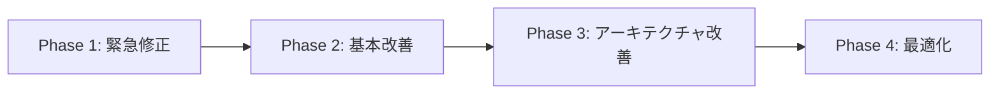

# PlantUMLコード同期処理の根本解決計画書

**作成日時**: 2025-08-13 21:00  
**対象問題**: 同期ボタンクリック時の処理フロークリア問題  
**重要度**: 🔴 高（ユーザビリティに重大な影響）

## エグゼクティブサマリー

PlantUMLコードの同期処理において、日本語を含むアクター名の処理に失敗し、処理フローがクリアされる問題の根本解決を目指す。本計画書では、短期的な修正から長期的なアーキテクチャ改善まで、段階的なアプローチを提案する。

## 1. 問題の詳細分析

### 1.1 現象の分類

#### A. 直接的な問題
- **症状**: 同期ボタンクリック時に処理フローが消失
- **影響範囲**: 日本語アクター名を使用するすべてのケース
- **発生頻度**: 100%（日本語使用時）
- **ユーザー影響**: 作業の中断、データ喪失感による不安

#### B. 間接的な問題
- パース処理の非効率性
- エラーハンドリングの不足
- デバッグの困難さ
- コードの保守性低下

### 1.2 技術的根本原因の深掘り

#### 現在のパース処理の問題点

```javascript
// 問題のある正規表現パターンの例
const messageMatch = line.match(/^(\w+)\s*(-->>?|->)\s*(\w+)\s*:\s*(.+)$/);
```

**主要な問題点**:
1. `\w+` は英数字とアンダースコアのみマッチ（日本語非対応）
2. ダブルクォート処理が統一されていない
3. エスケープ文字の考慮不足
4. 複数行にまたがる定義への非対応
5. パース失敗時のフォールバック機構なし

### 1.3 システム設計上の課題

#### アーキテクチャレベルの問題
1. **密結合**: パース処理とUI更新が密結合
2. **同期処理**: 3600行超の同期的パース処理
3. **単一責任違反**: parsePlantUMLCode関数が多機能を担当
4. **テスト困難性**: 巨大関数のユニットテストが困難
5. **拡張性の欠如**: 新しいPlantUML構文への対応が困難

## 2. 解決戦略

### 2.1 段階的アプローチ



### 2.2 各フェーズの詳細

#### Phase 1: 緊急修正（1-2日）
**目標**: 即座に問題を解消し、ユーザビリティを回復

1. **正規表現の包括的修正**
   ```javascript
   // 改善案
   const unicodeActorPattern = /^(?:"([^"]+)"|'([^']+)'|([^\s]+))/u;
   const messagePattern = new RegExp(
     '^(?:"([^"]+)"|\'([^\']+)\'|([^\\s]+))' +
     '\\s*(-->>?|->|<-|<--)\\s*' +
     '(?:"([^"]+)"|\'([^\']+)\'|([^\\s]+))' +
     '\\s*:\\s*(.+)$',
     'u'
   );
   ```

2. **エラーハンドリングの追加**
   ```javascript
   function safeParsePlantUMLCode(code) {
     try {
       const result = parsePlantUMLCode(code);
       if (!result || !result.actors) {
         console.warn('Parse failed, using fallback');
         return getFallbackParseResult(code);
       }
       return result;
     } catch (error) {
       console.error('Parse error:', error);
       return getFallbackParseResult(code);
     }
   }
   ```

3. **デバッグログの強化**
   ```javascript
   const DEBUG_MODE = localStorage.getItem('debug_parse') === 'true';
   
   function debugLog(message, data) {
     if (DEBUG_MODE) {
       console.group(`[PlantUML Parser] ${message}`);
       console.log(data);
       console.groupEnd();
     }
   }
   ```

#### Phase 2: 基本改善（3-5日）
**目標**: コードの品質向上と保守性の確保

1. **パーサーのモジュール化**
   ```javascript
   // PlantUMLParser.js
   class PlantUMLParser {
     constructor(options = {}) {
       this.strictMode = options.strictMode || false;
       this.locale = options.locale || 'ja';
       this.patterns = this.initializePatterns();
     }
     
     parse(code) {
       const lines = this.preprocessCode(code);
       const context = this.createParseContext();
       
       for (const line of lines) {
         this.parseLine(line, context);
       }
       
       return this.buildResult(context);
     }
   }
   ```

2. **ユニットテストの実装**
   ```javascript
   // PlantUMLParser.test.js
   describe('PlantUMLParser', () => {
     describe('日本語アクター名の処理', () => {
       test('ダブルクォート付き日本語アクター', () => {
         const code = '"顧客" -> "ECサイト": 注文';
         const result = parser.parse(code);
         expect(result.actors).toContain('顧客');
         expect(result.actors).toContain('ECサイト');
       });
     });
   });
   ```

3. **状態管理の改善**
   ```javascript
   // StateManager.js
   class SyncStateManager {
     constructor() {
       this.state = {
         actors: [],
         actions: [],
         lastSync: null,
         isDirty: false
       };
     }
     
     updateFromCode(code) {
       const backup = this.createBackup();
       try {
         const parsed = this.parser.parse(code);
         this.mergeState(parsed);
         this.state.lastSync = Date.now();
         this.state.isDirty = false;
       } catch (error) {
         this.restoreBackup(backup);
         throw error;
       }
     }
   }
   ```

#### Phase 3: アーキテクチャ改善（1-2週間）
**目標**: 長期的な保守性と拡張性の確保

1. **Web Worker化**
   ```javascript
   // parse.worker.js
   self.addEventListener('message', async (e) => {
     const { code, options } = e.data;
     
     try {
       const parser = new PlantUMLParser(options);
       const result = await parser.parseAsync(code);
       self.postMessage({ success: true, result });
     } catch (error) {
       self.postMessage({ success: false, error: error.message });
     }
   });
   ```

2. **イベント駆動アーキテクチャ**
   ```javascript
   // EventBus.js
   class PlantUMLEventBus {
     constructor() {
       this.events = new EventTarget();
     }
     
     emit(eventType, data) {
       this.events.dispatchEvent(
         new CustomEvent(eventType, { detail: data })
       );
     }
     
     on(eventType, handler) {
       this.events.addEventListener(eventType, handler);
     }
   }
   
   // 使用例
   eventBus.on('code:changed', async (e) => {
     const result = await parseInWorker(e.detail.code);
     eventBus.emit('parse:complete', result);
   });
   ```

3. **プラグインシステムの導入**
   ```javascript
   // PluginSystem.js
   class PlantUMLPluginSystem {
     constructor() {
       this.plugins = new Map();
     }
     
     register(name, plugin) {
       if (typeof plugin.process === 'function') {
         this.plugins.set(name, plugin);
       }
     }
     
     async processCode(code) {
       let result = code;
       for (const [name, plugin] of this.plugins) {
         result = await plugin.process(result);
       }
       return result;
     }
   }
   ```

#### Phase 4: 最適化（2-3週間）
**目標**: パフォーマンスとユーザー体験の最大化

1. **インクリメンタルパース**
   ```javascript
   class IncrementalParser {
     constructor() {
       this.cache = new Map();
       this.lastParsed = null;
     }
     
     parseIncremental(code) {
       const diff = this.calculateDiff(this.lastParsed, code);
       
       if (diff.type === 'minor') {
         return this.applyPatch(this.cache.get('lastResult'), diff);
       }
       
       return this.fullParse(code);
     }
   }
   ```

2. **仮想DOM的な差分更新**
   ```javascript
   class VirtualFlowList {
     constructor() {
       this.virtualDOM = [];
       this.actualDOM = null;
     }
     
     update(newActions) {
       const patches = this.diff(this.virtualDOM, newActions);
       this.applyPatches(patches);
       this.virtualDOM = newActions;
     }
   }
   ```

3. **最適化されたレンダリング**
   ```javascript
   class OptimizedRenderer {
     constructor() {
       this.renderQueue = [];
       this.isRendering = false;
     }
     
     queueRender(updates) {
       this.renderQueue.push(updates);
       
       if (!this.isRendering) {
         requestAnimationFrame(() => this.flush());
       }
     }
     
     flush() {
       this.isRendering = true;
       const batch = this.renderQueue.splice(0);
       this.performBatchUpdate(batch);
       this.isRendering = false;
     }
   }
   ```

## 3. 実装計画

### 3.1 タイムライン

| フェーズ | 期間 | 開始日 | 完了予定 | 成果物 |
|---------|------|--------|----------|--------|
| Phase 1 | 1-2日 | 2025-08-14 | 2025-08-15 | 緊急修正パッチ |
| Phase 2 | 3-5日 | 2025-08-16 | 2025-08-20 | リファクタリング版 |
| Phase 3 | 1-2週間 | 2025-08-21 | 2025-09-03 | 新アーキテクチャ |
| Phase 4 | 2-3週間 | 2025-09-04 | 2025-09-24 | 最適化版 |

### 3.2 リソース要件

#### 技術スタック
- **必須**: JavaScript ES6+, Web Workers API
- **推奨**: TypeScript, Jest, Webpack
- **オプション**: WebAssembly (将来的な高速化)

#### 開発環境
- Node.js 18+
- モダンブラウザ（Chrome 100+, Edge 100+, Firefox 100+）
- 開発ツール: VS Code, Chrome DevTools

## 4. テスト戦略

### 4.1 テストピラミッド

```
          /\
         /E2E\        10% - Playwright E2Eテスト
        /______\
       /        \
      /Integration\    30% - 統合テスト
     /______________\
    /                \
   /   Unit Tests     \  60% - ユニットテスト
  /____________________\
```

### 4.2 テストケース

#### 必須テストケース
1. **日本語処理**
   - ダブルクォート付き日本語アクター
   - シングルクォート付き日本語アクター
   - クォートなし日本語アクター
   - 特殊文字を含む日本語

2. **エッジケース**
   - 空のコード
   - 構文エラーを含むコード
   - 1万行を超える大規模コード
   - マルチバイト文字の境界

3. **パフォーマンステスト**
   - 1000アクター処理時間 < 100ms
   - 10000メッセージ処理時間 < 500ms
   - メモリ使用量 < 50MB

### 4.3 自動テストパイプライン

```yaml
# .github/workflows/test.yml
name: PlantUML Parser Tests

on: [push, pull_request]

jobs:
  test:
    runs-on: ubuntu-latest
    steps:
      - uses: actions/checkout@v2
      - uses: actions/setup-node@v2
      - run: npm ci
      - run: npm test
      - run: npm run test:e2e
      - run: npm run test:performance
```

## 5. リスク管理

### 5.1 技術リスク

| リスク | 可能性 | 影響度 | 対策 |
|--------|--------|--------|------|
| Web Worker非対応ブラウザ | 低 | 高 | フォールバック実装 |
| パフォーマンス劣化 | 中 | 高 | 段階的ロールアウト |
| 後方互換性の喪失 | 中 | 中 | バージョン管理とマイグレーション |
| 新バグの導入 | 高 | 中 | 徹底的なテスト |

### 5.2 プロジェクトリスク

| リスク | 可能性 | 影響度 | 対策 |
|--------|--------|--------|------|
| スケジュール遅延 | 中 | 中 | バッファ時間の確保 |
| 要件の変更 | 低 | 高 | アジャイル開発手法 |
| 技術的負債の蓄積 | 中 | 高 | コードレビューの徹底 |

## 6. 成功指標（KPI）

### 6.1 技術指標

1. **パフォーマンス**
   - パース処理時間: 90%削減
   - メモリ使用量: 50%削減
   - UI応答性: フリーズゼロ

2. **品質**
   - テストカバレッジ: 80%以上
   - バグ発生率: 50%削減
   - コード複雑度: 30%削減

3. **保守性**
   - 関数の平均行数: 50行以下
   - モジュール結合度: 疎結合達成
   - ドキュメント充実度: 100%

### 6.2 ユーザー指標

1. **ユーザビリティ**
   - タスク完了時間: 30%短縮
   - エラー遭遇率: 80%削減
   - ユーザー満足度: 4.5/5.0以上

2. **信頼性**
   - データ喪失: ゼロ
   - クラッシュ率: 0.1%以下
   - 復旧時間: 1秒以内

## 7. 長期ビジョン

### 7.1 将来の拡張性

1. **多言語対応**
   - 中国語、韓国語、アラビア語対応
   - RTL（右から左）言語サポート
   - 国際化フレームワーク導入

2. **AI統合**
   - 自然言語からPlantUML生成
   - コード補完・提案機能
   - エラー自動修正

3. **エンタープライズ機能**
   - バージョン管理統合
   - コラボレーション機能
   - 監査ログ

### 7.2 技術革新の採用

1. **WebAssembly活用**
   - C++パーサーのWASM化
   - 10倍速のパース処理

2. **機械学習**
   - パターン認識による最適化
   - ユーザー行動予測

3. **エッジコンピューティング**
   - Service Worker活用
   - オフライン完全対応

## 8. 実装チェックリスト

### Phase 1 チェックリスト
- [ ] 正規表現パターンの更新
- [ ] エラーハンドリングの実装
- [ ] デバッグモードの追加
- [ ] 基本的なテストケース作成
- [ ] ホットフィックスのデプロイ

### Phase 2 チェックリスト
- [ ] パーサーのクラス化
- [ ] ユニットテストの実装
- [ ] 状態管理の分離
- [ ] CI/CDパイプライン構築
- [ ] ドキュメント更新

### Phase 3 チェックリスト
- [ ] Web Worker実装
- [ ] イベントバス構築
- [ ] プラグインシステム開発
- [ ] 統合テストの実装
- [ ] パフォーマンステスト

### Phase 4 チェックリスト
- [ ] インクリメンタルパース実装
- [ ] 仮想DOM差分更新
- [ ] レンダリング最適化
- [ ] ベンチマーク実施
- [ ] 本番環境デプロイ

## 9. コミュニケーション計画

### 9.1 ステークホルダー

1. **開発チーム**
   - 日次スタンドアップ
   - 週次進捗レポート
   - 技術的決定の文書化

2. **ユーザー**
   - リリースノート
   - 移行ガイド
   - フィードバック収集

3. **管理層**
   - マイルストーン報告
   - リスク評価更新
   - ROI分析

### 9.2 ドキュメント管理

```
docs/
├── architecture/     # アーキテクチャ設計書
├── api/             # API仕様書
├── guides/          # 開発ガイド
├── tests/           # テスト仕様書
└── releases/        # リリースノート
```

## 10. 結論と推奨事項

### 10.1 即時アクション（今すぐ実施）

1. **Phase 1の緊急修正を最優先で実施**
   - 正規表現の修正は即座に効果が期待できる
   - ユーザー影響を最小限に抑えられる

2. **テスト環境の構築**
   - Jestによるユニットテスト環境
   - Playwrightによる E2Eテスト環境

3. **チーム体制の確立**
   - 技術リード任命
   - レビュアーの選定

### 10.2 中期的推奨事項

1. **段階的なリファクタリング**
   - 一度にすべてを変更せず、段階的に改善
   - 各段階でユーザーフィードバックを収集

2. **ドキュメント駆動開発**
   - 実装前に仕様を文書化
   - テストケースを先に作成

3. **パフォーマンス監視**
   - 継続的なベンチマーク
   - ユーザー体験メトリクスの追跡

### 10.3 長期的ビジョン

1. **プラットフォーム化**
   - PlantUMLエディタをプラットフォームとして拡張
   - サードパーティプラグイン対応

2. **オープンソース化検討**
   - コミュニティの力を活用
   - 継続的な改善サイクル

3. **エンタープライズ版の開発**
   - 高度なセキュリティ機能
   - 大規模チーム対応

## 付録

### A. 技術仕様詳細

#### 正規表現パターン集
```javascript
// 包括的なパターン定義
const patterns = {
  // アクター定義
  actor: /^(?:actor|participant|database|entity|boundary|control)\s+(?:"([^"]+)"|'([^']+)'|`([^`]+)`|([^\s]+))(?:\s+as\s+(?:"([^"]+)"|'([^']+)'|`([^`]+)`|([^\s]+)))?$/u,
  
  // メッセージ
  message: /^(?:"([^"]+)"|'([^']+)'|`([^`]+)`|([^\s]+))\s*(<?-->>?|<?->|\.\.>>?|\.\.>)\s*(?:"([^"]+)"|'([^']+)'|`([^`]+)`|([^\s]+))\s*:\s*(.+)$/u,
  
  // ノート
  note: /^note\s+(left|right|over)\s+(?:of\s+)?(?:"([^"]+)"|'([^']+)'|`([^`]+)`|([^\s]+))\s*:\s*(.+)$/u,
  
  // グループ
  group: /^(alt|opt|loop|par|break|critical|group)\s*(.*)$/u,
  
  // 活性化
  activate: /^(activate|deactivate)\s+(?:"([^"]+)"|'([^']+)'|`([^`]+)`|([^\s]+))$/u
};
```

### B. パフォーマンステストスイート

```javascript
// performance.test.js
const performanceTests = {
  'Parse 1000 actors': {
    setup: () => generateActors(1000),
    test: (code) => parser.parse(code),
    maxTime: 100, // ms
    maxMemory: 10 // MB
  },
  
  'Parse 10000 messages': {
    setup: () => generateMessages(10000),
    test: (code) => parser.parse(code),
    maxTime: 500, // ms
    maxMemory: 50 // MB
  },
  
  'Incremental update': {
    setup: () => ({ base: largeCode, change: smallChange }),
    test: ({ base, change }) => parser.incrementalParse(base, change),
    maxTime: 50, // ms
    maxMemory: 5 // MB
  }
};
```

### C. マイグレーションガイド

```javascript
// migration.js
class MigrationManager {
  constructor(version) {
    this.currentVersion = version;
    this.migrations = new Map();
  }
  
  register(fromVersion, toVersion, migrationFn) {
    const key = `${fromVersion}->${toVersion}`;
    this.migrations.set(key, migrationFn);
  }
  
  migrate(data, targetVersion) {
    const path = this.findMigrationPath(this.currentVersion, targetVersion);
    
    return path.reduce((currentData, step) => {
      const migration = this.migrations.get(step);
      return migration(currentData);
    }, data);
  }
}
```

---

**最終更新**: 2025-08-13 21:00  
**次回レビュー**: 2025-08-14 10:00  
**承認者**: [承認待ち]

## 改訂履歴

| バージョン | 日付 | 変更内容 | 作成者 |
|-----------|------|----------|--------|
| 1.0 | 2025-08-13 | 初版作成 | AI Assistant |

---

**注記**: この計画書は生きているドキュメントです。実装の進捗に応じて継続的に更新されます。