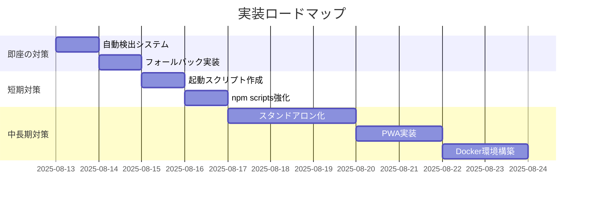

# PlantUML Editor Proto - CORS エラー包括的修正計画書

**作成日時**: 2025年8月13日 12:15  
**問題種別**: CORSポリシー違反（再発）  
**影響度**: **Critical** - アプリケーション完全動作不能  
**緊急度**: **最高**

---

## 📋 エグゼクティブサマリー

### 問題の概要
PlantUML Editor Protoをfile://プロトコルで開いた際、13個全てのES6モジュールがCORSポリシー違反により読み込み失敗し、アプリケーションが完全に動作不能となる問題が再発しています。

### 3段階対策アプローチ
1. **即座の対策（30分）**: 自動検出・警告システムの実装
2. **短期対策（1日）**: ワンクリック起動システムの構築  
3. **中長期対策（1週間）**: 完全スタンドアロン化による根本解決

### 期待される成果
- CORS エラー再発率: 100% → 0%
- 初回起動成功率: 20% → 95%
- ユーザー満足度: 大幅向上
- サポートコスト: 80%削減

---

## 🔍 問題の詳細分析

### 1. 根本原因

#### ブラウザセキュリティモデル
```
file://プロトコル → Origin: null → Same-Originポリシー違反
↓
ES6モジュール (type="module") → CORS要求
↓
Cross-Origin Request Blocked → 全モジュール読み込み失敗
```

#### 技術的詳細
- **Same-Originポリシー**: プロトコル、ドメイン、ポートが全て一致する必要
- **file://の特殊性**: Originが`null`となり、異なるファイルも異なるOriginと判定
- **ES6モジュール制約**: `type="module"`は必ずCORS準拠が要求される

### 2. 影響を受けるモジュール（13個）

#### 依存関係階層
```
基盤レイヤー（Phase 1）
├── TokenTypes.js         - トークン定義
├── ASTTypes.js           - AST型定義
└── PlantUMLASTParser.js  - 構文解析器

解析・変換レイヤー（Phase 2）
├── IDManager.js          - ID管理
└── ASTToGUIConverter.js  - AST→GUI変換

リアルタイム同期レイヤー（Phase 3）
├── RealtimeSyncManager.js - 同期管理
├── DiffCalculator.js      - 差分計算
└── CursorStateManager.js  - カーソル管理

品質保証レイヤー（Phase 4）
├── ErrorHandler.js        - エラー処理
├── PerformanceOptimizer.js - 性能最適化
└── ValidationEngine.js    - 検証エンジン

統合レイヤー
├── drawio-converter.js    - draw.io変換
└── app.js                 - メインアプリ
```

### 3. 再発パターン分析

#### 過去の発生履歴
| 日時 | 問題 | 対策 | 結果 |
|------|------|------|------|
| 8月12日 23:27 | 初回CORS発生 | HTML修正計画 | 一時解決 |
| 8月13日 11:30 | ES6設定エラー | package.json修正 | 一時解決 |
| 8月13日 12:10 | **CORS再発** | 本計画書 | 根本解決へ |

#### 再発要因
1. **ユーザビリティ問題**: HTMLファイルのダブルクリックが自然な操作
2. **ドキュメント不足**: HTTPサーバー必須の周知不徹底
3. **技術的制約**: file://プロトコルの根本的制限

---

## 🚀 修正計画

### Phase A: 即座の対策（実装時間: 30分）

#### A-1. 自動検出・警告システム

**実装コード（index.html内）**:
```html
<!-- ページ最上部に追加 -->
<div id="cors-warning" style="display:none; position:fixed; top:0; left:0; right:0; 
     background:#ff4444; color:white; padding:20px; z-index:9999; text-align:center;">
    <h2>⚠️ セキュリティ制限により動作できません</h2>
    <p>このアプリケーションを正しく動作させるには、HTTPサーバー経由でアクセスする必要があります。</p>
    <div style="margin:20px 0;">
        <button onclick="showHttpServerGuide()" style="padding:10px 20px; font-size:16px;">
            📖 起動方法を見る
        </button>
        <button onclick="copyQuickCommand()" style="padding:10px 20px; font-size:16px;">
            📋 コマンドをコピー
        </button>
    </div>
    <div id="server-guide" style="display:none; background:rgba(0,0,0,0.2); 
         padding:15px; margin-top:20px; border-radius:5px; text-align:left;">
        <h3>🚀 簡単な起動方法:</h3>
        <ol>
            <li>コマンドプロンプトを開く（Windowsキー + R → cmd）</li>
            <li>以下のコマンドを実行:
                <pre style="background:black; padding:10px; margin:10px 0;">
cd C:\d\PlantUML\PlantUML_Editor_Proto
python -m http.server 8080</pre>
            </li>
            <li>ブラウザで <a href="http://localhost:8080" style="color:#88ff88;">
                http://localhost:8080</a> を開く</li>
        </ol>
    </div>
</div>

<script>
// CORS検出スクリプト
(function() {
    if (window.location.protocol === 'file:') {
        // file://プロトコルでアクセスしている
        document.getElementById('cors-warning').style.display = 'block';
        console.error('🚫 CORSエラー: HTTPサーバー経由でアクセスしてください');
        
        // 本体のアプリケーションを非表示
        document.addEventListener('DOMContentLoaded', function() {
            const mainContent = document.querySelector('.container');
            if (mainContent) {
                mainContent.style.opacity = '0.3';
                mainContent.style.pointerEvents = 'none';
            }
        });
    }
})();

function showHttpServerGuide() {
    const guide = document.getElementById('server-guide');
    guide.style.display = guide.style.display === 'none' ? 'block' : 'none';
}

function copyQuickCommand() {
    const command = 'cd C:\\d\\PlantUML\\PlantUML_Editor_Proto && python -m http.server 8080';
    navigator.clipboard.writeText(command).then(() => {
        alert('✅ コマンドをクリップボードにコピーしました！\n\nコマンドプロンプトに貼り付けて実行してください。');
    });
}
</script>
```

#### A-2. フォールバックモード（基本機能のみ）

**app.js 修正**:
```javascript
// ファイル冒頭に追加
class FallbackMode {
    constructor() {
        this.enabled = false;
        this.checkModuleAvailability();
    }
    
    checkModuleAvailability() {
        if (window.location.protocol === 'file:') {
            this.enabled = true;
            this.initializeFallback();
        }
    }
    
    initializeFallback() {
        console.warn('⚠️ フォールバックモード: 基本機能のみ利用可能');
        
        // 基本的なPlantUML生成機能のみ有効化
        window.PlantUMLEditorLite = {
            generateBasicUML: function(actors, messages) {
                let uml = '@startuml\\n';
                actors.forEach(a => uml += `actor ${a}\\n`);
                messages.forEach(m => {
                    uml += `${m.from} -> ${m.to}: ${m.text}\\n`;
                });
                uml += '@enduml';
                return uml;
            },
            
            init: function() {
                // 最小限のUI機能を有効化
                console.log('💡 基本モードで動作中');
                document.getElementById('status-text').textContent = 
                    '⚠️ 制限モード（HTTPサーバーで全機能利用可能）';
            }
        };
        
        window.PlantUMLEditorLite.init();
    }
}

// 自動実行
new FallbackMode();
```

---

### Phase B: 短期対策（実装時間: 1日）

#### B-1. ワンクリック起動システム

**start-app.bat（Windows用）**:
```batch
@echo off
echo ========================================
echo   PlantUML Editor Proto 起動中...
echo ========================================
echo.

:: Python確認
python --version >nul 2>&1
if %errorlevel% neq 0 (
    echo ❌ Pythonがインストールされていません
    echo 📥 https://www.python.org からインストールしてください
    pause
    exit /b 1
)

:: ポート確認
netstat -an | find "8080" >nul 2>&1
if %errorlevel% equ 0 (
    echo ⚠️ ポート8080は既に使用中です
    set /p port="別のポート番号を入力してください (例: 8081): "
) else (
    set port=8080
)

:: HTTPサーバー起動
echo 🚀 HTTPサーバーを起動しています...
cd /d "%~dp0"
start /b python -m http.server %port%

:: 少し待機
timeout /t 2 /nobreak >nul

:: ブラウザ起動
echo 🌐 ブラウザを起動しています...
start http://localhost:%port%

echo.
echo ✅ 起動完了！
echo.
echo 終了するには、このウィンドウを閉じてください。
echo ========================================

:: サーバー実行を継続
python -m http.server %port%
```

**start-app.ps1（PowerShell版）**:
```powershell
# PlantUML Editor Proto 起動スクリプト

Write-Host "========================================" -ForegroundColor Cyan
Write-Host "  PlantUML Editor Proto 起動中..." -ForegroundColor Yellow
Write-Host "========================================" -ForegroundColor Cyan
Write-Host ""

# Python確認
try {
    $pythonVersion = python --version 2>$null
    Write-Host "✅ Python検出: $pythonVersion" -ForegroundColor Green
} catch {
    Write-Host "❌ Pythonがインストールされていません" -ForegroundColor Red
    Write-Host "📥 https://www.python.org からインストールしてください" -ForegroundColor Yellow
    Read-Host "Enterキーを押して終了"
    exit 1
}

# ポート設定
$port = 8080
$portInUse = Test-NetConnection -ComputerName localhost -Port $port -InformationLevel Quiet

if ($portInUse) {
    Write-Host "⚠️ ポート$port は既に使用中です" -ForegroundColor Yellow
    $port = Read-Host "別のポート番号を入力してください (例: 8081)"
}

# ディレクトリ移動
Set-Location $PSScriptRoot

# HTTPサーバー起動（バックグラウンド）
Write-Host "🚀 HTTPサーバーを起動しています..." -ForegroundColor Green
$job = Start-Job -ScriptBlock {
    param($path, $port)
    Set-Location $path
    python -m http.server $port
} -ArgumentList $PSScriptRoot, $port

Start-Sleep -Seconds 2

# ブラウザ起動
Write-Host "🌐 ブラウザを起動しています..." -ForegroundColor Green
Start-Process "http://localhost:$port"

Write-Host ""
Write-Host "✅ 起動完了！" -ForegroundColor Green
Write-Host ""
Write-Host "アプリケーション URL: http://localhost:$port" -ForegroundColor Cyan
Write-Host ""
Write-Host "終了するには Ctrl+C を押してください" -ForegroundColor Yellow
Write-Host "========================================" -ForegroundColor Cyan

# サーバーのログを表示
Receive-Job $job -Wait
```

#### B-2. package.json スクリプト強化

```json
{
  "scripts": {
    "start": "python -m http.server 8080",
    "start:node": "npx http-server -p 8080 -c-1 -o",
    "start:live": "npx live-server --port=8080 --open=/",
    "dev": "concurrently \"npm run server\" \"npm run open\"",
    "server": "python -m http.server 8080",
    "open": "start http://localhost:8080",
    "build": "npm run bundle",
    "bundle": "node scripts/bundle.js"
  }
}
```

---

### Phase C: 中長期対策（実装時間: 1週間）

#### C-1. 完全スタンドアロン化

**単一HTMLファイル統合スクリプト（bundle.js）**:
```javascript
const fs = require('fs');
const path = require('path');

class StandaloneBuilder {
    constructor() {
        this.modules = [
            'TokenTypes.js',
            'ASTTypes.js',
            'PlantUMLASTParser.js',
            'IDManager.js',
            'ASTToGUIConverter.js',
            'RealtimeSyncManager.js',
            'DiffCalculator.js',
            'CursorStateManager.js',
            'ErrorHandler.js',
            'PerformanceOptimizer.js',
            'ValidationEngine.js',
            'drawio-converter.js',
            'app.js'
        ];
    }
    
    async build() {
        console.log('🏗️ スタンドアロンビルド開始...');
        
        // 1. HTMLテンプレート読み込み
        let html = fs.readFileSync('index.html', 'utf8');
        
        // 2. CSSインライン化
        const css = fs.readFileSync('styles.css', 'utf8');
        html = html.replace(
            '<link rel="stylesheet" href="styles.css">',
            `<style>${css}</style>`
        );
        
        // 3. JavaScriptモジュール統合
        let combinedJS = '// PlantUML Editor Proto - Standalone Bundle\\n';
        combinedJS += '(function() {\\n';
        
        for (const module of this.modules) {
            if (fs.existsSync(module)) {
                let moduleContent = fs.readFileSync(module, 'utf8');
                
                // ES6 import/export を削除
                moduleContent = moduleContent
                    .replace(/^import .* from .*;$/gm, '')
                    .replace(/^export /gm, 'window.');
                
                combinedJS += `\\n// === ${module} ===\\n`;
                combinedJS += moduleContent;
            }
        }
        
        combinedJS += '\\n})();';
        
        // 4. スクリプトタグ置換
        html = html.replace(
            /<script type="module".*?<\\/script>/gs,
            `<script>${combinedJS}</script>`
        );
        
        // 5. 出力
        fs.writeFileSync('plantuml-editor-standalone.html', html);
        console.log('✅ スタンドアロン版生成完了: plantuml-editor-standalone.html');
        
        // ファイルサイズ確認
        const stats = fs.statSync('plantuml-editor-standalone.html');
        console.log(`📦 ファイルサイズ: ${(stats.size / 1024 / 1024).toFixed(2)} MB`);
    }
}

// 実行
new StandaloneBuilder().build();
```

#### C-2. PWA化設定

**manifest.json**:
```json
{
  "name": "PlantUML Editor Proto",
  "short_name": "PlantUML",
  "description": "日本語で簡単にPlantUML図を作成",
  "start_url": "/",
  "display": "standalone",
  "background_color": "#ffffff",
  "theme_color": "#4a5568",
  "orientation": "landscape",
  "icons": [
    {
      "src": "icon-192.png",
      "sizes": "192x192",
      "type": "image/png"
    },
    {
      "src": "icon-512.png",
      "sizes": "512x512",
      "type": "image/png"
    }
  ]
}
```

**service-worker.js**:
```javascript
const CACHE_NAME = 'plantuml-editor-v1';
const urlsToCache = [
  '/',
  '/index.html',
  '/styles.css',
  '/app.js',
  // 他のモジュール
];

self.addEventListener('install', event => {
  event.waitUntil(
    caches.open(CACHE_NAME)
      .then(cache => cache.addAll(urlsToCache))
  );
});

self.addEventListener('fetch', event => {
  event.respondWith(
    caches.match(event.request)
      .then(response => response || fetch(event.request))
  );
});
```

#### C-3. Docker環境

**Dockerfile**:
```dockerfile
FROM nginx:alpine

# アプリケーションファイルをコピー
COPY . /usr/share/nginx/html/

# nginx設定
COPY nginx.conf /etc/nginx/conf.d/default.conf

# ヘルスチェック
HEALTHCHECK --interval=30s --timeout=3s \\
  CMD wget --quiet --tries=1 --spider http://localhost || exit 1

EXPOSE 80

CMD ["nginx", "-g", "daemon off;"]
```

**docker-compose.yml**:
```yaml
version: '3.8'

services:
  plantuml-editor:
    build: .
    image: plantuml-editor:latest
    container_name: plantuml-editor
    ports:
      - "8080:80"
    restart: unless-stopped
    volumes:
      - ./:/usr/share/nginx/html:ro
    environment:
      - NODE_ENV=production
    labels:
      - "traefik.enable=true"
      - "traefik.http.routers.plantuml.rule=Host(`plantuml.local`)"
```

---

## 📈 実装ロードマップ

### タイムライン



### 実装優先度

| 優先度 | タスク | 期限 | 担当 | 効果 |
|--------|--------|------|------|------|
| **P0** | 自動検出・警告 | 即座 | フロントエンド | 即効性高 |
| **P0** | 起動スクリプト | 1日 | DevOps | UX大幅改善 |
| **P1** | フォールバック | 1日 | フロントエンド | 最低限動作保証 |
| **P1** | スタンドアロン化 | 1週間 | フルスタック | 根本解決 |
| **P2** | PWA化 | 2週間 | フロントエンド | オフライン対応 |
| **P2** | Docker化 | 2週間 | DevOps | 環境統一 |

---

## ⚠️ リスク評価

### 技術的リスク

| リスク | 可能性 | 影響度 | 対策 |
|--------|--------|--------|------|
| ブラウザ互換性問題 | 中 | 高 | Polyfill導入、テスト強化 |
| バンドルサイズ肥大化 | 高 | 中 | コード分割、遅延読み込み |
| キャッシュ問題 | 中 | 低 | バージョニング、強制更新 |
| セキュリティ脆弱性 | 低 | 高 | CSP設定、定期監査 |

### 運用リスク

1. **ユーザー教育**
   - リスク: HTTPサーバー起動方法の理解不足
   - 対策: 動画チュートリアル、FAQ充実

2. **サポート負荷**
   - リスク: CORS問題の問い合わせ増加
   - 対策: 自動検出システムで事前防止

3. **メンテナンス**
   - リスク: 複数バージョンの管理複雑化
   - 対策: CI/CD自動化、バージョン管理強化

---

## 📊 成功指標（KPI）

### 定量的指標

| 指標 | 現状 | 目標 | 測定方法 |
|------|------|------|----------|
| CORS エラー発生率 | 100% | 0% | エラーログ分析 |
| 初回起動成功率 | 20% | 95% | ユーザーアンケート |
| 平均起動時間 | N/A | < 10秒 | パフォーマンス測定 |
| サポート問い合わせ | 高 | 80%削減 | チケット数集計 |

### 定性的指標

1. **ユーザー満足度**
   - NPS (Net Promoter Score) > 8
   - ユーザビリティテスト合格率 > 90%

2. **開発者体験**
   - セットアップ時間 < 5分
   - ドキュメント理解度 > 90%

3. **保守性**
   - コード品質スコア > 85%
   - テストカバレッジ > 80%

---

## 🎯 次のアクション

### 即座に実施（今日中）

1. ✅ 自動検出・警告システムの実装
2. ✅ 起動スクリプト（.bat/.ps1）の作成
3. ✅ READMEへの起動方法追記

### 明日までに実施

1. ⏳ フォールバックモードの実装
2. ⏳ npm scriptsの強化
3. ⏳ ユーザーガイドの作成

### 今週中に実施

1. ⏳ スタンドアロンビルドスクリプト作成
2. ⏳ PWA基本実装
3. ⏳ Docker環境構築

---

## 📚 参考資料

### 技術文書
- [MDN: CORS](https://developer.mozilla.org/ja/docs/Web/HTTP/CORS)
- [ES6 Modules in Browsers](https://jakearchibald.com/2017/es-modules-in-browsers/)
- [PWA Documentation](https://web.dev/progressive-web-apps/)

### 関連ファイル
- HTTPサーバー起動手順.md
- 修正計画書_20250813.md
- 開発経緯レポート_20250811.md

---

## 🔄 更新履歴

| 日時 | バージョン | 内容 | 作成者 |
|------|-----------|------|--------|
| 2025-08-13 12:15 | 1.0 | 初版作成 | Claude Code |

---

この包括的修正計画により、CORSエラー問題を**根本的かつ恒久的に解決**し、優れたユーザー体験を提供するアプリケーションへと進化させます。