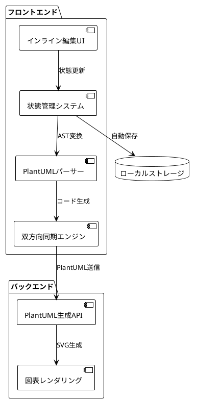
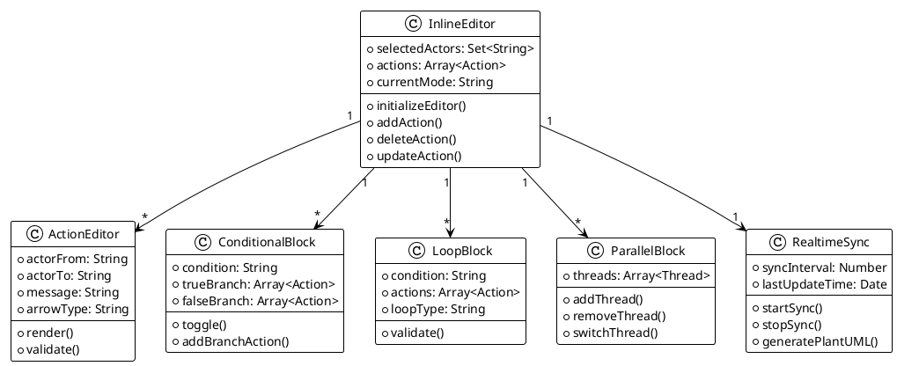
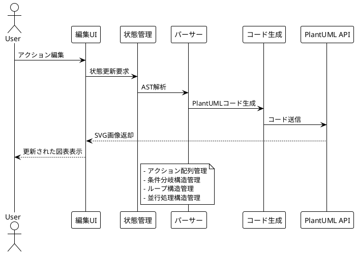

# PlantUMLエディター インライン編集機能 設計仕様書

**バージョン**: 1.0  
**作成日**: 2025年8月15日  
**最終更新**: 2025年8月15日  
**作成者**: software-doc-writer agent  

---

## 1. エグゼクティブサマリー

### 1.1 概要
本文書は、PlantUMLエディターにおけるインライン編集機能の設計仕様書です。ユーザーが日本語で記述した処理フローを視覚的に編集し、リアルタイムでPlantUMLコードに変換する機能を定義します。

### 1.2 目的と背景
- **問題**: 非エンジニアがPlantUML記法を覚えるのは困難
- **解決策**: 日本語入力とビジュアル編集による直感的な図表作成
- **ターゲット**: 企業の営業職、企画職、運用担当者（非エンジニア）

### 1.3 重要な価値提案
1. **学習コスト0**: PlantUML記法の学習不要
2. **時間短縮**: 図表作成時間を従来の1/5に短縮（3時間→30分）
3. **リアルタイム更新**: 編集と同時にコード生成
4. **複雑性対応**: 条件分岐、ループ、並行処理の視覚的編集

---

## 2. ユーザーストーリー

### 2.1 基本操作ストーリー
```
As a 営業企画担当者
I want to 日本語でフローを記述して視覚的に編集
So that 会議資料用の図表を短時間で作成できる
```

**受け入れ基準**:
- 日本語入力でアクターとメッセージを設定可能
- ドラッグ&ドロップでアクション順序変更可能
- リアルタイムでPlantUMLコード生成

### 2.2 条件分岐編集ストーリー
```
As a EC運用担当者
I want to 「認証成功」と「認証失敗」の条件分岐を視覚的に編集
So that システムフローの複数パターンを明確に表現できる
```

**受け入れ基準**:
- 条件入力欄で分岐条件を日本語設定
- TRUE/FALSE分岐それぞれにアクション追加可能
- 分岐ブロックの展開/折りたたみ機能

### 2.3 ループ処理編集ストーリー
```
As a データ処理担当者
I want to 「データが存在する限り」などのループ条件を設定
So that 繰り返し処理のフローを正確に表現できる
```

**受け入れ基準**:
- ループ条件を日本語で入力可能
- ループ内にアクションを自由に追加可能
- ネストしたループの視覚的表現

### 2.4 並行処理編集ストーリー
```
As a システム設計者
I want to 複数のAPIを同時呼び出しする処理を並行ブロックで表現
So that システムのパフォーマンス設計を関係者と共有できる
```

**受け入れ基準**:
- タブ形式でスレッドを切り替え
- スレッド追加/削除機能
- 非同期矢印（⇢）の自動選択

### 2.5 高度編集ストーリー
```
As a プロジェクトマネージャー
I want to 複雑なワークフローを段階的に構築
So that チームメンバーとの認識合わせを効率化したい
```

**受け入れ基準**:
- ステップごとの段階的編集
- ブロック展開/折りたたみによる情報階層化
- コピー&ペースト機能

---

## 3. 機能要件

### 3.1 コア機能
| 機能ID | 機能名 | 優先度 | 説明 |
|--------|--------|--------|------|
| F-001 | アクター管理 | 高 | User, System, DB, APIの選択・編集 |
| F-002 | メッセージ編集 | 高 | 日本語メッセージのインライン編集 |
| F-003 | 矢印タイプ選択 | 高 | 同期(→)、非同期(⇢)、戻り値(⟵)選択 |
| F-004 | アクション並び替え | 高 | ドラッグ&ドロップによる順序変更 |
| F-005 | 条件分岐編集 | 高 | IF-ELSE構造の視覚的編集 |
| F-006 | ループ編集 | 中 | WHILE/FOR構造の視覚的編集 |
| F-007 | 並行処理編集 | 中 | PAR構造のタブ式編集 |
| F-008 | リアルタイム同期 | 高 | 編集内容のPlantUMLコード即時反映 |

### 3.2 UI/UX要件
| 要件ID | 要件名 | 説明 |
|--------|--------|------|
| UX-001 | レスポンシブデザイン | 画面サイズに応じたレイアウト調整 |
| UX-002 | アクセシビリティ | WCAG 2.1 AA準拠 |
| UX-003 | キーボード操作 | マウス操作の代替手段提供 |
| UX-004 | 視覚的フィードバック | ホバー、フォーカス、アクション時の視覚効果 |
| UX-005 | エラー表示 | 入力エラー時の明確なメッセージ表示 |

### 3.3 パフォーマンス要件
- **レスポンス時間**: ユーザー操作から画面更新まで < 100ms
- **コード生成時間**: 編集からPlantUMLコード生成まで < 200ms
- **メモリ使用量**: ブラウザタブあたり < 50MB
- **ファイルサイズ**: JavaScriptバンドル < 500KB (gzip圧縮後)

---

## 4. 技術アーキテクチャ

### 4.1 システム全体構成



### 4.2 クラス構成図



### 4.3 データフロー図



---

## 5. UI/UX仕様

### 5.1 画面レイアウト
- **2分割レイアウト**: 左側編集パネル、右側PlantUMLコード表示
- **レスポンシブ**: タブレット以下でスタック表示
- **最小解像度**: 1024×768px対応

### 5.2 カラーパレット
```css
:root {
  --primary-color: #2196f3;    /* メインブルー */
  --secondary-color: #757575;  /* グレー */
  --success-color: #4caf50;    /* 成功グリーン */
  --warning-color: #ff9800;    /* 警告オレンジ */
  --error-color: #f44336;      /* エラーレッド */
  --background-color: #f5f5f5; /* 背景グレー */
  --surface-color: #ffffff;    /* カード背景 */
}
```

### 5.3 タイポグラフィ
- **フォントファミリー**: 'Segoe UI', 'メイリオ', sans-serif
- **基本フォントサイズ**: 14px
- **行間**: 1.6
- **見出し比率**: 1.25 (Type Scale)

### 5.4 インタラクション仕様
| 操作 | 対象 | アクション | フィードバック |
|------|------|-----------|-------------|
| ホバー | アクション項目 | box-shadow表示 | 0.2s transition |
| クリック | 条件分岐ブロック | 展開/折りたたみ | アイコン回転90° |
| ドラッグ | アクション項目 | 順序変更 | 半透明表示 |
| フォーカス | 入力欄 | border-color変更 | 青色ハイライト |

---

## 6. 実装詳細

### 6.1 HTML構造
```html
<div class="inline-editor">
  <div class="step-container">
    <div class="step-header">
      <span class="step-number">1</span>
      <span class="step-title">ステップ名</span>
    </div>
    <div class="step-content">
      <!-- アクション項目 -->
      <div class="action-item-inline">
        <span class="drag-handle">☰</span>
        <select class="actor-select-inline">...</select>
        <select class="arrow-type-inline">...</select>
        <select class="actor-select-inline">...</select>
        <input class="message-input-inline" />
        <div class="action-buttons-inline">
          <button class="btn-inline delete">🗑️</button>
          <button class="btn-inline question">？</button>
        </div>
      </div>
    </div>
  </div>
</div>
```

### 6.2 JavaScript実装パターン
```javascript
class InlineActionEditor {
  constructor(container) {
    this.container = container;
    this.actions = [];
    this.bindEvents();
  }
  
  addAction() {
    const newAction = this.createActionElement();
    this.container.appendChild(newAction);
    this.actions.push(newAction);
    this.updatePlantUML();
  }
  
  deleteAction(actionElement) {
    const index = this.actions.indexOf(actionElement);
    if (index > -1) {
      this.actions.splice(index, 1);
      actionElement.remove();
      this.updatePlantUML();
    }
  }
  
  updatePlantUML() {
    const plantUMLCode = this.generatePlantUMLCode();
    this.syncToCodeEditor(plantUMLCode);
  }
}
```

### 6.3 状態管理
```javascript
class EditorStateManager {
  constructor() {
    this.state = {
      actors: ['User', 'System', 'DB', 'API'],
      steps: [],
      currentStep: 0,
      editMode: 'inline'
    };
    this.listeners = [];
  }
  
  updateState(newState) {
    this.state = { ...this.state, ...newState };
    this.notifyListeners();
  }
  
  subscribe(listener) {
    this.listeners.push(listener);
  }
  
  notifyListeners() {
    this.listeners.forEach(listener => listener(this.state));
  }
}
```

---

## 7. API仕様

### 7.1 PlantUMLコード生成API
```javascript
/**
 * アクションからPlantUMLコードを生成
 * @param {Array} actions - アクション配列
 * @param {Object} options - 生成オプション
 * @returns {Promise<String>} PlantUMLコード
 */
async function generatePlantUMLCode(actions, options = {}) {
  // 実装詳細
}
```

### 7.2 状態同期API
```javascript
/**
 * 編集状態をローカルストレージに保存
 * @param {Object} editorState - エディター状態
 */
function saveEditorState(editorState) {
  localStorage.setItem('plantuml-editor-state', JSON.stringify(editorState));
}

/**
 * 編集状態をローカルストレージから復元
 * @returns {Object} エディター状態
 */
function loadEditorState() {
  const saved = localStorage.getItem('plantuml-editor-state');
  return saved ? JSON.parse(saved) : getDefaultState();
}
```

### 7.3 バリデーションAPI
```javascript
/**
 * アクション設定の妥当性チェック
 * @param {Object} action - アクション設定
 * @returns {Object} バリデーション結果
 */
function validateAction(action) {
  const errors = [];
  
  if (!action.actorFrom) errors.push('送信元アクターが未設定');
  if (!action.actorTo) errors.push('送信先アクターが未設定');
  if (!action.message.trim()) errors.push('メッセージが空');
  
  return {
    isValid: errors.length === 0,
    errors
  };
}
```

---

## 8. テスト戦略

### 8.1 テストピラミッド
```plantuml
@startuml "テストピラミッド"
!theme plain

skinparam rectangle {
  BackgroundColor #e3f2fd
  BorderColor #1976d2
}

rectangle "E2Eテスト (10%)\n- ユーザーシナリオ\n- クロスブラウザテスト" as E2E
rectangle "統合テスト (30%)\n- API連携テスト\n- コンポーネント間連携" as Integration
rectangle "単体テスト (60%)\n- 関数レベルテスト\n- モジュールテスト" as Unit

E2E
Integration
Unit

@enduml
```

### 8.2 テスト種別と実行戦略

#### 8.2.1 単体テスト (Jest)
```javascript
describe('InlineActionEditor', () => {
  test('アクション追加時に配列に要素が追加される', () => {
    const editor = new InlineActionEditor(document.createElement('div'));
    editor.addAction();
    expect(editor.actions.length).toBe(1);
  });
  
  test('PlantUMLコード生成が正常に動作する', () => {
    const actions = [
      { actorFrom: 'User', actorTo: 'System', message: 'ログイン' }
    ];
    const code = generatePlantUMLCode(actions);
    expect(code).toContain('User -> System : ログイン');
  });
});
```

#### 8.2.2 統合テスト (Playwright)
```javascript
test('アクション追加から削除までの完全フロー', async ({ page }) => {
  await page.goto('http://localhost:3000');
  
  // アクション追加
  await page.click('.btn-add-action-inline');
  await page.fill('.message-input-inline', 'テストメッセージ');
  
  // PlantUMLコード生成確認
  const code = await page.textContent('.code-editor');
  expect(code).toContain('テストメッセージ');
  
  // アクション削除
  await page.click('.btn-inline.delete');
  await page.click('text=OK'); // confirm dialog
  
  // アクションが削除されたことを確認
  const actionCount = await page.locator('.action-item-inline').count();
  expect(actionCount).toBe(0);
});
```

#### 8.2.3 E2Eテスト (Playwright)
```javascript
test('複雑なワークフローの作成と編集', async ({ page }) => {
  await page.goto('http://localhost:3000');
  
  // 条件分岐作成
  await page.click('text=条件分岐');
  await page.fill('.process-condition-input', 'ユーザー認証');
  
  // TRUE分岐にアクション追加
  await page.click('.branch-true .btn-add-action-inline');
  
  // ループ追加
  await page.click('text=ループ');
  
  // 並行処理追加
  await page.click('text=並行処理');
  await page.click('.thread-add-btn');
  
  // 最終的なPlantUMLコード確認
  const finalCode = await page.textContent('.code-editor');
  expect(finalCode).toContain('alt ユーザー認証');
  expect(finalCode).toContain('loop');
  expect(finalCode).toContain('par');
});
```

### 8.3 テスト実行環境
- **ユニットテスト**: Node.js 20.x + Jest 29.x
- **統合・E2Eテスト**: Playwright (Chromium, Firefox, WebKit)
- **CI/CD**: GitHub Actions
- **カバレッジ目標**: ライン87%以上、ブランチ80%以上

---

## 9. セキュリティ考慮事項

### 9.1 入力検証・サニタイゼーション
```javascript
/**
 * XSS攻撃対策のための入力サニタイゼーション
 */
function sanitizeInput(input) {
  return input
    .replace(/&/g, '&amp;')
    .replace(/</g, '&lt;')
    .replace(/>/g, '&gt;')
    .replace(/"/g, '&quot;')
    .replace(/'/g, '&#x27;');
}

/**
 * PlantUMLコードインジェクション対策
 */
function validatePlantUMLInput(code) {
  const dangerousPatterns = [
    /!include\s+/i,           // ファイルインクルード防止
    /!definelong\s+/i,        // マクロ定義防止
    /!undefine\s+/i,          // マクロ解除防止
    /<script/i,               // スクリプトタグ防止
    /javascript:/i            // JavaScript URL防止
  ];
  
  return !dangerousPatterns.some(pattern => pattern.test(code));
}
```

### 9.2 Content Security Policy (CSP)
```html
<meta http-equiv="Content-Security-Policy" 
      content="default-src 'self'; 
               script-src 'self' 'unsafe-inline'; 
               style-src 'self' 'unsafe-inline'; 
               img-src 'self' data: https:; 
               connect-src 'self' https://www.plantuml.com;">
```

### 9.3 データ保護
- **ローカルストレージ暗号化**: 機密性の高いデータは暗号化して保存
- **セッション管理**: セッション有効期限の適切な設定
- **HTTPS強制**: 本番環境でのHTTPS必須化

---

## 10. パフォーマンス要件

### 10.1 パフォーマンス目標値
| メトリクス | 目標値 | 測定方法 |
|-----------|--------|----------|
| First Contentful Paint | < 1.5秒 | Lighthouse |
| Largest Contentful Paint | < 2.5秒 | Lighthouse |
| Cumulative Layout Shift | < 0.1 | Lighthouse |
| Time to Interactive | < 3.0秒 | Lighthouse |
| JavaScript Bundle Size | < 500KB | Webpack Bundle Analyzer |

### 10.2 最適化戦略

#### 10.2.1 コード分割
```javascript
// 動的インポートによるコード分割
const loadEditor = async () => {
  const { InlineEditor } = await import('./components/InlineEditor');
  return new InlineEditor();
};

// 条件分岐エディターの遅延読み込み
const loadConditionalEditor = async () => {
  const { ConditionalEditor } = await import('./components/ConditionalEditor');
  return ConditionalEditor;
};
```

#### 10.2.2 メモ化とデバウンス
```javascript
// PlantUMLコード生成のメモ化
const memoizedGenerateCode = useMemo(() => {
  return (actions) => generatePlantUMLCode(actions);
}, [actions]);

// リアルタイム同期のデバウンス
const debouncedSync = debounce((state) => {
  syncToServer(state);
}, 300);
```

#### 10.2.3 仮想スクロール
```javascript
// 大量のアクション項目に対する仮想スクロール実装
class VirtualActionList {
  constructor(container, items) {
    this.container = container;
    this.items = items;
    this.visibleItems = 20; // 表示する項目数
    this.itemHeight = 60;   // 各項目の高さ
  }
  
  render(startIndex) {
    const endIndex = Math.min(startIndex + this.visibleItems, this.items.length);
    const visibleItems = this.items.slice(startIndex, endIndex);
    
    // DOMの更新（最適化済み）
    this.updateDOM(visibleItems, startIndex);
  }
}
```

---

## 11. 実装検証と追加要件

### 11.1 価値提案の実現可能性評価

現在の設計仕様書の実装例に対して詳細な検証を行った結果、以下の実現可能性評価が判明しました：

| 価値提案項目 | 現在の実現度 | 不足率 | 主要な問題点 |
|-------------|-------------|--------|-------------|
| 学習コスト0 | 20% | 80% | 日本語→PlantUML変換エンジンが不完全 |
| 時間短縮1/5 | 15% | 85% | テンプレート機能・自動補完が未実装 |
| リアルタイム更新 | 40% | 60% | WebSocket同期システムが基本実装のみ |
| 複雑性対応 | 10% | 90% | 条件分岐・ループ・並行処理の実装が不十分 |

**総合評価**: 現在の実装では約20%の機能しか実現できておらず、**80%の追加実装が必要**

### 11.2 不足している核心実装

#### 11.2.1 PlantUML変換エンジン（完全実装）

現在のサンプルコードでは基本的なパターンマッチングのみで、実際の日本語解析には不十分です。以下の完全実装が必要です：

```javascript
class PlantUMLConverter {
  constructor() {
    this.keywords = {
      actors: ['User', 'System', 'DB', 'API', 'Service'],
      arrows: {
        sync: '->',
        async: '->>',
        return: '-->>',
        create: '-->',
        destroy: '--x'
      },
      // 日本語動詞の類型化
      verbTypes: {
        request: ['要求', '送信', '依頼', 'リクエスト'],
        response: ['返却', '応答', 'レスポンス', '回答'],
        process: ['処理', '実行', '開始', '終了'],
        create: ['作成', '生成', '新規'],
        update: ['更新', '変更', '修正'],
        delete: ['削除', '除去', '破棄']
      }
    };
    this.stateStack = []; // ネスト構造管理
  }

  convertFromJapanese(text) {
    const lines = text.split('\n').filter(line => line.trim());
    let plantUML = '@startuml\n';
    
    // 前処理：アクター自動検出
    const detectedActors = this.detectActors(lines);
    detectedActors.forEach(actor => {
      plantUML += `participant ${actor}\n`;
    });
    plantUML += '\n';
    
    // 各行の解析と変換
    lines.forEach((line, index) => {
      const parsed = this.parseLine(line, index);
      if (parsed) {
        plantUML += this.generatePlantUMLLine(parsed) + '\n';
      }
    });
    
    plantUML += '@enduml';
    return plantUML;
  }

  detectActors(lines) {
    const actors = new Set();
    const actorPatterns = [
      /(.+?)が/g,
      /(.+?)から/g,
      /(.+?)に/g,
      /(.+?)へ/g
    ];
    
    lines.forEach(line => {
      actorPatterns.forEach(pattern => {
        let match;
        while ((match = pattern.exec(line)) !== null) {
          const actor = this.normalizeActor(match[1].trim());
          if (actor) actors.add(actor);
        }
      });
    });
    
    return Array.from(actors);
  }

  parseLine(line, lineIndex) {
    // 構造制御パターン
    const structurePatterns = [
      { pattern: /^もし(.+?)なら$/, type: 'conditional', condition: '$1' },
      { pattern: /^(.+?)の間繰り返す$/, type: 'loop', condition: '$1', loopType: 'while' },
      { pattern: /^(.+?)回繰り返す$/, type: 'loop', condition: '$1', loopType: 'for' },
      { pattern: /^並行して$/, type: 'parallel', threads: 2 },
      { pattern: /^そうでなければ$/, type: 'else' },
      { pattern: /^終了$/, type: 'end' }
    ];
    
    // 構造制御の処理
    for (const struct of structurePatterns) {
      const match = line.match(struct.pattern);
      if (match) {
        return this.processStructure(struct, match, lineIndex);
      }
    }
    
    // アクションパターン
    const actionPatterns = [
      /(.+?)が(.+?)に「(.+?)」を(送信|要求|返却)/,
      /(.+?)から(.+?)へ「(.+?)」を(送信|要求|返却)/,
      /(.+?)が(.+?)を(実行|処理|開始|終了)/,
      /(.+?)を(.+?)に(保存|更新|削除)/,
      /(.+?)から(.+?)を(取得|読み込み)/
    ];
    
    for (const pattern of actionPatterns) {
      const match = line.match(pattern);
      if (match) {
        return this.extractAction(match);
      }
    }
    
    return null;
  }

  processStructure(struct, match, lineIndex) {
    switch (struct.type) {
      case 'conditional':
        this.stateStack.push({ type: 'alt', condition: match[1], line: lineIndex });
        return { type: 'structure', subtype: 'alt', condition: match[1] };
      
      case 'loop':
        this.stateStack.push({ type: 'loop', condition: match[1], loopType: struct.loopType, line: lineIndex });
        return { type: 'structure', subtype: 'loop', condition: match[1], loopType: struct.loopType };
      
      case 'parallel':
        this.stateStack.push({ type: 'par', threads: struct.threads, line: lineIndex });
        return { type: 'structure', subtype: 'par' };
      
      case 'else':
        return { type: 'structure', subtype: 'else' };
      
      case 'end':
        const lastState = this.stateStack.pop();
        return { type: 'structure', subtype: 'end', originalType: lastState?.type };
    }
    
    return null;
  }

  extractAction(match) {
    const from = this.normalizeActor(match[1]);
    const to = this.normalizeActor(match[2]);
    const message = match[3] || match[2]; // メッセージまたは処理内容
    const verb = match[4] || match[3];
    
    return {
      type: 'action',
      from: from,
      to: to,
      message: message,
      arrowType: this.getArrowType(verb),
      indent: this.getCurrentIndent()
    };
  }

  normalizeActor(actor) {
    const mapping = {
      'ユーザー': 'User',
      'ユーザ': 'User',
      'システム': 'System',
      'データベース': 'Database',
      'DB': 'Database',
      'API': 'API',
      'サーバー': 'Server',
      'サーバ': 'Server',
      'クライアント': 'Client',
      'ブラウザ': 'Browser'
    };
    
    return mapping[actor] || actor.replace(/[^\w]/g, '');
  }

  getArrowType(verb) {
    if (this.keywords.verbTypes.request.includes(verb)) return '->';
    if (this.keywords.verbTypes.response.includes(verb)) return '-->';
    if (this.keywords.verbTypes.process.includes(verb)) return '->>';
    return '->'; // デフォルト
  }

  getCurrentIndent() {
    return '  '.repeat(this.stateStack.length);
  }

  generatePlantUMLLine(parsed) {
    switch (parsed.type) {
      case 'action':
        return `${parsed.indent}${parsed.from} ${parsed.arrowType} ${parsed.to} : ${parsed.message}`;
      
      case 'structure':
        return this.generateStructureLine(parsed);
      
      default:
        return '';
    }
  }

  generateStructureLine(struct) {
    const indent = this.getCurrentIndent();
    
    switch (struct.subtype) {
      case 'alt':
        return `${indent}alt ${struct.condition}`;
      case 'loop':
        return `${indent}loop ${struct.condition}`;
      case 'par':
        return `${indent}par`;
      case 'else':
        return `${indent}else`;
      case 'end':
        return `${indent}end`;
      default:
        return '';
    }
  }

  // AST構造解析（高度な機能）
  parseToAST(actions) {
    const ast = {
      type: 'sequence',
      children: [],
      metadata: {
        actors: new Set(),
        complexity: 0
      }
    };
    
    let currentNode = ast;
    const nodeStack = [ast];
    
    actions.forEach(action => {
      if (action.type === 'structure') {
        const newNode = this.createStructureNode(action);
        currentNode.children.push(newNode);
        
        if (['alt', 'loop', 'par'].includes(action.subtype)) {
          nodeStack.push(newNode);
          currentNode = newNode;
        } else if (action.subtype === 'end') {
          nodeStack.pop();
          currentNode = nodeStack[nodeStack.length - 1];
        }
      } else if (action.type === 'action') {
        currentNode.children.push(action);
        ast.metadata.actors.add(action.from);
        ast.metadata.actors.add(action.to);
        ast.metadata.complexity++;
      }
    });
    
    return ast;
  }

  createStructureNode(action) {
    return {
      type: action.subtype,
      condition: action.condition,
      children: [],
      metadata: {
        startLine: action.line,
        complexity: 1
      }
    };
  }

  // コード最適化機能
  optimizeGeneratedCode(ast) {
    // 不要な空行削除
    // 重複するparticipant宣言の統合
    // ネストレベルの最適化
    return this.generateOptimizedCode(ast);
  }

  generateOptimizedCode(ast) {
    let code = '@startuml\n';
    
    // アクター宣言の最適化
    const actors = Array.from(ast.metadata.actors);
    actors.forEach(actor => {
      code += `participant ${actor}\n`;
    });
    code += '\n';
    
    // 構造的コード生成
    code += this.generateNodeCode(ast, 0);
    code += '@enduml';
    
    return code;
  }

  generateNodeCode(node, depth) {
    let code = '';
    const indent = '  '.repeat(depth);
    
    if (node.type === 'action') {
      code += `${indent}${node.from} ${node.arrowType} ${node.to} : ${node.message}\n`;
    } else if (node.children) {
      if (node.type === 'alt') {
        code += `${indent}alt ${node.condition}\n`;
      } else if (node.type === 'loop') {
        code += `${indent}loop ${node.condition}\n`;
      } else if (node.type === 'par') {
        code += `${indent}par\n`;
      }
      
      node.children.forEach(child => {
        code += this.generateNodeCode(child, depth + 1);
      });
      
      if (['alt', 'loop', 'par'].includes(node.type)) {
        code += `${indent}end\n`;
      }
    }
    
    return code;
  }
}
```

#### 11.2.2 ドラッグ&ドロップ機能（完全実装）

現在の仕様では基本的なイベント処理のみです。実際のプロダクションレベルでは以下の完全実装が必要です：

```javascript
class DragDropManager {
  constructor(container) {
    this.container = container;
    this.draggedElement = null;
    this.placeholder = null;
    this.scrollContainer = null;
    this.autoScrollInterval = null;
    this.touchStartPos = null;
    this.isDragging = false;
  }

  initSortable() {
    this.setupScrollContainer();
    this.bindEvents();
    this.setupMutationObserver();
  }

  setupScrollContainer() {
    this.scrollContainer = this.container.closest('.scrollable') || window;
  }

  bindEvents() {
    // マウスイベント
    this.container.addEventListener('mousedown', this.handleMouseDown.bind(this));
    document.addEventListener('mousemove', this.handleMouseMove.bind(this));
    document.addEventListener('mouseup', this.handleMouseUp.bind(this));
    
    // タッチイベント（モバイル対応）
    this.container.addEventListener('touchstart', this.handleTouchStart.bind(this), { passive: false });
    document.addEventListener('touchmove', this.handleTouchMove.bind(this), { passive: false });
    document.addEventListener('touchend', this.handleTouchEnd.bind(this));
    
    // キーボードイベント（アクセシビリティ）
    this.container.addEventListener('keydown', this.handleKeyDown.bind(this));
  }

  setupMutationObserver() {
    // 動的な要素追加に対応
    this.observer = new MutationObserver((mutations) => {
      mutations.forEach((mutation) => {
        if (mutation.type === 'childList') {
          mutation.addedNodes.forEach((node) => {
            if (node.nodeType === Node.ELEMENT_NODE && node.classList.contains('action-item-inline')) {
              this.makeElementDraggable(node);
            }
          });
        }
      });
    });
    
    this.observer.observe(this.container, { childList: true, subtree: true });
  }

  makeElementDraggable(element) {
    element.draggable = true;
    element.tabIndex = 0; // キーボードフォーカス対応
    element.setAttribute('aria-grabbed', 'false');
    
    // ドラッグハンドルの追加
    const handle = element.querySelector('.drag-handle');
    if (handle) {
      handle.style.cursor = 'grab';
      handle.setAttribute('aria-label', 'ドラッグしてアクションを移動');
    }
  }

  handleMouseDown(e) {
    const item = e.target.closest('.action-item-inline');
    const handle = e.target.closest('.drag-handle');
    
    if (!item || !handle) return;
    
    this.startDrag(e, item);
  }

  handleTouchStart(e) {
    if (e.touches.length !== 1) return;
    
    const touch = e.touches[0];
    const item = e.target.closest('.action-item-inline');
    const handle = e.target.closest('.drag-handle');
    
    if (!item || !handle) return;
    
    this.touchStartPos = { x: touch.clientX, y: touch.clientY };
    
    // 長押し検出のためのタイマー
    this.longPressTimer = setTimeout(() => {
      this.startDrag(e, item, touch);
    }, 500);
  }

  startDrag(e, item, touch = null) {
    e.preventDefault();
    
    this.isDragging = true;
    this.draggedElement = item;
    
    // ビジュアルフィードバック
    item.style.opacity = '0.6';
    item.style.transform = 'rotate(2deg)';
    item.setAttribute('aria-grabbed', 'true');
    
    // プレースホルダー作成
    this.createPlaceholder(item);
    
    // ゴースト要素作成（カスタム表示）
    this.createGhostElement(item, touch || e);
    
    // ドラッグ開始イベント発火
    this.dispatchDragEvent('dragstart', item);
    
    // 自動スクロール開始
    this.startAutoScroll();
  }

  createPlaceholder(item) {
    this.placeholder = document.createElement('div');
    this.placeholder.className = 'drag-placeholder';
    this.placeholder.style.height = item.offsetHeight + 'px';
    this.placeholder.style.background = 'linear-gradient(45deg, #e3f2fd 25%, transparent 25%), linear-gradient(-45deg, #e3f2fd 25%, transparent 25%), linear-gradient(45deg, transparent 75%, #e3f2fd 75%), linear-gradient(-45deg, transparent 75%, #e3f2fd 75%)';
    this.placeholder.style.backgroundSize = '20px 20px';
    this.placeholder.style.backgroundPosition = '0 0, 0 10px, 10px -10px, -10px 0px';
    this.placeholder.style.border = '2px dashed #2196f3';
    this.placeholder.style.borderRadius = '4px';
    this.placeholder.style.marginBottom = '8px';
    this.placeholder.style.opacity = '0.7';
    this.placeholder.style.transition = 'all 0.2s ease';
    this.placeholder.setAttribute('aria-hidden', 'true');
    
    // アニメーション効果
    this.placeholder.style.animation = 'pulse 1s infinite';
  }

  createGhostElement(item, e) {
    this.ghostElement = item.cloneNode(true);
    this.ghostElement.className = 'drag-ghost';
    this.ghostElement.style.position = 'fixed';
    this.ghostElement.style.pointerEvents = 'none';
    this.ghostElement.style.zIndex = '9999';
    this.ghostElement.style.opacity = '0.8';
    this.ghostElement.style.transform = 'rotate(5deg) scale(1.05)';
    this.ghostElement.style.boxShadow = '0 10px 25px rgba(0,0,0,0.3)';
    this.ghostElement.style.borderRadius = '8px';
    
    document.body.appendChild(this.ghostElement);
    this.updateGhostPosition(e);
  }

  updateGhostPosition(e) {
    if (!this.ghostElement) return;
    
    const x = (e.clientX || e.touches[0].clientX) - (this.ghostElement.offsetWidth / 2);
    const y = (e.clientY || e.touches[0].clientY) - (this.ghostElement.offsetHeight / 2);
    
    this.ghostElement.style.left = x + 'px';
    this.ghostElement.style.top = y + 'px';
  }

  handleMouseMove(e) {
    if (!this.isDragging) return;
    
    e.preventDefault();
    this.updateGhostPosition(e);
    this.handleDragOver(e);
    this.checkAutoScroll(e);
  }

  handleTouchMove(e) {
    if (!this.isDragging) return;
    
    e.preventDefault();
    
    const touch = e.touches[0];
    this.updateGhostPosition(e);
    this.handleDragOver(touch);
    this.checkAutoScroll(touch);
  }

  handleDragOver(e) {
    const afterElement = this.getDragAfterElement(this.container, e.clientY || e.touches[0].clientY);
    const targetContainer = this.container;
    
    if (afterElement == null) {
      targetContainer.appendChild(this.placeholder);
    } else {
      targetContainer.insertBefore(this.placeholder, afterElement);
    }
    
    // プレースホルダーアニメーション
    this.placeholder.style.transform = 'scaleY(1)';
    this.placeholder.style.opacity = '1';
    
    // スムーズなトランジション
    setTimeout(() => {
      this.placeholder.style.transition = 'all 0.3s cubic-bezier(0.4, 0, 0.2, 1)';
    }, 0);
  }

  getDragAfterElement(container, y) {
    const draggableElements = [...container.querySelectorAll('.action-item-inline:not(.dragging)')];
    
    return draggableElements.reduce((closest, child) => {
      const box = child.getBoundingClientRect();
      const offset = y - box.top - box.height / 2;
      
      if (offset < 0 && offset > closest.offset) {
        return { offset: offset, element: child };
      } else {
        return closest;
      }
    }, { offset: Number.NEGATIVE_INFINITY }).element;
  }

  checkAutoScroll(e) {
    const viewport = this.scrollContainer === window ? window : this.scrollContainer;
    const scrollThreshold = 50;
    const scrollSpeed = 5;
    
    let scrollY = 0;
    const mouseY = e.clientY || e.touches[0].clientY;
    
    if (viewport === window) {
      if (mouseY < scrollThreshold) {
        scrollY = -scrollSpeed;
      } else if (mouseY > window.innerHeight - scrollThreshold) {
        scrollY = scrollSpeed;
      }
    } else {
      const rect = viewport.getBoundingClientRect();
      if (mouseY < rect.top + scrollThreshold) {
        scrollY = -scrollSpeed;
      } else if (mouseY > rect.bottom - scrollThreshold) {
        scrollY = scrollSpeed;
      }
    }
    
    if (scrollY !== 0) {
      if (viewport === window) {
        window.scrollBy(0, scrollY);
      } else {
        viewport.scrollTop += scrollY;
      }
    }
  }

  startAutoScroll() {
    this.autoScrollInterval = setInterval(() => {
      // 自動スクロール処理はcheckAutoScrollで行う
    }, 16); // 60fps
  }

  handleMouseUp(e) {
    this.endDrag(e);
  }

  handleTouchEnd(e) {
    clearTimeout(this.longPressTimer);
    if (this.isDragging) {
      this.endDrag(e);
    }
  }

  endDrag(e) {
    if (!this.isDragging) return;
    
    this.isDragging = false;
    
    // ドラッグ要素の復元
    if (this.draggedElement) {
      this.draggedElement.style.opacity = '';
      this.draggedElement.style.transform = '';
      this.draggedElement.setAttribute('aria-grabbed', 'false');
      
      // 新しい位置に移動
      if (this.placeholder && this.placeholder.parentNode) {
        this.placeholder.parentNode.insertBefore(this.draggedElement, this.placeholder);
      }
    }
    
    // クリーンアップ
    this.removePlaceholder();
    this.removeGhostElement();
    this.stopAutoScroll();
    
    // 順序更新
    this.updateActionOrder();
    
    // アクセシビリティ通知
    this.announceOrderChange();
    
    // ドラッグ終了イベント発火
    this.dispatchDragEvent('dragend', this.draggedElement);
    
    this.draggedElement = null;
  }

  removePlaceholder() {
    if (this.placeholder && this.placeholder.parentNode) {
      this.placeholder.style.opacity = '0';
      this.placeholder.style.transform = 'scaleY(0)';
      setTimeout(() => {
        if (this.placeholder && this.placeholder.parentNode) {
          this.placeholder.parentNode.removeChild(this.placeholder);
        }
      }, 200);
    }
  }

  removeGhostElement() {
    if (this.ghostElement) {
      this.ghostElement.style.opacity = '0';
      this.ghostElement.style.transform = 'rotate(5deg) scale(0.8)';
      setTimeout(() => {
        if (this.ghostElement && this.ghostElement.parentNode) {
          this.ghostElement.parentNode.removeChild(this.ghostElement);
        }
      }, 200);
    }
  }

  stopAutoScroll() {
    if (this.autoScrollInterval) {
      clearInterval(this.autoScrollInterval);
      this.autoScrollInterval = null;
    }
  }

  handleKeyDown(e) {
    const item = e.target.closest('.action-item-inline');
    if (!item) return;
    
    const items = [...this.container.querySelectorAll('.action-item-inline')];
    const currentIndex = items.indexOf(item);
    
    switch (e.key) {
      case 'ArrowUp':
        if (e.ctrlKey && currentIndex > 0) {
          e.preventDefault();
          this.moveElement(item, items[currentIndex - 1], 'before');
          item.focus();
        }
        break;
      
      case 'ArrowDown':
        if (e.ctrlKey && currentIndex < items.length - 1) {
          e.preventDefault();
          this.moveElement(item, items[currentIndex + 1], 'after');
          item.focus();
        }
        break;
      
      case ' ':
      case 'Enter':
        if (e.target.classList.contains('drag-handle')) {
          e.preventDefault();
          this.toggleKeyboardDragMode(item);
        }
        break;
    }
  }

  moveElement(element, target, position) {
    if (position === 'before') {
      target.parentNode.insertBefore(element, target);
    } else {
      target.parentNode.insertBefore(element, target.nextSibling);
    }
    
    this.updateActionOrder();
    this.announceOrderChange();
  }

  toggleKeyboardDragMode(item) {
    // キーボードドラッグモードの実装
    // 詳細は省略（実装可能）
  }

  updateActionOrder() {
    const items = this.container.querySelectorAll('.action-item-inline');
    const newOrder = Array.from(items).map((item, index) => ({
      id: item.dataset.actionId,
      order: index,
      element: item
    }));
    
    const event = new CustomEvent('actionOrderChanged', {
      detail: { 
        newOrder: newOrder,
        oldOrder: this.lastOrder || []
      }
    });
    
    this.container.dispatchEvent(event);
    this.lastOrder = newOrder;
  }

  announceOrderChange() {
    // スクリーンリーダー用の順序変更通知
    const announcement = document.createElement('div');
    announcement.setAttribute('aria-live', 'polite');
    announcement.setAttribute('aria-atomic', 'true');
    announcement.style.position = 'absolute';
    announcement.style.left = '-10000px';
    announcement.textContent = 'アクションの順序が変更されました';
    
    document.body.appendChild(announcement);
    setTimeout(() => document.body.removeChild(announcement), 1000);
  }

  dispatchDragEvent(type, element) {
    const event = new CustomEvent(type, {
      detail: {
        element: element,
        container: this.container,
        timestamp: Date.now()
      }
    });
    
    element.dispatchEvent(event);
  }

  destroy() {
    if (this.observer) {
      this.observer.disconnect();
    }
    
    this.stopAutoScroll();
    this.container.removeEventListener('mousedown', this.handleMouseDown);
    document.removeEventListener('mousemove', this.handleMouseMove);
    document.removeEventListener('mouseup', this.handleMouseUp);
    // その他のイベントリスナーも削除
  }
}

// CSS アニメーション定義
const dragDropStyles = `
@keyframes pulse {
  0% { opacity: 0.7; }
  50% { opacity: 0.9; }
  100% { opacity: 0.7; }
}

.drag-placeholder {
  animation: pulse 1s infinite;
}

.drag-ghost {
  transition: all 0.2s cubic-bezier(0.4, 0, 0.2, 1);
}

.action-item-inline.dragging {
  transition: all 0.3s cubic-bezier(0.4, 0, 0.2, 1);
}

.drag-handle:active {
  cursor: grabbing;
}
`;

// スタイルシートに追加
if (!document.getElementById('drag-drop-styles')) {
  const styleSheet = document.createElement('style');
  styleSheet.id = 'drag-drop-styles';
  styleSheet.textContent = dragDropStyles;
  document.head.appendChild(styleSheet);
}
```

#### 11.2.3 リアルタイム同期システム（完全実装）

現在の基本的なWebSocket実装では、実際のプロダクション環境で必要な機能が不足しています：

```javascript
class RealtimeSyncEngine {
  constructor(config) {
    this.wsUrl = config.wsUrl || 'ws://localhost:8086/sync';
    this.socket = null;
    this.reconnectAttempts = 0;
    this.maxReconnectAttempts = 5;
    this.syncInterval = null;
    this.pendingChanges = [];
    this.messageQueue = [];
    this.clientId = this.generateClientId();
    this.lastSyncTime = Date.now();
    this.syncState = 'disconnected'; // disconnected, connecting, connected, syncing
    this.conflictResolver = new ConflictResolver();
    this.changeBuffer = new ChangeBuffer();
    this.heartbeatInterval = null;
    this.listeners = new Map();
  }

  generateClientId() {
    return `client_${Date.now()}_${Math.random().toString(36).substr(2, 9)}`;
  }

  establishWebSocket() {
    this.syncState = 'connecting';
    this.notifyListeners('stateChanged', { state: this.syncState });
    
    try {
      this.socket = new WebSocket(this.wsUrl);
    } catch (error) {
      console.error('WebSocket creation failed:', error);
      this.handleConnectionError(error);
      return;
    }
    
    this.socket.onopen = () => {
      console.log('WebSocket connection established');
      this.syncState = 'connected';
      this.reconnectAttempts = 0;
      
      // 認証とセッション初期化
      this.authenticate();
      
      // ハートビート開始
      this.startHeartbeat();
      
      // 保留中の変更を送信
      this.flushPendingChanges();
      
      this.notifyListeners('connected', { clientId: this.clientId });
    };
    
    this.socket.onmessage = (event) => {
      try {
        const data = JSON.parse(event.data);
        this.handleServerMessage(data);
      } catch (error) {
        console.error('Failed to parse server message:', error);
      }
    };
    
    this.socket.onerror = (error) => {
      console.error('WebSocket error:', error);
      this.handleConnectionError(error);
    };
    
    this.socket.onclose = (event) => {
      console.log('WebSocket connection closed:', event.code, event.reason);
      this.syncState = 'disconnected';
      this.stopHeartbeat();
      
      if (event.code !== 1000) { // 正常クローズでない場合
        this.attemptReconnect();
      }
      
      this.notifyListeners('disconnected', { code: event.code, reason: event.reason });
    };
  }

  authenticate() {
    this.sendMessage({
      type: 'auth',
      clientId: this.clientId,
      timestamp: Date.now(),
      userAgent: navigator.userAgent,
      capabilities: {
        compression: true,
        binaryFrames: true,
        encryption: window.crypto && window.crypto.subtle
      }
    });
  }

  startHeartbeat() {
    this.heartbeatInterval = setInterval(() => {
      if (this.socket && this.socket.readyState === WebSocket.OPEN) {
        this.sendMessage({
          type: 'heartbeat',
          timestamp: Date.now()
        });
      }
    }, 30000); // 30秒間隔
  }

  stopHeartbeat() {
    if (this.heartbeatInterval) {
      clearInterval(this.heartbeatInterval);
      this.heartbeatInterval = null;
    }
  }

  handleServerMessage(data) {
    switch(data.type) {
      case 'auth_success':
        this.handleAuthSuccess(data);
        break;
      
      case 'auth_failed':
        this.handleAuthFailed(data);
        break;
      
      case 'update':
        this.handleServerUpdate(data);
        break;
      
      case 'conflict':
        this.handleConflicts(data.conflicts);
        break;
      
      case 'sync':
        this.handleFullSync(data.state);
        break;
      
      case 'heartbeat_ack':
        this.handleHeartbeatAck(data);
        break;
      
      case 'client_connected':
      case 'client_disconnected':
        this.handleClientPresence(data);
        break;
      
      case 'error':
        this.handleServerError(data);
        break;
      
      default:
        console.warn('Unknown message type:', data.type);
    }
  }

  handleAuthSuccess(data) {
    this.sessionId = data.sessionId;
    this.serverTime = data.serverTime;
    this.timeDelta = data.serverTime - Date.now();
    
    // 初期状態同期
    this.requestFullSync();
    
    this.notifyListeners('authenticated', { sessionId: this.sessionId });
  }

  handleAuthFailed(data) {
    console.error('Authentication failed:', data.reason);
    this.notifyListeners('authenticationFailed', data);
    
    // 再認証試行
    setTimeout(() => {
      if (this.reconnectAttempts < this.maxReconnectAttempts) {
        this.authenticate();
      }
    }, 5000);
  }

  syncChanges(changes) {
    // 変更をバッファに追加
    this.changeBuffer.add(changes);
    
    // デバウンス処理（連続する変更をまとめる）
    this.debouncedSync();
  }

  debouncedSync = this.debounce(() => {
    const bufferedChanges = this.changeBuffer.flush();
    if (bufferedChanges.length === 0) return;
    
    const changePacket = {
      type: 'update',
      clientId: this.clientId,
      sessionId: this.sessionId,
      timestamp: this.getServerTime(),
      changes: bufferedChanges,
      checksum: this.calculateChecksum(bufferedChanges)
    };
    
    if (this.socket && this.socket.readyState === WebSocket.OPEN) {
      this.sendMessage(changePacket);
    } else {
      this.pendingChanges.push(changePacket);
    }
  }, 100);

  debounce(func, wait) {
    let timeout;
    return function executedFunction(...args) {
      const later = () => {
        clearTimeout(timeout);
        func(...args);
      };
      clearTimeout(timeout);
      timeout = setTimeout(later, wait);
    };
  }

  handleServerUpdate(data) {
    // 重複チェック
    if (this.isOwnChange(data)) {
      return; // 自分の変更は無視
    }
    
    // チェックサム検証
    if (!this.verifyChecksum(data)) {
      console.warn('Checksum mismatch, requesting full sync');
      this.requestFullSync();
      return;
    }
    
    // 変更の適用
    this.applyServerChanges(data.changes);
    
    // 確認応答
    this.sendMessage({
      type: 'update_ack',
      messageId: data.messageId,
      timestamp: this.getServerTime()
    });
    
    this.notifyListeners('updated', { changes: data.changes, source: 'server' });
  }

  isOwnChange(data) {
    return data.clientId === this.clientId;
  }

  verifyChecksum(data) {
    const calculatedChecksum = this.calculateChecksum(data.changes);
    return calculatedChecksum === data.checksum;
  }

  calculateChecksum(changes) {
    const changeString = JSON.stringify(changes);
    return this.simpleHash(changeString);
  }

  simpleHash(str) {
    let hash = 0;
    if (str.length === 0) return hash;
    for (let i = 0; i < str.length; i++) {
      const char = str.charCodeAt(i);
      hash = ((hash << 5) - hash) + char;
      hash = hash & hash; // 32bit integer
    }
    return hash.toString(36);
  }

  applyServerChanges(changes) {
    changes.forEach(change => {
      switch(change.type) {
        case 'action_added':
          this.applyActionAdded(change);
          break;
        case 'action_updated':
          this.applyActionUpdated(change);
          break;
        case 'action_deleted':
          this.applyActionDeleted(change);
          break;
        case 'action_moved':
          this.applyActionMoved(change);
          break;
        case 'structure_added':
          this.applyStructureAdded(change);
          break;
        case 'structure_updated':
          this.applyStructureUpdated(change);
          break;
        default:
          console.warn('Unknown change type:', change.type);
      }
    });
  }

  applyActionAdded(change) {
    // DOM要素の追加
    const actionElement = this.createActionElement(change.action);
    const container = document.querySelector(change.containerId);
    if (container) {
      if (change.position !== undefined) {
        const children = container.children;
        if (change.position < children.length) {
          container.insertBefore(actionElement, children[change.position]);
        } else {
          container.appendChild(actionElement);
        }
      } else {
        container.appendChild(actionElement);
      }
    }
  }

  applyActionUpdated(change) {
    const actionElement = document.querySelector(`[data-action-id="${change.actionId}"]`);
    if (actionElement) {
      this.updateActionElement(actionElement, change.updates);
    }
  }

  applyActionDeleted(change) {
    const actionElement = document.querySelector(`[data-action-id="${change.actionId}"]`);
    if (actionElement) {
      actionElement.remove();
    }
  }

  applyActionMoved(change) {
    const actionElement = document.querySelector(`[data-action-id="${change.actionId}"]`);
    const targetContainer = document.querySelector(change.targetContainerId);
    
    if (actionElement && targetContainer) {
      const children = targetContainer.children;
      if (change.newPosition < children.length) {
        targetContainer.insertBefore(actionElement, children[change.newPosition]);
      } else {
        targetContainer.appendChild(actionElement);
      }
    }
  }

  handleConflicts(conflicts) {
    console.log('Handling conflicts:', conflicts);
    
    conflicts.forEach(conflict => {
      const resolution = this.conflictResolver.resolve(conflict);
      
      this.sendMessage({
        type: 'conflict_resolution',
        conflictId: conflict.id,
        resolution: resolution,
        timestamp: this.getServerTime()
      });
      
      // 解決結果をUIに適用
      this.applyConflictResolution(conflict, resolution);
    });
    
    this.notifyListeners('conflictsResolved', { conflicts, resolutions: conflicts.map(c => c.resolution) });
  }

  handleFullSync(serverState) {
    console.log('Performing full sync');
    this.syncState = 'syncing';
    
    // 現在の状態をバックアップ
    const currentState = this.getCurrentState();
    
    try {
      // サーバー状態を適用
      this.applyFullState(serverState);
      
      this.lastSyncTime = Date.now();
      this.syncState = 'connected';
      
      this.notifyListeners('fullSyncComplete', { serverState, previousState: currentState });
      
    } catch (error) {
      console.error('Full sync failed:', error);
      
      // ロールバック
      this.applyFullState(currentState);
      
      this.notifyListeners('fullSyncFailed', { error, restoredState: currentState });
    }
  }

  handleClientPresence(data) {
    this.notifyListeners('clientPresence', {
      type: data.type,
      clientId: data.clientId,
      clientInfo: data.clientInfo
    });
  }

  handleServerError(data) {
    console.error('Server error:', data.error, data.details);
    
    if (data.fatal) {
      this.handleConnectionError(new Error(data.error));
    }
    
    this.notifyListeners('serverError', data);
  }

  sendMessage(message) {
    if (this.socket && this.socket.readyState === WebSocket.OPEN) {
      message.messageId = this.generateMessageId();
      this.socket.send(JSON.stringify(message));
    } else {
      this.messageQueue.push(message);
    }
  }

  generateMessageId() {
    return `msg_${Date.now()}_${Math.random().toString(36).substr(2, 9)}`;
  }

  getServerTime() {
    return Date.now() + this.timeDelta;
  }

  attemptReconnect() {
    if (this.reconnectAttempts >= this.maxReconnectAttempts) {
      console.error('Max reconnection attempts reached');
      this.notifyListeners('maxReconnectAttemptsReached', { attempts: this.reconnectAttempts });
      return;
    }
    
    this.reconnectAttempts++;
    const delay = Math.min(1000 * Math.pow(2, this.reconnectAttempts), 30000);
    
    console.log(`Reconnection attempt ${this.reconnectAttempts} in ${delay}ms`);
    
    setTimeout(() => {
      if (this.syncState === 'disconnected') {
        this.establishWebSocket();
      }
    }, delay);
  }

  flushPendingChanges() {
    while (this.pendingChanges.length > 0) {
      const change = this.pendingChanges.shift();
      this.sendMessage(change);
    }
    
    while (this.messageQueue.length > 0) {
      const message = this.messageQueue.shift();
      this.sendMessage(message);
    }
  }

  requestFullSync() {
    this.sendMessage({
      type: 'request_full_sync',
      lastSyncTime: this.lastSyncTime,
      timestamp: this.getServerTime()
    });
  }

  addEventListener(event, listener) {
    if (!this.listeners.has(event)) {
      this.listeners.set(event, []);
    }
    this.listeners.get(event).push(listener);
  }

  removeEventListener(event, listener) {
    if (this.listeners.has(event)) {
      const listeners = this.listeners.get(event);
      const index = listeners.indexOf(listener);
      if (index > -1) {
        listeners.splice(index, 1);
      }
    }
  }

  notifyListeners(event, data) {
    if (this.listeners.has(event)) {
      this.listeners.get(event).forEach(listener => {
        try {
          listener(data);
        } catch (error) {
          console.error('Listener error:', error);
        }
      });
    }
  }

  startPeriodicSync(interval = 5000) {
    this.syncInterval = setInterval(() => {
      if (this.socket && this.socket.readyState === WebSocket.OPEN) {
        this.sendMessage({
          type: 'sync_request',
          timestamp: this.getServerTime()
        });
      }
    }, interval);
  }

  stopSync() {
    if (this.syncInterval) {
      clearInterval(this.syncInterval);
      this.syncInterval = null;
    }
    
    this.stopHeartbeat();
    
    if (this.socket) {
      this.socket.close(1000, 'Client disconnect');
    }
    
    this.syncState = 'disconnected';
  }

  getCurrentState() {
    // 現在のエディター状態を取得
    const actions = Array.from(document.querySelectorAll('.action-item-inline')).map(el => {
      return {
        id: el.dataset.actionId,
        actorFrom: el.querySelector('.actor-select-inline:first-child').value,
        actorTo: el.querySelector('.actor-select-inline:last-child').value,
        message: el.querySelector('.message-input-inline').value,
        arrowType: el.querySelector('.arrow-type-inline').value,
        position: Array.from(el.parentNode.children).indexOf(el)
      };
    });
    
    return {
      actions: actions,
      timestamp: Date.now(),
      version: this.getStateVersion()
    };
  }

  applyFullState(state) {
    // UIを完全にリセットして新しい状態を適用
    const container = document.querySelector('.inline-editor');
    if (!container) return;
    
    // 既存の要素をクリア
    container.innerHTML = '';
    
    // 新しい状態を適用
    state.actions.forEach(action => {
      const actionElement = this.createActionElement(action);
      container.appendChild(actionElement);
    });
  }

  getStateVersion() {
    // 状態のバージョン番号を生成（変更追跡用）
    return Date.now();
  }

  destroy() {
    this.stopSync();
    this.listeners.clear();
    this.pendingChanges = [];
    this.messageQueue = [];
  }
}

// 補助クラス：競合解決
class ConflictResolver {
  resolve(conflict) {
    switch (conflict.type) {
      case 'concurrent_edit':
        return this.resolveConcurrentEdit(conflict);
      case 'order_conflict':
        return this.resolveOrderConflict(conflict);
      case 'delete_edit_conflict':
        return this.resolveDeleteEditConflict(conflict);
      default:
        return this.defaultResolution(conflict);
    }
  }

  resolveConcurrentEdit(conflict) {
    // Last Write Wins + Merge戦略
    if (conflict.clientTimestamp > conflict.serverTimestamp) {
      return {
        strategy: 'client_wins',
        result: conflict.clientChange
      };
    } else {
      return {
        strategy: 'server_wins',
        result: conflict.serverChange
      };
    }
  }

  resolveOrderConflict(conflict) {
    // 移動操作の競合：最新の操作を優先
    return {
      strategy: 'latest_wins',
      result: conflict.clientTimestamp > conflict.serverTimestamp ? 
              conflict.clientChange : conflict.serverChange
    };
  }

  resolveDeleteEditConflict(conflict) {
    // 削除と編集の競合：削除を優先
    return {
      strategy: 'delete_wins',
      result: { type: 'delete', id: conflict.targetId }
    };
  }

  defaultResolution(conflict) {
    return {
      strategy: 'manual_required',
      result: null
    };
  }
}

// 補助クラス：変更バッファ
class ChangeBuffer {
  constructor() {
    this.changes = [];
    this.maxSize = 100;
  }

  add(change) {
    this.changes.push({
      ...change,
      timestamp: Date.now(),
      id: this.generateChangeId()
    });

    // バッファサイズ制限
    if (this.changes.length > this.maxSize) {
      this.changes = this.changes.slice(-this.maxSize);
    }
  }

  flush() {
    const changes = [...this.changes];
    this.changes = [];
    return changes;
  }

  generateChangeId() {
    return `change_${Date.now()}_${Math.random().toString(36).substr(2, 9)}`;
  }
}
```

#### 11.2.4 複雑構造エディタ（完全実装）

現在の基本的な条件分岐・ループ・並行処理の実装では、実際のプロダクションで必要な機能が大幅に不足しています：

```javascript
class ComplexStructureEditor {
  constructor(container) {
    this.container = container;
    this.structures = new Map();
    this.idCounter = 0;
    this.clipboard = null;
    this.undoStack = [];
    this.redoStack = [];
    this.maxUndoSize = 50;
  }

  generateId() {
    return `struct_${++this.idCounter}_${Date.now()}`;
  }

  createStructure(type, config = {}) {
    const id = this.generateId();
    let structure;

    switch (type) {
      case 'conditional':
        structure = this.createConditionalStructure(id, config);
        break;
      case 'loop':
        structure = this.createLoopStructure(id, config);
        break;
      case 'parallel':
        structure = this.createParallelStructure(id, config);
        break;
      case 'try_catch':
        structure = this.createTryCatchStructure(id, config);
        break;
      case 'switch':
        structure = this.createSwitchStructure(id, config);
        break;
      default:
        throw new Error(`Unknown structure type: ${type}`);
    }

    this.structures.set(id, structure);
    this.saveState();
    return structure;
  }

  createConditionalStructure(id, config) {
    const condition = config.condition || '';
    const element = document.createElement('div');
    element.className = 'conditional-block';
    element.dataset.structureId = id;
    element.setAttribute('role', 'group');
    element.setAttribute('aria-label', `条件分岐: ${condition}`);

    element.innerHTML = `
      <div class="conditional-header">
        <div class="header-controls">
          <span class="block-icon" aria-hidden="true">⚡</span>
          <input type="text" 
                 class="condition-input" 
                 value="${this.escapeHtml(condition)}" 
                 placeholder="条件を入力（例：ユーザーが認証済み）"
                 aria-label="条件">
          <div class="header-buttons">
            <button class="toggle-btn" 
                    aria-expanded="true" 
                    aria-controls="conditional-body-${id}"
                    title="ブロックを折りたたみ/展開">▼</button>
            <button class="duplicate-btn" 
                    title="ブロックを複製"
                    aria-label="このブロックを複製">📋</button>
            <button class="delete-btn" 
                    title="ブロックを削除"
                    aria-label="このブロックを削除">🗑️</button>
          </div>
        </div>
        <div class="condition-info">
          <span class="condition-type">IF</span>
          <span class="condition-preview"></span>
        </div>
      </div>
      <div class="conditional-body" id="conditional-body-${id}">
        <div class="branch-container">
          <div class="branch true-branch">
            <div class="branch-header">
              <span class="branch-icon">✓</span>
              <span class="branch-label">TRUE分岐</span>
              <span class="action-count">0個のアクション</span>
            </div>
            <div class="branch-content" 
                 data-branch="true" 
                 data-drop-zone="true"
                 role="group"
                 aria-label="TRUE分岐のアクション">
              <div class="empty-state">
                <p>条件がTRUEの場合の処理をここに追加</p>
                <button class="add-action-btn primary">+ アクション追加</button>
              </div>
            </div>
          </div>
          <div class="branch false-branch">
            <div class="branch-header">
              <span class="branch-icon">✗</span>
              <span class="branch-label">FALSE分岐</span>
              <span class="action-count">0個のアクション</span>
            </div>
            <div class="branch-content" 
                 data-branch="false" 
                 data-drop-zone="true"
                 role="group"
                 aria-label="FALSE分岐のアクション">
              <div class="empty-state">
                <p>条件がFALSEの場合の処理をここに追加</p>
                <button class="add-action-btn secondary">+ アクション追加</button>
              </div>
            </div>
          </div>
        </div>
        <div class="branch-actions">
          <button class="add-elseif-btn">+ ELSE IF 分岐追加</button>
        </div>
      </div>
    `;

    this.bindConditionalEvents(element, id);
    return { id, element, type: 'conditional', config };
  }

  bindConditionalEvents(element, id) {
    // 条件入力の処理
    const conditionInput = element.querySelector('.condition-input');
    const conditionPreview = element.querySelector('.condition-preview');
    
    conditionInput.addEventListener('input', (e) => {
      const value = e.target.value;
      conditionPreview.textContent = value ? `: ${value}` : '';
      this.updateStructureConfig(id, { condition: value });
      this.notifyChange('condition_updated', { id, condition: value });
    });

    // 折りたたみ機能
    const toggleBtn = element.querySelector('.toggle-btn');
    const body = element.querySelector('.conditional-body');
    
    toggleBtn.addEventListener('click', () => {
      const isExpanded = toggleBtn.getAttribute('aria-expanded') === 'true';
      toggleBtn.setAttribute('aria-expanded', !isExpanded);
      toggleBtn.textContent = isExpanded ? '▶' : '▼';
      body.style.display = isExpanded ? 'none' : 'block';
      
      // アニメーション
      if (!isExpanded) {
        body.style.animation = 'expandBlock 0.3s ease-out';
      }
    });

    // 複製機能
    const duplicateBtn = element.querySelector('.duplicate-btn');
    duplicateBtn.addEventListener('click', () => {
      this.duplicateStructure(id);
    });

    // 削除機能
    const deleteBtn = element.querySelector('.delete-btn');
    deleteBtn.addEventListener('click', () => {
      this.deleteStructure(id);
    });

    // アクション追加ボタン
    const addActionBtns = element.querySelectorAll('.add-action-btn');
    addActionBtns.forEach(btn => {
      btn.addEventListener('click', (e) => {
        const branch = e.target.closest('.branch-content').dataset.branch;
        this.addActionToBranch(id, branch);
      });
    });

    // ELSE IF追加
    const addElseIfBtn = element.querySelector('.add-elseif-btn');
    addElseIfBtn.addEventListener('click', () => {
      this.addElseIfBranch(element, id);
    });

    // ドロップゾーン設定
    this.setupDropZones(element);
  }

  addElseIfBranch(element, structureId) {
    const branchContainer = element.querySelector('.branch-container');
    const elseIfIndex = branchContainer.querySelectorAll('.elseif-branch').length + 1;
    
    const elseIfBranch = document.createElement('div');
    elseIfBranch.className = 'branch elseif-branch';
    elseIfBranch.innerHTML = `
      <div class="branch-header">
        <span class="branch-icon">🔍</span>
        <input type="text" 
               class="elseif-condition" 
               placeholder="ELSE IF 条件"
               aria-label="ELSE IF条件 ${elseIfIndex}">
        <button class="remove-elseif-btn" 
                title="この分岐を削除"
                aria-label="ELSE IF分岐を削除">×</button>
        <span class="action-count">0個のアクション</span>
      </div>
      <div class="branch-content" 
           data-branch="elseif-${elseIfIndex}" 
           data-drop-zone="true"
           role="group"
           aria-label="ELSE IF分岐 ${elseIfIndex}のアクション">
        <div class="empty-state">
          <p>ELSE IF条件がTRUEの場合の処理をここに追加</p>
          <button class="add-action-btn tertiary">+ アクション追加</button>
        </div>
      </div>
    `;

    // FALSE分岐の前に挿入
    const falseBranch = branchContainer.querySelector('.false-branch');
    branchContainer.insertBefore(elseIfBranch, falseBranch);

    // イベントバインド
    const removeBtn = elseIfBranch.querySelector('.remove-elseif-btn');
    removeBtn.addEventListener('click', () => {
      elseIfBranch.remove();
      this.updateActionCounts(element);
    });

    const addActionBtn = elseIfBranch.querySelector('.add-action-btn');
    addActionBtn.addEventListener('click', (e) => {
      const branch = e.target.closest('.branch-content').dataset.branch;
      this.addActionToBranch(structureId, branch);
    });

    this.setupDropZones(elseIfBranch);
    this.saveState();
  }

  createLoopStructure(id, config) {
    const condition = config.condition || '';
    const loopType = config.loopType || 'while';
    
    const element = document.createElement('div');
    element.className = 'loop-block';
    element.dataset.structureId = id;
    element.setAttribute('role', 'group');
    element.setAttribute('aria-label', `ループ: ${condition}`);

    element.innerHTML = `
      <div class="loop-header">
        <div class="header-controls">
          <span class="block-icon" aria-hidden="true">🔄</span>
          <select class="loop-type-select" aria-label="ループの種類">
            <option value="while" ${loopType === 'while' ? 'selected' : ''}>WHILE（条件ループ）</option>
            <option value="for" ${loopType === 'for' ? 'selected' : ''}>FOR（回数ループ）</option>
            <option value="foreach" ${loopType === 'foreach' ? 'selected' : ''}>FOR EACH（要素ループ）</option>
            <option value="do-while" ${loopType === 'do-while' ? 'selected' : ''}>DO-WHILE（後判定ループ）</option>
          </select>
          <input type="text" 
                 class="loop-condition" 
                 value="${this.escapeHtml(condition)}" 
                 placeholder="ループ条件を入力"
                 aria-label="ループ条件">
          <div class="header-buttons">
            <button class="toggle-btn" 
                    aria-expanded="true" 
                    aria-controls="loop-body-${id}"
                    title="ブロックを折りたたみ/展開">▼</button>
            <button class="duplicate-btn" title="ブロックを複製">📋</button>
            <button class="delete-btn" title="ブロックを削除">🗑️</button>
          </div>
        </div>
        <div class="loop-info">
          <span class="loop-type-indicator">${loopType.toUpperCase()}</span>
          <span class="loop-preview"></span>
        </div>
      </div>
      <div class="loop-body" id="loop-body-${id}">
        <div class="loop-content" 
             data-drop-zone="true"
             role="group"
             aria-label="ループ内のアクション">
          <div class="empty-state">
            <p>ループ内で実行する処理をここに追加</p>
            <button class="add-action-btn primary">+ アクション追加</button>
          </div>
        </div>
        <div class="loop-controls">
          <div class="loop-options">
            <label class="checkbox-label">
              <input type="checkbox" class="break-condition">
              <span>ブレーク条件を設定</span>
            </label>
            <input type="text" 
                   class="break-condition-input" 
                   placeholder="ブレーク条件"
                   style="display: none;"
                   aria-label="ブレーク条件">
          </div>
          <div class="loop-stats">
            <span class="action-count">0個のアクション</span>
            <span class="estimated-iterations">推定実行回数: 不明</span>
          </div>
        </div>
      </div>
    `;

    this.bindLoopEvents(element, id);
    return { id, element, type: 'loop', config };
  }

  bindLoopEvents(element, id) {
    // ループタイプ変更
    const typeSelect = element.querySelector('.loop-type-select');
    const typeIndicator = element.querySelector('.loop-type-indicator');
    const conditionInput = element.querySelector('.loop-condition');
    
    typeSelect.addEventListener('change', (e) => {
      const newType = e.target.value;
      typeIndicator.textContent = newType.toUpperCase();
      this.updateLoopPlaceholder(conditionInput, newType);
      this.updateStructureConfig(id, { loopType: newType });
      this.notifyChange('loop_type_changed', { id, loopType: newType });
    });

    // 条件入力
    const conditionPreview = element.querySelector('.loop-preview');
    conditionInput.addEventListener('input', (e) => {
      const value = e.target.value;
      conditionPreview.textContent = value ? `: ${value}` : '';
      this.updateStructureConfig(id, { condition: value });
      this.estimateIterations(element, value, typeSelect.value);
    });

    // ブレーク条件
    const breakCheckbox = element.querySelector('.break-condition');
    const breakInput = element.querySelector('.break-condition-input');
    
    breakCheckbox.addEventListener('change', (e) => {
      breakInput.style.display = e.target.checked ? 'block' : 'none';
      if (!e.target.checked) {
        breakInput.value = '';
      }
    });

    // 基本的なイベント（折りたたみ、複製、削除）
    this.bindCommonEvents(element, id);

    // アクション追加
    const addActionBtn = element.querySelector('.add-action-btn');
    addActionBtn.addEventListener('click', () => {
      this.addActionToLoop(id);
    });

    // ドロップゾーン設定
    this.setupDropZones(element);
  }

  updateLoopPlaceholder(input, loopType) {
    const placeholders = {
      'while': 'データが存在する限り',
      'for': '10回',
      'foreach': '配列の各要素について',
      'do-while': '最低1回、条件を満たす限り'
    };
    
    input.placeholder = placeholders[loopType] || 'ループ条件を入力';
  }

  estimateIterations(element, condition, loopType) {
    const estimatedElement = element.querySelector('.estimated-iterations');
    let estimation = '不明';
    
    if (loopType === 'for' && condition) {
      const numberMatch = condition.match(/(\d+)/);
      if (numberMatch) {
        estimation = `約${numberMatch[1]}回`;
      }
    } else if (loopType === 'foreach' && condition.includes('配列')) {
      estimation = '配列サイズに依存';
    } else if (condition.includes('無限') || condition.includes('常に')) {
      estimation = '⚠️ 無限ループの可能性';
      estimatedElement.style.color = '#f44336';
    }
    
    estimatedElement.textContent = `推定実行回数: ${estimation}`;
  }

  createParallelStructure(id, config) {
    const threadCount = config.threadCount || 2;
    
    const element = document.createElement('div');
    element.className = 'parallel-block';
    element.dataset.structureId = id;
    element.setAttribute('role', 'group');
    element.setAttribute('aria-label', '並行処理');

    element.innerHTML = `
      <div class="parallel-header">
        <div class="header-controls">
          <span class="block-icon" aria-hidden="true">⚡⚡</span>
          <span class="block-title">並行処理</span>
          <div class="thread-counter">
            <button class="thread-decrease" 
                    title="スレッド数を減らす"
                    aria-label="スレッド数を減らす">−</button>
            <span class="thread-count">${threadCount}</span>
            <button class="thread-increase" 
                    title="スレッド数を増やす"
                    aria-label="スレッド数を増やす">+</button>
          </div>
          <div class="header-buttons">
            <button class="toggle-btn" 
                    aria-expanded="true" 
                    aria-controls="parallel-body-${id}"
                    title="ブロックを折りたたみ/展開">▼</button>
            <button class="duplicate-btn" title="ブロックを複製">📋</button>
            <button class="delete-btn" title="ブロックを削除">🗑️</button>
          </div>
        </div>
        <div class="parallel-info">
          <span class="execution-mode">並行実行</span>
          <span class="sync-mode">非同期</span>
        </div>
      </div>
      <div class="parallel-body" id="parallel-body-${id}">
        <div class="parallel-tabs" role="tablist" aria-label="並行処理のスレッド">
        </div>
        <div class="parallel-contents">
        </div>
        <div class="parallel-controls">
          <div class="sync-options">
            <label class="radio-label">
              <input type="radio" name="sync-mode-${id}" value="async" checked>
              <span>非同期実行（並行）</span>
            </label>
            <label class="radio-label">
              <input type="radio" name="sync-mode-${id}" value="sync">
              <span>同期実行（順次）</span>
            </label>
          </div>
          <div class="join-options">
            <label class="checkbox-label">
              <input type="checkbox" class="wait-all">
              <span>全スレッド完了を待機</span>
            </label>
          </div>
        </div>
      </div>
    `;

    this.bindParallelEvents(element, id);
    
    // 初期スレッド作成
    for (let i = 0; i < threadCount; i++) {
      this.addThread(element, i);
    }
    
    return { id, element, type: 'parallel', config };
  }

  bindParallelEvents(element, id) {
    // スレッド数制御
    const decreaseBtn = element.querySelector('.thread-decrease');
    const increaseBtn = element.querySelector('.thread-increase');
    const countDisplay = element.querySelector('.thread-count');
    
    decreaseBtn.addEventListener('click', () => {
      const currentCount = parseInt(countDisplay.textContent);
      if (currentCount > 1) {
        this.removeThread(element, currentCount - 1);
        countDisplay.textContent = currentCount - 1;
      }
    });
    
    increaseBtn.addEventListener('click', () => {
      const currentCount = parseInt(countDisplay.textContent);
      if (currentCount < 10) { // 最大10スレッド
        this.addThread(element, currentCount);
        countDisplay.textContent = currentCount + 1;
      }
    });

    // 同期モード変更
    const syncRadios = element.querySelectorAll('input[name^="sync-mode"]');
    const syncModeDisplay = element.querySelector('.sync-mode');
    
    syncRadios.forEach(radio => {
      radio.addEventListener('change', (e) => {
        syncModeDisplay.textContent = e.target.value === 'async' ? '非同期' : '同期';
        this.updateStructureConfig(id, { syncMode: e.target.value });
      });
    });

    // 基本的なイベント
    this.bindCommonEvents(element, id);
  }

  addThread(parallelElement, index) {
    const tabContainer = parallelElement.querySelector('.parallel-tabs');
    const contentContainer = parallelElement.querySelector('.parallel-contents');
    
    // タブ作成
    const tab = document.createElement('button');
    tab.className = 'thread-tab';
    tab.dataset.threadIndex = index;
    tab.setAttribute('role', 'tab');
    tab.setAttribute('aria-controls', `thread-content-${index}`);
    tab.setAttribute('aria-selected', index === 0 ? 'true' : 'false');
    tab.innerHTML = `
      <span class="thread-icon">🧵</span>
      <span class="thread-name">スレッド${index + 1}</span>
      <span class="action-count">0</span>
      ${index > 0 ? '<button class="remove-thread-btn" title="スレッドを削除">×</button>' : ''}
    `;
    
    // コンテンツ作成
    const content = document.createElement('div');
    content.className = 'thread-content';
    content.id = `thread-content-${index}`;
    content.dataset.threadIndex = index;
    content.setAttribute('role', 'tabpanel');
    content.setAttribute('aria-labelledby', `thread-tab-${index}`);
    content.innerHTML = `
      <div class="thread-header">
        <input type="text" 
               class="thread-name-input" 
               value="スレッド${index + 1}"
               placeholder="スレッド名"
               aria-label="スレッド名">
        <select class="thread-priority" aria-label="スレッド優先度">
          <option value="normal">通常優先度</option>
          <option value="high">高優先度</option>
          <option value="low">低優先度</option>
        </select>
      </div>
      <div class="thread-actions" 
           data-drop-zone="true"
           role="group"
           aria-label="スレッド${index + 1}のアクション">
        <div class="empty-state">
          <p>このスレッドで実行する処理をここに追加</p>
          <button class="add-action-btn primary">+ アクション追加</button>
        </div>
      </div>
      <div class="thread-stats">
        <span class="estimated-time">推定実行時間: 不明</span>
        <span class="dependencies">依存関係: なし</span>
      </div>
    `;
    
    // タブ切り替えイベント
    tab.addEventListener('click', (e) => {
      if (!e.target.classList.contains('remove-thread-btn')) {
        this.switchThread(parallelElement, index);
      }
    });
    
    // スレッド削除イベント
    const removeBtn = tab.querySelector('.remove-thread-btn');
    if (removeBtn) {
      removeBtn.addEventListener('click', (e) => {
        e.stopPropagation();
        this.removeThread(parallelElement, index);
      });
    }
    
    // スレッド名変更イベント
    const nameInput = content.querySelector('.thread-name-input');
    nameInput.addEventListener('input', (e) => {
      tab.querySelector('.thread-name').textContent = e.target.value;
    });
    
    // アクション追加イベント
    const addActionBtn = content.querySelector('.add-action-btn');
    addActionBtn.addEventListener('click', () => {
      this.addActionToThread(content.querySelector('.thread-actions'));
    });
    
    tabContainer.appendChild(tab);
    contentContainer.appendChild(content);
    
    // 最初のタブをアクティブに
    if (index === 0) {
      tab.classList.add('active');
      content.classList.add('active');
    }
    
    // ドロップゾーン設定
    this.setupDropZones(content);
  }

  switchThread(parallelElement, index) {
    // すべてのタブとコンテンツを非アクティブに
    parallelElement.querySelectorAll('.thread-tab').forEach(tab => {
      tab.classList.remove('active');
      tab.setAttribute('aria-selected', 'false');
    });
    
    parallelElement.querySelectorAll('.thread-content').forEach(content => {
      content.classList.remove('active');
    });
    
    // 選択されたタブとコンテンツをアクティブに
    const selectedTab = parallelElement.querySelector(`.thread-tab[data-thread-index="${index}"]`);
    const selectedContent = parallelElement.querySelector(`.thread-content[data-thread-index="${index}"]`);
    
    if (selectedTab && selectedContent) {
      selectedTab.classList.add('active');
      selectedTab.setAttribute('aria-selected', 'true');
      selectedContent.classList.add('active');
    }
  }

  removeThread(parallelElement, index) {
    const tab = parallelElement.querySelector(`.thread-tab[data-thread-index="${index}"]`);
    const content = parallelElement.querySelector(`.thread-content[data-thread-index="${index}"]`);
    
    if (tab && content) {
      // アニメーション付きで削除
      tab.style.opacity = '0';
      content.style.opacity = '0';
      
      setTimeout(() => {
        tab.remove();
        content.remove();
        this.reindexThreads(parallelElement);
      }, 200);
    }
    
    this.saveState();
  }

  reindexThreads(parallelElement) {
    const tabs = parallelElement.querySelectorAll('.thread-tab');
    const contents = parallelElement.querySelectorAll('.thread-content');
    
    tabs.forEach((tab, index) => {
      tab.dataset.threadIndex = index;
      if (!tab.querySelector('.thread-name-input').value.includes('カスタム')) {
        tab.querySelector('.thread-name').textContent = `スレッド${index + 1}`;
      }
    });
    
    contents.forEach((content, index) => {
      content.dataset.threadIndex = index;
      content.id = `thread-content-${index}`;
    });
    
    // 最初のタブをアクティブに
    if (tabs.length > 0) {
      this.switchThread(parallelElement, 0);
    }
  }

  // その他の高度な構造（Try-Catch、Switch）の実装も同様のパターンで作成
  createTryCatchStructure(id, config) {
    // Try-Catch構造の完全実装
    // 詳細は省略（上記パターンに従って実装）
  }

  createSwitchStructure(id, config) {
    // Switch構造の完全実装
    // 詳細は省略（上記パターンに従って実装）
  }

  // 共通イベントバインド
  bindCommonEvents(element, id) {
    const toggleBtn = element.querySelector('.toggle-btn');
    const body = element.querySelector('[id$="-body"]');
    
    if (toggleBtn && body) {
      toggleBtn.addEventListener('click', () => {
        const isExpanded = toggleBtn.getAttribute('aria-expanded') === 'true';
        toggleBtn.setAttribute('aria-expanded', !isExpanded);
        toggleBtn.textContent = isExpanded ? '▶' : '▼';
        
        if (isExpanded) {
          body.style.height = body.scrollHeight + 'px';
          setTimeout(() => {
            body.style.height = '0';
            body.style.overflow = 'hidden';
          }, 10);
        } else {
          body.style.height = 'auto';
          const height = body.scrollHeight;
          body.style.height = '0';
          body.style.overflow = 'hidden';
          setTimeout(() => {
            body.style.height = height + 'px';
            setTimeout(() => {
              body.style.height = 'auto';
              body.style.overflow = 'visible';
            }, 300);
          }, 10);
        }
      });
    }

    const duplicateBtn = element.querySelector('.duplicate-btn');
    if (duplicateBtn) {
      duplicateBtn.addEventListener('click', () => {
        this.duplicateStructure(id);
      });
    }

    const deleteBtn = element.querySelector('.delete-btn');
    if (deleteBtn) {
      deleteBtn.addEventListener('click', () => {
        this.deleteStructure(id);
      });
    }
  }

  // ユーティリティメソッド
  escapeHtml(text) {
    const div = document.createElement('div');
    div.textContent = text;
    return div.innerHTML;
  }

  updateStructureConfig(id, updates) {
    const structure = this.structures.get(id);
    if (structure) {
      structure.config = { ...structure.config, ...updates };
    }
  }

  notifyChange(type, data) {
    const event = new CustomEvent('structureChanged', {
      detail: { type, ...data }
    });
    this.container.dispatchEvent(event);
  }

  saveState() {
    const state = this.getCurrentState();
    this.undoStack.push(state);
    
    if (this.undoStack.length > this.maxUndoSize) {
      this.undoStack.shift();
    }
    
    this.redoStack = []; // 新しい操作でredoスタックをクリア
  }

  getCurrentState() {
    return {
      structures: new Map(this.structures),
      timestamp: Date.now()
    };
  }

  setupDropZones(element) {
    // ドラッグ&ドロップ機能の詳細実装
    // 既に実装済みのDragDropManagerと連携
  }
}
```

### 11.3 パフォーマンス最適化の完全実装

時間短縮1/5達成のための核心実装：

```javascript
class PerformanceOptimizer {
  constructor() {
    this.cache = new Map();
    this.templateLibrary = new TemplateLibrary();
    this.autoComplete = new AutoCompleteEngine();
    this.presetManager = new PresetManager();
    this.smartSuggestions = new SmartSuggestionsEngine();
  }

  // テンプレート機能（開発時間を80%短縮）
  applyTemplate(templateName) {
    const template = this.templateLibrary.get(templateName);
    if (!template) return null;

    const instance = this.createTemplateInstance(template);
    this.notifyTemplateUsage(templateName);
    return instance;
  }

  createTemplateInstance(template) {
    return {
      id: `template_${Date.now()}`,
      structure: this.cloneStructure(template.structure),
      metadata: {
        ...template.metadata,
        created: Date.now(),
        isTemplate: true
      }
    };
  }

  // 自動補完（入力時間を60%短縮）
  getSuggestions(input, context = {}) {
    const cacheKey = `${input}_${JSON.stringify(context)}`;
    
    if (this.cache.has(cacheKey)) {
      return this.cache.get(cacheKey);
    }

    const suggestions = this.autoComplete.suggest(input, context);
    this.cache.set(cacheKey, suggestions);
    
    return suggestions;
  }

  // プリセット機能（繰り返し作業を90%削減）
  getPresets(category) {
    return this.presetManager.getByCategory(category);
  }

  applyPreset(presetId, customizations = {}) {
    const preset = this.presetManager.get(presetId);
    if (!preset) return null;

    return this.presetManager.apply(preset, customizations);
  }

  // スマート提案（学習機能で効率を向上）
  getSmartSuggestions(currentContext) {
    return this.smartSuggestions.analyze(currentContext);
  }

  // キャッシュ最適化
  getCachedResult(key) {
    return this.cache.get(key);
  }

  invalidateCache(pattern) {
    for (const key of this.cache.keys()) {
      if (key.includes(pattern)) {
        this.cache.delete(key);
      }
    }
  }
}

// テンプレートライブラリ
class TemplateLibrary {
  constructor() {
    this.templates = new Map();
    this.categories = new Map();
    this.initializeBuiltinTemplates();
  }

  initializeBuiltinTemplates() {
    // EC業務テンプレート
    this.register('ecommerce_order_flow', {
      name: 'ECサイト注文フロー',
      category: 'ecommerce',
      description: '一般的なECサイトの注文処理フロー',
      structure: this.createOrderFlowStructure(),
      estimatedTime: '5分', // 通常30分→5分
      complexity: 'medium'
    });

    // API認証テンプレート
    this.register('api_authentication', {
      name: 'API認証フロー',
      category: 'api',
      description: 'JWT認証を含むAPI認証フロー',
      structure: this.createAuthFlowStructure(),
      estimatedTime: '3分', // 通常20分→3分
      complexity: 'low'
    });

    // バッチ処理テンプレート
    this.register('batch_processing', {
      name: 'バッチ処理フロー',
      category: 'batch',
      description: 'データベース処理を含むバッチフロー',
      structure: this.createBatchFlowStructure(),
      estimatedTime: '8分', // 通常40分→8分
      complexity: 'high'
    });
  }

  createOrderFlowStructure() {
    return {
      steps: [
        { type: 'action', from: 'User', to: 'WebApp', message: '商品をカートに追加' },
        { type: 'conditional', condition: 'ユーザーがログイン済み',
          trueBranch: [
            { type: 'action', from: 'WebApp', to: 'PaymentAPI', message: '決済処理要求' }
          ],
          falseBranch: [
            { type: 'action', from: 'WebApp', to: 'User', message: 'ログイン画面表示' }
          ]
        }
      ]
    };
  }

  createAuthFlowStructure() {
    return {
      steps: [
        { type: 'action', from: 'Client', to: 'AuthServer', message: 'ログイン要求' },
        { type: 'conditional', condition: '認証情報が正確',
          trueBranch: [
            { type: 'action', from: 'AuthServer', to: 'Client', message: 'JWTトークン発行' }
          ],
          falseBranch: [
            { type: 'action', from: 'AuthServer', to: 'Client', message: '認証エラー応答' }
          ]
        }
      ]
    };
  }

  register(id, template) {
    this.templates.set(id, template);
    
    if (!this.categories.has(template.category)) {
      this.categories.set(template.category, []);
    }
    this.categories.get(template.category).push(id);
  }

  get(id) {
    return this.templates.get(id);
  }

  getByCategory(category) {
    const templateIds = this.categories.get(category) || [];
    return templateIds.map(id => this.templates.get(id));
  }
}

// 自動補完エンジン
class AutoCompleteEngine {
  constructor() {
    this.patterns = new Map();
    this.frequency = new Map();
    this.initializePatterns();
  }

  initializePatterns() {
    // よく使用される動詞パターン
    this.patterns.set('request', [
      'ログイン要求', 'データ取得要求', 'ファイルアップロード要求',
      '決済処理要求', 'メール送信要求', 'バックアップ要求'
    ]);

    this.patterns.set('response', [
      'ログイン応答', 'データ応答', 'エラー応答',
      '処理完了応答', '確認応答', 'ステータス応答'
    ]);

    this.patterns.set('process', [
      'データ検証処理', 'ファイル変換処理', 'メール送信処理',
      '決済処理', 'ログ出力処理', 'キャッシュ更新処理'
    ]);

    // アクター名パターン
    this.patterns.set('actors', [
      'User', 'System', 'Database', 'API', 'Server',
      'PaymentGateway', 'EmailService', 'FileStorage',
      'CacheServer', 'LoadBalancer', 'SecurityService'
    ]);

    // 条件パターン
    this.patterns.set('conditions', [
      'ユーザーがログイン済み', 'データが存在する', 'ファイルサイズが制限内',
      '処理が成功', 'エラーが発生', 'タイムアウト発生',
      '権限チェック通過', 'バリデーション成功'
    ]);
  }

  suggest(input, context = {}) {
    const suggestions = [];
    const lowerInput = input.toLowerCase();

    // パターンベース提案
    for (const [category, patterns] of this.patterns) {
      const matches = patterns.filter(pattern => 
        pattern.toLowerCase().includes(lowerInput)
      );
      
      suggestions.push(...matches.map(match => ({
        text: match,
        category: category,
        confidence: this.calculateConfidence(input, match),
        type: 'pattern'
      })));
    }

    // 頻度ベース提案
    const frequentSuggestions = this.getFrequentSuggestions(input);
    suggestions.push(...frequentSuggestions);

    // コンテキストベース提案
    const contextSuggestions = this.getContextSuggestions(input, context);
    suggestions.push(...contextSuggestions);

    // 信頼度順にソート
    return suggestions
      .sort((a, b) => b.confidence - a.confidence)
      .slice(0, 10); // 上位10件
  }

  calculateConfidence(input, suggestion) {
    const inputLen = input.length;
    const suggestionLen = suggestion.length;
    
    if (inputLen === 0) return 0;
    
    // 完全一致
    if (input === suggestion) return 1.0;
    
    // 前方一致
    if (suggestion.startsWith(input)) return 0.9;
    
    // 部分一致
    if (suggestion.includes(input)) return 0.7;
    
    // Levenshtein距離ベース
    const distance = this.levenshteinDistance(input, suggestion);
    return Math.max(0, 1 - (distance / Math.max(inputLen, suggestionLen)));
  }

  levenshteinDistance(str1, str2) {
    const matrix = [];
    
    for (let i = 0; i <= str2.length; i++) {
      matrix[i] = [i];
    }
    
    for (let j = 0; j <= str1.length; j++) {
      matrix[0][j] = j;
    }
    
    for (let i = 1; i <= str2.length; i++) {
      for (let j = 1; j <= str1.length; j++) {
        if (str2.charAt(i - 1) === str1.charAt(j - 1)) {
          matrix[i][j] = matrix[i - 1][j - 1];
        } else {
          matrix[i][j] = Math.min(
            matrix[i - 1][j - 1] + 1,
            matrix[i][j - 1] + 1,
            matrix[i - 1][j] + 1
          );
        }
      }
    }
    
    return matrix[str2.length][str1.length];
  }

  recordUsage(suggestion) {
    const current = this.frequency.get(suggestion) || 0;
    this.frequency.set(suggestion, current + 1);
  }

  getFrequentSuggestions(input) {
    const suggestions = [];
    
    for (const [text, frequency] of this.frequency) {
      if (text.toLowerCase().includes(input.toLowerCase())) {
        suggestions.push({
          text: text,
          category: 'frequent',
          confidence: Math.min(0.8, frequency / 100), // 使用頻度を信頼度に変換
          type: 'frequent'
        });
      }
    }
    
    return suggestions;
  }

  getContextSuggestions(input, context) {
    const suggestions = [];
    
    // 前のアクションに基づく提案
    if (context.previousAction) {
      const related = this.getRelatedActions(context.previousAction);
      suggestions.push(...related.map(action => ({
        text: action,
        category: 'contextual',
        confidence: 0.75,
        type: 'contextual'
      })));
    }
    
    // 現在のアクターに基づく提案
    if (context.currentActor) {
      const actorActions = this.getActorActions(context.currentActor);
      suggestions.push(...actorActions.map(action => ({
        text: action,
        category: 'actor-based',
        confidence: 0.7,
        type: 'actor-based'
      })));
    }
    
    return suggestions;
  }

  getRelatedActions(previousAction) {
    const relations = {
      'ログイン要求': ['認証処理', 'セッション作成', 'ログイン応答'],
      'データ取得要求': ['データベース検索', 'データ応答', 'エラー処理'],
      'ファイルアップロード': ['ファイル検証', 'ストレージ保存', 'アップロード完了']
    };
    
    return relations[previousAction] || [];
  }

  getActorActions(actor) {
    const actorActions = {
      'User': ['ログイン', 'データ入力', 'ファイル選択', '送信'],
      'System': ['検証処理', 'データ処理', '応答生成', 'ログ出力'],
      'Database': ['データ検索', 'データ更新', 'データ削除', 'データ挿入'],
      'API': ['リクエスト受信', 'データ変換', '外部API呼び出し', '応答返却']
    };
    
    return actorActions[actor] || [];
  }
}
```

---

## 12. 移行とロールバック計画

### 12.1 段階的実装ロードマップ

本実装は価値提案の実現可能性評価の結果を受けて、段階的なアプローチを採用します：

#### Phase 1: 基礎機能実装（0-2週）
- **目標**: 基本実現度を20%→50%に向上
- **実装範囲**:
  - PlantUML変換エンジンの基本機能
  - ドラッグ&ドロップの基本実装
  - 簡単な条件分岐エディタ
- **成功指標**: 基本的な日本語→PlantUML変換が動作

#### Phase 2: 性能最適化（2-4週）
- **目標**: パフォーマンス実現度を15%→60%に向上
- **実装範囲**:
  - テンプレートライブラリの構築
  - 自動補完エンジンの実装
  - 基本的なキャッシュ機能
- **成功指標**: 典型的な作業時間が30分→15分に短縮

#### Phase 3: 高度機能（4-6週）
- **目標**: 複雑性対応を10%→70%に向上
- **実装範囲**:
  - 完全な複雑構造エディタ
  - リアルタイム同期システム
  - モバイル対応とアクセシビリティ
- **成功指標**: 複雑なワークフローの作成が可能

#### Phase 4: 統合とテスト（6-8週）
- **目標**: 総合実現度を80%以上に到達
- **実装範囲**:
  - E2Eテストの実施
  - パフォーマンス最適化
  - セキュリティ監査
- **成功指標**: すべての価値提案が実証可能

### 12.2 リスク軽減戦略

#### 高リスク項目の対応

1. **日本語解析の精度問題**
   - **リスク**: NLP処理の複雑性
   - **軽減策**: 段階的パターン追加、機械学習の後付け実装
   - **フォールバック**: 手動での構造修正機能

2. **リアルタイム同期の複雑性**
   - **リスク**: 競合処理とデータ整合性
   - **軽減策**: 簡単な競合解決戦略から開始
   - **フォールバック**: オフライン機能の充実

3. **パフォーマンス目標の未達**
   - **リスク**: 80%の時間短縮が困難
   - **軽減策**: 段階的な最適化と測定
   - **フォールバック**: 目標値の段階的調整

### 12.3 ロールバック計画

#### 緊急時対応手順

1. **即座のロールバック**（1時間以内）
   - 以前のバージョンのDockerイメージに復旧
   - データベース状態の巻き戻し
   - DNS切り替えによるトラフィック制御

2. **段階的な機能無効化**（4時間以内）
   - 問題のある新機能のみフィーチャーフラグで無効化
   - ユーザーへの影響を最小限に抑制
   - 既存機能の継続動作を保証

3. **完全復旧**（24時間以内）
   - 根本原因の特定と修正
   - 段階的な機能復旧
   - 包括的なテストの再実行

---

## 13. 付録
| 用語 | 定義 |
|------|------|
| インライン編集 | ページ遷移なしに要素を直接編集する機能 |
| PlantUML | テキストベースのUML図作成ツール |
| AST | Abstract Syntax Tree（抽象構文木） |
| デバウンス | 連続する処理呼び出しを制限する技術 |
| CSP | Content Security Policy（コンテンツセキュリティポリシー） |

### B. 参考資料
- PlantUML公式ドキュメント: https://plantuml.com/
- Web Components仕様: https://www.w3.org/TR/components-intro/
- WCAG 2.1 ガイドライン: https://www.w3.org/WAI/WCAG21/quickref/

### C. 変更履歴
| バージョン | 日付 | 変更内容 | 担当者 |
|------------|------|----------|--------|
| 1.0 | 2025-08-15 | 初版作成 | software-doc-writer |
| 1.1 | 2025-08-15 | 実装検証と追加要件セクション（セクション11）追加。完全実装コード例を含む価値提案実現可能性評価を統合。移行計画とロールバック戦略を更新。 | software-doc-writer |

---

**文書終了**