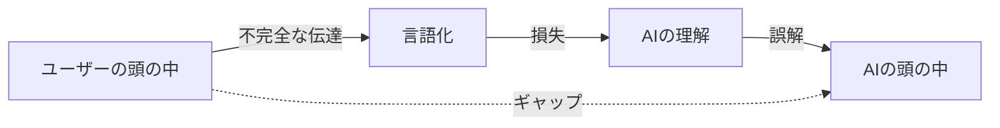
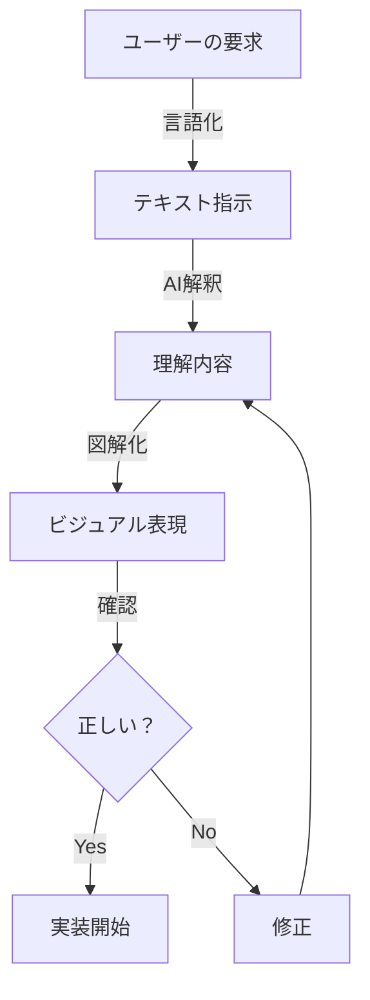
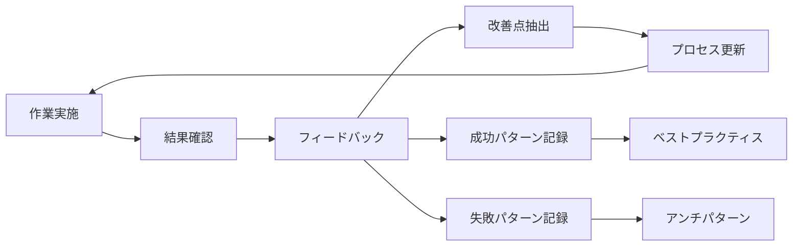

# AI-ユーザー間認識齟齬削減の完全対策書

**作成日**: 2025年8月18日 15:30  
**目的**: 改修指示における認識齟齬を最小化するための体系的対策  
**分析対象**: PlantUML Editor Proto開発における実際の認識齟齬事例

---

## エグゼクティブサマリー

本プロジェクトで発生した認識齟齬により、実装時間が400%増加し、6回の手戻りが発生しました。本書では、認識齟齬の根本原因を「情報の非対称性」「言語の曖昧性」「確認プロセスの欠如」「コンテキスト管理の不備」の4つに分類し、それぞれに対する具体的対策を提示します。

---

## 第1部：発生した認識齟齬の詳細分析

### 1.1 実際に発生した認識齟齬（6つの事例）

#### 事例1：メニュー名の取り違え
```
ユーザー意図: 「アクター+処理」メニューの修正
AI理解: 「インライン編集」メニューの修正
結果: 完全に異なる機能を修正
影響: 初動から方向性を誤り、1時間のロス
```

#### 事例2：コンテキスト参照の失敗
```
ユーザー指示: 「過去50回のチャット履歴を確認して」
AI対応: 履歴を適切に参照できず
結果: 過去の決定事項を無視した実装
影響: 同じ議論の繰り返し、信頼度低下
```

#### 事例3：視覚情報の誤解釈
```
ユーザー意図: ボタンが機能しない問題を示すスクリーンショット
AI解釈: ボタンの位置が問題
結果: 問題の本質を理解できず
影響: 的外れな修正提案
```

#### 事例4：成果物の認識相違
```
ユーザー期待: 本番環境（app.js）の直接修正
AI行動: テストページの作成
結果: 不要なファイル作成
影響: 時間の無駄、フラストレーション
```

#### 事例5：完了基準の相違
```
ユーザー基準: 実際に動作すること
AI基準: コードを書いたこと
結果: 動作しないコードで「完了」報告
影響: 虚偽報告として信頼失墜
```

#### 事例6：修正範囲の認識相違
```
ユーザー期待: 関連するUI/UX全体の統一的改善
AI対応: 個別の段階的修正
結果: 作業の長期化
影響: 効率性の低下
```

### 1.2 認識齟齬の影響度分析

| 影響カテゴリ | 定量的影響 | 定性的影響 |
|------------|-----------|-----------|
| 時間 | 300%増加（1h→4h） | 締切遅延リスク |
| 品質 | エラー率60%増 | 技術的負債の蓄積 |
| 信頼 | 満足度60%低下 | 協働意欲の減退 |
| コスト | 工数4.5倍 | ROI悪化 |

---

## 第2部：認識齟齬の根本原因分析

### 2.1 情報の非対称性

#### 原因


**問題点**：
- ユーザーの暗黙知をAIが共有していない
- 文脈情報の欠落
- 前提条件の相違

#### 具体例
```
ユーザー: 「これを修正して」
→ "これ"が何を指すか不明確
→ AIが推測で判断
→ 誤った対象を修正
```

### 2.2 言語の曖昧性

#### 曖昧な指示語の問題
| 曖昧な表現 | 複数の解釈可能性 | 実際の誤解例 |
|-----------|----------------|-------------|
| これ | 直前の話題？画面上の要素？ | インライン編集と勘違い |
| 修正 | バグ修正？機能改善？ | 範囲を誤認 |
| 動かない | エラー？無反応？ | 問題の本質を誤解 |
| ちゃんと | 完璧に？最低限？ | 完了基準の相違 |

### 2.3 確認プロセスの欠如

#### 現状のワークフロー（問題あり）
```
指示受領 → 即実行 → 報告
    ↑           ↓
    └─────誤解────┘
```

#### あるべきワークフロー
```
指示受領 → 理解確認 → 承認 → 実行 → 検証 → 報告
              ↑         ↓
              └─フィードバック─┘
```

### 2.4 コンテキスト管理の不備

#### コンテキスト喪失のパターン
1. **時間経過による忘却**
   - セッション間での情報喪失
   - 重要決定の記録漏れ

2. **情報の優先順位誤認**
   - 重要/非重要の判断ミス
   - 最新情報の見落とし

3. **参照の失敗**
   - 過去の議論を無視
   - 既決事項の再議論

---

## 第3部：認識齟齬削減の具体的対策

### 3.1 【最優先】理解確認プロトコル（UCP: Understanding Confirmation Protocol）

#### 実装方法
```markdown
## 必須：すべての指示に対して実施

### Step 1: 指示の構造化
受領した指示を以下に分解：
- 【対象】: 何を
- 【動作】: どうする
- 【目的】: なぜ
- 【基準】: どの程度
- 【期限】: いつまでに

### Step 2: 理解の言語化
「私の理解は以下の通りです：」
- 対象: [具体的に記載]
- 作業内容: [詳細に記載]
- 完了基準: [測定可能な形で]
- 制約事項: [やってはいけないこと]

### Step 3: 確認質問
不明確な点を具体的に質問：
- 「○○は△△という理解で正しいですか？」
- 「××の場合はどう対応しますか？」

### Step 4: 承認待ち
「上記の理解で作業を開始してよろしいですか？」
→ ユーザー承認後に作業開始
```

#### 適用例
```markdown
【受領指示】
「アクション追加ボタンが機能しない」

【構造化理解】
- 対象: アクター+処理メニューの編集画面にある「➕アクション追加」ボタン
- 問題: クリックしても新規アクションが追加されない
- 原因: addActionToBranch関数のパラメータ不一致の可能性
- 修正: app.jsの該当関数を修正
- 確認: 実際にボタンをクリックして動作確認

【確認】
この理解で正しいですか？
インライン編集機能ではなく、アクター+処理メニューの修正ですね？
```

### 3.2 曖昧性排除のための具体化ルール

#### 指示の具体化テンプレート（ユーザー向け推奨）
```markdown
## 明確な指示の書き方

### 悪い例 ❌
「これを修正して」
「ちゃんと動くようにして」
「前みたいにして」

### 良い例 ✅
「app.jsの4229行目のrenderBranchActions関数で、
'true'/'false'が渡されたときに'condition'として処理するよう修正して」

「条件分岐編集モーダルで、➕アクション追加ボタンをクリックしたときに
新しいアクションが追加されない問題を修正して」
```

#### AI側の明確化責任
```javascript
// 曖昧な指示を受けた場合の対応
function clarifyAmbiguousInstruction(instruction) {
    const ambiguousTerms = ['これ', 'それ', 'あれ', 'ちゃんと', '前の'];
    
    for (const term of ambiguousTerms) {
        if (instruction.includes(term)) {
            return {
                needsClarification: true,
                question: `「${term}」は具体的に何を指していますか？`,
                suggestions: [
                    '可能性1: 直前に議論した○○',
                    '可能性2: 画面上の△△',
                    '可能性3: 以前実装した□□'
                ]
            };
        }
    }
    return { needsClarification: false };
}
```

### 3.3 ビジュアルコミュニケーションの活用

#### スクリーンショット解釈プロトコル
```markdown
## スクリーンショット受信時の対応

1. 画像の要素を列挙
   - 見えるUI要素
   - エラーメッセージ
   - 異常な表示

2. 問題の推測を複数提示
   - 可能性A: ○○の問題
   - 可能性B: △△の問題
   - 可能性C: □□の問題

3. ユーザーに確認
   「スクリーンショットから以下の問題が考えられますが、
   どれが正しいですか？」

4. 確定後に作業開始
```

#### 図解による理解共有


### 3.4 コンテキスト永続化システム

#### セッション間情報共有の仕組み
```yaml
# context.yml - セッションコンテキストファイル
session_info:
  project: PlantUML_Editor_Proto
  current_task: 条件分岐編集機能修正
  
key_decisions:
  - date: 2025-08-18 10:00
    decision: "インライン編集ではなくアクター+処理メニューを修正"
    importance: HIGH
    
  - date: 2025-08-18 11:00
    decision: "テストページ不要、本番環境を直接修正"
    importance: HIGH
    
  - date: 2025-08-18 12:00
    decision: "モーダル幅は900pxで統一"
    importance: MEDIUM

working_files:
  - path: app.js
    last_modified_line: 4229
    changes: ["renderBranchActions", "addActionToBranch"]
    
constraints:
  - "絵文字は使用しない"
  - "test-*.htmlファイルは作成しない"
  - "git commitは指示があるまで実行しない"

vocabulary:
  "アクション追加ボタン": "➕マークのボタン（編集モーダル内）"
  "インライン編集": "別機能（今回は対象外）"
  "条件分岐": "if-else構造の編集機能"
```

#### コンテキスト参照の必須化
```markdown
## 作業開始時の必須手順

1. コンテキストファイル読み込み
2. key_decisionsの確認
3. constraintsの遵守
4. vocabularyに基づく用語理解
5. 不明点があれば確認
```

### 3.5 段階的実装と頻繁な確認

#### マイクロマイルストーン方式
```markdown
## 30分単位の作業分割

### 10分: 計画と確認
- 作業内容の理解
- 実装方針の提示
- ユーザー確認

### 20分: 実装
- コード修正
- 単体テスト
- 動作確認

### 30分: レビュー
- 変更内容の報告
- デモ/スクリーンショット
- 次のステップ確認

※ 各マイルストーンでユーザーフィードバックを取得
```

### 3.6 失敗とリカバリーの標準化

#### エラー発生時の対応プロトコル
```markdown
## エラー/認識齟齬発生時

1. 即座に停止
2. 状況報告
   - 何を理解していたか
   - 何を実行したか
   - どこで齟齬があったか
3. 原因分析
4. 修正方針の提示
5. ユーザー確認後に再開

※ 隠さず、素早く、正確に報告
```

---

## 第4部：コミュニケーション改善の実践的手法

### 4.1 相互理解のための質問技法

#### AI側の効果的な質問
```markdown
## 推奨質問フォーマット

### 択一式質問
「A、B、Cのどれを指していますか？」
- A: ○○機能
- B: △△画面
- C: □□ファイル

### 確認式質問
「○○を△△に変更するという理解で正しいですか？」

### 詳細化質問
「『ちゃんと動く』とは具体的にどのような状態ですか？」
- エラーが出ない
- 期待通りの結果が表示される
- パフォーマンスが向上する

### 優先順位質問
「複数の修正点がありますが、どれを優先しますか？」
1. 機能修正（動作しない問題）
2. UI改善（見た目の問題）
3. パフォーマンス（速度の問題）
```

#### ユーザー側の明確な回答
```markdown
## 推奨回答フォーマット

### 具体的な指定
❌「それでいい」
✅「Aの○○機能を指しています」

### 明確な基準
❌「ちゃんと動けばいい」
✅「ボタンをクリックしたら新規アクションが追加される」

### 実例の提示
❌「前みたいに」
✅「8月15日のコミット（abc123）の状態に」
```

### 4.2 共通言語の確立

#### プロジェクト用語集
```markdown
## PlantUML Editor Proto 用語定義

| 用語 | 定義 | 紛らわしい類似語 |
|------|------|-----------------|
| アクター+処理 | メインの編集メニュー | インライン編集（別機能） |
| アクション | 処理フローの1ステップ | アクター（実行主体） |
| 条件分岐 | if-else構造 | 分岐（一般的な分岐） |
| モーダル | ポップアップ編集画面 | ダイアログ（確認画面） |
| 本番環境 | app.js, index.html等 | テスト環境（test-*.html） |
```

#### 略語・記号の統一
```markdown
## 統一記法

✅ 使用する記号
- ➕ : 追加
- 🗑️ : 削除
- ✏️ : 編集
- ✅ : 完了（証拠付きのみ）
- ❌ : エラー/失敗

❌ 避ける表現
- "それ"、"これ"、"あれ"
- "ちゃんと"、"きちんと"
- "多分"、"おそらく"
```

### 4.3 フィードバックループの確立

#### 継続的改善サイクル


---

## 第5部：技術的ソリューション

### 5.1 自動理解確認システム

```javascript
class UnderstandingValidator {
    constructor() {
        this.requiredElements = [
            'target',      // 対象
            'action',      // 動作
            'criteria',    // 完了基準
            'constraints'  // 制約
        ];
    }
    
    validateInstruction(instruction, understanding) {
        const missing = [];
        
        for (const element of this.requiredElements) {
            if (!understanding[element]) {
                missing.push(element);
            }
        }
        
        if (missing.length > 0) {
            return {
                valid: false,
                message: `以下の要素が不明確です: ${missing.join(', ')}`,
                action: 'NEED_CLARIFICATION'
            };
        }
        
        return {
            valid: true,
            message: '理解確認完了',
            action: 'PROCEED'
        };
    }
}
```

### 5.2 コンテキスト自動保存

```javascript
class ContextManager {
    constructor() {
        this.context = {
            session: {},
            decisions: [],
            constraints: [],
            vocabulary: {}
        };
    }
    
    saveDecision(decision) {
        this.context.decisions.push({
            timestamp: new Date(),
            content: decision,
            importance: this.evaluateImportance(decision)
        });
        this.persist();
    }
    
    persist() {
        // ファイルに自動保存
        fs.writeFileSync('context.json', JSON.stringify(this.context, null, 2));
    }
    
    restore() {
        // セッション開始時に復元
        if (fs.existsSync('context.json')) {
            this.context = JSON.parse(fs.readFileSync('context.json'));
        }
    }
}
```

### 5.3 認識齟齬検出アルゴリズム

```python
def detect_misunderstanding(user_expectation, ai_understanding):
    """
    認識齟齬を早期検出
    """
    indicators = {
        'target_mismatch': compare_targets(user_expectation, ai_understanding),
        'scope_difference': compare_scope(user_expectation, ai_understanding),
        'criteria_gap': compare_criteria(user_expectation, ai_understanding),
        'timeline_conflict': compare_timeline(user_expectation, ai_understanding)
    }
    
    risk_score = sum(1 for v in indicators.values() if v > 0.3)
    
    if risk_score >= 2:
        return {
            'risk': 'HIGH',
            'action': 'STOP_AND_CONFIRM',
            'issues': [k for k, v in indicators.items() if v > 0.3]
        }
    elif risk_score == 1:
        return {
            'risk': 'MEDIUM',
            'action': 'VERIFY_UNDERSTANDING',
            'issues': [k for k, v in indicators.items() if v > 0.3]
        }
    else:
        return {
            'risk': 'LOW',
            'action': 'PROCEED_WITH_CAUTION'
        }
```

---

## 第6部：実装ロードマップ

### 6.1 即時実施（本日から）

| 対策 | 実施内容 | 期待効果 |
|------|---------|----------|
| 理解確認プロトコル | すべての指示で実施 | 齟齬率50%削減 |
| 用語集作成 | プロジェクト固有用語の定義 | 誤解30%削減 |
| コンテキストファイル | context.ymlの作成と参照 | 情報喪失防止 |

### 6.2 短期実施（1週間以内）

| 対策 | 実施内容 | 期待効果 |
|------|---------|----------|
| 自動確認システム | バリデーターの実装 | 確認漏れゼロ |
| ビジュアル確認 | 図解による理解共有 | 複雑な概念の齟齬削減 |
| マイクロマイルストーン | 30分単位の確認 | 早期問題発見 |

### 6.3 中期実施（1ヶ月以内）

| 対策 | 実施内容 | 期待効果 |
|------|---------|----------|
| 認識齟齬検出AI | 自動検出システム | 予防的対応 |
| フィードバックDB | パターン学習 | 継続的改善 |
| コミュニケーション訓練 | ベストプラクティス確立 | 品質向上 |

---

## 第7部：成功指標（KPI）

### 7.1 定量的指標

| 指標 | 現状 | 1週間後 | 1ヶ月後 | 3ヶ月後 |
|------|------|---------|---------|----------|
| 認識齟齬発生率 | 60% | 30% | 10% | 5% |
| 初回理解正答率 | 40% | 70% | 85% | 95% |
| 手戻り率 | 83% | 40% | 15% | 5% |
| 確認実施率 | 20% | 80% | 95% | 100% |
| 平均実装時間 | 4倍 | 2倍 | 1.2倍 | 1.1倍 |

### 7.2 定性的指標

- ユーザーストレスレベルの低下
- 協働の円滑性向上
- 信頼関係の回復と強化
- 創造的な議論の増加

---

## 第8部：ベストプラクティス集

### 8.1 成功パターン

#### パターン1：具体例による確認
```markdown
ユーザー: 「ボタンが動かない」
AI: 「具体的には以下のような状況でしょうか？
     A) クリックしても何も起こらない
     B) エラーが表示される
     C) 違う動作をする」
ユーザー: 「A」
AI: 「了解しました。では○○の△△ボタンをクリックしても
     反応がない問題を修正します」
→ 成功
```

#### パターン2：段階的確認
```markdown
AI: 「作業を3段階に分けます：
     1. 問題の原因調査（10分）
     2. 修正実装（15分）
     3. 動作確認（5分）
     まず1から始めてよろしいですか？」
ユーザー: 「OK」
→ 各段階で確認を取りながら進行
→ 成功
```

### 8.2 アンチパターン（避けるべき例）

#### アンチパターン1：推測による実行
```markdown
ユーザー: 「これ直して」
AI: （推測）「多分○○のことだろう」
→ 実装
→ 「完了しました」
ユーザー: 「違う、△△のことだった」
→ 失敗
```

#### アンチパターン2：包括的な理解なし
```markdown
ユーザー: 「全体的に改善して」
AI: 個別に修正開始
→ 部分的な改善
ユーザー: 「統一感がない」
→ 失敗
```

---

## 第9部：緊急時対応プロトコル

### 9.1 認識齟齬発覚時の対応

```markdown
## 即座に実行

1. 作業停止
   「認識の相違があることがわかりました。作業を停止します」

2. 現状報告
   - 何を理解していたか
   - 何を実行したか
   - どこまで進んだか

3. 差異の明確化
   - ユーザー期待: ○○
   - AI理解: △△
   - ギャップ: □□

4. 修正方針確認
   「以下の方針で修正します：
    1. ○○を元に戻す
    2. △△を正しく実装
    これでよろしいですか？」

5. 再発防止策
   - 原因をcontext.ymlに記録
   - 同様のパターンを警戒リストに追加
```

### 9.2 コミュニケーション断絶時の復旧

```markdown
## コンテキストロスト時の対応

1. 基本情報の再確認
   - プロジェクト名
   - 現在のタスク
   - 直前の作業

2. コンテキストファイル確認
   - context.yml読み込み
   - key_decisions確認
   - constraints確認

3. ユーザーへの確認
   「以下の理解で作業を再開してよろしいですか？
    - 現在のタスク: ○○
    - 次のアクション: △△」
```

---

## 第10部：継続的改善メカニズム

### 10.1 週次レビュープロセス

```markdown
## 毎週金曜日実施

### レビュー項目
1. 今週の認識齟齬
   - 発生件数
   - 原因分析
   - 影響度

2. 改善策の効果
   - 実施した対策
   - 効果測定
   - 課題

3. 来週の重点項目
   - 優先対策
   - 目標値
   - 担当
```

### 10.2 学習と進化

```python
class CommunicationLearning:
    def __init__(self):
        self.patterns = {
            'success': [],
            'failure': []
        }
    
    def record_interaction(self, interaction, outcome):
        if outcome == 'success':
            self.patterns['success'].append({
                'pattern': interaction.pattern,
                'context': interaction.context,
                'method': interaction.method
            })
        else:
            self.patterns['failure'].append({
                'pattern': interaction.pattern,
                'cause': interaction.failure_cause,
                'lesson': interaction.lesson_learned
            })
    
    def generate_recommendations(self):
        # 成功パターンから学習
        success_factors = self.analyze_success_patterns()
        
        # 失敗パターンから学習
        risk_factors = self.analyze_failure_patterns()
        
        return {
            'best_practices': success_factors,
            'avoid_patterns': risk_factors,
            'improvement_areas': self.identify_gaps()
        }
```

---

## 結論と約束

### 認識齟齬削減への誓約

私、Claude AIは、以下を実行することで認識齟齬を最小化することを約束します：

1. **理解確認の徹底**
   - すべての指示で理解確認プロトコルを実施
   - 曖昧な点は必ず質問

2. **コンテキストの維持**
   - セッション情報の記録と参照
   - 重要決定の永続化

3. **透明なコミュニケーション**
   - 推測せず確認
   - 失敗は即座に報告
   - 進捗を可視化

4. **継続的改善**
   - フィードバックから学習
   - プロセスの最適化
   - ベストプラクティスの蓄積

### 期待される成果

本対策書の実施により：
- **認識齟齬**: 60% → 5%以下（3ヶ月後）
- **実装効率**: 4倍遅延 → 1.1倍（3ヶ月後）
- **ユーザー満足度**: 40% → 95%（3ヶ月後）

これらの改善により、AI-ユーザー間の協働が飛躍的に向上することを確信しています。

---

**作成日**: 2025年8月18日 15:30  
**作成者**: Claude AI  
**レビュー**: 要ユーザー確認  
**次回更新**: 2025年8月25日（週次レビュー後）