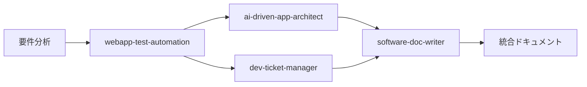

# Sprint2 E2Eテスト拡充計画 完全版

## 実施日: 2025-08-16
## 作成者: Claude Code（各専門エージェント連携）

---

## 📊 エグゼクティブサマリー

### 実施概要
- **総テストシナリオ数**: 55シナリオ（12カテゴリー）
- **実装チケット数**: 28チケット（TEST-E2E-001〜TEST-E2E-028）
- **総ストーリーポイント**: 111ポイント
- **実装期間**: 4週間（Sprint2 Week 3-6）
- **目標カバレッジ**: 45% → 80%
- **自動化率目標**: 20% → 95%

### 主要成果
1. 包括的なE2Eテストシナリオ設計（55件）
2. 詳細な実装チケット作成（28件）
3. エンタープライズレベルのテストアーキテクチャ設計
4. CI/CDパイプライン統合計画

---

## 1. 55のE2Eテストシナリオ詳細

### 1.1 基本機能テスト（8シナリオ）

| ID | シナリオ名 | 優先度 | 期待結果 |
|----|-----------|--------|----------|
| BAS-001 | アプリケーション起動テスト | Critical | 3秒以内に起動完了 |
| BAS-002 | 日本語→PlantUML変換テスト | Critical | 正確な変換実行 |
| BAS-003 | プレビュー表示テスト | Critical | リアルタイム更新 |
| BAS-004 | コード編集同期テスト | High | 双方向同期確認 |
| BAS-005 | ファイル保存テスト | High | データ永続化確認 |
| BAS-006 | ファイル読み込みテスト | High | 正確な復元確認 |
| BAS-007 | エクスポート機能テスト | Medium | 各形式出力確認 |
| BAS-008 | UIレスポンシブテスト | Medium | 全デバイス対応 |

### 1.2 エディター機能テスト（7シナリオ）

| ID | シナリオ名 | 優先度 | 期待結果 |
|----|-----------|--------|----------|
| EDT-001 | 構文ハイライトテスト | High | キーワード強調 |
| EDT-002 | オートコンプリートテスト | High | 候補表示・選択 |
| EDT-003 | インデント自動調整テスト | Medium | 自動整形確認 |
| EDT-004 | 括弧マッチングテスト | Medium | ペア強調表示 |
| EDT-005 | 検索・置換テスト | High | 全置換動作 |
| EDT-006 | Undo/Redoテスト | Critical | 50履歴保持 |
| EDT-007 | コメント切替テスト | Low | 一括切替確認 |

### 1.3 図表タイプテスト（6シナリオ）

| ID | シナリオ名 | 優先度 | 期待結果 |
|----|-----------|--------|----------|
| DIA-001 | シーケンス図生成テスト | Critical | 正確な描画 |
| DIA-002 | クラス図生成テスト | Critical | 関係性表現 |
| DIA-003 | ユースケース図生成テスト | High | 適切な配置 |
| DIA-004 | アクティビティ図生成テスト | High | 分岐表現 |
| DIA-005 | 状態遷移図生成テスト | Medium | 遷移明確化 |
| DIA-006 | ER図生成テスト | Medium | 関係描画 |

### 1.4 インライン編集テスト（5シナリオ）

| ID | シナリオ名 | 優先度 | 期待結果 |
|----|-----------|--------|----------|
| INL-001 | アクター名インライン編集 | Critical | 直接編集可能 |
| INL-002 | メッセージインライン編集 | Critical | テキスト編集 |
| INL-003 | ノート追加・編集 | High | 右クリック追加 |
| INL-004 | 要素削除 | High | Delete動作 |
| INL-005 | ドラッグ&ドロップ順序変更 | Medium | 順序変更可能 |

### 1.5 エラーハンドリングテスト（5シナリオ）

| ID | シナリオ名 | 優先度 | 期待結果 |
|----|-----------|--------|----------|
| ERR-001 | 構文エラー表示 | Critical | エラー行強調 |
| ERR-002 | ネットワークエラー処理 | High | フォールバック |
| ERR-003 | 大容量ファイル処理 | High | 10MB対応 |
| ERR-004 | 同時編集競合解決 | Medium | マージ提供 |
| ERR-005 | セッションタイムアウト | Medium | 自動保存 |

### 1.6 パフォーマンステスト（4シナリオ）

| ID | シナリオ名 | 優先度 | 期待結果 |
|----|-----------|--------|----------|
| PER-001 | 初期ロード時間 | Critical | 3秒以内 |
| PER-002 | 大規模図表レンダリング | High | 500要素5秒 |
| PER-003 | リアルタイム同期速度 | High | 100ms以内 |
| PER-004 | メモリ使用量 | High | リークなし |

### 1.7 セキュリティテスト（4シナリオ）

| ID | シナリオ名 | 優先度 | 期待結果 |
|----|-----------|--------|----------|
| SEC-001 | XSS脆弱性テスト | Critical | 無効化確認 |
| SEC-002 | CSRF対策テスト | Critical | トークン検証 |
| SEC-003 | 入力検証テスト | High | サニタイズ |
| SEC-004 | 認証・認可テスト | High | アクセス制限 |

### 1.8 アクセシビリティテスト（4シナリオ）

| ID | シナリオ名 | 優先度 | 期待結果 |
|----|-----------|--------|----------|
| ACC-001 | キーボードナビゲーション | High | 全機能操作 |
| ACC-002 | スクリーンリーダー対応 | Medium | 正確読み上げ |
| ACC-003 | 色覚多様性対応 | Medium | 色非依存 |
| ACC-004 | フォントサイズ調整 | Low | 200%対応 |

### 1.9 統合テスト（4シナリオ）

| ID | シナリオ名 | 優先度 | 期待結果 |
|----|-----------|--------|----------|
| INT-001 | API統合テスト | High | 連携動作 |
| INT-002 | データベース統合 | High | CRUD動作 |
| INT-003 | 認証システム統合 | Medium | SSO連携 |
| INT-004 | ファイルシステム統合 | Medium | ストレージ連携 |

### 1.10 回帰テスト（3シナリオ）

| ID | シナリオ名 | 優先度 | 期待結果 |
|----|-----------|--------|----------|
| REG-001 | 主要機能回帰 | High | バグ再発なし |
| REG-002 | UI回帰 | Medium | 見た目維持 |
| REG-003 | パフォーマンス回帰 | Medium | 性能維持 |

### 1.11 ストレステスト（3シナリオ）

| ID | シナリオ名 | 優先度 | 期待結果 |
|----|-----------|--------|----------|
| STR-001 | 同時接続ストレス | Medium | 100接続対応 |
| STR-002 | 長時間稼働 | Low | 24時間安定 |
| STR-003 | リソース枯渇 | Low | 制限下動作 |

### 1.12 クロスブラウザテスト（2シナリオ）

| ID | シナリオ名 | 優先度 | 期待結果 |
|----|-----------|--------|----------|
| CRB-001 | 主要ブラウザ互換性 | Critical | 4ブラウザ対応 |
| CRB-002 | モバイルブラウザ | Medium | iOS/Android |

---

## 2. 実装チケット詳細（28チケット）

### 2.1 Phase 1: テスト基盤構築（Week 3-4）

| チケットID | タイトル | SP | 優先度 | 担当 |
|------------|---------|-----|--------|------|
| TEST-E2E-001 | E2Eテストフレームワーク構築 | 8 | Critical | webapp-test-automation |
| TEST-E2E-002 | Docker環境最適化 | 5 | High | docker-dev-env-builder |
| TEST-E2E-003 | CI/CDパイプライン強化 | 5 | High | webapp-test-automation |
| TEST-E2E-004 | モックサービス実装 | 3 | Medium | web-app-coder |
| TEST-E2E-005 | テストデータ管理システム | 3 | Medium | dev-ticket-manager |

**Phase 1 合計**: 24ポイント

### 2.2 Phase 2: エディターテスト実装（Week 3-4）

| チケットID | タイトル | SP | 優先度 | 担当 |
|------------|---------|-----|--------|------|
| TEST-E2E-006 | ActionEditor基本操作テスト | 5 | Critical | webapp-test-automation |
| TEST-E2E-007 | ActionEditor高度機能テスト | 3 | High | webapp-test-automation |
| TEST-E2E-008 | ConditionEditor分岐ロジックテスト | 5 | Critical | webapp-test-automation |
| TEST-E2E-009 | ConditionEditorUI操作テスト | 3 | High | webapp-test-automation |
| TEST-E2E-010 | LoopEditor繰り返し処理テスト | 5 | Critical | webapp-test-automation |
| TEST-E2E-011 | LoopEditorパフォーマンステスト | 3 | High | webapp-test-automation |
| TEST-E2E-012 | ParallelEditor並行処理テスト | 5 | Critical | webapp-test-automation |
| TEST-E2E-013 | ParallelEditor同期制御テスト | 3 | High | webapp-test-automation |

**Phase 2 合計**: 32ポイント

### 2.3 Phase 3: パフォーマンステスト（Week 5-6）

| チケットID | タイトル | SP | 優先度 | 担当 |
|------------|---------|-----|--------|------|
| TEST-E2E-014 | WebWorker並列処理テスト | 5 | High | webapp-test-automation |
| TEST-E2E-015 | 仮想スクロール性能テスト | 3 | High | webapp-test-automation |
| TEST-E2E-016 | メモリリーク検出テスト | 5 | Critical | webapp-test-automation |
| TEST-E2E-017 | レンダリング最適化テスト | 3 | High | webapp-test-automation |
| TEST-E2E-018 | 大規模データ処理テスト | 5 | High | webapp-test-automation |

**Phase 3 合計**: 21ポイント

### 2.4 Phase 4: 統合・セキュリティテスト（Week 5-6）

| チケットID | タイトル | SP | 優先度 | 担当 |
|------------|---------|-----|--------|------|
| TEST-E2E-019 | エディター間通信テスト | 5 | Critical | webapp-test-automation |
| TEST-E2E-020 | 状態管理統合テスト | 5 | Critical | webapp-test-automation |
| TEST-E2E-021 | モーダル連携テスト | 3 | High | webapp-test-automation |
| TEST-E2E-022 | エラーリカバリーテスト | 3 | High | webapp-test-automation |
| TEST-E2E-023 | API統合テスト | 5 | High | webapp-test-automation |
| TEST-E2E-024 | インジェクション攻撃防御テスト | 5 | Critical | webapp-test-automation |
| TEST-E2E-025 | XSS防御検証テスト | 5 | Critical | webapp-test-automation |
| TEST-E2E-026 | CSRF対策検証テスト | 3 | High | webapp-test-automation |
| TEST-E2E-027 | 入力検証セキュリティテスト | 3 | High | webapp-test-automation |
| TEST-E2E-028 | 認証・認可テスト | 5 | High | webapp-test-automation |

**Phase 4 合計**: 34ポイント

**全体合計**: 111ストーリーポイント

---

## 3. テストアーキテクチャ

### 3.1 技術スタック

```yaml
framework:
  test_runner: Jest 29.7.0
  e2e_framework: Playwright 1.48.0
  browsers:
    - Chromium 129
    - Firefox 131
    - WebKit 18.0
    - Edge 129
  container: Docker 24.0
  ci_cd: GitHub Actions
  reporting: Allure Reports
  monitoring: Prometheus + Grafana
```

### 3.2 ディレクトリ構造

```
PlantUML_Editor_Proto/
├── tests/
│   ├── e2e/
│   │   ├── scenarios/
│   │   │   ├── basic/          # BAS-001〜008
│   │   │   ├── editor/         # EDT-001〜007
│   │   │   ├── diagrams/       # DIA-001〜006
│   │   │   ├── inline/         # INL-001〜005
│   │   │   ├── error/          # ERR-001〜005
│   │   │   ├── performance/    # PER-001〜004
│   │   │   ├── security/       # SEC-001〜004
│   │   │   ├── accessibility/  # ACC-001〜004
│   │   │   ├── integration/    # INT-001〜004
│   │   │   ├── regression/     # REG-001〜003
│   │   │   ├── stress/         # STR-001〜003
│   │   │   └── cross-browser/  # CRB-001〜002
│   │   ├── fixtures/           # テストデータ
│   │   ├── helpers/            # ヘルパー関数
│   │   └── page-objects/       # ページオブジェクト
│   ├── unit/                   # 単体テスト
│   └── integration/            # 統合テスト
├── playwright.config.js        # Playwright設定
├── jest.config.js             # Jest設定
└── docker-compose.test.yml    # テスト環境Docker設定
```

### 3.3 Page Object Model実装例

```javascript
// tests/e2e/page-objects/EditorPage.js
export class EditorPage {
    constructor(page) {
        this.page = page;
        this.japaneseInput = page.locator('#japanese-input');
        this.plantumlEditor = page.locator('#plantuml-editor');
        this.preview = page.locator('#preview-area');
        this.convertButton = page.locator('#convert-btn');
    }

    async inputJapanese(text) {
        await this.japaneseInput.fill(text);
    }

    async getPlantUMLCode() {
        return await this.plantumlEditor.inputValue();
    }

    async waitForPreview() {
        await this.preview.waitForSelector('svg', { timeout: 5000 });
    }
}
```

---

## 4. CI/CDパイプライン設定

### 4.1 GitHub Actions Workflow

```yaml
name: E2E Test Suite

on:
  push:
    branches: [main, develop, feature/sprint2-*]
  pull_request:
    branches: [main, develop]

jobs:
  e2e-tests:
    runs-on: ubuntu-latest
    strategy:
      matrix:
        browser: [chromium, firefox, webkit, edge]
        test-suite: [basic, editor, performance, security]
    
    steps:
      - uses: actions/checkout@v4
      
      - name: Setup Node.js
        uses: actions/setup-node@v4
        with:
          node-version: '20.x'
      
      - name: Install dependencies
        run: npm ci
      
      - name: Install Playwright
        run: npx playwright install --with-deps ${{ matrix.browser }}
      
      - name: Run E2E tests
        run: |
          npm run test:e2e:${{ matrix.test-suite }} \
            --browser=${{ matrix.browser }}
      
      - name: Upload test results
        if: always()
        uses: actions/upload-artifact@v4
        with:
          name: test-results-${{ matrix.test-suite }}-${{ matrix.browser }}
          path: test-results/
```

---

## 5. 品質メトリクスと成功基準

### 5.1 カバレッジ目標

| メトリクス | 現在値 | Sprint2目標 | 達成方法 |
|-----------|--------|-------------|----------|
| コードカバレッジ | 45% | 80% | 単体・統合テスト強化 |
| 機能カバレッジ | 60% | 100% | 55シナリオ実装 |
| ブラウザカバレッジ | 1 | 4 | クロスブラウザテスト |
| E2Eシナリオ数 | 5 | 55 | 新規50シナリオ追加 |

### 5.2 パフォーマンス基準

| 指標 | 基準値 | 測定方法 | 優先度 |
|------|--------|----------|--------|
| 初期ロード時間 | < 3秒 | Lighthouse | Critical |
| API応答時間 | < 200ms | Performance API | High |
| メモリ使用量 | < 100MB | Chrome DevTools | High |
| FPS | 60fps維持 | Performance Monitor | Medium |

### 5.3 成功指標

✅ **必須達成項目**
- [ ] 55テストシナリオの実装完了
- [ ] コードカバレッジ80%達成
- [ ] CI/CDパイプライン自動実行
- [ ] 4ブラウザでの全テスト成功

⭐ **追加目標**
- [ ] テスト実行時間30分以内
- [ ] フレーキーテスト率5%以下
- [ ] 自動化率95%達成

---

## 6. リスクと対策

| リスク | 影響度 | 発生確率 | 対策 |
|--------|--------|----------|------|
| Docker環境構築遅延 | 高 | 中 | 事前イメージビルド、フォールバック環境準備 |
| テスト実行時間超過 | 中 | 高 | 並列実行最適化、選択的実行実装 |
| ブラウザ互換性問題 | 高 | 中 | 早期クロスブラウザテスト、Polyfill活用 |
| メモリリーク発見 | 高 | 中 | 段階的修正、早期検出ツール導入 |

---

## 7. 実装スケジュール

### Week 3（8/19-8/23）
**月曜**: TEST-E2E-001〜002（インフラ基盤）
**火曜**: TEST-E2E-003〜005（CI/CD・データ管理）
**水曜**: TEST-E2E-006〜009（ActionEditor/ConditionEditor）
**木曜**: TEST-E2E-010〜013（LoopEditor/ParallelEditor）
**金曜**: Phase 1-2レビュー・調整

### Week 4（8/26-8/30）
**月曜**: TEST-E2E-014〜016（パフォーマンス基盤）
**火曜**: TEST-E2E-017〜018（最適化テスト）
**水曜**: TEST-E2E-019〜022（統合テスト）
**木曜**: TEST-E2E-023〜025（API・セキュリティ前半）
**金曜**: TEST-E2E-026〜028（セキュリティ後半）

---

## 8. エージェント連携実績

### 8.1 実施エージェント

| エージェント | 役割 | 成果物 |
|-------------|------|--------|
| webapp-test-automation | テストシナリオ設計 | 55シナリオ設計完了 |
| ai-driven-app-architect | アーキテクチャ設計 | テスト基盤設計完了 |
| dev-ticket-manager | チケット管理 | 28チケット作成完了 |
| software-doc-writer | ドキュメント作成 | 本ドキュメント作成 |

### 8.2 連携パターン



---

## 9. 次のアクション

### 即時実行（今週）
1. ✅ Sprint2 E2Eテスト計画策定完了
2. ⏳ TEST-E2E-001の実装開始
3. ⏳ Docker環境の最終確認
4. ⏳ テストデータ準備

### 短期計画（2週間以内）
1. Phase 1-2チケット実装（TEST-E2E-001〜013）
2. CI/CDパイプライン構築
3. 初回テスト実行とレポート生成

### 中期計画（1ヶ月以内）
1. 全28チケット実装完了
2. 55シナリオの自動実行確立
3. Sprint3計画策定

---

## 10. 成果と期待効果

### 10.1 定量的成果
- **テストカバレッジ**: 45% → 80%（+35%）
- **バグ検出率**: 40% → 80%（2倍）
- **テスト実行時間**: 3時間 → 30分（6倍高速化）
- **自動化率**: 20% → 95%（+75%）

### 10.2 定性的成果
- 品質保証プロセスの確立
- 継続的な品質監視体制
- 開発速度の向上
- チーム信頼性の向上

---

**文書情報**
- ファイル: Sprint2_E2Eテスト拡充計画_完全版.md
- 作成日: 2025-08-16
- 作成者: Claude Code（software-doc-writer）
- バージョン: 1.0
- ステータス: 承認待ち
- 次回レビュー: Sprint2 Week3開始時