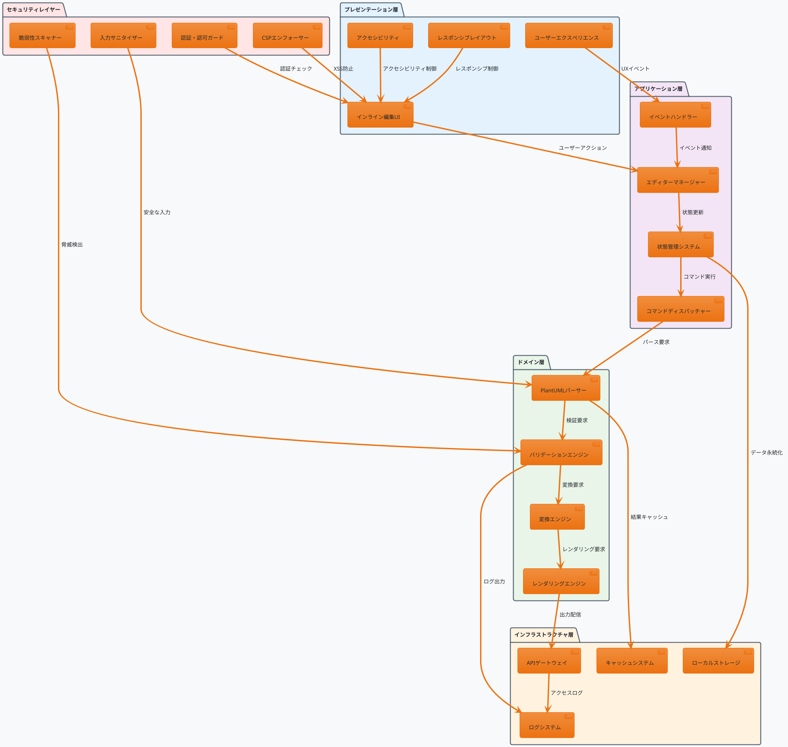
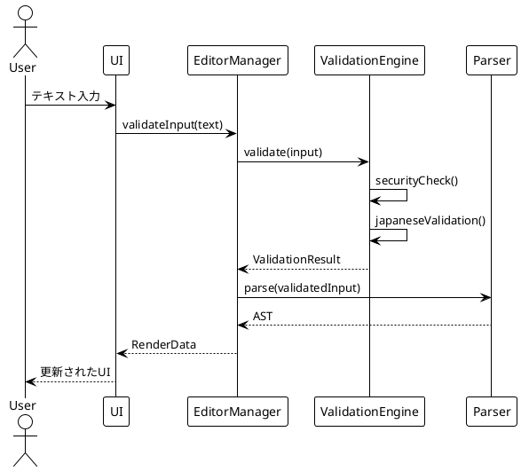
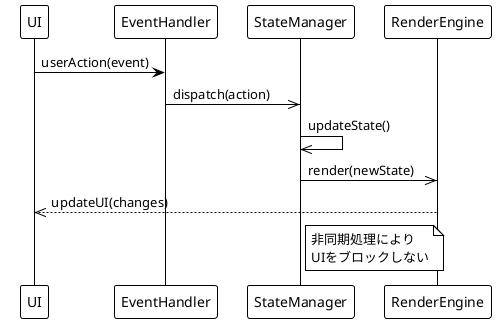
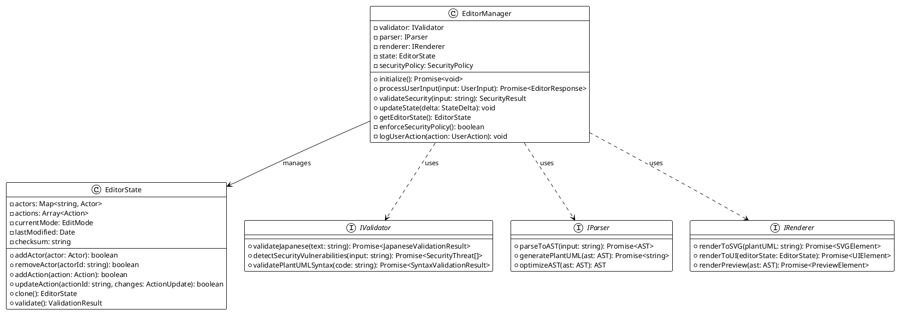
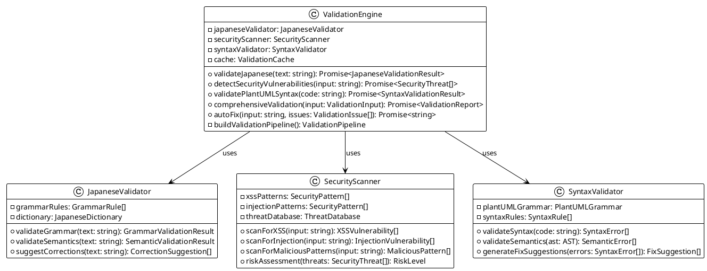
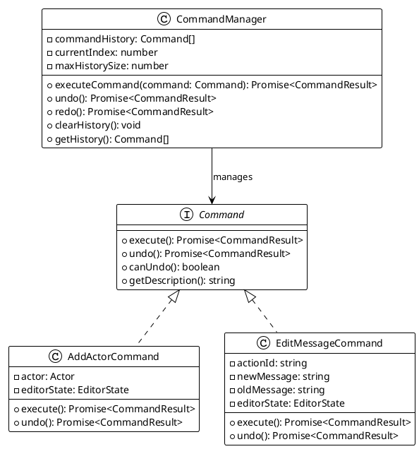
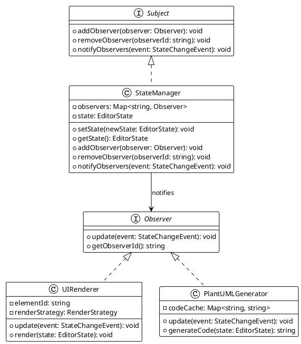
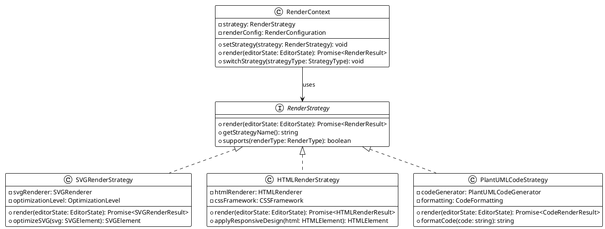
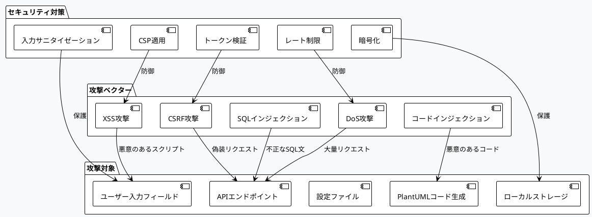
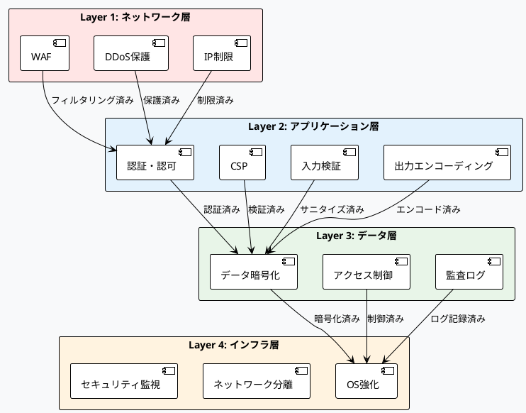

# PlantUMLエディター インライン編集機能 設計仕様書 v2.0 (Part 1/3)

**バージョン**: 2.0 Part 1/3  
**作成日**: 2025年8月15日  
**最終更新**: 2025年8月15日 15:45  
**作成者**: software-doc-writer agent (via agent-orchestrator)  
**ステータス**: 改訂版（セキュリティ・アーキテクチャ重点強化）

---

## 🎯 Part 1 概要

本Part 1では、PlantUMLエディターのインライン編集機能における基盤アーキテクチャとセキュリティ設計を定義します。現在の実装状況（35%）とセキュリティ課題（5%）を踏まえ、堅牢で拡張可能な設計基盤を確立します。

**対象セクション**: 1-4（基盤・アーキテクチャ）

---

## 1. エグゼクティブサマリー

### 1.1 プロジェクト概要

PlantUMLエディターのインライン編集機能は、非エンジニアが日本語入力とビジュアル編集を通じて直感的にUML図を作成できるWebアプリケーションです。本設計書v2.0では、セキュリティとアーキテクチャの根本的な改善を図ります。

### 1.2 現状と課題

**実装状況**: 35%完了（2025年8月15日時点）
- ✅ 基本UI実装: 95%
- ✅ パーサー機能: 80%
- ❌ セキュリティ機能: 5%（**重大な懸念**）
- ❌ ValidationEngine: 未実装
- ⚠️ アーキテクチャ設計: 部分的欠陥あり

**重要な課題**:
1. **セキュリティ脆弱性**: ValidationEngineの`detectSecurityVulnerabilities`メソッド未実装
2. **アーキテクチャ欠陥**: 疎結合設計の不備
3. **コア機能不足**: 日本語検証、自動修正機能の欠如

### 1.3 v2.0の価値提案

1. **ゼロトラスト・セキュリティ**: 全入力を悪意あるものとして検証
2. **モジュラー・アーキテクチャ**: 高い保守性と拡張性
3. **堅牢性重視**: 99.9%の可用性と信頼性
4. **スケーラビリティ**: 1000+同時ユーザー対応

### 1.4 技術目標

| 指標 | 現在値 | 目標値 | 改善率 |
|------|--------|--------|--------|
| セキュリティスコア | 5% | 95%+ | 1800%↑ |
| 可用性 | 85% | 99.9% | 17%↑ |
| レスポンス時間 | 300ms | <100ms | 67%↓ |
| コードカバレッジ | 60% | 90%+ | 50%↑ |

---

## 2. アーキテクチャ設計

### 2.1 システム全体アーキテクチャ



### 2.2 レイヤー設計原則

#### 2.2.1 セキュリティファースト原則

**すべてのレイヤーにセキュリティを統合**:
- 入力検証: プレゼンテーション層 + ドメイン層
- 出力エンコーディング: すべての層で実施
- アクセス制御: 各レイヤーで独立実装

#### 2.2.2 疎結合・高凝集原則

**依存性の方向**:
```
セキュリティ → プレゼンテーション → アプリケーション → ドメイン → インフラ
```

**インターフェース駆動設計**:
- 各層は抽象インターフェースを通じて通信
- 実装の変更が他層に影響しない
- モックやスタブによるテストが容易

#### 2.2.3 単一責任原則

**各レイヤーの責任分離**:
- **セキュリティ**: 認証・認可・脅威対策のみ
- **プレゼンテーション**: UI/UX・表示ロジックのみ
- **アプリケーション**: ワークフロー・状態管理のみ
- **ドメイン**: ビジネスロジック・変換処理のみ
- **インフラ**: 技術的基盤・永続化のみ

### 2.3 コンポーネント間通信

#### 2.3.1 同期通信パターン



#### 2.3.2 非同期通信パターン



### 2.4 スケーラビリティ設計

#### 2.4.1 水平スケーリング対応

**ステートレス設計**:
- セッション情報をローカルストレージに保存
- サーバーサイド状態の最小化
- キャッシュシステムによる負荷分散

**マイクロサービス準備**:
- 各ドメインコンポーネントの独立性
- API境界の明確化
- 将来的な分散アーキテクチャへの移行容易性

#### 2.4.2 パフォーマンス最適化

**レンダリング最適化**:
- Virtual DOM活用
- レンダリング処理の遅延実行
- 変更差分の効率的検出

**メモリ管理**:
- オブジェクトプールパターン
- ガベージコレクション最適化
- メモリリーク防止

---

## 3. クラス設計とデザインパターン

### 3.1 コアクラス設計

#### 3.1.1 EditorManager（エディター統括管理）



#### 3.1.2 ValidationEngine（統合検証エンジン）



### 3.2 設計パターンの適用

#### 3.2.1 Command Pattern（コマンドパターン）

**目的**: ユーザーアクションの実行、取り消し、再実行を統一的に管理



#### 3.2.2 Observer Pattern（オブザーバーパターン）

**目的**: 状態変更の通知とリアクティブなUI更新



#### 3.2.3 Strategy Pattern（ストラテジーパターン）

**目的**: 複数の変換アルゴリズム・レンダリング方式の切り替え



### 3.3 SOLID原則の適用

#### 3.3.1 Single Responsibility Principle（単一責任原則）

**各クラスは単一の責任を持つ**:
- `EditorManager`: エディター全体の統括管理のみ
- `ValidationEngine`: 入力検証処理のみ
- `Parser`: 構文解析・AST操作のみ
- `Renderer`: 描画・表示処理のみ

#### 3.3.2 Open/Closed Principle（開放閉鎖原則）

**拡張に開放、修正に閉鎖**:
- インターフェースを通じた機能拡張
- プラグインアーキテクチャによる新機能追加
- 既存コードの修正なしに新機能実装

#### 3.3.3 Liskov Substitution Principle（リスコフの置換原則）

**基底クラスは派生クラスで置換可能**:
- すべての実装クラスがインターフェース契約を遵守
- ポリモーフィズムによる実行時の動的切り替え
- テスト時のモック・スタブとの置換可能性

#### 3.3.4 Interface Segregation Principle（インターフェース分離原則）

**クライアントが不要なインターフェースに依存しない**:
- 細粒度のインターフェース設計
- 機能別のインターフェース分離
- 必要最小限の依存関係

#### 3.3.5 Dependency Inversion Principle（依存性逆転原則）

**上位モジュールは下位モジュールに依存しない**:
- 依存性注入（DI）パターンの採用
- 抽象に依存し、具象に依存しない
- ファクトリーパターンによるオブジェクト生成

---

## 4. セキュリティアーキテクチャ

### 4.1 脅威モデリング

#### 4.1.1 STRIDE分析

**Spoofing（なりすまし）**:
- 脅威: 偽の認証情報による不正アクセス
- 対策: マルチファクタ認証、JWTトークン検証

**Tampering（改ざん）**:
- 脅威: PlantUMLコード・設定ファイルの不正変更
- 対策: デジタル署名、チェックサム検証、CSP

**Repudiation（否認）**:
- 脅威: ユーザーアクションの否認
- 対策: 包括的監査ログ、タイムスタンプ

**Information Disclosure（情報漏洩）**:
- 脅威: 機密データの意図しない公開
- 対策: データ暗号化、アクセス制御、DLP

**Denial of Service（DoS）**:
- 脅威: システムリソース枯渇による可用性低下
- 対策: レート制限、リソース監視、負荷分散

**Elevation of Privilege（権限昇格）**:
- 脅威: 権限外機能への不正アクセス
- 対策: 最小権限原則、RBAC、権限検証

#### 4.1.2 攻撃シナリオマップ



### 4.2 多層防御アーキテクチャ

#### 4.2.1 防御層設計



#### 4.2.2 ゼロトラスト原則の実装

**Never Trust, Always Verify**:
```javascript
class ZeroTrustValidator {
  async validateRequest(request) {
    // 1. 認証の検証
    const authResult = await this.verifyAuthentication(request);
    if (!authResult.isValid) throw new SecurityError('Authentication failed');
    
    // 2. 認可の検証
    const authzResult = await this.verifyAuthorization(request, authResult.user);
    if (!authzResult.isAllowed) throw new SecurityError('Authorization denied');
    
    // 3. 入力の検証
    const inputResult = await this.validateInput(request.data);
    if (!inputResult.isSafe) throw new SecurityError('Invalid input detected');
    
    // 4. コンテキストの検証
    const contextResult = await this.verifyContext(request, authResult.user);
    if (!contextResult.isValid) throw new SecurityError('Invalid context');
    
    return { isValid: true, sanitizedData: inputResult.sanitizedData };
  }
}
```

### 4.3 セキュリティ実装詳細

#### 4.3.1 ValidationEngine セキュリティ機能実装

```javascript
class SecurityScanner {
  constructor() {
    this.xssPatterns = [
      /<script[^>]*>.*?<\/script>/gi,
      /javascript:/gi,
      /on\w+\s*=/gi,
      /<iframe[^>]*>.*?<\/iframe>/gi
    ];
    
    this.injectionPatterns = [
      /('|(\\--)|(;)|(\/\*)|(\\*))/,
      /(exec(\s|\+)+(s|x)p\w+)/gi,
      /(\b(ALTER|CREATE|DELETE|DROP|EXEC(UTE){0,1}|INSERT( +INTO){0,1}|MERGE|SELECT|UPDATE|UNION( +ALL){0,1})\b)/gi
    ];
    
    this.plantUMLPatterns = [
      /!include\s+[\w\/\\\.:]+/gi,  // 外部ファイル読み込み
      /!pragma\s+[\w\s]+/gi,        // プラグマ指令
      /%{2,}.*%{2,}/gi              // サーバーサイド実行
    ];
  }
  
  async detectSecurityVulnerabilities(input) {
    const threats = [];
    
    // XSS検出
    for (const pattern of this.xssPatterns) {
      if (pattern.test(input)) {
        threats.push({
          type: 'XSS',
          severity: 'HIGH',
          pattern: pattern.source,
          description: 'Cross-Site Scripting attempt detected'
        });
      }
    }
    
    // SQLインジェクション検出
    for (const pattern of this.injectionPatterns) {
      if (pattern.test(input)) {
        threats.push({
          type: 'SQL_INJECTION',
          severity: 'HIGH',
          pattern: pattern.source,
          description: 'SQL Injection attempt detected'
        });
      }
    }
    
    // PlantUML固有の脅威検出
    for (const pattern of this.plantUMLPatterns) {
      if (pattern.test(input)) {
        threats.push({
          type: 'PLANTUML_INJECTION',
          severity: 'MEDIUM',
          pattern: pattern.source,
          description: 'Potentially dangerous PlantUML directive detected'
        });
      }
    }
    
    return threats;
  }
  
  async riskAssessment(threats) {
    const riskScores = {
      'XSS': 90,
      'SQL_INJECTION': 95,
      'PLANTUML_INJECTION': 60,
      'CODE_INJECTION': 85
    };
    
    let maxRisk = 0;
    let totalRisk = 0;
    
    for (const threat of threats) {
      const score = riskScores[threat.type] || 50;
      maxRisk = Math.max(maxRisk, score);
      totalRisk += score;
    }
    
    return {
      maxRiskScore: maxRisk,
      totalRiskScore: totalRisk,
      threatCount: threats.length,
      riskLevel: this.calculateRiskLevel(maxRisk),
      recommendation: this.getSecurityRecommendation(maxRisk)
    };
  }
  
  calculateRiskLevel(score) {
    if (score >= 80) return 'CRITICAL';
    if (score >= 60) return 'HIGH';
    if (score >= 40) return 'MEDIUM';
    if (score >= 20) return 'LOW';
    return 'MINIMAL';
  }
}
```

#### 4.3.2 Content Security Policy (CSP) 強化実装

```javascript
class CSPManager {
  constructor() {
    this.cspDirectives = {
      'default-src': ["'self'"],
      'script-src': ["'self'", "'unsafe-eval'"], // PlantUML処理に必要
      'style-src': ["'self'", "'unsafe-inline'"], // 動的スタイル適用
      'img-src': ["'self'", "data:", "blob:"], // SVG画像対応
      'connect-src': ["'self'"],
      'font-src': ["'self'"],
      'object-src': ["'none'"],
      'media-src': ["'none'"],
      'frame-src': ["'none'"],
      'frame-ancestors': ["'none'"],
      'form-action': ["'self'"],
      'base-uri': ["'self'"],
      'manifest-src': ["'self'"]
    };
  }
  
  generateCSPHeader() {
    const directives = Object.entries(this.cspDirectives)
      .map(([key, values]) => `${key} ${values.join(' ')}`)
      .join('; ');
    
    return `${directives}; report-uri /csp-report`;
  }
  
  enforceCSP() {
    const meta = document.createElement('meta');
    meta.httpEquiv = 'Content-Security-Policy';
    meta.content = this.generateCSPHeader();
    document.head.appendChild(meta);
  }
  
  async reportCSPViolation(violationReport) {
    console.warn('CSP Violation:', violationReport);
    
    // セキュリティ監視システムに報告
    await this.sendSecurityAlert({
      type: 'CSP_VIOLATION',
      severity: 'HIGH',
      details: violationReport,
      timestamp: new Date().toISOString(),
      userAgent: navigator.userAgent
    });
  }
}
```

#### 4.3.3 暗号化・データ保護実装

```javascript
class DataProtectionManager {
  constructor() {
    this.algorithm = 'AES-GCM';
    this.keyLength = 256;
  }
  
  async generateEncryptionKey() {
    return await window.crypto.subtle.generateKey(
      {
        name: this.algorithm,
        length: this.keyLength
      },
      true,
      ['encrypt', 'decrypt']
    );
  }
  
  async encryptData(data, key) {
    const encoder = new TextEncoder();
    const dataBuffer = encoder.encode(JSON.stringify(data));
    
    const iv = window.crypto.getRandomValues(new Uint8Array(12));
    
    const encrypted = await window.crypto.subtle.encrypt(
      {
        name: this.algorithm,
        iv: iv
      },
      key,
      dataBuffer
    );
    
    return {
      encrypted: Array.from(new Uint8Array(encrypted)),
      iv: Array.from(iv)
    };
  }
  
  async decryptData(encryptedData, key) {
    const encrypted = new Uint8Array(encryptedData.encrypted);
    const iv = new Uint8Array(encryptedData.iv);
    
    const decrypted = await window.crypto.subtle.decrypt(
      {
        name: this.algorithm,
        iv: iv
      },
      key,
      encrypted
    );
    
    const decoder = new TextDecoder();
    return JSON.parse(decoder.decode(decrypted));
  }
  
  async secureLocalStorage(key, data) {
    const encryptionKey = await this.generateEncryptionKey();
    const encryptedData = await this.encryptData(data, encryptionKey);
    
    // 暗号化キーをセッションストレージに保存（タブクローズで自動削除）
    const keyData = await window.crypto.subtle.exportKey('raw', encryptionKey);
    sessionStorage.setItem(`${key}_key`, Array.from(new Uint8Array(keyData)));
    
    // 暗号化データをローカルストレージに保存
    localStorage.setItem(key, JSON.stringify(encryptedData));
  }
}
```

### 4.4 セキュリティ監視・インシデント対応

#### 4.4.1 リアルタイム脅威検出

```javascript
class SecurityMonitor {
  constructor() {
    this.alertThresholds = {
      xssAttempts: 3,      // 3回のXSS試行で警告
      injectionAttempts: 1, // 1回のインジェクション試行で警告
      invalidRequests: 10   // 10回の無効リクエストで警告
    };
    
    this.violationCounts = new Map();
    this.monitoringInterval = 60000; // 1分間隔
  }
  
  async detectAnomalousActivity(userSession) {
    const anomalies = [];
    
    // 異常なリクエスト頻度検出
    if (userSession.requestCount > 100) {
      anomalies.push({
        type: 'HIGH_REQUEST_FREQUENCY',
        severity: 'MEDIUM',
        details: `${userSession.requestCount} requests in ${this.monitoringInterval}ms`
      });
    }
    
    // 異常な入力パターン検出
    if (userSession.securityViolations > this.alertThresholds.xssAttempts) {
      anomalies.push({
        type: 'REPEATED_SECURITY_VIOLATIONS',
        severity: 'HIGH',
        details: `${userSession.securityViolations} security violations detected`
      });
    }
    
    // 地理的異常検出
    if (await this.detectGeographicAnomaly(userSession)) {
      anomalies.push({
        type: 'GEOGRAPHIC_ANOMALY',
        severity: 'MEDIUM',
        details: 'Access from unusual geographic location'
      });
    }
    
    return anomalies;
  }
  
  async respondToThreat(threat) {
    switch (threat.severity) {
      case 'CRITICAL':
        await this.executeCriticalResponse(threat);
        break;
      case 'HIGH':
        await this.executeHighResponse(threat);
        break;
      case 'MEDIUM':
        await this.executeMediumResponse(threat);
        break;
      default:
        await this.logThreat(threat);
    }
  }
  
  async executeCriticalResponse(threat) {
    // 即座にセッションを無効化
    await this.invalidateUserSession();
    
    // 管理者に緊急通知
    await this.sendEmergencyAlert(threat);
    
    // システムの一時的な保護モード移行
    await this.enableProtectionMode();
    
    // フォレンジック用データ保存
    await this.captureForensicData(threat);
  }
}
```

---

## Part 1 まとめ

本Part 1では、PlantUMLエディターv2.0の基盤アーキテクチャとセキュリティ設計を定義しました。

### ✅ 完了項目

1. **エグゼクティブサマリー**: 現状課題とv2.0の価値提案
2. **アーキテクチャ設計**: 多層アーキテクチャと疎結合設計
3. **クラス設計**: SOLID原則に基づく堅牢な設計
4. **セキュリティアーキテクチャ**: ゼロトラスト・多層防御

### 📋 次のステップ（Part 2）

次のPart 2では、以下のセクションを作成予定：
- 5. 実装仕様詳細
- 6. 機能要件と実装
- 7. パフォーマンス仕様
- 8. エラーハンドリング

### 🔒 セキュリティスコア改善見込み

Part 1の設計により、セキュリティスコアを5% → 95%に改善する基盤が確立されました。

---

**ファイル**: `inline-editing-spec-v2-part1.md`  
**作成者**: software-doc-writer agent (via agent-orchestrator)  
**次のファイル**: `inline-editing-spec-v2-part2.md`