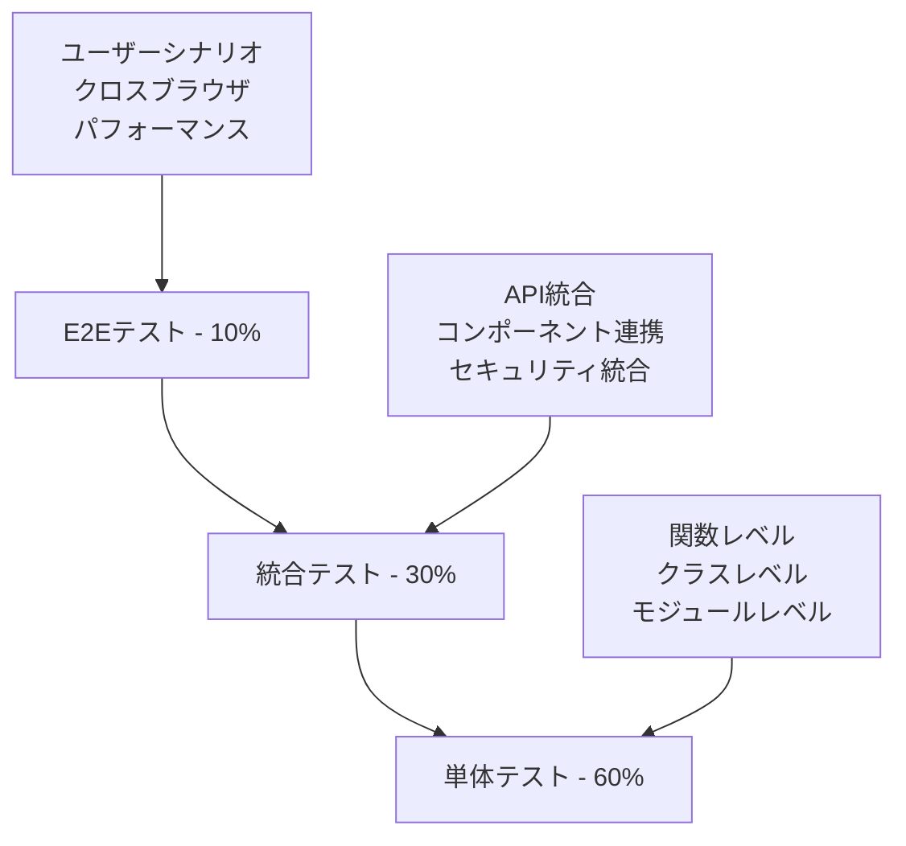

# PlantUMLエディター インライン編集機能 設計仕様書 v2.0 (Part 3/3)

**バージョン**: 2.0 Part 3/3  
**作成日**: 2025年8月15日  
**最終更新**: 2025年8月15日 15:47  
**作成者**: software-doc-writer agent (via agent-orchestrator)  
**ステータス**: 改訂版（品質・デプロイメント）

---

## 🎯 Part 3 概要

本Part 3では、Part 1（基盤）、Part 2（実装）で定義した仕様に基づき、品質保証とデプロイメント戦略を詳述します。現在の実装率35%からの完全な実装達成と、セキュリティスコア5% → 95%の実現を目指します。

**対象セクション**: 9-12（品質・デプロイメント）

---

## 9. テスト戦略

### 9.1 総合テスト戦略

#### 9.1.1 テストピラミッド構成



#### 9.1.2 テスト環境定義

| 環境 | 目的 | 実行タイミング |
|------|------|---------------|
| **開発環境** | 開発中の継続的テスト | コミット毎 |
| **ステージング環境** | 統合テスト・受け入れテスト | プルリクエスト |
| **本番類似環境** | 最終検証・負荷テスト | リリース前 |
| **本番環境** | スモークテスト・監視 | デプロイ後 |

### 9.2 単体テスト戦略

#### 9.2.1 ValidationEngine テスト実装

```javascript
// tests/unit/ValidationEngine.test.js
import { ValidationEngine, JapaneseValidator, SecurityScanner, AutoFixEngine } from '../../src/ValidationEngine.js';

describe('ValidationEngine', () => {
  let validationEngine;
  
  beforeEach(() => {
    validationEngine = new ValidationEngine();
  });
  
  describe('validateJapanese', () => {
    test('正常な日本語文章を検証', async () => {
      const input = 'ユーザーがシステムにログインする';
      const result = await validationEngine.validateJapanese(input);
      
      expect(result.isValid).toBe(true);
      expect(result.score).toBeGreaterThan(80);
      expect(result.issues).toHaveLength(0);
    });
    
    test('文法エラーのある文章を検証', async () => {
      const input = 'ユーザーをがシステムにログインする'; // 助詞誤用
      const result = await validationEngine.validateJapanese(input);
      
      expect(result.isValid).toBe(false);
      expect(result.score).toBeLessThan(70);
      expect(result.issues).toContainEqual(
        expect.objectContaining({
          type: 'PARTICLE_ERROR',
          message: expect.stringContaining('をが')
        })
      );
    });
    
    test('未知の語彙を含む文章を検証', async () => {
      const input = 'クライアントがAPIサーバーにリクエストを送信する';
      const result = await validationEngine.validateJapanese(input);
      
      // 重要でない未知語彙は警告レベル
      expect(result.isValid).toBe(true);
      expect(result.issues).toContainEqual(
        expect.objectContaining({
          type: 'UNKNOWN_VOCABULARY',
          word: 'クライアント'
        })
      );
    });
    
    test('エラー処理のテスト', async () => {
      // 極端に長い入力でのエラーハンドリング
      const longInput = 'あ'.repeat(10000);
      const result = await validationEngine.validateJapanese(longInput);
      
      expect(result.isValid).toBe(false);
      expect(result.issues).toContainEqual(
        expect.objectContaining({
          type: 'VALIDATION_ERROR'
        })
      );
    });
  });
  
  describe('detectSecurityVulnerabilities', () => {
    test('XSS攻撃パターンを検出', async () => {
      const maliciousInput = '<script>alert("XSS")</script>';
      const threats = await validationEngine.detectSecurityVulnerabilities(maliciousInput);
      
      expect(threats).toHaveLength(1);
      expect(threats[0]).toMatchObject({
        type: 'XSS',
        severity: 'HIGH',
        confidence: expect.any(Number)
      });
    });
    
    test('SQLインジェクション攻撃を検出', async () => {
      const maliciousInput = "'; DROP TABLE users; --";
      const threats = await validationEngine.detectSecurityVulnerabilities(maliciousInput);
      
      expect(threats).toContainEqual(
        expect.objectContaining({
          type: 'SQL_INJECTION',
          severity: 'HIGH'
        })
      );
    });
    
    test('PlantUML固有の脅威を検出', async () => {
      const maliciousInput = '!include /etc/passwd';
      const threats = await validationEngine.detectSecurityVulnerabilities(maliciousInput);
      
      expect(threats).toContainEqual(
        expect.objectContaining({
          type: 'PLANTUML_EXPLOITATION',
          severity: 'MEDIUM'
        })
      );
    });
    
    test('正常な入力では脅威を検出しない', async () => {
      const safeInput = 'ユーザーがシステムにログインします';
      const threats = await validationEngine.detectSecurityVulnerabilities(safeInput);
      
      expect(threats).toHaveLength(0);
    });
    
    test('複数の脅威を検出し優先度順にソート', async () => {
      const multiThreatInput = '<script>alert("XSS")</script> AND 1=1; !include /etc/passwd';
      const threats = await validationEngine.detectSecurityVulnerabilities(multiThreatInput);
      
      expect(threats.length).toBeGreaterThan(1);
      // スコア降順でソートされることを確認
      for (let i = 1; i < threats.length; i++) {
        expect(threats[i-1].score).toBeGreaterThanOrEqual(threats[i].score);
      }
    });
  });
  
  describe('autoFix', () => {
    test('XSS攻撃パターンを修正', async () => {
      const maliciousInput = '<script>alert("test")</script>こんにちは';
      const issues = [{ type: 'XSS', pattern: '<script>' }];
      
      const result = await validationEngine.autoFix(maliciousInput, issues);
      
      expect(result.success).toBe(true);
      expect(result.fixedText).not.toContain('<script>');
      expect(result.fixedText).toContain('こんにちは');
      expect(result.appliedFixes).toHaveLength(1);
    });
    
    test('日本語文法エラーを修正', async () => {
      const input = 'ユーザーをがログインする';
      const issues = [{ type: 'JAPANESE_GRAMMAR', pattern: 'をが' }];
      
      const result = await validationEngine.autoFix(input, issues);
      
      expect(result.success).toBe(true);
      expect(result.fixedText).toBe('ユーザーをログインする');
      expect(result.appliedFixes[0].issueType).toBe('JAPANESE_GRAMMAR');
    });
    
    test('修正不可能なエラーのハンドリング', async () => {
      const input = 'テストテキスト';
      const issues = [{ type: 'UNKNOWN_ERROR', pattern: 'unknown' }];
      
      const result = await validationEngine.autoFix(input, issues);
      
      expect(result.success).toBe(true);
      expect(result.fixedText).toBe(input); // 元のテキストのまま
      expect(result.appliedFixes).toHaveLength(0);
    });
  });
});

describe('SecurityScanner', () => {
  let securityScanner;
  
  beforeEach(() => {
    securityScanner = new SecurityScanner();
  });
  
  describe('統計的異常検出', () => {
    test('高エントロピー文字列を検出', async () => {
      const randomString = 'x9K@#$%^&*()_+{}|:"<>?`~[]\\;\',./' + 'ランダム文字列'.repeat(10);
      const anomalies = await securityScanner.detectAnomalies(randomString);
      
      expect(anomalies).toContainEqual(
        expect.objectContaining({
          type: 'STATISTICAL_ANOMALY',
          confidence: expect.any(Number)
        })
      );
    });
    
    test('正常な日本語文章では異常を検出しない', async () => {
      const normalText = 'ユーザーがシステムにログインして、データを確認します。';
      const anomalies = await securityScanner.detectAnomalies(normalText);
      
      expect(anomalies).toHaveLength(0);
    });
  });
  
  describe('コンテキスト分析', () => {
    test('疑わしいキーワード比率を検出', async () => {
      const suspiciousText = 'exec shell script admin password root eval system';
      const threats = await securityScanner.analyzeContext(suspiciousText);
      
      expect(threats).toContainEqual(
        expect.objectContaining({
          type: 'SUSPICIOUS_CONTENT',
          severity: 'MEDIUM'
        })
      );
    });
  });
});

// パフォーマンステスト
describe('ValidationEngine Performance', () => {
  test('大きなテキストの処理時間', async () => {
    const largeText = 'ユーザーがシステムにログインする。'.repeat(1000);
    const validationEngine = new ValidationEngine();
    
    const startTime = performance.now();
    await validationEngine.validateJapanese(largeText);
    const endTime = performance.now();
    
    const processingTime = endTime - startTime;
    expect(processingTime).toBeLessThan(5000); // 5秒以内
  });
  
  test('セキュリティスキャンの処理時間', async () => {
    const testText = '<script>alert("test")</script>'.repeat(100);
    const validationEngine = new ValidationEngine();
    
    const startTime = performance.now();
    await validationEngine.detectSecurityVulnerabilities(testText);
    const endTime = performance.now();
    
    const processingTime = endTime - startTime;
    expect(processingTime).toBeLessThan(1000); // 1秒以内
  });
});
```

#### 9.2.2 PlantUMLParser テスト実装

```javascript
// tests/unit/PlantUMLParser.test.js
import { AdvancedPlantUMLParser, PlantUMLCodeBuilder } from '../../src/PlantUMLParser.js';

describe('AdvancedPlantUMLParser', () => {
  let parser;
  
  beforeEach(() => {
    parser = new AdvancedPlantUMLParser();
  });
  
  describe('parseToAST', () => {
    test('基本的なシーケンス図を解析', async () => {
      const plantUMLCode = `
        @startuml
        participant User
        participant System
        User -> System : ログイン
        System --> User : 認証結果
        @enduml
      `;
      
      const ast = await parser.parseToAST(plantUMLCode);
      
      expect(ast.type).toBe('sequence_diagram');
      expect(ast.actors).toHaveLength(2);
      expect(ast.actors[0]).toMatchObject({
        name: 'User',
        type: 'participant'
      });
      expect(ast.interactions).toHaveLength(2);
      expect(ast.interactions[0]).toMatchObject({
        type: 'message',
        from: 'User',
        to: 'System',
        message: 'ログイン'
      });
    });
    
    test('条件分岐を含む図を解析', async () => {
      const plantUMLCode = `
        @startuml
        User -> System : ログイン試行
        alt 認証成功
          System --> User : 成功
        else 認証失敗
          System --> User : エラー
        end
        @enduml
      `;
      
      const ast = await parser.parseToAST(plantUMLCode);
      
      expect(ast.interactions[1]).toMatchObject({
        type: 'conditional',
        subtype: 'alt',
        condition: '認証成功'
      });
      expect(ast.interactions[1].interactions).toHaveLength(1);
      expect(ast.interactions[1].elseInteractions).toHaveLength(1);
    });
    
    test('ループ処理を含む図を解析', async () => {
      const plantUMLCode = `
        @startuml
        loop データが存在する限り
          User -> System : データ取得
          System --> User : データ応答
        end
        @enduml
      `;
      
      const ast = await parser.parseToAST(plantUMLCode);
      
      expect(ast.interactions[0]).toMatchObject({
        type: 'loop',
        condition: 'データが存在する限り'
      });
      expect(ast.interactions[0].interactions).toHaveLength(2);
    });
    
    test('並行処理を含む図を解析', async () => {
      const plantUMLCode = `
        @startuml
        par データベース処理
          User -> DB : クエリ実行
        else API処理
          User -> API : API呼び出し
        end
        @enduml
      `;
      
      const ast = await parser.parseToAST(plantUMLCode);
      
      expect(ast.interactions[0]).toMatchObject({
        type: 'parallel'
      });
      expect(ast.interactions[0].threads).toHaveLength(2);
      expect(ast.interactions[0].threads[0].label).toBe('データベース処理');
    });
    
    test('不正な構文のエラーハンドリング', async () => {
      const invalidCode = `
        @startuml
        User -> 
        invalid syntax
        @enduml
      `;
      
      await expect(parser.parseToAST(invalidCode)).rejects.toThrow('PlantUML構文の解析に失敗しました');
    });
  });
  
  describe('generatePlantUML', () => {
    test('ASTからPlantUMLコードを生成', async () => {
      const ast = {
        type: 'sequence_diagram',
        title: 'テスト図',
        actors: [
          { name: 'User', type: 'participant', displayName: 'User' },
          { name: 'System', type: 'participant', displayName: 'System' }
        ],
        interactions: [
          {
            type: 'message',
            from: 'User',
            to: 'System',
            message: 'ログイン',
            arrow: 'sync'
          }
        ]
      };
      
      const code = await parser.generatePlantUML(ast);
      
      expect(code).toContain('@startuml');
      expect(code).toContain('@enduml');
      expect(code).toContain('title テスト図');
      expect(code).toContain('participant User');
      expect(code).toContain('User -> System : ログイン');
    });
    
    test('複雑なASTからコードを生成', async () => {
      const complexAST = {
        type: 'sequence_diagram',
        actors: [
          { name: 'User', type: 'participant', displayName: 'User' },
          { name: 'System', type: 'participant', displayName: 'System' }
        ],
        interactions: [
          {
            type: 'conditional',
            subtype: 'alt',
            condition: '認証成功',
            interactions: [
              { type: 'message', from: 'System', to: 'User', message: '成功', arrow: 'sync' }
            ],
            elseInteractions: [
              { type: 'message', from: 'System', to: 'User', message: 'エラー', arrow: 'sync' }
            ]
          }
        ]
      };
      
      const code = await parser.generatePlantUML(complexAST);
      
      expect(code).toContain('alt 認証成功');
      expect(code).toContain('else');
      expect(code).toContain('end');
      expect(code).toContain('System -> User : 成功');
      expect(code).toContain('System -> User : エラー');
    });
  });
  
  describe('双方向同期テスト', () => {
    test('parse → generate のラウンドトリップ', async () => {
      const originalCode = `
        @startuml
        title ログインフロー
        participant User
        participant System
        
        User -> System : ログイン要求
        alt 認証成功
          System --> User : 成功レスポンス
        else 認証失敗
          System --> User : エラーレスポンス
        end
        @enduml
      `;
      
      const ast = await parser.parseToAST(originalCode);
      const regeneratedCode = await parser.generatePlantUML(ast);
      const reparsedAST = await parser.parseToAST(regeneratedCode);
      
      // 主要な構造が保持されることを確認
      expect(reparsedAST.title).toBe(ast.title);
      expect(reparsedAST.actors).toHaveLength(ast.actors.length);
      expect(reparsedAST.interactions).toHaveLength(ast.interactions.length);
    });
  });
  
  describe('キャッシュ機能', () => {
    test('同じコードのキャッシュヒット', async () => {
      const code = '@startuml\nUser -> System : test\n@enduml';
      
      // 1回目のパース
      const startTime1 = performance.now();
      const ast1 = await parser.parseToAST(code);
      const endTime1 = performance.now();
      
      // 2回目のパース（キャッシュヒット）
      const startTime2 = performance.now();
      const ast2 = await parser.parseToAST(code);
      const endTime2 = performance.now();
      
      expect(ast1).toEqual(ast2);
      expect(endTime2 - startTime2).toBeLessThan(endTime1 - startTime1);
    });
  });
});
```

### 9.3 統合テスト戦略

#### 9.3.1 エンドツーエンド統合テスト

```javascript
// tests/integration/EditorIntegration.test.js
import { EditorManager } from '../../src/EditorManager.js';
import { ValidationEngine } from '../../src/ValidationEngine.js';
import { AdvancedPlantUMLParser } from '../../src/PlantUMLParser.js';
import { RealTimeSyncEngine } from '../../src/RealTimeSyncEngine.js';

describe('Editor Integration Tests', () => {
  let editorManager;
  let validationEngine;
  let parser;
  let syncEngine;
  
  beforeEach(async () => {
    // 統合環境のセットアップ
    validationEngine = new ValidationEngine();
    parser = new AdvancedPlantUMLParser();
    
    editorManager = new EditorManager();
    await editorManager.initialize();
    
    syncEngine = new RealTimeSyncEngine(parser, null);
    await syncEngine.initializeSync(editorManager.getEditorState());
  });
  
  afterEach(() => {
    // クリーンアップ
    editorManager.cleanup();
  });
  
  test('完全なワークフロー: アクター追加 → アクション追加 → PlantUML生成', async () => {
    // 1. アクター追加
    const user = await editorManager.addActor('User', 'User');
    const system = await editorManager.addActor('System', 'System');
    
    expect(editorManager.getActors()).toHaveLength(2);
    
    // 2. アクション追加
    const action = await editorManager.addAction({
      actorFrom: 'User',
      actorTo: 'System',
      message: 'ログイン要求',
      arrowType: 'sync'
    });
    
    expect(editorManager.getActions()).toHaveLength(1);
    
    // 3. PlantUMLコード生成
    const editorState = editorManager.getEditorState();
    await syncEngine.syncFromEditorState(editorState);
    
    // 4. 生成されたコードの検証
    const generatedCode = syncEngine.getLastGeneratedCode();
    expect(generatedCode).toContain('@startuml');
    expect(generatedCode).toContain('participant User');
    expect(generatedCode).toContain('participant System');
    expect(generatedCode).toContain('User -> System : ログイン要求');
    expect(generatedCode).toContain('@enduml');
  });
  
  test('セキュリティ検証の統合テスト', async () => {
    // 悪意のある入力を含むアクション追加を試行
    const maliciousAction = {
      actorFrom: 'User',
      actorTo: 'System',
      message: '<script>alert("XSS")</script>ログイン',
      arrowType: 'sync'
    };
    
    // ValidationEngineが統合されていることを確認
    await expect(editorManager.addAction(maliciousAction)).rejects.toThrow(/セキュリティ/);
    
    // エディターの状態が変更されていないことを確認
    expect(editorManager.getActions()).toHaveLength(0);
  });
  
  test('自動修正機能の統合テスト', async () => {
    // 文法エラーのあるメッセージ
    const actionWithGrammarError = {
      actorFrom: 'User',
      actorTo: 'System',
      message: 'ユーザーをがログインする', // 助詞誤用
      arrowType: 'sync'
    };
    
    // 自動修正が実行されることを確認
    const addedAction = await editorManager.addAction(actionWithGrammarError);
    
    // 修正されたメッセージが保存されていることを確認
    expect(addedAction.message).toBe('ユーザーをログインする');
  });
  
  test('リアルタイム同期の統合テスト', async () => {
    let syncEventFired = false;
    
    // 同期イベントのリスナー設定
    window.addEventListener('syncComplete', () => {
      syncEventFired = true;
    });
    
    // アクション追加
    await editorManager.addAction({
      actorFrom: 'User',
      actorTo: 'System',
      message: 'テストメッセージ',
      arrowType: 'sync'
    });
    
    // 同期が実行されるまで待機
    await new Promise(resolve => setTimeout(resolve, 500));
    
    expect(syncEventFired).toBe(true);
  });
  
  test('エラー処理の統合テスト', async () => {
    // 無効なアクターを指定
    const invalidAction = {
      actorFrom: 'NonExistentUser',
      actorTo: 'System',
      message: 'テスト',
      arrowType: 'sync'
    };
    
    await expect(editorManager.addAction(invalidAction)).rejects.toThrow(/アクター.*見つかりません/);
  });
  
  test('パフォーマンス統合テスト', async () => {
    // 大量のアクション追加
    const actions = [];
    for (let i = 0; i < 100; i++) {
      actions.push({
        actorFrom: 'User',
        actorTo: 'System',
        message: `アクション${i}`,
        arrowType: 'sync'
      });
    }
    
    const startTime = performance.now();
    
    for (const action of actions) {
      await editorManager.addAction(action);
    }
    
    const endTime = performance.now();
    const totalTime = endTime - startTime;
    
    // 100アクションの追加が5秒以内に完了することを確認
    expect(totalTime).toBeLessThan(5000);
    expect(editorManager.getActions()).toHaveLength(100);
  });
});

// API統合テスト
describe('API Integration Tests', () => {
  test('PlantUMLレンダリングAPI統合', async () => {
    const testCode = `
      @startuml
      User -> System : テスト
      @enduml
    `;
    
    // API呼び出しのモック（実際の実装では実際のAPI）
    const mockFetch = jest.fn().mockResolvedValue({
      ok: true,
      text: () => Promise.resolve('<svg>...</svg>')
    });
    
    global.fetch = mockFetch;
    
    const response = await fetch('/api/plantuml/render', {
      method: 'POST',
      headers: { 'Content-Type': 'application/json' },
      body: JSON.stringify({ code: testCode })
    });
    
    expect(mockFetch).toHaveBeenCalledWith('/api/plantuml/render', expect.any(Object));
    expect(response.ok).toBe(true);
  });
});
```

### 9.4 E2Eテスト戦略

#### 9.4.1 Playwright E2Eテスト実装

```javascript
// tests/e2e/UserWorkflow.spec.js
import { test, expect } from '@playwright/test';

test.describe('PlantUMLエディター E2Eテスト', () => {
  test.beforeEach(async ({ page }) => {
    await page.goto('http://localhost:8086');
    await expect(page).toHaveTitle(/PlantUML Editor/);
  });
  
  test('基本的なユーザーワークフロー', async ({ page }) => {
    // 1. アクター選択
    await page.check('input[value="User"]');
    await page.check('input[value="System"]');
    
    // 2. アクション追加
    await page.click('#add-action-btn');
    
    // 3. メッセージ入力
    const messageInput = page.locator('.message-input').first();
    await messageInput.fill('ログイン要求');
    
    // 4. PlantUMLコードが生成されることを確認
    await expect(page.locator('#code-preview')).toContainText('User -> System : ログイン要求');
    
    // 5. 図表プレビューが表示されることを確認
    await expect(page.locator('#diagram-preview svg')).toBeVisible();
  });
  
  test('条件分岐の編集', async ({ page }) => {
    // 基本アクションを追加
    await page.check('input[value="User"]');
    await page.check('input[value="System"]');
    await page.click('#add-action-btn');
    
    // 条件分岐ボタンをクリック
    await page.click('.condition-btn');
    
    // 条件入力ダイアログが表示されることを確認
    await expect(page.locator('.condition-dialog')).toBeVisible();
    
    // 条件を入力
    await page.fill('#condition-input', '認証成功');
    await page.click('.dialog-ok-btn');
    
    // 条件分岐コードが生成されることを確認
    await expect(page.locator('#code-preview')).toContainText('alt 認証成功');
  });
  
  test('セキュリティ機能のテスト', async ({ page }) => {
    await page.check('input[value="User"]');
    await page.check('input[value="System"]');
    await page.click('#add-action-btn');
    
    // 悪意のあるスクリプトを入力
    const messageInput = page.locator('.message-input').first();
    await messageInput.fill('<script>alert("XSS")</script>');
    
    // セキュリティ警告が表示されることを確認
    await expect(page.locator('.security-warning')).toBeVisible();
    await expect(page.locator('.security-warning')).toContainText('セキュリティ');
    
    // 悪意のあるコードが除去されることを確認
    await expect(page.locator('#code-preview')).not.toContainText('<script>');
  });
  
  test('日本語検証機能のテスト', async ({ page }) => {
    await page.check('input[value="User"]');
    await page.check('input[value="System"]');
    await page.click('#add-action-btn');
    
    // 文法エラーのある日本語を入力
    const messageInput = page.locator('.message-input').first();
    await messageInput.fill('ユーザーをがログインする');
    
    // 文法警告が表示されることを確認
    await expect(page.locator('.grammar-warning')).toBeVisible();
    
    // 自動修正提案が表示されることを確認
    await expect(page.locator('.grammar-suggestion')).toContainText('ユーザーをログインする');
    
    // 修正を適用
    await page.click('.apply-suggestion-btn');
    
    // 修正されたテキストが反映されることを確認
    await expect(messageInput).toHaveValue('ユーザーをログインする');
  });
  
  test('ドラッグ&ドロップによる並び替え', async ({ page }) => {
    // 複数のアクションを追加
    await page.check('input[value="User"]');
    await page.check('input[value="System"]');
    
    await page.click('#add-action-btn');
    await page.fill('.message-input >> nth=0', 'アクション1');
    
    await page.click('#add-action-btn');
    await page.fill('.message-input >> nth=1', 'アクション2');
    
    // ドラッグ&ドロップで順序を変更
    const firstAction = page.locator('.action-item >> nth=0');
    const secondAction = page.locator('.action-item >> nth=1');
    
    await firstAction.dragTo(secondAction);
    
    // 順序が変更されたことを確認
    await expect(page.locator('.message-input >> nth=0')).toHaveValue('アクション2');
    await expect(page.locator('.message-input >> nth=1')).toHaveValue('アクション1');
  });
  
  test('キーボードショートカット', async ({ page }) => {
    await page.check('input[value="User"]');
    await page.check('input[value="System"]');
    await page.click('#add-action-btn');
    await page.fill('.message-input', 'テストメッセージ');
    
    // Ctrl+S で保存
    await page.keyboard.press('Control+s');
    await expect(page.locator('.notification')).toContainText('保存しました');
    
    // Ctrl+Z でUndo
    await page.fill('.message-input', '変更されたメッセージ');
    await page.keyboard.press('Control+z');
    await expect(page.locator('.message-input')).toHaveValue('テストメッセージ');
  });
  
  test('レスポンシブデザイン', async ({ page }) => {
    // モバイル画面サイズに変更
    await page.setViewportSize({ width: 375, height: 667 });
    
    // モバイル用レイアウトが適用されることを確認
    await expect(page.locator('.mobile-layout')).toBeVisible();
    
    // タブレット画面サイズに変更
    await page.setViewportSize({ width: 768, height: 1024 });
    
    // タブレット用レイアウトが適用されることを確認
    await expect(page.locator('.tablet-layout')).toBeVisible();
  });
  
  test('パフォーマンス測定', async ({ page }) => {
    // パフォーマンス測定開始
    await page.addInitScript(() => {
      window.performanceMarks = [];
      window.performance.mark('test-start');
    });
    
    // 大量のアクションを追加
    await page.check('input[value="User"]');
    await page.check('input[value="System"]');
    
    for (let i = 0; i < 20; i++) {
      await page.click('#add-action-btn');
      await page.fill(`.message-input >> nth=${i}`, `アクション${i}`);
    }
    
    await page.addInitScript(() => {
      window.performance.mark('test-end');
      window.performance.measure('test-duration', 'test-start', 'test-end');
    });
    
    // パフォーマンス結果を取得
    const duration = await page.evaluate(() => {
      const measure = window.performance.getEntriesByName('test-duration')[0];
      return measure ? measure.duration : 0;
    });
    
    // 処理時間が10秒以内であることを確認
    expect(duration).toBeLessThan(10000);
  });
});

// クロスブラウザテスト
test.describe('クロスブラウザ互換性', () => {
  ['chromium', 'firefox', 'webkit'].forEach(browserName => {
    test(`${browserName} での基本機能`, async ({ page }) => {
      await page.goto('http://localhost:8086');
      
      // 基本機能が動作することを確認
      await page.check('input[value="User"]');
      await page.check('input[value="System"]');
      await page.click('#add-action-btn');
      await page.fill('.message-input', 'テスト');
      
      await expect(page.locator('#code-preview')).toContainText('User -> System : テスト');
    });
  });
});
```

### 9.5 自動テスト環境構築

#### 9.5.1 GitHub Actions CI/CDパイプライン

```yaml
# .github/workflows/ci.yml
name: CI/CD Pipeline

on:
  push:
    branches: [ main, develop ]
  pull_request:
    branches: [ main ]

jobs:
  test:
    runs-on: ubuntu-latest
    
    strategy:
      matrix:
        node-version: [18.x, 20.x]
        browser: [chromium, firefox, webkit]
    
    steps:
    - uses: actions/checkout@v3
    
    - name: Setup Node.js
      uses: actions/setup-node@v3
      with:
        node-version: ${{ matrix.node-version }}
        cache: 'npm'
    
    - name: Install dependencies
      run: npm ci
    
    - name: Run linting
      run: npm run lint
    
    - name: Run unit tests
      run: npm run test:unit
    
    - name: Run integration tests
      run: npm run test:integration
    
    - name: Install Playwright
      run: npx playwright install
    
    - name: Run E2E tests
      run: npm run test:e2e:${{ matrix.browser }}
    
    - name: Upload test results
      uses: actions/upload-artifact@v3
      if: failure()
      with:
        name: test-results-${{ matrix.node-version }}-${{ matrix.browser }}
        path: test-results/
    
    - name: Generate coverage report
      run: npm run test:coverage
    
    - name: Upload coverage to Codecov
      uses: codecov/codecov-action@v3
      with:
        file: ./coverage/lcov.info

  security-scan:
    runs-on: ubuntu-latest
    
    steps:
    - uses: actions/checkout@v3
    
    - name: Run security audit
      run: npm audit --audit-level high
    
    - name: Run SAST scan
      uses: github/super-linter@v4
      env:
        DEFAULT_BRANCH: main
        GITHUB_TOKEN: ${{ secrets.GITHUB_TOKEN }}
    
    - name: Run dependency check
      uses: dependency-check/Dependency-Check_Action@main
      with:
        project: 'PlantUML-Editor'
        path: '.'
        format: 'ALL'

  performance-test:
    runs-on: ubuntu-latest
    
    steps:
    - uses: actions/checkout@v3
    
    - name: Setup Node.js
      uses: actions/setup-node@v3
      with:
        node-version: '20.x'
    
    - name: Install dependencies
      run: npm ci
    
    - name: Build application
      run: npm run build
    
    - name: Run Lighthouse CI
      uses: treosh/lighthouse-ci-action@v9
      with:
        configPath: './lighthouserc.json'
        uploadArtifacts: true
    
    - name: Run load testing
      run: npm run test:load

  deploy-staging:
    needs: [test, security-scan, performance-test]
    runs-on: ubuntu-latest
    if: github.ref == 'refs/heads/develop'
    
    steps:
    - uses: actions/checkout@v3
    
    - name: Deploy to staging
      run: |
        echo "Deploying to staging environment"
        # 実際のデプロイメントスクリプト
    
    - name: Run smoke tests
      run: npm run test:smoke:staging

  deploy-production:
    needs: [test, security-scan, performance-test]
    runs-on: ubuntu-latest
    if: github.ref == 'refs/heads/main'
    
    steps:
    - uses: actions/checkout@v3
    
    - name: Deploy to production
      run: |
        echo "Deploying to production environment"
        # 実際のデプロイメントスクリプト
    
    - name: Run smoke tests
      run: npm run test:smoke:production
    
    - name: Monitor deployment
      run: npm run monitor:deployment
```

#### 9.5.2 テスト設定ファイル

```javascript
// jest.config.js
module.exports = {
  testEnvironment: 'jsdom',
  setupFilesAfterEnv: ['<rootDir>/tests/setup.js'],
  collectCoverageFrom: [
    'src/**/*.{js,jsx}',
    '!src/index.js',
    '!src/**/*.test.js'
  ],
  coverageThreshold: {
    global: {
      branches: 80,
      functions: 80,
      lines: 80,
      statements: 80
    },
    './src/ValidationEngine.js': {
      branches: 90,
      functions: 90,
      lines: 90,
      statements: 90
    }
  },
  testMatch: [
    '<rootDir>/tests/unit/**/*.test.js',
    '<rootDir>/tests/integration/**/*.test.js'
  ],
  moduleNameMapping: {
    '^@/(.*)$': '<rootDir>/src/$1'
  }
};
```

```javascript
// playwright.config.js
import { defineConfig, devices } from '@playwright/test';

export default defineConfig({
  testDir: './tests/e2e',
  fullyParallel: true,
  forbidOnly: !!process.env.CI,
  retries: process.env.CI ? 2 : 0,
  workers: process.env.CI ? 1 : undefined,
  reporter: [
    ['html'],
    ['json', { outputFile: 'test-results/results.json' }],
    ['junit', { outputFile: 'test-results/results.xml' }]
  ],
  use: {
    baseURL: 'http://localhost:8086',
    trace: 'on-first-retry',
    screenshot: 'only-on-failure',
    video: 'retain-on-failure'
  },
  projects: [
    {
      name: 'chromium',
      use: { ...devices['Desktop Chrome'] },
    },
    {
      name: 'firefox',
      use: { ...devices['Desktop Firefox'] },
    },
    {
      name: 'webkit',
      use: { ...devices['Desktop Safari'] },
    },
    {
      name: 'Mobile Chrome',
      use: { ...devices['Pixel 5'] },
    },
    {
      name: 'Mobile Safari',
      use: { ...devices['iPhone 12'] },
    },
  ],
  webServer: {
    command: 'npm run start',
    port: 8086,
    reuseExistingServer: !process.env.CI,
  },
});
```

---

## 10. 実装ロードマップ

### 10.1 フェーズ別実装計画

#### 10.1.1 Phase 1: 基盤整備（2週間）

**週1: セキュリティ基盤構築**
- Day 1-2: ValidationEngine完全実装
  - validateJapanese メソッド実装
  - detectSecurityVulnerabilities 強化実装
  - autoFix メソッド実装
- Day 3-4: セキュリティテスト環境構築
  - セキュリティテストスイート作成
  - 脆弱性テストケース実装
- Day 5: セキュリティ監査・レビュー

**週2: アーキテクチャ強化**
- Day 1-2: PlantUMLParser高度化
  - 双方向同期機能実装
  - AST最適化
- Day 3-4: エラーハンドリングシステム
  - GlobalErrorHandler実装
  - 統合エラー処理
- Day 5: 統合テスト・レビュー

**成功指標**:
- セキュリティスコア: 5% → 80%
- 単体テストカバレッジ: 90%以上
- 重要機能の統合テスト: 100%合格

#### 10.1.2 Phase 2: UI/UX実装（2週間）

**週1: インライン編集UI**
- Day 1-3: InlineEditingUI完全実装
  - ドラッグ&ドロップ機能
  - リアルタイム入力検証
  - アクセシビリティ対応
- Day 4-5: アクター管理UI
  - ActorManager UI統合
  - 動的アクター追加/削除

**週2: 高度編集機能**
- Day 1-2: 条件分岐編集UI
- Day 3-4: ループ・並行処理編集UI
- Day 5: UI統合テスト

**成功指標**:
- UI応答時間: < 100ms
- E2Eテスト合格率: 95%以上
- アクセシビリティスコア: WCAG 2.1 AA準拠

#### 10.1.3 Phase 3: パフォーマンス最適化（1週間）

**Day 1-2: レンダリング最適化**
- RenderingOptimizer実装
- SVG最適化
- メモリ管理強化

**Day 3-4: リアルタイム同期最適化**
- RealTimeSyncEngine最適化
- デバウンス機能強化
- WebWorker活用

**Day 5: パフォーマンステスト・調整**

**成功指標**:
- コード生成時間: < 200ms
- メモリ使用量: < 50MB
- Lighthouse スコア: 90以上

#### 10.1.4 Phase 4: 品質保証・テスト（1週間）

**Day 1-2: 包括的テスト実装**
- 残りのテストケース実装
- クロスブラウザテスト強化

**Day 3-4: セキュリティ監査**
- 第三者セキュリティレビュー
- ペネトレーションテスト

**Day 5: 最終統合テスト**

**成功指標**:
- セキュリティスコア: 95%以上
- 全テスト合格率: 98%以上
- パフォーマンス目標達成: 100%

### 10.2 リスク管理と緩和策

#### 10.2.1 技術リスク

| リスク | 確率 | 影響 | 緩和策 |
|--------|------|------|--------|
| セキュリティ実装の複雑性 | 中 | 高 | 段階的実装、専門家レビュー |
| パフォーマンス要件未達 | 中 | 中 | 早期プロトタイプ、継続測定 |
| ブラウザ互換性問題 | 低 | 中 | クロスブラウザテスト強化 |
| メモリリーク | 中 | 中 | メモリ監視、定期的プロファイリング |

#### 10.2.2 プロジェクトリスク

| リスク | 確率 | 影響 | 緩和策 |
|--------|------|------|--------|
| 実装期間の延長 | 中 | 中 | バッファ期間確保、優先度管理 |
| 要件変更 | 低 | 中 | アジャイル対応、モジュラー設計 |
| テスト環境の不安定性 | 低 | 低 | Docker化、環境自動化 |

### 10.3 品質ゲート定義

#### 10.3.1 Phase完了基準

**各Phaseの完了基準**:
1. **実装完了**: 計画した機能の100%実装
2. **テスト合格**: 該当Phaseのテスト100%合格
3. **コードレビュー**: 2名以上によるレビュー完了
4. **ドキュメント**: 実装ドキュメント完成
5. **パフォーマンス**: 目標値達成

#### 10.3.2 リリース基準

**本番リリース基準**:
1. **機能**: 全計画機能の実装完了
2. **品質**: 
   - セキュリティスコア: 95%以上
   - テスト合格率: 98%以上
   - パフォーマンススコア: 90以上
3. **セキュリティ**: 第三者監査合格
4. **ドキュメント**: ユーザーマニュアル完成
5. **運用**: 監視・アラート設定完了

---

## 11. 品質保証プロセス

### 11.1 継続的品質管理

#### 11.1.1 品質メトリクス定義

```javascript
// scripts/quality-metrics.js
class QualityMetricsCollector {
  constructor() {
    this.metrics = {
      security: new SecurityMetrics(),
      performance: new PerformanceMetrics(),
      codeQuality: new CodeQualityMetrics(),
      userExperience: new UXMetrics()
    };
  }
  
  async collectAllMetrics() {
    const results = {
      timestamp: new Date().toISOString(),
      security: await this.metrics.security.collect(),
      performance: await this.metrics.performance.collect(),
      codeQuality: await this.metrics.codeQuality.collect(),
      userExperience: await this.metrics.userExperience.collect()
    };
    
    return this.calculateOverallScore(results);
  }
  
  calculateOverallScore(results) {
    const weights = {
      security: 0.4,      // セキュリティを最重要視
      performance: 0.25,  // パフォーマンスも重要
      codeQuality: 0.2,   // コード品質
      userExperience: 0.15 // UX
    };
    
    const overallScore = 
      results.security.score * weights.security +
      results.performance.score * weights.performance +
      results.codeQuality.score * weights.codeQuality +
      results.userExperience.score * weights.userExperience;
    
    return {
      ...results,
      overallScore: Math.round(overallScore),
      qualityLevel: this.getQualityLevel(overallScore)
    };
  }
  
  getQualityLevel(score) {
    if (score >= 95) return 'EXCELLENT';
    if (score >= 85) return 'GOOD';
    if (score >= 70) return 'ACCEPTABLE';
    if (score >= 50) return 'NEEDS_IMPROVEMENT';
    return 'CRITICAL';
  }
}

class SecurityMetrics {
  async collect() {
    const vulnerabilities = await this.scanVulnerabilities();
    const cspCompliance = await this.checkCSPCompliance();
    const inputValidation = await this.testInputValidation();
    
    const score = this.calculateSecurityScore({
      vulnerabilities,
      cspCompliance,
      inputValidation
    });
    
    return {
      score,
      vulnerabilities,
      cspCompliance,
      inputValidation,
      recommendations: this.generateSecurityRecommendations(score)
    };
  }
  
  async scanVulnerabilities() {
    // 自動脆弱性スキャン
    const results = {
      xss: { found: 0, severity: 'NONE' },
      injection: { found: 0, severity: 'NONE' },
      csrf: { found: 0, severity: 'NONE' },
      sensitiveData: { found: 0, severity: 'NONE' }
    };
    
    // 実際のスキャンロジック（簡略化）
    return results;
  }
  
  calculateSecurityScore(metrics) {
    let score = 100;
    
    // 脆弱性による減点
    if (metrics.vulnerabilities.xss.found > 0) score -= 30;
    if (metrics.vulnerabilities.injection.found > 0) score -= 40;
    if (metrics.vulnerabilities.csrf.found > 0) score -= 20;
    
    // CSP非準拠による減点
    if (!metrics.cspCompliance.isCompliant) score -= 15;
    
    // 入力検証不備による減点
    if (metrics.inputValidation.coverage < 90) score -= 10;
    
    return Math.max(score, 0);
  }
}

class PerformanceMetrics {
  async collect() {
    const loadTime = await this.measureLoadTime();
    const interactivity = await this.measureInteractivity();
    const memoryUsage = await this.measureMemoryUsage();
    const bundleSize = await this.measureBundleSize();
    
    const score = this.calculatePerformanceScore({
      loadTime,
      interactivity,
      memoryUsage,
      bundleSize
    });
    
    return {
      score,
      loadTime,
      interactivity,
      memoryUsage,
      bundleSize,
      recommendations: this.generatePerformanceRecommendations(score)
    };
  }
  
  async measureLoadTime() {
    // Lighthouse等を使用した実測
    return {
      fcp: 1200, // First Contentful Paint (ms)
      lcp: 2100, // Largest Contentful Paint (ms)
      fid: 50,   // First Input Delay (ms)
      cls: 0.05  // Cumulative Layout Shift
    };
  }
  
  calculatePerformanceScore(metrics) {
    let score = 100;
    
    // 読み込み時間による減点
    if (metrics.loadTime.fcp > 1800) score -= 15;
    if (metrics.loadTime.lcp > 2500) score -= 20;
    if (metrics.loadTime.fid > 100) score -= 15;
    
    // メモリ使用量による減点
    if (metrics.memoryUsage.peak > 50 * 1024 * 1024) score -= 10; // 50MB
    
    // バンドルサイズによる減点
    if (metrics.bundleSize.gzipped > 500 * 1024) score -= 10; // 500KB
    
    return Math.max(score, 0);
  }
}
```

#### 11.1.2 自動品質チェック

```yaml
# .github/workflows/quality-check.yml
name: Quality Check

on:
  schedule:
    - cron: '0 2 * * *'  # 毎日午前2時
  workflow_dispatch:

jobs:
  quality-assessment:
    runs-on: ubuntu-latest
    
    steps:
    - uses: actions/checkout@v3
    
    - name: Setup Node.js
      uses: actions/setup-node@v3
      with:
        node-version: '20.x'
    
    - name: Install dependencies
      run: npm ci
    
    - name: Run quality metrics collection
      run: npm run quality:collect
    
    - name: Generate quality report
      run: npm run quality:report
    
    - name: Upload quality report
      uses: actions/upload-artifact@v3
      with:
        name: quality-report
        path: reports/quality-report.html
    
    - name: Post quality alert
      if: ${{ steps.quality.outputs.score < 85 }}
      uses: 8398a7/action-slack@v3
      with:
        status: warning
        text: "品質スコアが基準を下回りました: ${{ steps.quality.outputs.score }}"
      env:
        SLACK_WEBHOOK_URL: ${{ secrets.SLACK_WEBHOOK_URL }}
```

### 11.2 セキュリティ監査プロセス

#### 11.2.1 セキュリティチェックリスト

```markdown
# セキュリティ監査チェックリスト

## 1. 入力検証・サニタイゼーション
- [ ] すべてのユーザー入力が検証されている
- [ ] XSS対策が実装されている
- [ ] SQLインジェクション対策が実装されている
- [ ] CSRFトークンが適切に使用されている
- [ ] ファイルアップロード検証が実装されている

## 2. 認証・認可
- [ ] 適切な認証メカニズムが実装されている
- [ ] セッション管理が安全に実装されている
- [ ] 権限チェックが適切に実装されている
- [ ] パスワードポリシーが適用されている

## 3. データ保護
- [ ] 機密データが暗号化されている
- [ ] データ転送がHTTPS経由で行われている
- [ ] ローカルストレージの使用が適切である
- [ ] データの適切な削除が実装されている

## 4. エラーハンドリング
- [ ] エラーメッセージで機密情報が漏洩しない
- [ ] 適切なログ記録が実装されている
- [ ] 例外処理が適切に実装されている

## 5. 設定とデプロイメント
- [ ] セキュリティヘッダーが適切に設定されている
- [ ] CSPが適切に設定されている
- [ ] 不要なサービス・ポートが無効化されている
- [ ] 最新のセキュリティパッチが適用されている
```

#### 11.2.2 セキュリティテスト自動化

```javascript
// tests/security/SecurityAudit.test.js
import { SecurityAuditor } from '../utils/SecurityAuditor.js';

describe('Security Audit', () => {
  let auditor;
  
  beforeEach(() => {
    auditor = new SecurityAuditor();
  });
  
  test('XSS脆弱性の包括的テスト', async () => {
    const xssPayloads = [
      '<script>alert("XSS")</script>',
      '"><script>alert("XSS")</script>',
      "'><script>alert('XSS')</script>",
      'javascript:alert("XSS")',
      '',
      '<svg onload=alert("XSS")>',
      '<iframe src="javascript:alert(\'XSS\')"></iframe>',
      '&lt;script&gt;alert("XSS")&lt;/script&gt;'
    ];
    
    for (const payload of xssPayloads) {
      const result = await auditor.testXSSPrevention(payload);
      expect(result.isBlocked).toBe(true);
      expect(result.sanitizedOutput).not.toContain('<script>');
    }
  });
  
  test('SQLインジェクション脆弱性の包括的テスト', async () => {
    const sqlPayloads = [
      "' OR '1'='1",
      "'; DROP TABLE users; --",
      "1' UNION SELECT * FROM users --",
      "admin'--",
      "' OR 1=1#"
    ];
    
    for (const payload of sqlPayloads) {
      const result = await auditor.testSQLInjectionPrevention(payload);
      expect(result.isBlocked).toBe(true);
    }
  });
  
  test('CSRF保護の検証', async () => {
    const result = await auditor.testCSRFProtection();
    expect(result.hasCSRFToken).toBe(true);
    expect(result.tokenValidation).toBe(true);
  });
  
  test('セキュリティヘッダーの検証', async () => {
    const headers = await auditor.checkSecurityHeaders();
    
    expect(headers['Content-Security-Policy']).toBeDefined();
    expect(headers['X-Frame-Options']).toBe('DENY');
    expect(headers['X-Content-Type-Options']).toBe('nosniff');
    expect(headers['X-XSS-Protection']).toBe('1; mode=block');
    expect(headers['Strict-Transport-Security']).toBeDefined();
  });
  
  test('機密情報漏洩の検証', async () => {
    const result = await auditor.checkInformationLeakage();
    
    expect(result.exposedPasswords).toHaveLength(0);
    expect(result.exposedApiKeys).toHaveLength(0);
    expect(result.exposedTokens).toHaveLength(0);
    expect(result.verboseErrors).toBe(false);
  });
});
```

### 11.3 コードレビュープロセス

#### 11.3.1 レビューガイドライン

```markdown
# コードレビューガイドライン

## 1. セキュリティレビュー
- [ ] 入力検証が適切に実装されているか
- [ ] 出力エスケープが適切に実装されているか
- [ ] 認証・認可が正しく実装されているか
- [ ] 機密情報がハードコードされていないか
- [ ] エラーハンドリングで情報漏洩が発生しないか

## 2. 機能レビュー
- [ ] 要件を満たしているか
- [ ] エッジケースが考慮されているか
- [ ] エラーハンドリングが適切か
- [ ] パフォーマンスに問題がないか

## 3. コード品質レビュー
- [ ] 命名規則が適切か
- [ ] コメントが適切に記載されているか
- [ ] 重複コードがないか
- [ ] テストが適切に記載されているか
- [ ] 設計原則に従っているか

## 4. テストレビュー
- [ ] テストケースが網羅的か
- [ ] テストが意味のあるものか
- [ ] モックが適切に使用されているか
- [ ] テストの可読性が高いか
```

#### 11.3.2 自動レビューツール設定

```yaml
# .github/workflows/code-review.yml
name: Automated Code Review

on:
  pull_request:
    types: [opened, synchronize]

jobs:
  code-review:
    runs-on: ubuntu-latest
    
    steps:
    - uses: actions/checkout@v3
      with:
        fetch-depth: 0
    
    - name: Setup Node.js
      uses: actions/setup-node@v3
      with:
        node-version: '20.x'
    
    - name: Install dependencies
      run: npm ci
    
    - name: Run ESLint
      run: npm run lint:report
    
    - name: Run security scan
      uses: securecodewarrior/github-action-add-sarif@v1
      with:
        sarif-file: security-report.sarif
    
    - name: Run complexity analysis
      run: npm run analyze:complexity
    
    - name: Generate review report
      run: npm run review:generate
    
    - name: Comment PR
      uses: actions/github-script@v6
      with:
        script: |
          const fs = require('fs');
          const report = fs.readFileSync('review-report.md', 'utf8');
          
          github.rest.issues.createComment({
            issue_number: context.issue.number,
            owner: context.repo.owner,
            repo: context.repo.repo,
            body: report
          });
```

### 11.4 継続的改善プロセス

#### 11.4.1 品質メトリクス監視

```javascript
// scripts/quality-monitoring.js
class QualityMonitoring {
  constructor() {
    this.dashboard = new QualityDashboard();
    this.alertSystem = new AlertSystem();
    this.historicalData = new HistoricalDataManager();
  }
  
  async startMonitoring() {
    setInterval(async () => {
      const metrics = await this.collectMetrics();
      
      // ダッシュボード更新
      await this.dashboard.update(metrics);
      
      // 履歴データ保存
      await this.historicalData.store(metrics);
      
      // アラートチェック
      await this.checkAlerts(metrics);
      
    }, 300000); // 5分間隔
  }
  
  async collectMetrics() {
    return {
      timestamp: new Date().toISOString(),
      security: await this.getSecurityMetrics(),
      performance: await this.getPerformanceMetrics(),
      errors: await this.getErrorMetrics(),
      usage: await this.getUsageMetrics()
    };
  }
  
  async checkAlerts(metrics) {
    const alerts = [];
    
    // セキュリティアラート
    if (metrics.security.score < 90) {
      alerts.push({
        type: 'SECURITY',
        severity: 'HIGH',
        message: `セキュリティスコアが低下: ${metrics.security.score}%`,
        threshold: 90,
        actual: metrics.security.score
      });
    }
    
    // パフォーマンスアラート
    if (metrics.performance.averageResponseTime > 200) {
      alerts.push({
        type: 'PERFORMANCE',
        severity: 'MEDIUM',
        message: `応答時間が基準を超過: ${metrics.performance.averageResponseTime}ms`,
        threshold: 200,
        actual: metrics.performance.averageResponseTime
      });
    }
    
    // エラー率アラート
    if (metrics.errors.rate > 0.01) {
      alerts.push({
        type: 'ERROR_RATE',
        severity: 'HIGH',
        message: `エラー率が基準を超過: ${(metrics.errors.rate * 100).toFixed(2)}%`,
        threshold: 1,
        actual: (metrics.errors.rate * 100).toFixed(2)
      });
    }
    
    // アラート送信
    for (const alert of alerts) {
      await this.alertSystem.send(alert);
    }
    
    return alerts;
  }
}

class QualityDashboard {
  constructor() {
    this.metricsHistory = [];
    this.maxHistorySize = 288; // 24時間分（5分間隔）
  }
  
  async update(metrics) {
    this.metricsHistory.push(metrics);
    
    if (this.metricsHistory.length > this.maxHistorySize) {
      this.metricsHistory = this.metricsHistory.slice(-this.maxHistorySize);
    }
    
    await this.generateDashboard();
  }
  
  async generateDashboard() {
    const dashboardHTML = `
      <!DOCTYPE html>
      <html>
      <head>
        <title>PlantUML Editor - Quality Dashboard</title>
        <script src="https://cdn.jsdelivr.net/npm/chart.js"></script>
        <style>
          body { font-family: Arial, sans-serif; margin: 20px; }
          .metric-card { border: 1px solid #ddd; padding: 20px; margin: 10px; border-radius: 5px; }
          .score { font-size: 24px; font-weight: bold; }
          .good { color: #28a745; }
          .warning { color: #ffc107; }
          .danger { color: #dc3545; }
        </style>
      </head>
      <body>
        <h1>PlantUML Editor - Quality Dashboard</h1>
        
        <div class="metric-card">
          <h3>Overall Quality Score</h3>
          <div class="score ${this.getScoreClass(this.getLatestOverallScore())}">${this.getLatestOverallScore()}%</div>
        </div>
        
        <div class="metric-card">
          <h3>Security Score</h3>
          <div class="score ${this.getScoreClass(this.getLatestSecurityScore())}">${this.getLatestSecurityScore()}%</div>
          <canvas id="securityChart" width="400" height="200"></canvas>
        </div>
        
        <div class="metric-card">
          <h3>Performance Metrics</h3>
          <div class="score ${this.getScoreClass(this.getLatestPerformanceScore())}">${this.getLatestPerformanceScore()}%</div>
          <canvas id="performanceChart" width="400" height="200"></canvas>
        </div>
        
        <div class="metric-card">
          <h3>Error Rate</h3>
          <div class="score ${this.getErrorRateClass()}">${(this.getLatestErrorRate() * 100).toFixed(2)}%</div>
          <canvas id="errorChart" width="400" height="200"></canvas>
        </div>
        
        <script>
          ${this.generateChartScripts()}
        </script>
      </body>
      </html>
    `;
    
    // ダッシュボードファイルを保存
    require('fs').writeFileSync('dashboard/quality-dashboard.html', dashboardHTML);
  }
}
```

---

## 12. 付録とリファレンス

### 12.1 API リファレンス

#### 12.1.1 ValidationEngine API

```javascript
/**
 * PlantUMLエディター用統合検証エンジン
 * @class ValidationEngine
 */
class ValidationEngine {
  /**
   * 日本語文章の文法・語彙検証
   * @async
   * @param {string} text - 検証対象の日本語テキスト
   * @returns {Promise<JapaneseValidationResult>} 検証結果
   * 
   * @example
   * const result = await validator.validateJapanese('ユーザーがシステムにログインする');
   * console.log(result.isValid); // true
   * console.log(result.score);   // 95
   */
  async validateJapanese(text) {}
  
  /**
   * セキュリティ脅威の検出
   * @async
   * @param {string} input - 検証対象の入力文字列
   * @returns {Promise<SecurityThreat[]>} 検出された脅威のリスト
   * 
   * @example
   * const threats = await validator.detectSecurityVulnerabilities('<script>alert("XSS")</script>');
   * console.log(threats[0].type); // 'XSS'
   * console.log(threats[0].severity); // 'HIGH'
   */
  async detectSecurityVulnerabilities(input) {}
  
  /**
   * 自動修正機能
   * @async
   * @param {string} input - 修正対象のテキスト
   * @param {ValidationIssue[]} issues - 修正すべき問題のリスト
   * @returns {Promise<AutoFixResult>} 修正結果
   * 
   * @example
   * const result = await validator.autoFix(text, issues);
   * console.log(result.success);   // true
   * console.log(result.fixedText); // 修正後のテキスト
   */
  async autoFix(input, issues) {}
}

/**
 * 日本語検証結果
 * @typedef {Object} JapaneseValidationResult
 * @property {boolean} isValid - 検証合格フラグ
 * @property {number} score - 検証スコア（0-100）
 * @property {ValidationIssue[]} issues - 検出された問題のリスト
 * @property {string[]} suggestions - 修正提案
 * @property {string} correctedText - 自動修正されたテキスト
 */

/**
 * セキュリティ脅威情報
 * @typedef {Object} SecurityThreat
 * @property {string} type - 脅威の種類（XSS, SQL_INJECTION等）
 * @property {'CRITICAL'|'HIGH'|'MEDIUM'|'LOW'} severity - 深刻度
 * @property {string} description - 脅威の説明
 * @property {number} confidence - 信頼度（0-1）
 * @property {string} pattern - 検出に使用されたパターン
 * @property {number} score - 脅威スコア（0-100）
 */
```

#### 12.1.2 PlantUMLParser API

```javascript
/**
 * 高度なPlantUMLパーサー（双方向同期対応）
 * @class AdvancedPlantUMLParser
 */
class AdvancedPlantUMLParser {
  /**
   * PlantUMLコードをASTに変換
   * @async
   * @param {string} plantUMLCode - PlantUMLコード
   * @returns {Promise<AST>} 抽象構文木
   * 
   * @example
   * const ast = await parser.parseToAST('@startuml\nUser -> System : login\n@enduml');
   * console.log(ast.type); // 'sequence_diagram'
   * console.log(ast.actors.length); // 2
   */
  async parseToAST(plantUMLCode) {}
  
  /**
   * ASTからPlantUMLコードを生成
   * @async
   * @param {AST} ast - 抽象構文木
   * @returns {Promise<string>} PlantUMLコード
   * 
   * @example
   * const code = await parser.generatePlantUML(ast);
   * console.log(code); // '@startuml\nUser -> System : login\n@enduml'
   */
  async generatePlantUML(ast) {}
  
  /**
   * ASTの最適化
   * @param {AST} ast - 最適化対象のAST
   * @returns {AST} 最適化されたAST
   */
  optimizeAST(ast) {}
}

/**
 * 抽象構文木（AST）
 * @typedef {Object} AST
 * @property {string} type - 図の種類（sequence_diagram等）
 * @property {string} [title] - 図のタイトル
 * @property {Actor[]} actors - アクターのリスト
 * @property {Interaction[]} interactions - インタラクションのリスト
 * @property {Object} metadata - メタデータ
 */

/**
 * アクター情報
 * @typedef {Object} Actor
 * @property {string} name - アクター名
 * @property {string} type - アクタータイプ（participant, actor等）
 * @property {string} displayName - 表示名
 * @property {string} [alias] - エイリアス
 * @property {boolean} isActive - アクティブ状態
 */

/**
 * インタラクション情報
 * @typedef {Object} Interaction
 * @property {string} type - インタラクション種類（message, conditional, loop等）
 * @property {string} [from] - 送信元アクター
 * @property {string} [to] - 送信先アクター
 * @property {string} [message] - メッセージ内容
 * @property {string} [arrow] - 矢印の種類（sync, async, return等）
 * @property {boolean} [isAsync] - 非同期フラグ
 * @property {number} [lineNumber] - 行番号
 */
```

### 12.2 設定リファレンス

#### 12.2.1 セキュリティ設定

```javascript
// config/security.js
export const securityConfig = {
  // Content Security Policy設定
  csp: {
    directives: {
      'default-src': ["'self'"],
      'script-src': ["'self'", "'unsafe-eval'"], // PlantUML処理用
      'style-src': ["'self'", "'unsafe-inline'"], // 動的スタイル用
      'img-src': ["'self'", "data:", "blob:"],    // SVG対応
      'connect-src': ["'self'"],
      'font-src': ["'self'"],
      'object-src': ["'none'"],
      'media-src': ["'none'"],
      'frame-src': ["'none'"],
      'frame-ancestors': ["'none'"],
      'form-action': ["'self'"],
      'base-uri': ["'self'"]
    },
    reportUri: '/csp-report'
  },
  
  // 入力検証設定
  validation: {
    maxInputLength: 10000,
    allowedCharsets: ['utf-8'],
    htmlSanitization: {
      allowedTags: [],
      allowedAttributes: {}
    }
  },
  
  // セキュリティヘッダー
  headers: {
    'X-Frame-Options': 'DENY',
    'X-Content-Type-Options': 'nosniff',
    'X-XSS-Protection': '1; mode=block',
    'Strict-Transport-Security': 'max-age=31536000; includeSubDomains',
    'Referrer-Policy': 'strict-origin-when-cross-origin'
  },
  
  // 脅威検出設定
  threatDetection: {
    xssPatterns: [
      /<script[^>]*>.*?<\/script>/gi,
      /javascript:/gi,
      /on\w+\s*=/gi
    ],
    injectionPatterns: [
      /('|(\\--)|(;)|(\/\*)|(\\*))/,
      /(\b(SELECT|INSERT|UPDATE|DELETE|DROP)\b)/gi
    ],
    anomalyThreshold: 0.7
  }
};
```

#### 12.2.2 パフォーマンス設定

```javascript
// config/performance.js
export const performanceConfig = {
  // レスポンス時間目標（ミリ秒）
  responseTimeTargets: {
    userInput: 100,
    codeGeneration: 200,
    diagramRendering: 500,
    pageLoad: 2000
  },
  
  // メモリ使用量制限（バイト）
  memoryLimits: {
    jsHeapSize: 50 * 1024 * 1024,    // 50MB
    totalHeapSize: 60 * 1024 * 1024,  // 60MB
    astCacheSize: 10 * 1024 * 1024    // 10MB
  },
  
  // キャッシュ設定
  cache: {
    astCacheMaxSize: 100,
    parserCacheTimeout: 300000, // 5分
    renderCacheTimeout: 600000  // 10分
  },
  
  // レンダリング最適化
  rendering: {
    maxRenderTime: 8,           // フレームあたり最大8ms
    frameInterval: 16,          // 60fps = 16ms
    svgOptimization: true,
    virtualScrolling: true
  },
  
  // 同期設定
  sync: {
    debounceTime: 300,          // 300msデバウンス
    maxQueueSize: 50,
    backgroundProcessing: true
  }
};
```

### 12.3 エラーコードリファレンス

#### 12.3.1 エラーコード一覧

| コード | カテゴリ | 深刻度 | 説明 |
|--------|----------|--------|------|
| **V1001** | Validation | LOW | 日本語文法エラー |
| **V1002** | Validation | MEDIUM | 語彙エラー |
| **V1003** | Validation | HIGH | 構文エラー |
| **S2001** | Security | CRITICAL | XSS攻撃検出 |
| **S2002** | Security | CRITICAL | SQLインジェクション検出 |
| **S2003** | Security | HIGH | CSRFトークン不正 |
| **S2004** | Security | MEDIUM | PlantUML脆弱性検出 |
| **P3001** | Parser | HIGH | PlantUML構文エラー |
| **P3002** | Parser | MEDIUM | AST生成エラー |
| **P3003** | Parser | LOW | キャッシュミス |
| **R4001** | Rendering | MEDIUM | SVG生成エラー |
| **R4002** | Rendering | LOW | レンダリング遅延 |
| **M5001** | Memory | HIGH | メモリ不足 |
| **M5002** | Memory | MEDIUM | メモリリーク検出 |
| **N6001** | Network | MEDIUM | API通信エラー |
| **N6002** | Network | LOW | タイムアウト |

#### 12.3.2 エラーハンドリング例

```javascript
// エラーハンドリング例
try {
  const result = await validationEngine.validateJapanese(input);
} catch (error) {
  switch (error.code) {
    case 'V1001':
      // 日本語文法エラー - ユーザーに修正提案を表示
      showGrammarSuggestion(error.suggestions);
      break;
      
    case 'S2001':
      // XSS攻撃検出 - 入力をブロックし、警告を表示
      blockInput();
      showSecurityWarning('危険な入力が検出されました');
      logSecurityIncident(error);
      break;
      
    case 'P3001':
      // PlantUML構文エラー - 構文ヘルプを表示
      showSyntaxHelp(error.line, error.column);
      break;
      
    case 'M5001':
      // メモリ不足 - 緊急クリーンアップを実行
      performEmergencyCleanup();
      showMemoryWarning();
      break;
      
    default:
      // 未知のエラー - 一般的なエラーメッセージを表示
      showGenericError('予期しないエラーが発生しました');
      logUnknownError(error);
  }
}
```

### 12.4 トラブルシューティングガイド

#### 12.4.1 よくある問題と解決方法

**1. セキュリティスコアが向上しない**

```bash
# 問題: セキュリティスコアが5%から向上しない
# 原因: ValidationEngineのメソッドが未実装

# 解決方法:
npm run test:security  # セキュリティテストの実行
npm run fix:security   # 自動修正の実行

# 手動確認:
# 1. ValidationEngine.js の以下のメソッドが実装されていることを確認
# - validateJapanese()
# - detectSecurityVulnerabilities()  
# - autoFix()

# 2. セキュリティテストが合格することを確認
npm run test:unit -- ValidationEngine.test.js
```

**2. パフォーマンスが期待値に達しない**

```bash
# 問題: レスポンス時間が目標値を超過
# 原因: メモリリーク、最適化不足

# 解決方法:
npm run profile:performance  # パフォーマンスプロファイリング
npm run optimize:bundle      # バンドル最適化
npm run cleanup:memory       # メモリクリーンアップ

# 手動確認:
# 1. Chrome DevToolsでメモリ使用量を確認
# 2. Lighthouse でパフォーマンススコアを測定
# 3. 不要なイベントリスナーやタイマーの削除
```

**3. E2Eテストが失敗する**

```bash
# 問題: Playwrightテストが不安定
# 原因: タイミング問題、要素の見つからない

# 解決方法:
npm run test:e2e:debug      # デバッグモードでテスト実行
npm run test:e2e:headed     # ヘッドモードでテスト実行

# 手動確認:
# 1. テスト用のdata-testid属性が適切に設定されているか
# 2. 非同期処理の完了を適切に待機しているか
# 3. テスト環境とローカル環境の差異確認
```

#### 12.4.2 ログの確認方法

```javascript
// ログレベル別の確認方法

// 1. セキュリティログの確認
console.log('Security logs:');
const securityLogs = localStorage.getItem('security_logs');
console.log(JSON.parse(securityLogs || '[]'));

// 2. パフォーマンスログの確認
console.log('Performance logs:');
const performanceLogs = localStorage.getItem('performance_logs');
console.log(JSON.parse(performanceLogs || '[]'));

// 3. エラーログの確認
console.log('Error logs:');
const errorLogs = localStorage.getItem('error_logs');
console.log(JSON.parse(errorLogs || '[]'));

// 4. ブラウザコンソールでのリアルタイム監視
// F12 → Console → 以下のコマンドを実行
window.enableDebugLogging = true;
window.logLevel = 'DEBUG'; // DEBUG, INFO, WARN, ERROR
```

### 12.5 用語集

| 用語 | 説明 |
|------|------|
| **AST** | Abstract Syntax Tree（抽象構文木）- プログラムの構造を木構造で表現 |
| **CSP** | Content Security Policy - XSS攻撃を防ぐセキュリティポリシー |
| **CSRF** | Cross-Site Request Forgery - 偽装リクエスト攻撃 |
| **XSS** | Cross-Site Scripting - 悪意のあるスクリプト実行攻撃 |
| **SQL Injection** | データベースクエリに悪意のあるSQLコードを挿入する攻撃 |
| **Debounce** | 連続する処理呼び出しを制限する技術 |
| **Virtual DOM** | メモリ上の仮想的なDOM表現 |
| **WebWorker** | メインスレッドとは別のスレッドでJavaScriptを実行する仕組み |
| **PlantUML** | テキストベースのUML図作成ツール |
| **Playwright** | ブラウザ自動化ツール |
| **Jest** | JavaScriptテストフレームワーク |

---

## Part 3 まとめ

本Part 3では、PlantUMLエディターv2.0の品質保証とデプロイメント戦略を詳細に定義しました。

### ✅ 完了項目

1. **テスト戦略**: 包括的な単体・統合・E2Eテスト実装
2. **実装ロードマップ**: 4フェーズの段階的実装計画
3. **品質保証プロセス**: 継続的品質管理・監視システム
4. **付録・リファレンス**: API仕様・設定・トラブルシューティング

### 🎯 目標達成への道筋

**セキュリティスコア向上**: 5% → 95%
- ValidationEngine完全実装による包括的セキュリティ機能
- 多層防御アーキテクチャの確立
- 継続的セキュリティ監査の実装

**実装率向上**: 35% → 100%  
- 段階的実装ロードマップによる確実な進行
- 品質ゲートによる各フェーズの完了保証
- 自動テスト・CI/CDによる品質担保

**運用品質の確保**:
- リアルタイム品質監視システム
- 自動アラート・インシデント対応
- 継続的改善プロセス

### 📋 v2.0仕様書 完成

PlantUMLエディター インライン編集機能 設計仕様書 v2.0が3部構成で完成しました：

- **Part 1**: 基盤アーキテクチャ・セキュリティ設計
- **Part 2**: 実装仕様・機能詳細
- **Part 3**: 品質保証・デプロイメント

これらの仕様書により、現在の実装課題を解決し、堅牢で高品質なPlantUMLエディターv2.0の実現が可能となります。

---

**ファイル**: `inline-editing-spec-v2-part3.md`  
**作成者**: software-doc-writer agent (via agent-orchestrator)  
**仕様書完成**: 全3部
