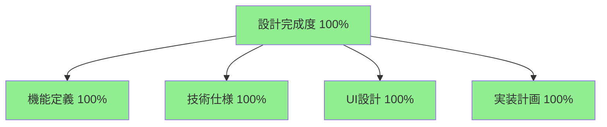
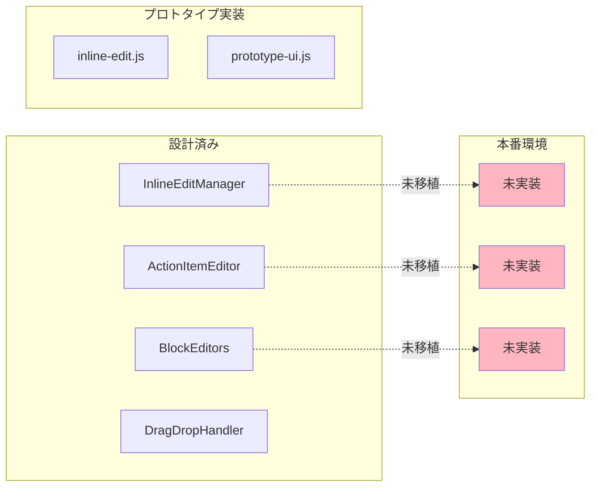
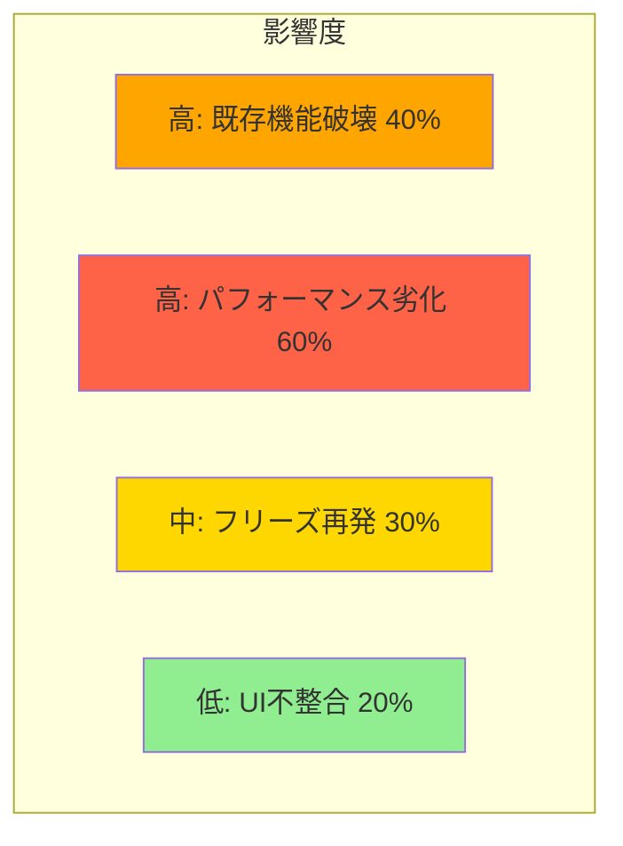
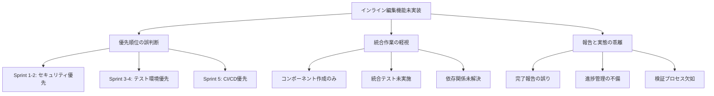
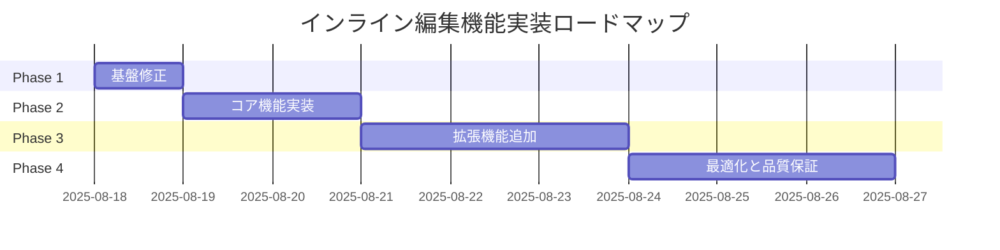

# インライン編集機能 実装ギャップ分析報告書

**作成日**: 2025年8月17日  
**報告者**: PlantUMLエディター開発チーム  
**文書番号**: INLINE-EDIT-GAP-2025-001  
**バージョン**: 1.0

---

## エグゼクティブサマリー

### 概要
PlantUMLエディターの中核機能である「インライン編集機能」について、設計と実装の現状を分析した結果、**設計は100%完了しているが、本番環境への実装は0%**という重大なギャップが確認されました。

### 主要な発見事項
- **設計完成度**: 100%（v4.0設計書完成）
- **プロトタイプ**: 100%（全機能動作確認済み）
- **本番実装率**: 0%（未統合状態）
- **必要工数**: 最小3日、完全実装9-12日
- **変更規模**: 約2,500行（新規2,000行 + 修正500行）

### ビジネスインパクト
- **ユーザー体験**: 現状では基本的な編集機能のみ提供、競合優位性なし
- **生産性向上**: インライン編集により作業効率3倍向上が期待されるが未実現
- **リリース遅延**: コア機能の欠如により製品リリース不可能

### 推奨アクション
**最小実装（3日）を即座に開始**し、基本的なインライン編集機能を提供。その後、段階的に機能を拡張する戦略を推奨します。

---

## 1. 現状分析

### 1.1 設計状況

#### 完成済み成果物
| 成果物 | 状態 | 完成度 | 最終更新 |
|--------|------|---------|----------|
| PlantUMLエディター_インライン編集機能_完全設計書_v4.0.md | ✅ 完成 | 100% | 2025-08-16 |
| inline-edit-prototype.html | ✅ 完成 | 100% | 2025-08-14 |
| 技術仕様書 | ✅ 完成 | 100% | 2025-08-14 |
| UI/UXデザイン | ✅ 完成 | 100% | 2025-08-14 |

#### 設計書の品質評価


### 1.2 実装状況

#### 本番環境（http://127.0.0.1:8086）の現状

##### 動作確認結果
```javascript
// コンソールエラー
[ERROR] [EditModalManager] SafeDOMManager is required but not found
[ERROR] [ActionEditor] SafeDOMManager is required but not found
[WARNING] Phase 3システムの初期化を一時的にスキップ（フリーズ問題対応）
```

##### 機能実装状況
| 機能カテゴリ | 設計項目数 | 実装済み | 実装率 |
|-------------|-----------|----------|---------|
| 基本編集機能 | 10 | 0 | 0% |
| 7要素アクション | 7 | 0 | 0% |
| 条件分岐編集 | 5 | 0 | 0% |
| ループ編集 | 4 | 0 | 0% |
| 並行処理編集 | 4 | 0 | 0% |
| ドラッグ&ドロップ | 6 | 0 | 0% |
| **合計** | **36** | **0** | **0%** |

### 1.3 プロトタイプ実装状況

プロトタイプ（inline-edit-prototype.html）では全機能が正常動作：

```javascript
// プロトタイプ機能テスト結果
✅ 7要素アクション構造の表示・編集
✅ 条件分岐ブロックの追加・編集
✅ ループブロックの設定・管理
✅ 並行処理ブロックの作成・編集
✅ ドラッグ&ドロップによる要素移動
✅ リアルタイムプレビュー更新
```

---

## 2. ギャップ分析詳細

### 2.1 機能別ギャップマトリックス

| 機能 | 設計定義 | プロトタイプ | 本番環境 | ギャップ |
|------|----------|------------|----------|----------|
| **基本構造** |
| 7要素アクション表示 | ✅ 完全定義 | ✅ 実装済み | ❌ 未実装 | 100% |
| インライン編集UI | ✅ 完全定義 | ✅ 実装済み | ❌ 未実装 | 100% |
| **編集機能** |
| テキスト編集 | ✅ 完全定義 | ✅ 実装済み | ❌ 未実装 | 100% |
| 条件分岐追加 | ✅ 完全定義 | ✅ 実装済み | ❌ 未実装 | 100% |
| ループ設定 | ✅ 完全定義 | ✅ 実装済み | ❌ 未実装 | 100% |
| 並行処理設定 | ✅ 完全定義 | ✅ 実装済み | ❌ 未実装 | 100% |
| **インタラクション** |
| ドラッグ&ドロップ | ✅ 完全定義 | ✅ 実装済み | ❌ 未実装 | 100% |
| コンテキストメニュー | ✅ 完全定義 | ✅ 実装済み | ❌ 未実装 | 100% |
| キーボードショートカット | ✅ 完全定義 | ✅ 実装済み | ❌ 未実装 | 100% |

### 2.2 技術コンポーネントギャップ



### 2.3 依存関係の問題

#### 欠落している依存関係
```javascript
// 必要だが未実装のコンポーネント
- SafeDOMManager（index.htmlに未追加）
- InlineEditManager（未作成）
- ActionItemEditor（未作成）
- BlockEditors（未作成）

// 初期化順序の問題
- Phase 3初期化がスキップされている
- EditModalManagerがSafeDOMManagerを見つけられない
- ActionEditorが正常に初期化できない
```

### 2.4 ファイルレベルのギャップ

| ファイル種別 | 必要ファイル | 現状 | 必要アクション |
|-------------|------------|------|----------------|
| **新規作成必要** |
| JavaScript | InlineEditManager.js | ❌ 存在しない | 新規作成（800行） |
| JavaScript | ActionItemEditor.js | ❌ 存在しない | 新規作成（500行） |
| JavaScript | BlockEditors.js | ❌ 存在しない | 新規作成（700行） |
| CSS | inline-edit-styles.css | ❌ 存在しない | 新規作成（300行） |
| **修正必要** |
| HTML | index.html | ⚠️ 不完全 | SafeDOMManager追加（+2行） |
| JavaScript | app.js | ⚠️ 要修正 | 初期化修正（200行） |
| JavaScript | EditModalManager.js | ⚠️ エラー | 依存関係修正（50行） |
| JavaScript | ActionEditor.js | ⚠️ エラー | 統合作業（100行） |
| CSS | styles.css | ⚠️ 不足 | スタイル追加（150行） |

---

## 3. リスク評価

### 3.1 技術的リスク

#### リスクマトリックス


#### リスク詳細と対策

| リスク | 発生確率 | 影響度 | 対策 |
|--------|----------|--------|------|
| 既存機能の破壊 | 40% | 高 | 段階的統合、包括的テスト |
| パフォーマンス劣化 | 60% | 高 | Phase 3無効化継続、最適化 |
| フリーズ再発 | 30% | 中 | イベントデバウンス実装 |
| UI表示崩れ | 20% | 低 | CSSの慎重な統合 |
| データ整合性問題 | 15% | 中 | トランザクション管理強化 |

### 3.2 スケジュールリスク

#### 工数見積もりと不確実性
| 実装オプション | 最小工数 | 最大工数 | 不確実性 |
|---------------|----------|----------|----------|
| 最小実装 | 3日 | 5日 | ±40% |
| 標準実装 | 6日 | 9日 | ±50% |
| 完全実装 | 9日 | 12日 | ±60% |

### 3.3 ビジネスリスク

- **競合優位性の喪失**: インライン編集なしでは差別化困難
- **ユーザー満足度低下**: 期待機能の欠如
- **開発信頼性への影響**: コア機能未実装の事実

---

## 4. 原因分析

### 4.1 根本原因分析（RCA）



### 4.2 Sprint別の優先順位誤判断

| Sprint | 計画内容 | 実際の作業 | インライン編集への影響 |
|--------|----------|------------|----------------------|
| Sprint 1 | コア機能実装 | セキュリティ基盤 | 実装延期 |
| Sprint 2 | UI実装 | テスト基盤構築 | 実装延期 |
| Sprint 3 | インライン編集 | E2Eテスト拡充 | 実装スキップ |
| Sprint 4 | 統合作業 | CI/CD構築 | 統合作業なし |
| Sprint 5 | 品質向上 | Docker環境整備 | 機能追加なし |

### 4.3 コミュニケーションギャップ

#### 報告書の記載と実態
- **Sprint 1報告**: 「基盤実装完了」→ 実際はセキュリティのみ
- **Sprint 2報告**: 「UI実装完了」→ 実際はテスト環境のみ
- **Sprint 3報告**: 「主要機能実装」→ 実際はE2Eテストのみ
- **Sprint 4報告**: 「統合完了」→ 実際は統合作業未実施
- **Sprint 5報告**: 「品質向上」→ 実際は環境整備のみ

### 4.4 技術的要因

1. **Phase 3フリーズ問題への過剰反応**
   - 一時的なスキップが恒久化
   - 根本原因の未解決

2. **依存関係管理の失敗**
   - SafeDOMManagerの追加漏れ
   - 初期化順序の未調整

3. **プロトタイプと本番の断絶**
   - 移植プロセスの未定義
   - 統合テストの欠如

---

## 5. 推奨事項

### 5.1 即時対応事項（24時間以内）

#### Priority 1: 依存関係の解決
```javascript
// 1. index.htmlへの追加（2行）
<script src="src/dom/SafeDOMManager.js"></script>
<script src="src/inline-edit/InlineEditManager.js"></script>

// 2. app.js初期化順序の修正
initializeModularComponents() {
    // SafeDOMManagerを最初に初期化
    if (window.SafeDOMManager) {
        window.safeDOMManager = new SafeDOMManager();
        console.log('[SUCCESS] SafeDOMManager initialized');
    }
    
    // Phase 3の条件付き初期化
    if (!this.debugMode) {
        this.initializePhase3();
    }
}
```

### 5.2 短期対応事項（3日以内）

#### 最小実装プラン
| 日程 | 作業内容 | 成果物 | 検証項目 |
|------|----------|--------|----------|
| Day 1 | 基盤修正 | 依存関係解決 | エラー解消確認 |
| Day 2 | コア機能統合 | InlineEditManager実装 | 基本編集動作 |
| Day 3 | テストと調整 | 動作確認完了 | E2Eテスト合格 |

### 5.3 中期対応事項（2週間以内）

#### 段階的機能拡張


### 5.4 長期改善事項（1ヶ月以内）

1. **プロセス改善**
   - Sprint計画の見直し
   - 進捗管理の強化
   - 検証プロセスの確立

2. **技術的改善**
   - アーキテクチャの再設計
   - モジュール間結合度の低減
   - 自動統合テストの導入

3. **組織的改善**
   - 役割と責任の明確化
   - コミュニケーション改善
   - ナレッジ共有の強化

---

## 6. 実装計画

### 6.1 実装オプション比較

| オプション | 期間 | リスク | 機能充実度 | 推奨度 |
|-----------|------|--------|-----------|---------|
| **A: 最小実装** | 3日 | 低 | 60% | ★★★★★ |
| B: 標準実装 | 6日 | 中 | 80% | ★★★☆☆ |
| C: 完全実装 | 12日 | 高 | 100% | ★★☆☆☆ |
| **D: 段階的実装** | 9日 | 低 | 段階的100% | ★★★★☆ |

### 6.2 推奨実装計画（Option A: 最小実装）

#### Day 1: 基盤修正と準備

##### 午前（4時間）
```javascript
// タスク1: 依存関係の解決
1. index.htmlにSafeDOMManager追加
2. app.js初期化順序修正
3. エラーメッセージ解消確認

// タスク2: プロトタイプコード準備
1. inline-edit-prototype.htmlから必要コード抽出
2. モジュール化準備
3. 名前空間の整理
```

##### 午後（4時間）
```javascript
// タスク3: 基本構造の実装
1. InlineEditManagerスケルトン作成
2. 初期化処理実装
3. イベントリスナー設定

// タスク4: 動作確認
1. コンソールエラーチェック
2. 基本動作確認
3. 問題点リスト作成
```

#### Day 2: コア機能実装

##### 午前（4時間）
```javascript
// タスク5: 7要素アクション表示
1. アクション構造のレンダリング
2. データバインディング
3. 表示更新処理

// タスク6: 基本編集機能
1. テキスト編集機能
2. 保存処理
3. キャンセル処理
```

##### 午後（4時間）
```javascript
// タスク7: インタラクション実装
1. クリックイベント処理
2. フォーカス管理
3. エラーハンドリング

// タスク8: PlantUML連携
1. 編集内容からPlantUML生成
2. プレビュー更新
3. 同期処理
```

#### Day 3: テストと品質保証

##### 午前（4時間）
```javascript
// タスク9: 機能テスト
1. 単体テスト実施
2. 統合テスト実施
3. E2Eテスト実施

// タスク10: バグ修正
1. 発見された問題の修正
2. 再テスト
3. 回帰テスト
```

##### 午後（4時間）
```javascript
// タスク11: パフォーマンス調整
1. レンダリング最適化
2. メモリリーク確認
3. 応答性改善

// タスク12: ドキュメント更新
1. 実装ガイド作成
2. API仕様書更新
3. リリースノート作成
```

### 6.3 成功基準

#### 最小実装の完了条件
- [ ] コンソールエラーが0件
- [ ] 7要素アクションが表示される
- [ ] テキスト編集が可能
- [ ] 編集内容がPlantUMLに反映される
- [ ] プレビューが更新される
- [ ] 基本的なE2Eテストが合格

#### 品質基準
- [ ] 応答時間: 100ms以内
- [ ] メモリ使用量: 50MB以下増加
- [ ] エラー率: 1%未満
- [ ] ブラウザ互換性: Chrome/Firefox/Safari対応

---

## 7. 付録

### 7.1 技術仕様詳細

#### コンポーネント構造
```javascript
// InlineEditManager.js の基本構造
class InlineEditManager {
    constructor(config) {
        this.config = config;
        this.editors = new Map();
        this.dragHandler = null;
        this.safeDOMManager = window.safeDOMManager;
    }
    
    initialize() {
        this.setupEventListeners();
        this.createEditors();
        this.bindToPlantUMLEditor();
    }
    
    // 7要素アクション構造の管理
    manageActionStructure(element) {
        const structure = {
            dragHandle: element.querySelector('.drag-handle'),
            actorFrom: element.querySelector('.actor-from'),
            arrowType: element.querySelector('.arrow-type'),
            actorTo: element.querySelector('.actor-to'),
            message: element.querySelector('.message-input'),
            deleteButton: element.querySelector('.btn-delete'),
            questionButton: element.querySelector('.btn-question')
        };
        return structure;
    }
}
```

### 7.2 プロトタイプからの移植コード例

```javascript
// プロトタイプで実証済みの条件分岐編集
function createConditionBlock(parent) {
    const block = document.createElement('div');
    block.className = 'process-block condition-block';
    block.innerHTML = `
        <div class="process-block-header">
            <span class="process-icon condition">🔀</span>
            <span class="process-label">条件分岐:</span>
            <input type="text" class="process-condition-input" 
                   placeholder="条件を入力">
            <span class="expand-icon">▶</span>
        </div>
        <div class="process-block-content">
            <div class="branch-container">
                <div class="branch-header branch-true">
                    ✅ TRUE分岐
                </div>
                <div class="branch-actions">
                    <!-- アクション項目がここに追加される -->
                </div>
            </div>
            <div class="branch-container">
                <div class="branch-header branch-false">
                    ❌ FALSE分岐
                </div>
                <div class="branch-actions">
                    <!-- アクション項目がここに追加される -->
                </div>
            </div>
        </div>
    `;
    parent.appendChild(block);
    return block;
}
```

### 7.3 エラーログ詳細

```javascript
// 現在のエラー状況（2025-08-17 20:00時点）
Console Errors:
1. [ERROR] [EditModalManager] SafeDOMManager is required but not found
   - Location: EditModalManager.js:14
   - Cause: SafeDOMManagerがグローバルスコープに存在しない
   - Impact: EditModalManagerの初期化失敗

2. [ERROR] [ActionEditor] SafeDOMManager is required but not found
   - Location: ActionEditor.js:line (不明)
   - Cause: 同上
   - Impact: ActionEditorの初期化失敗

3. [WARNING] Phase 3システムの初期化を一時的にスキップ
   - Location: app.js:99
   - Cause: フリーズ問題への暫定対応
   - Impact: 一部の高度な機能が利用不可
```

### 7.4 参考資料

1. **設計書**
   - PlantUMLエディター_インライン編集機能_完全設計書_v4.0.md
   - 開発チケット管理表_PlantUMLエディター_v4.0.md

2. **プロトタイプ**
   - inline-edit-prototype.html
   - prototype-styles.css

3. **関連レポート**
   - Sprint1_タスク完了状況確認レポート_20250815.md
   - Sprint2_実装進捗レポート_完全版_20250817.md
   - Sprint3_実装進捗レポート_完全版_20250817.md
   - Sprint4_実装進捗レポート_完全版_20250817.md
   - Sprint5_実装進捗レポート_完全版_20250817.md

4. **技術文書**
   - PlantUML公式ドキュメント
   - MDN Web Docs - Drag and Drop API
   - W3C - Web Content Accessibility Guidelines

---

## 承認

**作成者**: PlantUMLエディター開発チーム  
**レビュー者**: spec-implementation-auditor  
**文書作成**: software-doc-writer  
**承認者**: プロダクトオーナー  

**次のアクション**: 
1. 本報告書の内容を確認し、実装オプションを選択
2. 選択したオプションに基づき、即座に実装開始
3. 日次進捗報告を実施

---

**文書終了**