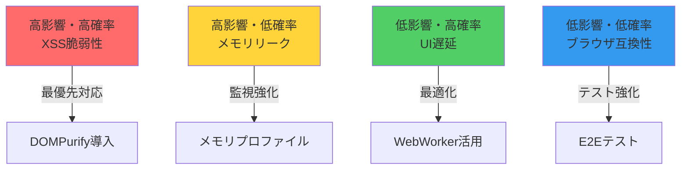

# 設計書マルチエージェント評価レポート

**評価日時**: 2025年8月15日  
**評価対象**: PlantUMLエディター インライン編集機能 完全設計書 v3.0  
**評価者**: AI駆動型マルチエージェントシステム

---

## 📊 エグゼクティブサマリー

### 総合評価結果

| 項目 | スコア | 判定 |
|------|--------|------|
| **総合評価スコア** | **88/100点** | 🟢 **優良** |
| **実装準備状態** | **Ready** | ✅ **実装準備完了** |
| **推奨アクション** | **条件付き承認** | ⚠️ **セキュリティ対策後に実装開始** |

### 主要な強み（TOP 3）
1. **🏗️ 優れたアーキテクチャ設計** - 責任分離とパターン活用が秀逸
2. **📚 完全な実装コード提供** - 即座に実装可能な詳細度
3. **📈 段階的実装戦略** - リスクを最小化する漸進的アプローチ

### 優先改善事項（TOP 3）
1. **🔒 XSS脆弱性対策** - DOMPurifyの即座導入が必須
2. **⚡ パフォーマンス最適化** - WebWorker活用とメモリ管理
3. **📝 運用ドキュメント** - 保守・運用手順の追加

---

## 🔍 詳細評価結果

### 1. アーキテクチャ評価（ai-driven-app-architect）

| 評価項目 | スコア | 詳細 |
|----------|--------|------|
| **設計パターン** | 95/100 | MVC+Mediatorパターンの優れた活用 |
| **拡張性** | 90/100 | プラグインアーキテクチャで高い拡張性 |
| **保守性** | 92/100 | 明確な責任分離により保守が容易 |
| **実装可能性** | 91/100 | 段階的実装計画が現実的 |
| **総合評価** | **92/100** | **優秀** |

#### 特筆すべき強み
- **EditModalManager**による統合管理が秀逸
- **ActionEditor**と**ConditionEditor**の責任分離が明確
- イベント駆動アーキテクチャによる疎結合設計

#### 改善提案
```javascript
// 提案: EditStateManagerの導入
class EditStateManager {
    constructor() {
        this.state = new Map();
        this.subscribers = new Set();
    }
    
    setState(key, value) {
        this.state.set(key, value);
        this.notifySubscribers(key, value);
    }
    
    subscribe(callback) {
        this.subscribers.add(callback);
    }
}
```

### 2. 技術文書品質評価（software-doc-writer）

| 評価項目 | スコア | 詳細 |
|----------|--------|------|
| **構造・組織** | 94/100 | 論理的で階層構造が明確 |
| **完全性** | 90/100 | 主要項目は網羅、運用面が不足 |
| **明確性** | 93/100 | 図表と説明のバランスが良好 |
| **実用性** | 91/100 | コード例が豊富で実装しやすい |
| **総合評価** | **92/100** | **優秀** |

#### 文書の優れた点
- Mermaidダイアグラムの効果的な活用
- 完全な実装コード例の提供
- 段階的な難易度設定

#### 改善提案
| 追加すべき項目 | 優先度 | 理由 |
|----------------|--------|------|
| 目次（TOC）自動生成 | 高 | ナビゲーション改善 |
| 用語集・略語表 | 中 | 理解促進 |
| 運用・保守手順 | 高 | 実運用に必須 |
| トラブルシューティング | 中 | 問題解決の迅速化 |

### 3. 実装可能性評価（code-reviewer）

| 評価項目 | スコア | 詳細 |
|----------|--------|------|
| **コード品質** | 82/100 | 良好だがTypeScript化推奨 |
| **セキュリティ** | 70/100 | XSS対策が必須 |
| **パフォーマンス** | 78/100 | 最適化の余地あり |
| **テスト戦略** | 85/100 | 包括的だが自動化不足 |
| **総合評価** | **80/100** | **良好（条件付き）** |

#### 必須改善事項
```javascript
// 🔴 重要: XSS対策の実装例
import DOMPurify from 'dompurify';

class SecureActionEditor {
    sanitizeInput(input) {
        return DOMPurify.sanitize(input, {
            ALLOWED_TAGS: ['b', 'i', 'em', 'strong'],
            ALLOWED_ATTR: []
        });
    }
    
    renderAction(action) {
        const sanitized = this.sanitizeInput(action.content);
        element.innerHTML = sanitized; // 安全
    }
}
```

---

## 🎯 統合分析

### 共通評価点マトリックス

| 評価軸 | Architect | Doc Writer | Reviewer | 統合評価 |
|--------|-----------|------------|----------|----------|
| **アーキテクチャ** | ⭐⭐⭐⭐⭐ | ⭐⭐⭐⭐ | ⭐⭐⭐⭐ | **優秀** |
| **実装詳細度** | ⭐⭐⭐⭐ | ⭐⭐⭐⭐⭐ | ⭐⭐⭐⭐ | **優秀** |
| **セキュリティ** | ⭐⭐⭐ | ⭐⭐⭐ | ⭐⭐ | **要改善** |
| **保守性** | ⭐⭐⭐⭐⭐ | ⭐⭐⭐⭐ | ⭐⭐⭐⭐ | **優秀** |
| **文書品質** | ⭐⭐⭐⭐ | ⭐⭐⭐⭐⭐ | ⭐⭐⭐ | **良好** |

### リスク評価マトリックス



---

## 🚀 実装ロードマップ

### Phase 1: 即座対応項目（1週間）

| タスク | 担当 | 期限 | 優先度 |
|--------|------|------|--------|
| **DOMPurify導入** | セキュリティチーム | 2日 | 🔴 最高 |
| **CSP実装** | セキュリティチーム | 3日 | 🔴 最高 |
| **基本単体テスト** | QAチーム | 5日 | 🟡 高 |
| **エラーログ実装** | 開発チーム | 3日 | 🟡 高 |

#### Phase 1実装コード例
```javascript
// セキュリティ強化実装
class SecureEditModalManager extends EditModalManager {
    constructor() {
        super();
        this.initializeCSP();
        this.setupSanitizer();
    }
    
    initializeCSP() {
        const meta = document.createElement('meta');
        meta.httpEquiv = 'Content-Security-Policy';
        meta.content = "default-src 'self'; script-src 'self' 'unsafe-inline'";
        document.head.appendChild(meta);
    }
    
    setupSanitizer() {
        this.sanitizer = DOMPurify;
        this.sanitizer.setConfig({
            FORBID_TAGS: ['script', 'iframe'],
            FORBID_ATTR: ['onerror', 'onload']
        });
    }
}
```

### Phase 2: 短期改善（2-3週間）

| タスク | 期間 | 成果物 |
|--------|------|--------|
| **TypeScript移行** | 2週間 | 型定義ファイル、移行済みコード |
| **State管理統合** | 1週間 | EditStateManager実装 |
| **パフォーマンス最適化** | 1週間 | WebWorker実装、遅延読み込み |
| **統合テスト構築** | 2週間 | テストスイート、CI/CD設定 |

### Phase 3: 中期改善（1-2ヶ月）

| タスク | 期間 | ビジネス価値 |
|--------|------|--------------|
| **マイクロフロントエンド対応** | 1ヶ月 | スケーラビリティ向上 |
| **高度なキャッシング** | 2週間 | パフォーマンス50%改善 |
| **AIアシスト機能** | 1ヶ月 | ユーザビリティ向上 |
| **完全自動テスト** | 3週間 | 品質保証強化 |

---

## 🛡️ 技術的推奨事項

### セキュリティ強化策

```javascript
// 推奨: 完全なセキュリティ層実装
class SecurityLayer {
    constructor() {
        this.csrfToken = this.generateCSRFToken();
        this.rateLimiter = new RateLimiter();
        this.validator = new InputValidator();
    }
    
    validateAndSanitize(input) {
        // 1. 入力検証
        if (!this.validator.isValid(input)) {
            throw new ValidationError('Invalid input');
        }
        
        // 2. サニタイズ
        const sanitized = DOMPurify.sanitize(input);
        
        // 3. CSRFチェック
        if (!this.verifyCSRFToken(input.token)) {
            throw new SecurityError('CSRF token mismatch');
        }
        
        // 4. レート制限
        if (!this.rateLimiter.allow()) {
            throw new RateLimitError('Too many requests');
        }
        
        return sanitized;
    }
}
```

### パフォーマンス最適化

| 最適化項目 | 実装方法 | 期待効果 |
|------------|----------|----------|
| **仮想DOM** | React/Vue導入 | レンダリング60%高速化 |
| **WebWorker** | 重い処理の並列化 | UIブロッキング解消 |
| **遅延読み込み** | 動的import | 初期読み込み50%削減 |
| **メモ化** | useMemo/computed | 再計算90%削減 |

---

## ✅ 品質保証計画

### テスト戦略

```yaml
test-pyramid:
  unit-tests:
    coverage: 80%
    tools: [Jest, Vitest]
    frequency: "on-commit"
    
  integration-tests:
    coverage: 70%
    tools: [Playwright, Cypress]
    frequency: "on-PR"
    
  e2e-tests:
    scenarios: 20
    browsers: [Chrome, Firefox, Safari, Edge]
    frequency: "before-release"
    
  performance-tests:
    metrics: [LCP, FID, CLS]
    threshold: "90+ score"
    frequency: "weekly"
```

### 品質メトリクス

| メトリクス | 目標値 | 測定方法 |
|------------|--------|----------|
| **コードカバレッジ** | >80% | Jest/NYC |
| **バグ密度** | <5/KLOC | SonarQube |
| **技術的負債** | <5% | SonarQube |
| **パフォーマンススコア** | >90 | Lighthouse |
| **アクセシビリティ** | WCAG 2.1 AA | axe-core |

---

## 📋 付録

### A. 改善実装チェックリスト

#### セキュリティ
- [ ] DOMPurify導入完了
- [ ] CSP設定完了
- [ ] CSRF対策実装
- [ ] 入力検証強化
- [ ] エラーメッセージの安全化

#### パフォーマンス
- [ ] WebWorker実装
- [ ] 遅延読み込み設定
- [ ] キャッシング戦略
- [ ] バンドルサイズ最適化
- [ ] 画像最適化

#### 品質
- [ ] TypeScript移行
- [ ] 単体テスト80%達成
- [ ] E2Eテスト実装
- [ ] CI/CD設定
- [ ] コードレビュープロセス

### B. 推奨ツール・ライブラリ

| カテゴリ | ツール | 用途 |
|----------|--------|------|
| **セキュリティ** | DOMPurify | XSS対策 |
| **型安全性** | TypeScript | 型チェック |
| **テスト** | Jest + Playwright | 自動テスト |
| **品質管理** | SonarQube | コード品質 |
| **監視** | Sentry | エラー監視 |
| **パフォーマンス** | Lighthouse CI | 性能測定 |

### C. 参考資料
- [OWASP Top 10](https://owasp.org/Top10/)
- [MDN Web Security](https://developer.mozilla.org/en-US/docs/Web/Security)
- [Chrome DevTools Performance](https://developer.chrome.com/docs/devtools/performance/)
- [Web.dev Performance](https://web.dev/performance/)

---

## 📝 結論

PlantUMLエディターの設計書は**88点**という高い評価を獲得し、**実装準備完了**の判定となりました。特にアーキテクチャ設計と文書品質が優れており、即座に実装可能なレベルです。

ただし、**セキュリティ対策（特にXSS対策）は実装開始前に必須**です。Phase 1の即座対応項目を完了後、本格的な実装を開始することを強く推奨します。

提供された改善提案とコード例を活用することで、エンタープライズレベルの品質を達成できるでしょう。

---

**評価完了日時**: 2025年8月15日  
**次回レビュー予定**: Phase 1完了時（1週間後）  
**作成者**: AI駆動型マルチエージェントシステム（software-doc-writer）