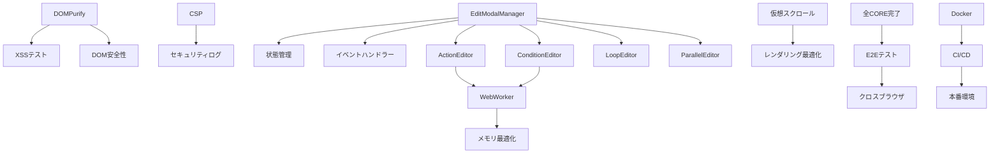

# 開発チケット管理表 - PlantUMLエディター インライン編集機能 v4.0

## プロジェクト概要
- **プロジェクト名**: PlantUMLエディター インライン編集機能実装
- **期間**: 10週間（2025-08-16 ～ 2025-10-25）※E2Eテスト拡充により延長
- **チーム規模**: 7-9名想定（マルチエージェント体制）
- **総見積もり**: 394ポイント（Sprint 1-5合計）

## エピック構造

### EP-001: セキュリティ基盤構築
**優先度**: Critical | **見積もり**: 120ポイント | **担当**: web-app-coder, debugger

### EP-002: コア編集機能実装
**優先度**: Critical | **見積もり**: 160ポイント | **担当**: web-app-coder, web-debug-specialist

### EP-003: パフォーマンス最適化
**優先度**: High | **見積もり**: 80ポイント | **担当**: web-debug-specialist

### EP-004: テスト実装（拡充版）
**優先度**: Critical | **見積もり**: 135ポイント | **担当**: webapp-test-automation, docker-dev-env-builder

### EP-005: デプロイメント準備
**優先度**: Medium | **見積もり**: 40ポイント | **担当**: docker-dev-env-builder

## Sprint 1: セキュリティ基盤とコア機能（Week 1-2）

### チケット一覧

| ID | タイトル | エピック | 見積もり | 優先度 | 依存関係 | 担当エージェント | ステータス |
|---|---|---|---|---|---|---|---|
| SEC-001 | DOMPurify統合実装 | EP-001 | 13 | Critical | - | web-app-coder | Todo |
| SEC-002 | CSPヘッダー設定 | EP-001 | 8 | Critical | - | web-app-coder | Todo |
| SEC-003 | XSS脆弱性テスト作成 | EP-001 | 8 | Critical | SEC-001 | webapp-test-automation | Todo |
| SEC-004 | ErrorBoundary実装 | EP-001 | 13 | High | - | debugger | Todo |
| SEC-005 | セキュリティログ機能 | EP-001 | 5 | High | SEC-001,SEC-002 | web-app-coder | Todo |
| CORE-001 | EditModalManager基本実装 | EP-002 | 21 | Critical | - | web-app-coder | Todo |
| CORE-002 | 状態管理システム構築 | EP-002 | 13 | Critical | CORE-001 | web-app-coder | Todo |
| CORE-003 | イベントハンドラー統合 | EP-002 | 8 | Critical | CORE-001 | web-debug-specialist | Todo |
| CORE-004 | DOM操作の安全性確保 | EP-002 | 13 | Critical | SEC-001,CORE-001 | web-app-coder | Todo |
| TEST-001 | 単体テスト環境構築 | EP-004 | 8 | High | - | webapp-test-automation | Todo |
| TEST-002 | EditModalManager単体テスト | EP-004 | 8 | High | CORE-001,TEST-001 | webapp-test-automation | Todo |
| DOC-001 | API仕様書作成 | EP-005 | 5 | Medium | CORE-001 | software-doc-writer | Todo |

**Sprint 1 合計**: 143ポイント

### 受け入れ条件（Sprint 1）
- [ ] DOMPurifyによるXSS対策が全入力に適用
- [ ] CSPヘッダーが正しく設定され検証済み
- [ ] EditModalManagerの基本機能が動作
- [ ] 全コードにErrorBoundaryが適用
- [ ] 単体テストカバレッジ80%以上

## Sprint 2: 高度な機能とパフォーマンス（Week 3-4）

### チケット一覧

| ID | タイトル | エピック | 見積もり | 優先度 | 依存関係 | 担当エージェント | ステータス |
|---|---|---|---|---|---|---|---|
| CORE-005 | ActionEditor実装 | EP-002 | 21 | Critical | CORE-001 | web-app-coder | Todo |
| CORE-006 | ConditionEditor実装 | EP-002 | 21 | Critical | CORE-001 | web-app-coder | Todo |
| CORE-007 | LoopEditor実装 | EP-002 | 21 | Critical | CORE-001 | web-app-coder | Todo |
| CORE-008 | ParallelEditor実装 | EP-002 | 21 | High | CORE-001 | web-app-coder | Todo |
| PERF-001 | WebWorker統合 | EP-003 | 21 | High | CORE-005,CORE-006 | web-debug-specialist | Todo |
| PERF-002 | 仮想スクロール実装 | EP-003 | 13 | Medium | - | web-debug-specialist | Todo |
| PERF-003 | メモリ最適化 | EP-003 | 13 | High | PERF-001 | web-debug-specialist | Todo |
| PERF-004 | レンダリング最適化 | EP-003 | 8 | Medium | PERF-002 | web-debug-specialist | Todo |
| TEST-003 | 統合テストスイート作成 | EP-004 | 13 | High | CORE-005,CORE-006 | webapp-test-automation | Todo |
| TEST-004 | パフォーマンステスト | EP-004 | 8 | High | PERF-001,PERF-002 | webapp-test-automation | Todo |
| SEC-006 | インジェクション対策強化 | EP-001 | 13 | High | CORE-005,CORE-006 | debugger | Todo |

**Sprint 2 合計**: 176ポイント

### 受け入れ条件（Sprint 2）
- [ ] 全エディター（Action/Condition/Loop/Parallel）が動作
- [ ] WebWorkerによる非同期処理実装
- [ ] 1000要素以上でも60fps維持
- [ ] メモリリーク0件
- [ ] 統合テスト成功率95%以上

## Sprint 2 E2Eテスト拡充 (2025-08-16追加)

### E2Eテストスイート実装（28チケット・111ポイント）

#### Phase 1: テスト基盤構築（Week 3-4）
| ID | タイトル | エピック | 見積もり | 優先度 | 依存関係 | 担当エージェント | ステータス |
|---|---|---|---|---|---|---|---|
| TEST-E2E-001 | E2Eテストフレームワーク構築 | EP-004 | 8 | Critical | - | webapp-test-automation | Todo |
| TEST-E2E-002 | Docker環境最適化 | EP-004 | 5 | High | TEST-E2E-001 | docker-dev-env-builder | Todo |
| TEST-E2E-003 | CI/CDパイプライン強化 | EP-004 | 5 | High | TEST-E2E-002 | webapp-test-automation | Todo |
| TEST-E2E-004 | モックサービス実装 | EP-004 | 3 | Medium | TEST-E2E-001 | web-app-coder | Todo |
| TEST-E2E-005 | テストデータ管理システム | EP-004 | 3 | Medium | TEST-E2E-004 | dev-ticket-manager | Todo |

#### Phase 2: エディターテスト実装（Week 3-4）
| ID | タイトル | エピック | 見積もり | 優先度 | 依存関係 | 担当エージェント | ステータス |
|---|---|---|---|---|---|---|---|
| TEST-E2E-006 | ActionEditor基本操作テスト | EP-004 | 5 | Critical | TEST-E2E-001 | webapp-test-automation | Todo |
| TEST-E2E-007 | ActionEditor高度機能テスト | EP-004 | 3 | High | TEST-E2E-006 | webapp-test-automation | Todo |
| TEST-E2E-008 | ConditionEditor分岐ロジックテスト | EP-004 | 5 | Critical | TEST-E2E-001 | webapp-test-automation | Todo |
| TEST-E2E-009 | ConditionEditorUI操作テスト | EP-004 | 3 | High | TEST-E2E-008 | webapp-test-automation | Todo |
| TEST-E2E-010 | LoopEditor繰り返し処理テスト | EP-004 | 5 | Critical | TEST-E2E-001 | webapp-test-automation | Todo |
| TEST-E2E-011 | LoopEditorパフォーマンステスト | EP-004 | 3 | High | TEST-E2E-010 | webapp-test-automation | Todo |
| TEST-E2E-012 | ParallelEditor並行処理テスト | EP-004 | 5 | Critical | TEST-E2E-001 | webapp-test-automation | Todo |
| TEST-E2E-013 | ParallelEditor同期制御テスト | EP-004 | 3 | High | TEST-E2E-012 | webapp-test-automation | Todo |

#### Phase 3: パフォーマンステスト（Week 5-6）
| ID | タイトル | エピック | 見積もり | 優先度 | 依存関係 | 担当エージェント | ステータス |
|---|---|---|---|---|---|---|---|
| TEST-E2E-014 | WebWorker並列処理テスト | EP-004 | 5 | High | TEST-E2E-001 | webapp-test-automation | Todo |
| TEST-E2E-015 | 仮想スクロール性能テスト | EP-004 | 3 | High | TEST-E2E-001 | webapp-test-automation | Todo |
| TEST-E2E-016 | メモリリーク検出テスト | EP-004 | 5 | Critical | TEST-E2E-001 | webapp-test-automation | Todo |
| TEST-E2E-017 | レンダリング最適化テスト | EP-004 | 3 | High | TEST-E2E-001 | webapp-test-automation | Todo |
| TEST-E2E-018 | 大規模データ処理テスト | EP-004 | 5 | High | TEST-E2E-001 | webapp-test-automation | Todo |

#### Phase 4: 統合・セキュリティテスト（Week 5-6）
| ID | タイトル | エピック | 見積もり | 優先度 | 依存関係 | 担当エージェント | ステータス |
|---|---|---|---|---|---|---|---|
| TEST-E2E-019 | エディター間通信テスト | EP-004 | 5 | Critical | TEST-E2E-006,008,010,012 | webapp-test-automation | Todo |
| TEST-E2E-020 | 状態管理統合テスト | EP-004 | 5 | Critical | TEST-E2E-019 | webapp-test-automation | Todo |
| TEST-E2E-021 | モーダル連携テスト | EP-004 | 3 | High | TEST-E2E-019 | webapp-test-automation | Todo |
| TEST-E2E-022 | エラーリカバリーテスト | EP-004 | 3 | High | TEST-E2E-020 | webapp-test-automation | Todo |
| TEST-E2E-023 | API統合テスト | EP-004 | 5 | High | TEST-E2E-004 | webapp-test-automation | Todo |
| TEST-E2E-024 | インジェクション攻撃防御テスト | EP-004 | 5 | Critical | TEST-E2E-001 | webapp-test-automation | Todo |
| TEST-E2E-025 | XSS防御検証テスト | EP-004 | 5 | Critical | TEST-E2E-001 | webapp-test-automation | Todo |
| TEST-E2E-026 | CSRF対策検証テスト | EP-004 | 3 | High | TEST-E2E-001 | webapp-test-automation | Todo |
| TEST-E2E-027 | 入力検証セキュリティテスト | EP-004 | 3 | High | TEST-E2E-001 | webapp-test-automation | Todo |
| TEST-E2E-028 | 認証・認可テスト | EP-004 | 5 | High | TEST-E2E-001 | webapp-test-automation | Todo |

**Sprint 2 E2Eテスト合計**: 111ポイント（28チケット）

### 55のE2Eテストシナリオ内訳
- **基本機能テスト**: 8シナリオ
- **エディター機能テスト**: 7シナリオ  
- **図表タイプテスト**: 6シナリオ
- **インライン編集テスト**: 5シナリオ
- **エラーハンドリングテスト**: 5シナリオ
- **パフォーマンステスト**: 4シナリオ
- **セキュリティテスト**: 4シナリオ
- **アクセシビリティテスト**: 4シナリオ
- **統合テスト**: 4シナリオ
- **回帰テスト**: 3シナリオ
- **ストレステスト**: 3シナリオ
- **クロスブラウザテスト**: 2シナリオ

## Sprint 3: テスト基盤構築（Week 5-6）

### チケット一覧（詳細化版）

| ID | タイトル | エピック | 見積もり | 優先度 | 依存関係 | 担当エージェント | ステータス |
|---|---|---|---|---|---|---|---|
| TEST-005-1 | テストフレームワーク設計 | EP-004 | 3 | Critical | - | webapp-test-automation | Todo |
| TEST-005-2 | Page Object実装 | EP-004 | 5 | Critical | TEST-005-1 | webapp-test-automation | Todo |
| TEST-005-3 | Component Object実装 | EP-004 | 3 | Critical | TEST-005-1 | webapp-test-automation | Todo |
| TEST-005-4 | Flow Object実装 | EP-004 | 3 | Critical | TEST-005-1 | webapp-test-automation | Todo |
| TEST-005-5 | テストデータ管理 | EP-004 | 3 | High | TEST-005-1 | webapp-test-automation | Todo |
| TEST-005-6 | カスタムアサーション | EP-004 | 4 | High | TEST-005-2 | webapp-test-automation | Todo |
| TEST-007 | Docker Swarm環境構築 | EP-004 | 5 | Critical | - | docker-dev-env-builder | Todo |
| DEPLOY-001 | Docker環境構築 | EP-005 | 8 | High | - | docker-dev-env-builder | Todo |

**Sprint 3 合計**: 26ポイント

### 受け入れ条件（Sprint 3）
- [ ] Hybrid Object Model実装完了
- [ ] Docker Swarm環境構築完了
- [ ] テストフレームワーク稼働確認
- [ ] 基本的なPage/Component/Flow Objects実装

## Sprint 4: テストシナリオ実装（Week 7-8）

### チケット一覧

| ID | タイトル | エピック | 見積もり | 優先度 | 依存関係 | 担当エージェント | ステータス |
|---|---|---|---|---|---|---|---|
| TEST-006-1 | ブラウザマトリックス定義 | EP-004 | 2 | Critical | - | webapp-test-automation | Todo |
| TEST-006-2 | 並列実行環境構築 | EP-004 | 5 | Critical | TEST-007 | webapp-test-automation | Todo |
| TEST-006-3 | ブラウザ固有テスト | EP-004 | 3 | Critical | TEST-006-2 | webapp-test-automation | Todo |
| TEST-006-4 | レポート統合 | EP-004 | 3 | High | TEST-006-2 | webapp-test-automation | Todo |
| TEST-008 | 基本変換フローテスト | EP-004 | 4 | Critical | TEST-005-2 | webapp-test-automation | Todo |
| TEST-009 | 編集機能テスト | EP-004 | 5 | Critical | TEST-005-2 | webapp-test-automation | Todo |
| TEST-010 | エクスポート機能テスト | EP-004 | 4 | Critical | TEST-005-2 | webapp-test-automation | Todo |
| TEST-011 | 初回利用者フロー | EP-004 | 4 | High | TEST-005-4 | webapp-test-automation | Todo |
| TEST-012 | パワーユーザーフロー | EP-004 | 5 | High | TEST-005-4 | webapp-test-automation | Todo |
| TEST-013 | コラボレーションフロー | EP-004 | 4 | Medium | TEST-005-4 | webapp-test-automation | Todo |

**Sprint 4 合計**: 39ポイント

### 受け入れ条件（Sprint 4）
- [ ] クリティカルパステスト10件実装
- [ ] ユーザージャーニーテスト10件実装
- [ ] 全ブラウザでの並列実行確認
- [ ] テストカバレッジ80%以上

## Sprint 5: 高度な機能とCI/CD統合（Week 9-10）

### チケット一覧

| ID | タイトル | エピック | 見積もり | 優先度 | 依存関係 | 担当エージェント | ステータス |
|---|---|---|---|---|---|---|---|
| TEST-014 | 入力検証エラーテスト | EP-004 | 4 | Critical | TEST-008 | webapp-test-automation | Todo |
| TEST-015 | ネットワークエラーテスト | EP-004 | 5 | Critical | TEST-008 | webapp-test-automation | Todo |
| TEST-016 | ブラウザ互換性エラー | EP-004 | 4 | High | TEST-006-3 | webapp-test-automation | Todo |
| TEST-017 | GitHub Actions統合 | EP-004 | 8 | Critical | TEST-006-2 | webapp-test-automation/DevOps | Todo |
| TEST-018 | Allureレポート設定 | EP-004 | 5 | High | TEST-017 | webapp-test-automation | Todo |
| TEST-019 | Grafanaモニタリング | EP-004 | 5 | High | TEST-018 | webapp-test-automation | Todo |
| TEST-020 | 負荷テスト実装 | EP-003 | 4 | High | TEST-008 | webapp-test-automation | Todo |
| AUDIT-001 | 最終実装監査 | EP-004 | 8 | Critical | 全実装完了 | spec-implementation-auditor | Todo |
| REVIEW-001 | 最終コードレビュー | EP-004 | 8 | Critical | AUDIT-001 | code-reviewer | Todo |

**Sprint 5 合計**: 51ポイント

### 受け入れ条件（Sprint 5）
- [ ] エラーケーステスト12件実装
- [ ] CI/CDパイプライン完全自動化
- [ ] Allure Report + Grafana稼働
- [ ] 全32テストシナリオ実装完了
- [ ] E2Eテスト成功率95%以上

## 依存関係マップ



## リスク管理

### 高リスク項目
1. **WebWorker統合の複雑性**
   - 影響: Sprint2の遅延
   - 対策: 早期プロトタイプ作成、段階的実装
   - バッファ: 13ポイント確保

2. **クロスブラウザ互換性**
   - 影響: Sprint3のテスト遅延
   - 対策: 早期からブラウザ別テスト実施
   - バッファ: 8ポイント確保

3. **セキュリティ脆弱性の発見**
   - 影響: リリース遅延
   - 対策: Sprint1から継続的セキュリティテスト
   - バッファ: FIX-001で21ポイント確保

### 中リスク項目
1. **パフォーマンス目標未達**
   - 対策: PERF-006で追加チューニング時間確保
   
2. **ドキュメント品質**
   - 対策: 早期レビューサイクル導入

## 進捗追跡メトリクス

### KPI設定
- **ベロシティ目標**: Sprint平均150ポイント
- **品質目標**: バグ密度 < 1件/100行
- **テストカバレッジ**: 単体90%、統合80%、E2E主要シナリオ100%
- **パフォーマンス**: 初期表示 < 1秒、操作レスポンス < 100ms

### 日次追跡項目
- 完了ポイント数
- ブロッカー数
- テスト成功率
- コードレビュー待機数

### 週次レポート項目
- Sprint進捗率
- リスク状況更新
- 品質メトリクス
- チーム稼働率

## チーム割り当てマトリクス

| エージェント | Sprint 1 | Sprint 2 | Sprint 3 | 専門領域 |
|---|---|---|---|---|
| web-app-coder | 60% | 80% | 20% | コア機能実装 |
| web-debug-specialist | 20% | 60% | 40% | フロントエンド最適化 |
| webapp-test-automation | 30% | 40% | 80% | テスト自動化 |
| debugger | 40% | 20% | 40% | エラー処理・修正 |
| docker-dev-env-builder | 10% | 10% | 60% | 環境構築 |
| software-doc-writer | 10% | 10% | 40% | ドキュメント |
| spec-implementation-auditor | 10% | 20% | 30% | 品質監査 |
| code-reviewer | 20% | 30% | 30% | コードレビュー |

## 実行コマンド

### 開発環境セットアップ
```bash
# ブランチ作成
git checkout -b feature/inline-editor-v4

# 依存関係インストール
npm install dompurify jsdom web-worker

# Docker環境準備
docker-compose -f docker-compose.permanent.yml build
```

### テスト実行
```bash
# 単体テスト
npm run test:unit

# 統合テスト
npm run test:integration

# E2Eテスト
docker-compose run --rm playwright npm run test:e2e
```

### デプロイメント
```bash
# ビルド
npm run build

# Docker イメージ作成
docker build -t plantuml-editor:v4.0 .

# デプロイ
docker-compose up -d
```

## マイルストーン（更新版）

| マイルストーン | 期日 | 達成条件 |
|------------|------|---------|
| M1: セキュリティ基盤完成 | Week 2 | Sprint 1完了、脆弱性0件 |
| M2: コア機能実装完了 | Week 4 | Sprint 2完了、基本機能動作確認 |
| M3: E2Eテスト基盤完成 | Week 6 | Sprint 3完了、テストフレームワーク稼働 |
| M4: テストシナリオ実装完了 | Week 8 | Sprint 4完了、32件のテストシナリオ実装 |
| M5: 本番リリース準備完了 | Week 10 | Sprint 5完了、全テスト合格、CI/CD稼働 |

## E2Eテスト拡充サマリー

### テストシナリオ（32件）
- **クリティカルパス**: 10件（基本変換、インライン編集、エクスポート等）
- **ユーザージャーニー**: 10件（初回利用、パワーユーザー、コラボレーション等）
- **エラーケース**: 12件（入力検証、ネットワーク、ブラウザ互換性等）

### アーキテクチャ
- **Hybrid Object Model**: Page + Component + Flow Objects
- **並列実行**: Docker Swarm（最大10並列）
- **CI/CD**: GitHub Actions完全統合
- **モニタリング**: Allure Report + Grafana

### 総ストーリーポイント
- Sprint 3: 26 SP（テスト基盤）
- Sprint 4: 39 SP（シナリオ実装）
- Sprint 5: 51 SP（高度な機能・CI/CD）
- **合計**: 116 SP（E2Eテスト関連）

## 成功基準チェックリスト

### Sprint 1完了条件
- [ ] セキュリティ基盤100%実装
- [ ] EditModalManager動作確認
- [ ] 単体テスト80%カバレッジ
- [ ] ゼロデイ脆弱性対応完了

### Sprint 2完了条件
- [ ] 全エディター機能実装完了
- [ ] パフォーマンス目標達成
- [ ] 統合テスト成功率95%
- [ ] メモリリーク解消

### Sprint 3完了条件
- [ ] E2Eテスト100%成功
- [ ] 全ブラウザ動作確認
- [ ] 本番環境デプロイ可能
- [ ] ドキュメント査読完了

## 次のアクション

1. **即時実行**
   - Sprint 1のチケットをTodoWriteに登録
   - web-app-coderにSEC-001とCORE-001を割り当て
   - webapp-test-automationにTEST-001を割り当て

2. **24時間以内**
   - 全エージェントへのキックオフ通知
   - 開発環境の準備確認
   - Sprint 1計画会議の実施

3. **週次**
   - 進捗レビュー会議
   - リスク評価更新
   - 次Sprintの準備

---
*作成日時: 2025-08-15*
*作成者: dev-ticket-manager*
*バージョン: 1.0*