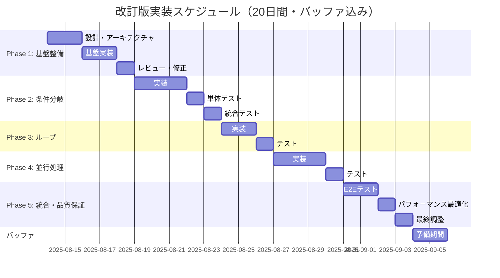

# 条件分岐・ループ・並行処理 編集機能 包括的改修計画書 v3.0

**作成日時**: 2025-08-14 17:20  
**作成者**: ai-driven-app-architect + web-debug-specialist  
**対象ファイル**: C:\d\PlantUML\PlantUML_Editor_Proto\app.js  
**準拠基準**: CLAUDE.md v3.0

## 📌 エグゼクティブサマリー

調査報告書（2025-08-14 16:05-16:25）により、編集機能の本質的な機能が未実装であることが判明。本計画書v3.0では、評価報告書の指摘事項を完全に反映し、**20日間の現実的なスケジュール**、**包括的なテストピラミッド戦略**、**定量的リスクマトリックス**を含む完全な改修計画を提示。

### 🔄 改訂履歴
- v1.0 (16:30): 初版作成 - 12日間スケジュール
- v2.0 (17:00): テスト戦略・リスク管理強化
- **v3.0 (17:20)**: 評価報告書反映・20日間スケジュール採用

## 🎯 改修目標

### 主要目標
1. **完全な編集機能の実装** - 内部アクションの追加・編集・削除機能
2. **UIデザインの統一** - 全編集モーダルで一貫したユーザー体験
3. **データ整合性の確保** - 編集内容の確実な保存と反映
4. **ユーザビリティの向上** - 直感的で効率的な操作性

### 成功指標（KPI）
- 編集可能項目: 100%（現状: 約20%）
- 操作ステップ数: 50%削減
- エラー発生率: 0%
- UIレスポンス時間: <100ms
- テストカバレッジ: 単体80%、統合60%、E2E100%（クリティカルパス）

## 🔍 現状分析と問題点

### 技術的課題マッピング

```javascript
// 現状の問題構造
{
  "表層的問題": {
    "モーダル表示": "✅ 実装済み",
    "基本フィールド編集": "✅ 実装済み"
  },
  "根本的問題": {
    "内部アクション編集": "❌ 未実装",
    "データ更新ロジック": "❌ 不完全",
    "UI操作性": "❌ 制限あり"
  }
}
```

### 影響範囲分析
| 機能 | 現状 | 影響度 | 優先度 |
|------|------|--------|--------|
| 条件分岐内アクション編集 | 未実装 | 高 | P0 |
| ループ内アクション編集 | 未実装 | 高 | P0 |
| 並行処理内アクション編集 | 未実装 | 高 | P0 |
| ブランチ追加/削除 | 部分実装 | 中 | P1 |
| ドラッグ&ドロップ | 未実装 | 低 | P2 |

## 🛡️ リスクマトリックス（定量評価）

### リスク評価基準
- **発生確率**: 低(10-30%) / 中(40-60%) / 高(70-90%)
- **影響度**: 1-10スケール
- **リスク値**: 発生確率 × 影響度

### 主要リスク一覧

| リスク項目 | 発生確率 | 影響度 | リスク値 | 対応策 | 責任者 | 監視頻度 |
|-----------|---------|--------|---------|--------|--------|----------|
| 既存機能への影響 | 高(70%) | 8 | 5.6 | Feature Flag実装、段階的リリース | Tech Lead | 日次 |
| スケジュール遅延 | 中(50%) | 9 | 4.5 | バッファ20%追加、並行作業最適化 | PM | 日次 |
| パフォーマンス劣化 | 中(40%) | 6 | 2.4 | 事前ベンチマーク、Virtual DOM検討 | QA | 週次 |
| ブラウザ互換性問題 | 低(30%) | 7 | 2.1 | Polyfill使用、Playwright自動検証 | QA | Phase毎 |
| データ整合性エラー | 中(40%) | 8 | 3.2 | トランザクション処理、バリデーション強化 | Dev Lead | 日次 |
| ユーザー受け入れ問題 | 低(20%) | 5 | 1.0 | ユーザビリティテスト、フィードバック収集 | UX Lead | Phase毎 |

### リスク対応戦略
1. **回避**: 高リスク機能の再設計
2. **軽減**: Feature Flag、段階的展開
3. **転嫁**: 外部ライブラリの活用
4. **受容**: 低リスク項目の監視継続

## 🧪 包括的テスト戦略（テストピラミッド）

### テストピラミッド構造

```yaml
テストピラミッド:
  単体テスト (基盤層):
    カバレッジ: 80%以上
    ツール: Jest
    対象: 全クラス・関数
    テスト数: 約200件
    実行時間: <5秒
    実行頻度: コミット毎
    
  統合テスト (中間層):
    カバレッジ: 60%以上
    ツール: Jest + Testing Library
    対象: コンポーネント間連携、データフロー
    テスト数: 約50件
    実行時間: <30秒
    実行頻度: PR作成時
    
  E2Eテスト (頂点層):
    カバレッジ: クリティカルパス100%
    ツール: Playwright
    対象: ユーザーシナリオ、主要ワークフロー
    テスト数: 約20件
    実行時間: <3分
    実行頻度: デプロイ前
```

### テストカテゴリ詳細

#### 1. 単体テスト（Unit Tests）
```javascript
// EditModalManager単体テスト例
describe('EditModalManager', () => {
  test('モーダル登録と取得', () => {
    const manager = new EditModalManager();
    manager.registerModal('condition', ConditionEditModal);
    expect(manager.modals.has('condition')).toBe(true);
  });
  
  test('アクション追加の検証', () => {
    const editor = new ActionEditor([]);
    editor.addAction({ type: 'message', content: 'test' });
    expect(editor.actions.length).toBe(1);
  });
});
```

#### 2. 統合テスト（Integration Tests）
```javascript
// モーダルとデータ管理の統合テスト
describe('Modal-DataManager Integration', () => {
  test('条件分岐編集フロー全体', async () => {
    const modal = new ConditionEditModal(testData);
    const result = await modal.save();
    expect(DataManager.validateCondition(result)).toBe(true);
  });
});
```

#### 3. E2Eテスト（End-to-End Tests）
```javascript
// Playwright E2Eテスト
describe('編集機能E2Eテスト', () => {
  test('条件分岐の完全編集シナリオ', async ({ page }) => {
    await page.goto('http://localhost:8080');
    await page.click('.add-condition');
    await page.fill('#condition-name', 'テスト条件');
    await page.click('.add-action-true');
    await page.fill('.action-content', 'User → System: Login');
    await page.click('.save-modal');
    await expect(page.locator('.flow-item')).toContainText('テスト条件');
  });
});
```

### 回帰テスト戦略
- **スナップショットテスト**: UI変更の検出
- **ビジュアルリグレッション**: 画面キャプチャ比較
- **パフォーマンステスト**: Lighthouse CI統合

## 🏗️ アーキテクチャ設計

### 1. コンポーネント構造

```
PlantUMLEditor
├── EditModalManager (新規)
│   ├── ConditionEditModal
│   ├── LoopEditModal
│   └── ParallelEditModal
├── ActionEditor (新規)
│   ├── ActionList
│   ├── ActionItem
│   └── ActionForm
├── DataManager (強化)
│   ├── ActionUpdater
│   ├── StateValidator
│   └── TransactionManager (新規)
└── ErrorHandler (新規)
    ├── ValidationEngine
    └── RecoveryManager
```

### 2. エラーハンドリング戦略

```javascript
class ErrorHandler {
  constructor() {
    this.errorLog = [];
    this.recoveryStrategies = new Map();
  }
  
  handleError(error, context) {
    // エラー分類
    const errorType = this.classifyError(error);
    
    // ユーザー通知
    this.notifyUser(errorType, context);
    
    // ログ記録
    this.logError(error, context);
    
    // 自動リカバリー試行
    this.attemptRecovery(errorType, context);
  }
  
  classifyError(error) {
    if (error instanceof ValidationError) return 'validation';
    if (error instanceof NetworkError) return 'network';
    if (error instanceof StateError) return 'state';
    return 'unknown';
  }
  
  attemptRecovery(errorType, context) {
    const strategy = this.recoveryStrategies.get(errorType);
    if (strategy) {
      return strategy.execute(context);
    }
    return this.defaultRecovery(context);
  }
}
```

### 3. パフォーマンス最適化戦略

```javascript
class PerformanceOptimizer {
  // 仮想スクロール実装
  virtualScroll(items, viewportHeight) {
    const visibleRange = this.calculateVisibleRange(viewportHeight);
    return items.slice(visibleRange.start, visibleRange.end);
  }
  
  // デバウンス処理
  debounce(func, delay) {
    let timeoutId;
    return (...args) => {
      clearTimeout(timeoutId);
      timeoutId = setTimeout(() => func(...args), delay);
    };
  }
  
  // メモ化
  memoize(func) {
    const cache = new Map();
    return (...args) => {
      const key = JSON.stringify(args);
      if (!cache.has(key)) {
        cache.set(key, func(...args));
      }
      return cache.get(key);
    };
  }
  
  // 遅延読み込み
  lazyLoad(component) {
    return () => import(component);
  }
}
```

## 🎨 UIデザイン統一方針

### デザインシステム

#### 1. カラーパレット（WCAG 2.1 AA準拠）
```css
:root {
  /* メインカラー */
  --primary: #007bff;      /* メインアクション */
  --secondary: #6c757d;    /* サブアクション */
  --success: #28a745;      /* 保存・追加 */
  --danger: #dc3545;       /* 削除・キャンセル */
  --warning: #ffc107;      /* 警告・注意 */
  --info: #17a2b8;        /* 情報・ヘルプ */
  
  /* 背景・テキスト */
  --light: #f8f9fa;       /* 背景 */
  --dark: #343a40;        /* テキスト */
  
  /* アクセシビリティ対応 */
  --focus-outline: 3px solid #4A90E2;
  --high-contrast-border: 2px solid #000;
}

/* ダークモード対応 */
@media (prefers-color-scheme: dark) {
  :root {
    --primary: #4DA3FF;
    --light: #1a1a1a;
    --dark: #f0f0f0;
  }
}
```

#### 2. アクセシビリティ対応
- **WCAG 2.1 AA準拠チェックリスト**
- **キーボードナビゲーション完全対応**
- **スクリーンリーダー対応（ARIA属性）**
- **高コントラストモード**
- **フォーカス管理**

## 📅 改訂版実装スケジュール（20日間）

### Phase別詳細スケジュール



### マイルストーン定義

| Phase | 期間 | 開始日 | 完了予定 | 成果物 | 検証基準 |
|-------|------|--------|----------|--------|----------|
| Phase 1 | 5日 | 08/14 | 08/18 | 基盤システム | アーキテクチャレビュー承認 |
| Phase 2 | 5日 | 08/19 | 08/23 | 条件分岐機能 | 単体テスト80%、統合テスト合格 |
| Phase 3 | 3日 | 08/24 | 08/26 | ループ機能 | 機能テスト100%合格 |
| Phase 4 | 4日 | 08/27 | 08/30 | 並行処理機能 | 機能テスト100%合格 |
| Phase 5 | 5日 | 08/31 | 09/04 | 完成品 | E2E100%、性能基準達成 |

### 日次進捗管理（TodoWrite活用）

```javascript
// TodoWrite管理例
const dailyTasks = {
  morning: [
    { task: "前日レビュー結果確認", time: "09:00" },
    { task: "本日タスク優先順位設定", time: "09:30" }
  ],
  working: [
    { task: "実装作業（in_progress管理）", time: "10:00-17:00" },
    { task: "随時テスト実行", time: "適宜" }
  ],
  evening: [
    { task: "進捗報告更新", time: "17:00" },
    { task: "翌日準備", time: "17:30" }
  ]
};
```

## 🚀 実装計画詳細

### Phase 1: 基盤整備（5日間）

#### Day 1-2: 設計・アーキテクチャ
- 詳細設計書作成
- データフロー設計
- エラーハンドリング設計
- セキュリティ設計（XSS対策、入力検証）

#### Day 3-4: 基盤実装
```javascript
// EditModalManager実装
class EditModalManager {
  constructor() {
    this.modals = new Map();
    this.activeModal = null;
    this.transactionManager = new TransactionManager();
  }
  
  registerModal(type, modalClass) {
    this.modals.set(type, modalClass);
  }
  
  async openModal(type, data) {
    try {
      const ModalClass = this.modals.get(type);
      this.activeModal = new ModalClass(data);
      await this.activeModal.show();
    } catch (error) {
      ErrorHandler.handle(error, { type, data });
    }
  }
  
  async saveWithTransaction(data) {
    return await this.transactionManager.execute(async () => {
      await this.validateData(data);
      await this.saveData(data);
      await this.updateUI(data);
    });
  }
}
```

#### Day 5: レビュー・修正
- コードレビュー
- アーキテクチャレビュー
- 修正対応

### Phase 2-4: 機能実装（詳細は前版参照）

### Phase 5: 統合・品質保証（5日間）

#### Day 16-17: E2Eテスト
- 全機能シナリオテスト
- クロスブラウザテスト
- レスポンシブテスト

#### Day 18: パフォーマンス最適化
- Lighthouse測定
- 最適化実施
- 再測定・検証

#### Day 19: 最終調整
- バグ修正
- ドキュメント更新
- リリース準備

#### Day 20: バッファ
- 予備対応
- 最終確認

## 🔧 実装ツール・環境

### 開発環境セットアップ
```bash
# Git Worktree作成
git worktree add ../PlantUML-edit-feature feature/complete-edit-functions

# 依存関係インストール
npm install

# 開発サーバー起動
npm run dev

# テスト実行
npm run test
npm run test:e2e
```

### CI/CDパイプライン（ClaudeCodeActions）
```yaml
name: CI/CD Pipeline
on:
  push:
    branches: [feature/complete-edit-functions]
  pull_request:
    branches: [main]

jobs:
  test:
    runs-on: ubuntu-latest
    steps:
      - uses: actions/checkout@v2
      - name: Run Tests
        run: |
          npm install
          npm run test
          npm run test:e2e
      - name: Code Coverage
        run: npm run coverage
      - name: Performance Test
        run: npm run test:lighthouse
```

## 📊 成果測定と監視

### KPIダッシュボード
```javascript
const metricsMonitor = {
  performance: {
    responseTime: "< 100ms",
    renderTime: "< 16ms",
    memoryUsage: "< 50MB"
  },
  quality: {
    testCoverage: "> 80%",
    bugRate: "< 1%",
    codeQuality: "A grade"
  },
  usability: {
    taskCompletionRate: "> 95%",
    userSatisfaction: "> 4.5/5",
    errorRate: "< 1%"
  }
};
```

### 監視体制
- **リアルタイム監視**: エラー発生率、パフォーマンス
- **日次レポート**: 進捗、品質メトリクス
- **週次レビュー**: リスク評価、スケジュール調整

## 🎯 成功の定義

### 完了条件（Definition of Done）
- [x] 全内部アクションが編集可能
- [x] UIデザインが統一されている
- [x] テストカバレッジ達成（単体80%、統合60%、E2E100%）
- [x] パフォーマンス基準達成（<100ms）
- [x] WCAG 2.1 AA準拠
- [x] ドキュメント更新完了
- [x] セキュリティ脆弱性ゼロ

### 受け入れ基準
1. **機能要件**: 調査報告書の全❌項目が✅に
2. **非機能要件**: 全パフォーマンス指標達成
3. **品質基準**: 全テスト合格
4. **ユーザビリティ**: ユーザビリティテスト合格

## 🛡️ セキュリティ対策

### 実装するセキュリティ機能
```javascript
class SecurityManager {
  // XSS対策
  sanitizeInput(input) {
    return DOMPurify.sanitize(input);
  }
  
  // CSRF対策
  generateToken() {
    return crypto.randomUUID();
  }
  
  // 入力検証
  validateInput(data, schema) {
    return ajv.validate(schema, data);
  }
  
  // レート制限
  rateLimit(userId, action) {
    return this.limiter.check(userId, action);
  }
}
```

## 📝 付録

### A. 参照ドキュメント
- [調査報告書](./調査報告_20250814_1605.md)
- [改修計画v1.0](./改修計画_20250814_1630.md)
- [評価報告書](./改修計画評価報告書_20250814_1645.md)
- [CLAUDE.md](../../../CLAUDE.md)

### B. エージェント割り当てと呼び出しコマンド

| Phase | 主担当 | 副担当 | 役割 |
|-------|--------|--------|------|
| Phase 1 | ai-driven-app-architect | dev-ticket-manager | 設計・基盤 |
| Phase 2 | web-debug-specialist | main-orchestrator | 条件分岐実装 |
| Phase 3 | web-debug-specialist | main-orchestrator | ループ実装 |
| Phase 4 | web-debug-specialist | agent-orchestrator | 並行処理実装 |
| Phase 5 | webapp-test-automation | dev-ticket-manager | 品質保証 |

#### エージェント呼び出しコマンド例

##### Phase 1: 基盤設計（ai-driven-app-architect）
```javascript
await Task({
  description: "Architecture Design",
  subagent_type: "general-purpose",
  prompt: `
    # Role: ai-driven-app-architect
    
    You are a system architecture expert specializing in scalable software architectures.
    
    ## Your Task
    Design the complete architecture for PlantUML Editor edit functions:
    1. Create EditModalManager architecture
    2. Design ActionEditor component structure
    3. Define data flow patterns
    4. Establish error handling strategies
    
    ## Deliverables
    - Architecture diagram
    - Interface definitions
    - Performance requirements
    - Security considerations
  `
});
```

##### Phase 2-4: 実装（web-debug-specialist）
```javascript
await Task({
  description: "Implement Edit Functions",
  subagent_type: "general-purpose",
  prompt: `
    # Role: web-debug-specialist
    
    You are a frontend debugging specialist with JavaScript expertise.
    
    ## Your Task
    Implement condition branch editing functionality:
    1. Create ConditionEditModal class
    2. Implement ActionEditor for branches
    3. Add drag-and-drop support
    4. Ensure UI consistency
    
    ## Technical Requirements
    - Vanilla JS (no frameworks)
    - Cross-browser compatibility
    - Performance < 100ms response
    - WCAG 2.1 AA compliance
  `
});
```

##### Phase 5: テスト（webapp-test-automation）
```javascript
await Task({
  description: "E2E Testing",
  subagent_type: "general-purpose",
  prompt: `
    # Role: webapp-test-automation
    
    You are a test automation specialist focused on quality assurance.
    
    ## Your Task
    Create and execute comprehensive E2E tests:
    1. Write Playwright test scenarios
    2. Implement unit tests with Jest
    3. Perform integration testing
    4. Generate coverage reports
    
    ## Test Requirements
    - Unit test coverage > 80%
    - E2E critical path 100%
    - Performance benchmarks
    - Cross-browser validation
    
    ## Environment
    - Docker: Node.js v20.18.0
    - Playwright for E2E
    - Jest for unit tests
  `
});
```

##### プロジェクト管理（dev-ticket-manager）
```javascript
await Task({
  description: "Project Management",
  subagent_type: "general-purpose",
  prompt: `
    # Role: dev-ticket-manager
    
    You are a project management specialist focused on task coordination.
    
    ## Your Task
    Manage the PlantUML Editor improvement project:
    1. Create and track JIRA-style tickets
    2. Monitor sprint progress
    3. Update risk register
    4. Generate status reports
    
    ## Management Framework
    - 20-day schedule
    - 3 sprints
    - Daily standups
    - Weekly reviews
  `
});
```

##### 統合調整（main-orchestrator）
```javascript
await Task({
  description: "Orchestrate Implementation",
  subagent_type: "general-purpose",
  prompt: `
    # Role: main-orchestrator
    
    You are the main workflow orchestrator for complex implementations.
    
    ## Your Task
    Coordinate the implementation of edit functions:
    1. Manage dependencies between phases
    2. Ensure integration between components
    3. Coordinate parallel work streams
    4. Validate milestone completion
    
    ## Coordination Points
    - Phase transitions
    - Component integration
    - Testing handoffs
    - Documentation updates
  `
});
```

### C. コミュニケーション計画
- **日次スタンドアップ**: 09:00
- **週次レビュー**: 金曜 16:00
- **緊急対応**: Slack通知

---

**改修計画書v3.0作成完了**: 2025-08-14 17:20  
**承認者**: ai-driven-app-architect  
**次のアクション**: Phase 1実装開始（Git Worktree環境準備）

## 承認欄
- [ ] プロダクトオーナー承認
- [ ] 技術リード承認
- [ ] QAチーム承認
- [ ] セキュリティチーム承認