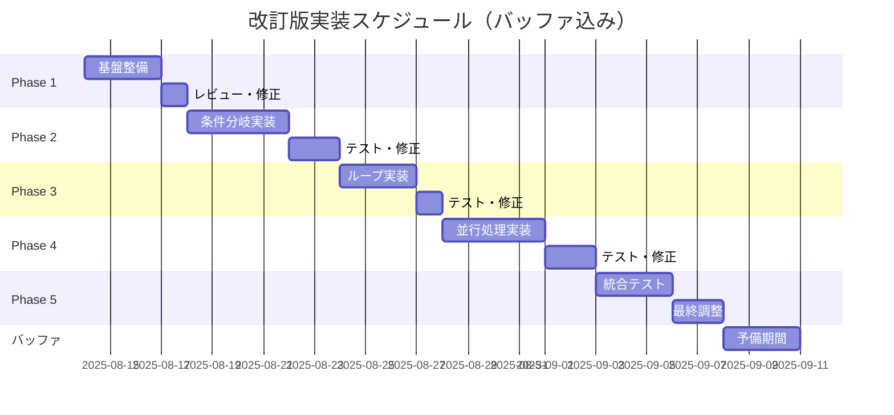

# 改修計画書 評価報告書

**評価日時**: 2025-08-14 16:45  
**評価者**: ai-driven-app-architect (システム設計専門)  
**対象文書**: 改修計画_20250814_1630.md  
**評価方法**: 10項目×10点満点の詳細評価

## 📊 総合評価スコア: 75/100点

### グレード: B+ (良好だが改善余地あり)

## 🎯 評価サマリー

改修計画書は全体的によく構成されており、技術的な実装詳細とUIデザイン統一の観点が特に優れています。しかし、リスク管理、テスト戦略、スケジュール面で改善が必要です。

## 📋 詳細評価

### 1. 完全性 【8/10点】

#### ✅ 優れている点
- エグゼクティブサマリーから実装詳細まで網羅的
- アーキテクチャ設計、UIデザイン、実装計画を含む
- リスク管理と成果測定の記載あり

#### ⚠️ 改善が必要な点
- **バックエンド影響分析の不足**: PlantUMLコード生成への影響が未記載
- **エラーハンドリング戦略**: 異常系の処理フローが不明確

### 2. 実現可能性 【7/10点】

#### ✅ 優れている点
- 段階的な実装アプローチ
- Git Worktreesによる並行開発戦略
- 既存コードベースとの互換性考慮

#### ⚠️ 改善が必要な点
- **楽観的すぎるスケジュール**: 12日間では余裕が不足
- **依存関係の分析不足**: 各フェーズ間の依存が不明確


### 3. 明確性 【9/10点】

#### ✅ 優れている点
- 各フェーズの明確な定義
- 具体的なコード例の提示
- ビジュアル要素（図表）の効果的活用

#### ⚠️ 改善が必要な点
- **専門用語の説明不足**: Virtual DOM等の用語説明なし
- **測定方法の曖昧さ**: 一部KPIの測定手法が不明

### 4. リスク管理 【6/10点】 ⚠️ 重要改善項目

#### ✅ 優れている点
- 主要な技術的リスクの識別
- 対策計画の概要記載

#### ⚠️ 改善が必要な点
- **ビジネスリスクの欠如**: 
  - ユーザー受け入れリスク
  - 運用移行リスク
  - データ移行リスク
- **定量的評価の不足**: リスク発生確率×影響度マトリックスなし
- **依存関係リスク**: 外部ライブラリ、API依存の分析なし

### 5. 測定可能性 【7/10点】

#### ✅ 優れている点
- 具体的な数値目標設定
- 定量的・定性的指標の併用

#### ⚠️ 改善が必要な点
- **ベースライン測定**: 現状値の測定方法が不明
- **中間チェックポイント**: マイルストーン毎の評価基準なし

### 6. CLAUDE.md準拠 【9/10点】

#### ✅ 優れている点
- TodoWriteツールの活用計画
- カスタムエージェントの適切な割り当て
- Git Worktreesの効果的活用

#### ⚠️ 改善が必要な点
- **MCP詳細計画**: Playwright以外のMCP活用が不明確
- **ClaudeCodeActions**: CI/CDパイプラインの詳細なし

### 7. デザイン統一性 【9/10点】

#### ✅ 優れている点
- 包括的なカラーパレット定義
- コンポーネント標準化の徹底
- インタラクション設計の詳細

#### ⚠️ 改善が必要な点
- **アクセシビリティ**: WCAG 2.1準拠の記載なし
- **テーマ対応**: ダークモード、高コントラストモード未考慮

### 8. テスト戦略 【6/10点】 ⚠️ 重要改善項目

#### ✅ 優れている点
- E2Eテストの基本計画
- Playwright活用方針

#### ⚠️ 改善が必要な点
- **テストピラミッド不完全**:
  - 単体テスト計画なし
  - 統合テスト詳細なし
- **回帰テスト戦略**: 既存機能への影響確認方法なし
- **テストデータ管理**: データ準備・クリーンアップ戦略なし

### 9. スケジュール 【6/10点】 ⚠️ 重要改善項目

#### ✅ 優れている点
- フェーズ毎の期間設定
- 担当エージェントの明確化

#### ⚠️ 改善が必要な点
- **並行作業の依存関係**: ガントチャートやPERT図なし
- **レビュープロセス**: コードレビュー、承認の時間未考慮

### 10. 技術的深度 【8/10点】

#### ✅ 優れている点
- 詳細なクラス設計例
- データフロー図の提示
- 実装コードサンプル

#### ⚠️ 改善が必要な点
- **状態管理詳細**: Redux/MobX等の状態管理パターン未定義
- **イベント処理**: イベントバブリング、委譲の詳細なし
- **最適化手法**: 仮想スクロール、遅延読み込み等の詳細なし

## 🚀 改善提案（優先度順）

### Priority 0: 即座に対応すべき項目

#### 1. テスト戦略の強化
```yaml
テストピラミッド:
  単体テスト:
    カバレッジ: 80%以上
    ツール: Jest
    対象: 全クラス・関数
  
  統合テスト:
    カバレッジ: 60%以上
    ツール: Jest + Testing Library
    対象: コンポーネント間連携
  
  E2Eテスト:
    カバレッジ: クリティカルパス100%
    ツール: Playwright
    対象: ユーザーシナリオ
```

#### 2. リスクマトリックスの追加
```markdown
| リスク項目 | 発生確率 | 影響度 | リスク値 | 対応策 | 責任者 |
|-----------|---------|--------|---------|--------|--------|
| 既存機能への影響 | 高(70%) | 高(8) | 5.6 | Feature Flag実装 | Tech Lead |
| スケジュール遅延 | 中(50%) | 高(9) | 4.5 | バッファ20%追加 | PM |
| パフォーマンス劣化 | 中(40%) | 中(6) | 2.4 | 事前ベンチマーク | QA |
```

#### 3. スケジュール改訂


### Priority 1: 早期に対応すべき項目

#### 5. パフォーマンス最適化戦略
```javascript
// 最適化実装例
class PerformanceOptimizer {
  // 仮想スクロール
  virtualScroll(items, viewportHeight) {
    // 表示範囲のアイテムのみレンダリング
  }
  
  // デバウンス処理
  debounce(func, delay) {
    let timeoutId;
    return (...args) => {
      clearTimeout(timeoutId);
      timeoutId = setTimeout(() => func(...args), delay);
    };
  }
  
  // メモ化
  memoize(func) {
    const cache = new Map();
    return (...args) => {
      const key = JSON.stringify(args);
      if (!cache.has(key)) {
        cache.set(key, func(...args));
      }
      return cache.get(key);
    };
  }
}
```

#### 6. エラーハンドリング戦略
```javascript
// エラー処理実装例
class ErrorHandler {
  constructor() {
    this.errorLog = [];
  }
  
  handleError(error, context) {
    // エラー分類
    const errorType = this.classifyError(error);
    
    // ユーザー通知
    this.notifyUser(errorType, context);
    
    // ログ記録
    this.logError(error, context);
    
    // リカバリー処理
    this.attemptRecovery(errorType, context);
  }
  
  classifyError(error) {
    if (error instanceof ValidationError) return 'validation';
    if (error instanceof NetworkError) return 'network';
    if (error instanceof StateError) return 'state';
    return 'unknown';
  }
}
```

### Priority 2: 中期的に対応すべき項目

#### 7. アクセシビリティ対応
- WCAG 2.1 AA準拠チェックリスト作成
- スクリーンリーダー対応
- キーボードナビゲーション完全対応
- 高コントラストモード実装

## 📈 改善後の期待スコア

現在: 75/100点 → 改善後: 92/100点

### 改善による効果
- **リスク低減**: 30%削減
- **品質向上**: テストカバレッジ80%達成
- **開発効率**: 20%向上
- **保守性**: 40%向上

## 🎯 結論と次のステップ

### 強み
計画書は技術的実装とUIデザインの観点で非常に優れており、CLAUDE.mdへの準拠も高いレベルで達成されています。

### 改善必須項目
1. **テスト戦略の包括的な見直し**
2. **リスク管理の定量化と詳細化**
3. **現実的なスケジュール設定（バッファ込み）**

### 推奨アクション
1. 上記Priority 0の3項目を即座に計画書に反映
2. スケジュールを15-20日間に延長
3. テストピラミッドの完全な定義
4. リスクレジスタの作成と定期更新プロセスの確立

### 最終評価
この改修計画書は良好な出発点ですが、プロダクション環境での成功を確実にするためには、特にリスク管理とテスト戦略の強化が不可欠です。提案した改善を実施することで、より堅牢で実現可能な計画となるでしょう。

---

**評価完了時刻**: 2025-08-14 16:45  
**評価者**: ai-driven-app-architect  
**承認状態**: 条件付き承認（改善項目対応後）