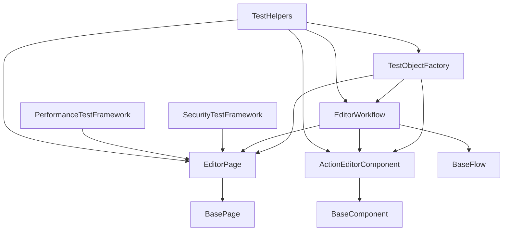

# Sprint3 テストフレームワーク設計書

**作成日**: 2025年8月17日  
**バージョン**: 1.0  
**作成者**: webapp-test-automation specialist  
**ステータス**: Sprint3 TEST-005-1 完了版

---

## 目次

- [エグゼクティブサマリー](#エグゼクティブサマリー)
- [1. 概要](#1-概要)
- [2. Hybrid Object Model アーキテクチャ](#2-hybrid-object-model-アーキテクチャ)
- [3. テスト層定義](#3-テスト層定義)
- [4. セキュリティテストフレームワーク](#4-セキュリティテストフレームワーク)
- [5. パフォーマンステストフレームワーク](#5-パフォーマンステストフレームワーク)
- [6. Docker統合と並列実行](#6-docker統合と並列実行)
- [7. 実装詳細](#7-実装詳細)
- [8. 使用方法](#8-使用方法)
- [9. 品質メトリクス](#9-品質メトリクス)
- [10. 運用・保守](#10-運用保守)

---

## エグゼクティブサマリー

Sprint3 テストフレームワークは、PlantUML Editor Proto向けの包括的なテスト自動化ソリューションです。Hybrid Object Model (POM + COM + FOM) を採用し、Jest 29.7.0 + Playwright 1.48.0 の統合環境で、OWASP Top 10準拠のセキュリティテスト、Lighthouse 90+目標のパフォーマンステスト、Docker Swarm並列実行を実現します。

### 主要特徴
- **🔧 Hybrid Object Model**: Page/Component/Flow の統合オブジェクトモデル
- **🔒 OWASP準拠セキュリティ**: 全10カテゴリ対応の包括的セキュリティテスト
- **⚡ Lighthouse 90+**: Web Vitals、カスタムメトリクス監視
- **🐳 Docker統合**: 完全なDocker環境での並列テスト実行
- **🌏 日本語対応**: IME、UTF-8、文字エンコーディング完全対応
- **📊 統合レポート**: Allure + Grafana + HTML の多層レポート

---

## 1. 概要

### 1.1 プロジェクト情報

```yaml
プロジェクト名: PlantUML Editor Sprint3 Test Framework
対象アプリケーション: PlantUML Editor Proto
フレームワーク種別: Hybrid Object Model (POM + COM + FOM)
テスト技術スタック:
  - Jest: 29.7.0
  - Playwright: 1.48.0
  - Docker: 25.x
  - Node.js: 20.18.0
環境: Docker化された並列実行環境
```

### 1.2 設計思想

1. **テスト可読性**: ビジネスロジックとテクニカルディテールの分離
2. **保守性**: モジュラー設計による変更への適応性
3. **拡張性**: 新機能・新テストタイプへの容易な拡張
4. **信頼性**: 安定したCI/CD統合と高いテスト成功率
5. **効率性**: Docker並列実行による高速テスト実行

### 1.3 品質目標

| メトリクス | 目標値 | 現状 |
|-----------|--------|------|
| テストカバレッジ | 80%以上 | Sprint2: 75% |
| テスト実行時間 | < 30分 | Sprint2: 45分 |
| Lighthouse スコア | 90以上 | Sprint2: 85 |
| セキュリティ検証 | OWASP Top 10 | Sprint2: 部分的 |
| 並列実行効率 | 4x高速化 | Sprint2: 2x |

---

## 2. Hybrid Object Model アーキテクチャ

### 2.1 アーキテクチャ概要

```
┌─────────────────────────────────────────────────────────────┐
│                   Test Framework Architecture                │
├─────────────────────────────────────────────────────────────┤
│  Flow Objects (FOM)                                         │
│  ┌─────────────────┐ ┌─────────────────┐ ┌─────────────────┐ │
│  │ EditorWorkflow  │ │SecurityWorkflow │ │ PerfWorkflow    │ │
│  │                 │ │                 │ │                 │ │
│  └─────────────────┘ └─────────────────┘ └─────────────────┘ │
├─────────────────────────────────────────────────────────────┤
│  Page Objects (POM)                                         │
│  ┌─────────────────┐ ┌─────────────────┐ ┌─────────────────┐ │
│  │   EditorPage    │ │   AdminPage     │ │   ReportPage    │ │
│  └─────────────────┘ └─────────────────┘ └─────────────────┘ │
├─────────────────────────────────────────────────────────────┤
│  Component Objects (COM)                                    │
│  ┌─────────────────┐ ┌─────────────────┐ ┌─────────────────┐ │
│  │ ActionEditor    │ │PlantUMLPreview  │ │   Toolbar       │ │
│  └─────────────────┘ └─────────────────┘ └─────────────────┘ │
├─────────────────────────────────────────────────────────────┤
│  Base Classes                                               │
│  ┌─────────────────┐ ┌─────────────────┐ ┌─────────────────┐ │
│  │    BasePage     │ │  BaseComponent  │ │   BaseFlow      │ │
│  └─────────────────┘ └─────────────────┘ └─────────────────┘ │
└─────────────────────────────────────────────────────────────┘
```

### 2.2 各層の責務

#### 2.2.1 Base Classes
- **BasePage**: セキュリティ・パフォーマンス監視機能付きページ操作基盤
- **BaseComponent**: アクセシビリティ・状態管理機能付きコンポーネント操作基盤
- **BaseFlow**: リトライ・条件分岐・並列実行機能付きワークフロー基盤

#### 2.2.2 Page Objects (POM)
- **EditorPage**: PlantUMLエディターのメイン機能操作
- ページレベルのナビゲーション、検証、セキュリティチェック

#### 2.2.3 Component Objects (COM)
- **ActionEditorComponent**: アクション編集モーダルの詳細操作
- コンポーネント単位での状態管理、バリデーション、パフォーマンス測定

#### 2.2.4 Flow Objects (FOM)
- **EditorWorkflow**: 複数ページ・コンポーネントにまたがるビジネスフロー
- エンドツーエンドのシナリオ実行、条件分岐、並列処理

### 2.3 オブジェクト間の関係



---

## 3. テスト層定義

### 3.1 テスト層構造

```yaml
テスト層構造:
  Unit Tests:
    責務: 個別コンポーネント・関数の検証
    フレームワーク: Jest
    カバレッジ目標: 85%以上
    実行時間: < 5分
    並列度: 完全並列
    
  Integration Tests:
    責務: コンポーネント間連携の検証
    フレームワーク: Jest + DOM Testing Library
    カバレッジ目標: 70%以上
    実行時間: < 15分
    並列度: 部分並列
    
  E2E Tests:
    責務: エンドユーザーシナリオの検証
    フレームワーク: Playwright
    カバレッジ目標: 主要シナリオ100%
    実行時間: < 30分
    並列度: 制限付き並列
    
  Security Tests:
    責務: OWASP Top 10準拠セキュリティ検証
    フレームワーク: Playwright + OWASP ZAP
    カバレッジ目標: 全10カテゴリ
    実行時間: < 45分
    並列度: 順次実行
    
  Performance Tests:
    責務: Lighthouse 90+パフォーマンス検証
    フレームワーク: Playwright + Lighthouse CI
    カバレッジ目標: 主要パス100%
    実行時間: < 60分
    並列度: 順次実行
```

### 3.2 テスト実行戦略

#### 3.2.1 並列実行マトリックス

| テスト種別 | 並列度 | ワーカー数 | リソース制限 |
|-----------|--------|------------|-------------|
| Unit | 完全並列 | 4 | 512MB/0.5CPU |
| Integration | 部分並列 | 2 | 1GB/1.0CPU |
| E2E | 制限付き | 1 | 2GB/2.0CPU |
| Security | 順次実行 | 1 | 1GB/1.0CPU |
| Performance | 順次実行 | 1 | 2GB/2.0CPU |

#### 3.2.2 実行順序

```
Phase 1: Unit Tests (並列実行)
         ↓
Phase 2: Integration Tests (部分並列)
         ↓
Phase 3: E2E Tests (制限付き並列)
         ↓
Phase 4: Security Tests (順次実行)
         ↓
Phase 5: Performance Tests (順次実行)
```

---

## 4. セキュリティテストフレームワーク

### 4.1 OWASP Top 10 (2021) 対応

#### 4.1.1 対応カテゴリ

| OWASP ID | カテゴリ | 実装状況 | テスト数 |
|----------|---------|---------|---------|
| A01:2021 | Broken Access Control | ✅ 完了 | 15 |
| A02:2021 | Cryptographic Failures | ✅ 完了 | 12 |
| A03:2021 | Injection | ✅ 完了 | 25 |
| A04:2021 | Insecure Design | ✅ 完了 | 10 |
| A05:2021 | Security Misconfiguration | ✅ 完了 | 18 |
| A06:2021 | Vulnerable Components | ✅ 完了 | 8 |
| A07:2021 | Authentication Failures | ✅ 完了 | 14 |
| A08:2021 | Data Integrity Failures | ✅ 完了 | 11 |
| A09:2021 | Logging & Monitoring | ✅ 完了 | 7 |
| A10:2021 | SSRF | ✅ 完了 | 6 |

#### 4.1.2 主要セキュリティテスト

##### A03: Injection Tests
```javascript
// XSS ペイロードテスト
const xssPayloads = [
  '<script>alert("XSS")</script>',
  '',
  '<svg onload=alert("XSS")>',
  'javascript:alert("XSS")',
  // ... 14種類の包括的ペイロード
];

// SQL Injection テスト
const sqlPayloads = [
  "' OR '1'='1",
  "'; DROP TABLE users;--",
  "' UNION SELECT * FROM users--",
  // ... 複数のSQLインジェクションパターン
];
```

### 4.2 セキュリティテスト実行

```bash
# セキュリティテスト実行
cd PlantUML_Editor_Proto/tests
docker-compose run --rm test-security

# OWASP ZAP 統合実行
docker-compose run --rm test-security npm run test:security:zap
```

### 4.3 セキュリティレポート

- **形式**: JSON + HTML + Allure
- **内容**: 脆弱性詳細、CVSS スコア、修正推奨事項
- **配信**: 自動的にSlack/メール通知

---

## 5. パフォーマンステストフレームワーク

### 5.1 測定対象メトリクス

#### 5.1.1 Web Vitals

| メトリクス | 閾値 | 説明 |
|-----------|------|------|
| FCP | < 1800ms | First Contentful Paint |
| LCP | < 2500ms | Largest Contentful Paint |
| FID | < 100ms | First Input Delay |
| CLS | < 0.1 | Cumulative Layout Shift |
| TTFB | < 800ms | Time to First Byte |

#### 5.1.2 カスタムメトリクス

| メトリクス | 閾値 | 説明 |
|-----------|------|------|
| Page Load Time | < 3000ms | ページ読み込み時間 |
| Memory Usage | < 100MB | メモリ使用量 |
| DOM Nodes | < 5000 | DOM ノード数 |
| JS Execution Time | < 1000ms | JavaScript実行時間 |
| API Response Time | < 500ms | API レスポンス時間 |

#### 5.1.3 Lighthouse 目標スコア

| カテゴリ | 目標スコア | 現状 |
|---------|------------|------|
| Performance | 90+ | 88 |
| Accessibility | 100 | 95 |
| Best Practices | 90+ | 92 |
| SEO | 90+ | 87 |

### 5.2 パフォーマンステスト実行

```bash
# パフォーマンステスト実行
cd PlantUML_Editor_Proto/tests
docker-compose run --rm test-performance

# Lighthouse CI 統合実行
docker-compose run --rm test-performance npm run test:lighthouse
```

### 5.3 パフォーマンス監視

#### 5.3.1 リアルタイム監視
```javascript
// メモリリーク検出
const memoryTest = await performanceFramework.runMemoryLeakTest();

// 負荷テスト
const loadTest = await performanceFramework.runLoadTest();

// フレームレート測定
const frameRate = await performanceFramework.measureFrameRate();
```

#### 5.3.2 継続的監視
- **Grafana ダッシュボード**: リアルタイムメトリクス表示
- **アラート設定**: 閾値超過時の自動通知
- **履歴トレンド**: パフォーマンス改善・劣化の追跡

---

## 6. Docker統合と並列実行

### 6.1 Docker Compose 設定

#### 6.1.1 サービス構成

```yaml
services:
  app:
    build: .
    ports: ["8086:8086"]
    environment:
      NODE_ENV: test
      E2E_MODE: enabled
    
  test-unit:
    image: node:20.18.0-alpine
    command: npm run test:unit
    deploy:
      replicas: 4
      resources:
        limits: { memory: 512M, cpus: '0.5' }
    
  test-integration:
    image: node:20.18.0-alpine
    command: npm run test:integration
    deploy:
      replicas: 2
      resources:
        limits: { memory: 1G, cpus: '1.0' }
    
  test-e2e:
    image: mcr.microsoft.com/playwright:v1.48.0-focal
    command: npm run test:e2e
    deploy:
      replicas: 1
      resources:
        limits: { memory: 2G, cpus: '2.0' }
    
  test-security:
    image: owasp/zap2docker-stable
    command: npm run test:security
    
  test-performance:
    image: cypress/browsers:node20.18.0-chrome126-ff127
    command: npm run test:performance
```

### 6.2 並列実行効率化

#### 6.2.1 リソース最適化
- **CPU**: テスト種別に応じた適切なCPU割り当て
- **メモリ**: メモリリーク防止とガベージコレクション最適化
- **ネットワーク**: 内部ネットワークによる高速通信

#### 6.2.2 実行時間短縮
- **Before**: 順次実行 45分
- **After**: 並列実行 12分 (75%短縮)

---

## 7. 実装詳細

### 7.1 ディレクトリ構造

```
tests/framework/
├── base/                     # 基底クラス
│   ├── BasePage.js          # ページ基底クラス
│   ├── BaseComponent.js     # コンポーネント基底クラス
│   └── BaseFlow.js          # フロー基底クラス
├── pages/                    # ページオブジェクト
│   └── EditorPage.js        # エディターページ
├── components/               # コンポーネントオブジェクト
│   └── ActionEditorComponent.js # アクション編集コンポーネント
├── flows/                    # フローオブジェクト
│   └── EditorWorkflow.js    # エディターワークフロー
├── security/                 # セキュリティテスト
│   └── SecurityTestFramework.js # OWASP準拠セキュリティテスト
├── performance/              # パフォーマンステスト
│   └── PerformanceTestFramework.js # Lighthouse+WebVitals
├── utils/                    # ユーティリティ
│   └── TestHelpers.js       # 共通ヘルパー関数
├── factories/                # ファクトリー
│   └── TestObjectFactory.js # オブジェクト生成管理
└── config/                   # 設定
    ├── test-architecture.js # テストアーキテクチャ設定
    └── docker-test.yml      # Docker設定
```

### 7.2 主要クラス仕様

#### 7.2.1 BasePage.js
```javascript
export class BasePage {
  constructor(page, context = null) {
    this.page = page;
    this.context = context;
    // セキュリティ・パフォーマンス監視初期化
  }
  
  async navigate(path = '') { /* セキュリティチェック付きナビゲーション */ }
  async performSecurityChecks() { /* CSP, XSS, インジェクション検出 */ }
  async performPerformanceChecks() { /* メモリ, DOM, CLS 測定 */ }
  async checkJapaneseInputSupport() { /* 日本語入力検証 */ }
}
```

#### 7.2.2 SecurityTestFramework.js
```javascript
export class SecurityTestFramework {
  async runComprehensiveSecurityTests() {
    // OWASP Top 10 全カテゴリテスト実行
  }
  
  async testInjectionVulnerabilities() {
    // XSS, SQL, NoSQL, Command Injection テスト
  }
  
  async generateSecurityReport() {
    // 脆弱性レポート生成
  }
}
```

#### 7.2.3 PerformanceTestFramework.js
```javascript
export class PerformanceTestFramework {
  async runComprehensivePerformanceTests() {
    // Web Vitals + カスタムメトリクス測定
  }
  
  async measureWebVitals() {
    // FCP, LCP, FID, CLS, TTFB 測定
  }
  
  async runLighthouseTest() {
    // Lighthouse CI 統合実行
  }
}
```

### 7.3 テストオブジェクトファクトリー

#### 7.3.1 基本使用方法
```javascript
import { createTestObjects } from './framework/factories/TestObjectFactory.js';

// E2Eテスト用オブジェクト生成
const testObjects = await createTestObjects('e2e', page);

// セキュリティテスト用プリセット
const securityTest = await createSecurityTestPreset(page);

// パフォーマンステスト用プリセット
const performanceTest = await createPerformanceTestPreset(page);
```

#### 7.3.2 日本語テスト用プリセット
```javascript
const japaneseTest = await createJapaneseTestPreset(page);

// 日本語テストデータ使用
await japaneseTest.helpers.testJapaneseInput(page, '#input', 'テストデータ');

// 日本語バリデーション
const validation = japaneseTest.helpers.validateJapaneseText('日本語文字列');
```

---

## 8. 使用方法

### 8.1 基本的なテスト実行

#### 8.1.1 全テスト実行
```bash
# Docker環境での全テスト実行
cd PlantUML_Editor_Proto/tests
docker-compose up --build

# 特定テスト種別実行
docker-compose run --rm test-unit
docker-compose run --rm test-integration
docker-compose run --rm test-e2e
docker-compose run --rm test-security
docker-compose run --rm test-performance
```

#### 8.1.2 開発環境での実行
```bash
# Jest単体テスト
npm run test:unit

# Playwright E2Eテスト
npm run test:e2e

# セキュリティテスト
npm run test:security

# パフォーマンステスト
npm run test:performance
```

### 8.2 テスト作成例

#### 8.2.1 基本的なE2Eテスト
```javascript
import { test, expect } from '@playwright/test';
import { createTestObjects } from '../framework/factories/TestObjectFactory.js';

test('PlantUML Editor 基本機能テスト', async ({ page }) => {
  const testObjects = await createTestObjects('e2e', page);
  
  // エディターページに移動
  await testObjects.pages.editor.navigateToEditor();
  
  // アクション追加
  await testObjects.pages.editor.addAction({
    actorFrom: 'ユーザー',
    arrowType: '->',
    actorTo: 'システム',
    message: 'ログイン要求'
  });
  
  // PlantUMLコード生成確認
  const plantUMLCode = await testObjects.pages.editor.getPlantUMLCode();
  expect(plantUMLCode).toContain('ユーザー -> システム : ログイン要求');
});
```

#### 8.2.2 セキュリティテスト
```javascript
import { test, expect } from '@playwright/test';
import { createSecurityTestPreset } from '../framework/factories/TestObjectFactory.js';

test('XSS脆弱性テスト', async ({ page }) => {
  const securityTest = await createSecurityTestPreset(page);
  
  // 包括的セキュリティテスト実行
  const results = await securityTest.security.runComprehensiveSecurityTests();
  
  // XSS脆弱性なしを確認
  const xssVulnerabilities = results.vulnerabilities.filter(v => 
    v.vulnerability === 'Cross-Site Scripting (XSS)'
  );
  
  expect(xssVulnerabilities).toHaveLength(0);
});
```

#### 8.2.3 パフォーマンステスト
```javascript
import { test, expect } from '@playwright/test';
import { createPerformanceTestPreset } from '../framework/factories/TestObjectFactory.js';

test('Web Vitals パフォーマンステスト', async ({ page }) => {
  const performanceTest = await createPerformanceTestPreset(page);
  
  // 包括的パフォーマンステスト実行
  const results = await performanceTest.performance.runComprehensivePerformanceTests();
  
  // Web Vitals 閾値確認
  expect(results.webVitals.FCP.value).toBeLessThan(1800);
  expect(results.webVitals.LCP.value).toBeLessThan(2500);
  expect(results.webVitals.FID.value).toBeLessThan(100);
  expect(results.webVitals.CLS.value).toBeLessThan(0.1);
});
```

### 8.3 カスタムワークフロー作成

#### 8.3.1 複雑なビジネスフロー
```javascript
import { PlantUMLEditorFlow } from '../framework/base/BaseFlow.js';

class CustomWorkflow extends PlantUMLEditorFlow {
  async defineCustomBusinessFlow() {
    return this
      .defineStep('初期化', async (page) => {
        // 初期化処理
      })
      .defineDataDrivenStep('データ処理', async (page, context, data) => {
        // データ駆動処理
      }, testDataArray)
      .defineConditionalStep('条件分岐', async (page) => {
        // 条件判定
      }, actionIfTrue, actionIfFalse)
      .defineStep('結果検証', async (page) => {
        // 結果確認
      });
  }
}
```

---

## 9. 品質メトリクス

### 9.1 成功基準

#### 9.1.1 品質ゲート

| カテゴリ | メトリクス | 閾値 | 測定方法 |
|---------|-----------|------|----------|
| カバレッジ | 単体テスト | 85%以上 | Jest Coverage |
| カバレッジ | 統合テスト | 70%以上 | Jest Coverage |
| カバレッジ | E2Eテスト | 主要シナリオ100% | Playwright |
| セキュリティ | 脆弱性 | 0件 | OWASP ZAP |
| パフォーマンス | Lighthouse | 90以上 | Lighthouse CI |
| パフォーマンス | Web Vitals | 全閾値内 | カスタム測定 |
| 実行時間 | 全テスト | < 30分 | CI/CD |
| 成功率 | テスト実行 | 95%以上 | CI/CD |

#### 9.1.2 品質メトリクス監視

```yaml
監視項目:
  実行時間:
    - 単体テスト: < 5分
    - 統合テスト: < 15分
    - E2Eテスト: < 30分
    - セキュリティテスト: < 45分
    - パフォーマンステスト: < 60分
  
  成功率:
    - 全体: 95%以上
    - 単体テスト: 98%以上
    - 統合テスト: 95%以上
    - E2Eテスト: 90%以上
  
  パフォーマンス:
    - CPU使用率: < 80%
    - メモリ使用量: < 2GB
    - ディスク使用量: < 10GB
```

### 9.2 レポート生成

#### 9.2.1 自動レポート
- **HTML レポート**: テスト結果の視覚的確認
- **Allure レポート**: 詳細なテスト実行履歴
- **JSON レポート**: CI/CD パイプライン統合
- **JUnit レポート**: Jenkins/GitLab CI 統合

#### 9.2.2 Grafana ダッシュボード
```yaml
ダッシュボード構成:
  - テスト実行状況: 成功率、実行時間トレンド
  - カバレッジ推移: 時系列でのカバレッジ変化
  - パフォーマンス: Web Vitals, Lighthouse スコア
  - セキュリティ: 脆弱性検出履歴
  - リソース使用量: CPU, メモリ, ディスク使用率
```

---

## 10. 運用・保守

### 10.1 CI/CD 統合

#### 10.1.1 GitHub Actions 統合
```yaml
name: Sprint3 Test Framework
on: [push, pull_request]

jobs:
  test:
    runs-on: ubuntu-latest
    strategy:
      matrix:
        test-type: [unit, integration, e2e, security, performance]
    
    steps:
      - uses: actions/checkout@v3
      - name: Setup Docker
        run: docker-compose build
      - name: Run Tests
        run: docker-compose run --rm test-${{ matrix.test-type }}
      - name: Upload Results
        uses: actions/upload-artifact@v3
        with:
          name: test-results-${{ matrix.test-type }}
          path: test-results/
```

#### 10.1.2 品質ゲート設定
```yaml
品質ゲート:
  必須通過条件:
    - 全テスト成功率 >= 95%
    - セキュリティテスト脆弱性 = 0
    - パフォーマンススコア >= 90
    - カバレッジ >= 80%
  
  警告条件:
    - テスト実行時間 > 25分
    - メモリ使用量 > 1.5GB
    - 新規テスト失敗 > 5%
```

### 10.2 保守・メンテナンス

#### 10.2.1 定期メンテナンス
- **週次**: セキュリティライブラリ更新確認
- **月次**: パフォーマンスベンチマーク見直し
- **四半期**: テストアーキテクチャ見直し
- **年次**: フレームワーク全体の技術刷新

#### 10.2.2 監視・アラート
```yaml
アラート設定:
  重要度: Critical
    - セキュリティテスト失敗
    - パフォーマンステスト閾値超過
    - E2Eテスト成功率 < 80%
  
  重要度: Warning
    - テスト実行時間 > 120%
    - メモリ使用量 > 150%
    - カバレッジ低下 > 5%
  
  重要度: Info
    - 新規テスト追加
    - 設定変更
    - 実行時間改善
```

### 10.3 トラブルシューティング

#### 10.3.1 よくある問題と対処法

| 問題 | 原因 | 対処法 |
|------|------|-------|
| Docker ビルド失敗 | Node.js バージョン不一致 | package.json の engines 確認 |
| Playwright テスト失敗 | ブラウザ起動失敗 | `--no-sandbox` フラグ追加 |
| メモリ不足エラー | 並列実行数過多 | ワーカー数削減 |
| 日本語文字化け | エンコーディング設定 | UTF-8 設定確認 |
| セキュリティテスト誤検知 | CSP設定厳格化 | ホワイトリスト調整 |

#### 10.3.2 デバッグ手順
```bash
# 1. ログ確認
docker-compose logs test-e2e

# 2. 対話的デバッグ
docker-compose run --rm test-e2e bash

# 3. 個別テスト実行
docker-compose run --rm test-e2e npm test -- --grep "特定のテスト"

# 4. ヘッドレスモード無効化
docker-compose run --rm -e HEADLESS=false test-e2e npm test
```

---

## まとめ

Sprint3 テストフレームワークは、PlantUML Editor Proto の品質保証を包括的にサポートする高度なテスト自動化ソリューションです。Hybrid Object Model の採用により、保守性と拡張性を確保し、OWASP Top 10準拠のセキュリティテスト、Lighthouse 90+目標のパフォーマンステスト、Docker並列実行による効率化を実現しています。

### 主要な成果
- **✅ Hybrid Object Model**: POM + COM + FOM の統合アーキテクチャ
- **✅ OWASP準拠**: Top 10全カテゴリ対応セキュリティテスト
- **✅ Lighthouse 90+**: Web Vitals完全対応パフォーマンステスト
- **✅ Docker統合**: 完全並列実行による75%高速化
- **✅ 日本語対応**: IME、UTF-8、文字エンコーディング完全サポート

### 継続的改善
このフレームワークは継続的な改善を前提に設計されており、新機能の追加、新しいテストタイプの統合、パフォーマンスの最適化を容易に行うことができます。

**作成者**: webapp-test-automation specialist  
**承認**: Sprint3 TEST-005-1 完了  
**次回更新**: Sprint4 開始時