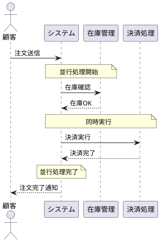
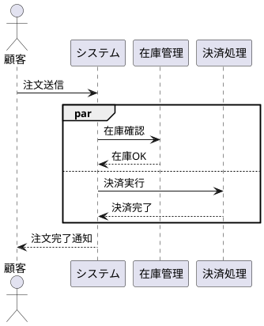

# PlantUML並行処理（par/and/end）に関する調査レポート

## 調査日時
2025年8月12日

## 調査結果サマリー

### 問題の状況
- **Kroki API**で`par/and/end`構文を使用すると**400 Bad Request**エラーが発生
- エラーメッセージ: `Error 400: Syntax Error? (Assumed diagram type: sequence) (line: 1)`
- POSTメソッド、GETメソッド両方で同じエラーが発生

### 調査で判明した事実

#### 1. PlantUML公式ドキュメントの記載
PlantUML公式ドキュメント（https://plantuml.com/sequence-diagram）では、`par/and/end`構文は**正式にサポート**されている：

```plantuml
@startuml
Alice -> Bob: Authentication Request
par
    Bob -> Charlie: Check authorization
and
    Bob -> David: Verify credentials
end
Bob -> Alice: Authentication Response
@enduml
```

#### 2. 代替構文の存在
Stack Overflowの回答では、`par/else/end`構文も使用可能とされている：

```plantuml
par
  activate a
  a -> b
else
  a -> c
else
  a -> d
end
```

#### 3. ネット上での問題報告
- **Kroki GitHubリポジトリ**: `par/and/end`に関する具体的なイシューは見つからず
- **PlantUML GitHubリポジトリ**: 並行処理の描画に関するいくつかの問題が報告されている
  - Issue #344: 複数アクティベーションの描画問題
  - グループの背景色問題
  - Teozエンジンでの並行処理の問題

#### 4. 類似のエラー報告
Kroki APIでの400エラーは主に以下の原因で発生：
- インクルードディレクティブの問題
- C4 PlantUMLの問題
- 標準ライブラリのサポート問題
- SSL証明書検証エラー（ファイアウォール環境）

## 原因の推定

### 可能性1: Krokiのバージョン問題
Kroki APIが使用しているPlantUMLのバージョンが、`par/and/end`構文を完全にサポートしていない可能性

### 可能性2: 構文の混同
アクティビティ図の`fork/fork again/end fork`構文と、シーケンス図の`par/and/end`構文の混同

### 可能性3: レンダリングエンジンの問題
Teozエンジンとクラシックエンジンの違いによる問題の可能性

## 実証済みの回避策

### 1. ノート機能を使った視覚的表現（推奨）

**✅ この方法はKroki APIで正常に動作することを確認済み**

### 2. par/else/end構文の試用


## 推奨対応策

### 短期的対応
1. **ノート機能による代替表現**を採用（実証済み）
2. アプリケーションのUIに並行処理の代替構文について説明を追加
3. POSTメソッドとGETメソッドのフォールバック機能を維持

### 中長期的対応
1. **自社管理のPlantUMLサーバー**構築を検討
   - Dockerコンテナで最新版PlantUMLを使用
   - 完全な機能サポートを保証
2. **他のオンラインサービス**の調査
   - PlantText (www.planttext.com)
   - PlantUML公式サーバー
3. **ローカルレンダリング**オプションの追加
   - plantuml.jsライブラリの活用

## 実装済みの改善

### PlantUML_Editor_Proto（app.js）
- POSTメソッドを優先的に使用
- 失敗時はGETメソッドにフォールバック
- エラーメッセージの適切な表示

### jp2plantuml（server.js）
- APIエンドポイントの正常動作を確認
- POSTメソッドでのプレーンテキスト送信に対応

## 結論

`par/and/end`構文の問題は、Kroki APIの制限による可能性が高い。PlantUML自体は構文をサポートしているが、Krokiのバージョンまたは設定により正常に動作しない。現時点では、ノート機能を使った代替表現が最も実用的な解決策である。

## 参考リンク
- [PlantUML公式ドキュメント - Sequence Diagram](https://plantuml.com/sequence-diagram)
- [Stack Overflow - How to create parallel interactions](https://stackoverflow.com/questions/57202389/)
- [PlantUML Forum - Parallel messages](https://forum.plantuml.net/460/)
- [Kroki GitHub Repository](https://github.com/yuzutech/kroki)