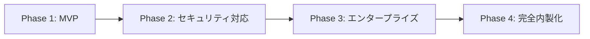
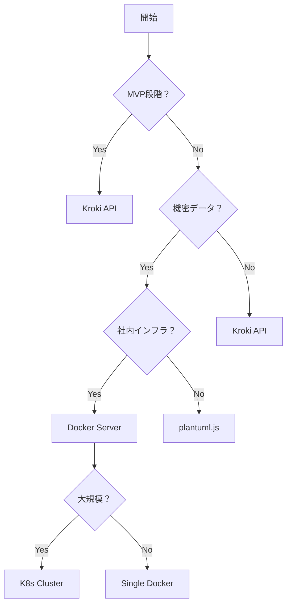

# PlantUMLレンダリング 段階的アプローチ戦略

## 📋 概要

PlantUMLの図生成において、**開発フェーズ**と**セキュリティ要件**に応じて最適なレンダリング方式を選択する段階的アプローチを採用します。

## 🎯 基本方針



---

## Phase 1: MVP開発（最初の2週間）

### 採用技術: **Kroki API**

#### 実装方法
```javascript
// シンプルな実装で高速開発
const KROKI_BASE_URL = 'https://kroki.io';

async function renderPlantUML(text) {
  const encoded = btoa(unescape(encodeURIComponent(text)));
  const url = `${KROKI_BASE_URL}/plantuml/svg/${encoded}`;
  return url;
}
```

#### メリット
- ✅ **セットアップ不要**（即座に利用開始）
- ✅ **高速レンダリング**（CDN経由）
- ✅ **多様な出力形式**（SVG/PNG/PDF）
- ✅ **インフラ管理不要**

#### デメリット
- ⚠️ 外部サービス依存
- ⚠️ インターネット接続必須
- ⚠️ 機密データの送信リスク

#### 適用基準
```yaml
使用する場合:
  - プロトタイプ開発
  - デモンストレーション
  - 個人利用
  - 非機密データのみ

使用しない場合:
  - 社内ネットワーク限定
  - 機密情報を含む
  - SLA要件がある
```

---

## Phase 2: セキュリティ対応（3-4週目）

### 採用技術: **Kroki API + plantuml.js ハイブリッド**

#### 実装方法
```javascript
import plantuml from 'plantuml-encoder';
import * as plantumljs from 'plantuml-js';

class HybridRenderer {
  constructor() {
    this.sensitiveKeywords = ['password', '機密', 'secret', '個人情報'];
  }

  async render(text, options = {}) {
    // 機密データチェック
    const isSensitive = this.checkSensitive(text);
    
    if (isSensitive || options.forceLocal) {
      // ローカルレンダリング（plantuml.js）
      return await this.renderLocal(text);
    } else {
      // APIレンダリング（Kroki）
      return await this.renderAPI(text);
    }
  }

  checkSensitive(text) {
    return this.sensitiveKeywords.some(keyword => 
      text.toLowerCase().includes(keyword)
    );
  }

  async renderLocal(text) {
    // ブラウザ内で完結
    const svg = await plantumljs.render(text);
    return `data:image/svg+xml;base64,${btoa(svg)}`;
  }

  async renderAPI(text) {
    const encoded = plantuml.encode(text);
    return `https://kroki.io/plantuml/svg/${encoded}`;
  }
}
```

#### 設定ファイル
```json
{
  "rendering": {
    "mode": "hybrid",
    "localThreshold": {
      "dataSize": 10000,
      "complexity": "high",
      "containsSensitive": true
    },
    "apiEndpoint": "https://kroki.io",
    "timeout": 5000,
    "retry": 3
  }
}
```

#### 判定ロジック
```javascript
function selectRenderer(diagram) {
  const factors = {
    size: diagram.length,
    hasSensitiveData: checkSensitiveData(diagram),
    complexity: estimateComplexity(diagram),
    userPreference: getUserPreference(),
    networkStatus: getNetworkStatus()
  };

  if (factors.hasSensitiveData) return 'local';
  if (factors.size > 10000) return 'local';
  if (factors.networkStatus === 'offline') return 'local';
  if (factors.complexity === 'simple') return 'api';
  
  return 'api'; // デフォルト
}
```

---

## Phase 3: エンタープライズ対応（5-6週目）

### 採用技術: **Docker PlantUML Server（自社管理）**

#### Docker構成
```yaml
# docker-compose.yml
version: '3.8'

services:
  plantuml:
    image: plantuml/plantuml-server:latest
    container_name: plantuml-server
    ports:
      - "8080:8080"
    environment:
      - PLANTUML_LIMIT_SIZE=16384
      - PLANTUML_STATS=true
      - PLANTUML_SECURITY_PROFILE=INTERNET
    volumes:
      - ./config:/config
      - ./cache:/var/cache/plantuml
    restart: unless-stopped
    healthcheck:
      test: ["CMD", "curl", "-f", "http://localhost:8080/png/SyfFKj2rKt3CoKnELR1Io4ZDoSa70000"]
      interval: 30s
      timeout: 10s
      retries: 3

  nginx:
    image: nginx:alpine
    container_name: plantuml-proxy
    ports:
      - "443:443"
      - "80:80"
    volumes:
      - ./nginx.conf:/etc/nginx/nginx.conf
      - ./ssl:/etc/nginx/ssl
    depends_on:
      - plantuml
```

#### Nginx設定（キャッシュ・SSL）
```nginx
# nginx.conf
upstream plantuml {
    server plantuml:8080;
}

server {
    listen 443 ssl http2;
    server_name plantuml.your-company.com;

    ssl_certificate /etc/nginx/ssl/cert.pem;
    ssl_certificate_key /etc/nginx/ssl/key.pem;

    # キャッシュ設定
    proxy_cache_path /var/cache/nginx levels=1:2 keys_zone=plantuml_cache:10m max_size=1g;
    proxy_cache_key "$scheme$request_method$host$request_uri";

    location / {
        proxy_pass http://plantuml;
        proxy_cache plantuml_cache;
        proxy_cache_valid 200 1h;
        proxy_cache_valid 404 1m;
        
        # セキュリティヘッダー
        add_header X-Content-Type-Options nosniff;
        add_header X-Frame-Options DENY;
        add_header X-XSS-Protection "1; mode=block";
    }
}
```

#### クライアント実装
```javascript
class EnterprisePlantUMLClient {
  constructor(config) {
    this.baseUrl = config.baseUrl || 'https://plantuml.your-company.com';
    this.timeout = config.timeout || 10000;
    this.cache = new Map();
  }

  async render(text, format = 'svg') {
    // キャッシュチェック
    const cacheKey = `${text}-${format}`;
    if (this.cache.has(cacheKey)) {
      return this.cache.get(cacheKey);
    }

    try {
      const encoded = this.encode(text);
      const url = `${this.baseUrl}/${format}/${encoded}`;
      
      const response = await fetch(url, {
        timeout: this.timeout,
        headers: {
          'Authorization': `Bearer ${this.getToken()}`,
          'X-Client-Version': '1.0.0'
        }
      });

      if (!response.ok) throw new Error(`HTTP ${response.status}`);
      
      const data = await response.blob();
      const objectUrl = URL.createObjectURL(data);
      
      // キャッシュ保存
      this.cache.set(cacheKey, objectUrl);
      
      return objectUrl;
    } catch (error) {
      console.error('Enterprise render failed:', error);
      // フォールバック処理
      return this.fallbackRender(text, format);
    }
  }

  fallbackRender(text, format) {
    // ローカルレンダリングにフォールバック
    return plantumljs.render(text, { format });
  }
}
```

---

## Phase 4: 完全内製化（7-8週目）

### 採用技術: **カスタムPlantUMLエンジン + CDN**

#### アーキテクチャ
```
┌─────────────┐     ┌──────────────┐     ┌─────────────┐
│   Client    │────▶│ Load Balancer│────▶│ PlantUML    │
│   (React)   │     │   (HAProxy)   │     │  Cluster    │
└─────────────┘     └──────────────┘     └─────────────┘
                             │                    │
                             ▼                    ▼
                    ┌──────────────┐     ┌─────────────┐
                    │     CDN      │     │   Cache     │
                    │  (CloudFront)│     │   (Redis)   │
                    └──────────────┘     └─────────────┘
```

#### Kubernetes設定
```yaml
# plantuml-deployment.yaml
apiVersion: apps/v1
kind: Deployment
metadata:
  name: plantuml-server
spec:
  replicas: 3
  selector:
    matchLabels:
      app: plantuml
  template:
    metadata:
      labels:
        app: plantuml
    spec:
      containers:
      - name: plantuml
        image: your-registry/plantuml-custom:latest
        ports:
        - containerPort: 8080
        resources:
          requests:
            memory: "512Mi"
            cpu: "500m"
          limits:
            memory: "1Gi"
            cpu: "1"
        env:
        - name: JAVA_OPTS
          value: "-Xmx768m -Djava.awt.headless=true"
        livenessProbe:
          httpGet:
            path: /health
            port: 8080
          initialDelaySeconds: 30
          periodSeconds: 10
---
apiVersion: v1
kind: Service
metadata:
  name: plantuml-service
spec:
  selector:
    app: plantuml
  ports:
    - protocol: TCP
      port: 80
      targetPort: 8080
  type: LoadBalancer
```

#### 高度な機能実装
```javascript
class AdvancedPlantUMLService {
  constructor() {
    this.workers = new WorkerPool(4);
    this.cache = new LRUCache({ max: 1000 });
    this.metrics = new MetricsCollector();
  }

  async renderWithOptimization(text, options = {}) {
    const startTime = Date.now();
    
    try {
      // 1. 構文検証
      const validation = await this.validate(text);
      if (!validation.isValid) {
        throw new ValidationError(validation.errors);
      }

      // 2. 最適化
      const optimized = await this.optimize(text);

      // 3. 並列レンダリング（複数フォーマット）
      const formats = options.formats || ['svg', 'png'];
      const results = await Promise.all(
        formats.map(format => 
          this.workers.execute('render', { text: optimized, format })
        )
      );

      // 4. 後処理（圧縮、最適化）
      const processed = await this.postProcess(results);

      // 5. メトリクス記録
      this.metrics.record({
        renderTime: Date.now() - startTime,
        inputSize: text.length,
        outputFormats: formats,
        success: true
      });

      return processed;
    } catch (error) {
      this.metrics.recordError(error);
      throw error;
    }
  }

  async optimize(text) {
    // PlantUML最適化
    return text
      .replace(/!define\s+(\w+)\s+(.+)/g, (match, name, value) => {
        // マクロ展開
        return `!define ${name} ${this.expandMacro(value)}`;
      })
      .replace(/skinparam\s+(\w+)\s+(.+)/g, (match, param, value) => {
        // スキンパラメータ最適化
        return `skinparam ${param} ${this.optimizeSkinParam(value)}`;
      });
  }

  async validate(text) {
    // 構文チェック
    const errors = [];
    const warnings = [];

    // 基本構文チェック
    if (!text.includes('@startuml')) {
      errors.push('Missing @startuml directive');
    }
    if (!text.includes('@enduml')) {
      errors.push('Missing @enduml directive');
    }

    // 日本語特有のチェック
    if (text.match(/[ぁ-ん]が[ぁ-ん]に/)) {
      warnings.push('日本語パターン検出: 変換が必要かもしれません');
    }

    return {
      isValid: errors.length === 0,
      errors,
      warnings
    };
  }
}
```

---

## 📊 フェーズ別比較表

| 項目 | Phase 1 | Phase 2 | Phase 3 | Phase 4 |
|------|---------|---------|---------|---------|
| **技術** | Kroki API | Hybrid | Docker | K8s Cluster |
| **コスト** | $0 | $0 | $50/月 | $500/月 |
| **性能** | 高速 | 中速 | 高速 | 超高速 |
| **セキュリティ** | 低 | 中 | 高 | 最高 |
| **可用性** | 95% | 98% | 99.5% | 99.99% |
| **スケーラビリティ** | 自動 | 制限あり | 手動 | 自動 |
| **実装期間** | 1日 | 1週間 | 2週間 | 1ヶ月 |
| **運用負荷** | なし | 低 | 中 | 高 |

---

## 🔄 移行戦略

### Phase 1 → Phase 2
```javascript
// 設定ファイルで切り替え
{
  "renderingMode": "hybrid",  // "api" から変更
  "enableLocalFallback": true
}
```

### Phase 2 → Phase 3
```javascript
// 環境変数で切り替え
PLANTUML_ENDPOINT=https://plantuml.internal.company.com
ENABLE_CACHE=true
CACHE_TTL=3600
```

### Phase 3 → Phase 4
```yaml
# Helm chartでデプロイ
helm install plantuml ./charts/plantuml \
  --set replicas=3 \
  --set ingress.enabled=true \
  --set persistence.enabled=true
```

---

## 📝 意思決定フローチャート



---

## 🎯 推奨事項

### EC/SaaS運用担当者向け
1. **開始時**: Phase 1（Kroki API）で素早く価値検証
2. **3週目**: Phase 2（ハイブリッド）で機密データ対応
3. **本番導入時**: Phase 3（Docker）で安定運用
4. **スケール時**: Phase 4（K8s）で大規模対応

### セキュリティチェックリスト
- [ ] 機密データの識別ルール定義
- [ ] ローカル/API切り替え基準の文書化
- [ ] アクセスログの監査
- [ ] SSL/TLS通信の強制
- [ ] データ保持ポリシーの策定

### パフォーマンス目標
| フェーズ | レスポンス時間 | 同時処理数 | 可用性 |
|---------|--------------|-----------|--------|
| Phase 1 | < 1秒 | 100 | 95% |
| Phase 2 | < 2秒 | 50 | 98% |
| Phase 3 | < 1秒 | 200 | 99.5% |
| Phase 4 | < 500ms | 1000 | 99.99% |

---

## 📚 参考資料

- [PlantUML公式](https://plantuml.com/)
- [Kroki Documentation](https://docs.kroki.io/)
- [plantuml-js GitHub](https://github.com/plantuml/plantuml-js)
- [PlantUML Server Docker](https://hub.docker.com/r/plantuml/plantuml-server)

---

*最終更新: 2025年8月9日*  
*バージョン: 1.0*