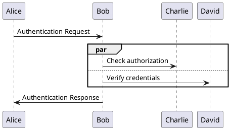

# PlantUML日本語変換プロジェクト

## 概要
日本語からPlantUMLを生成するツール群のプロジェクトです。
ビジネスユーザーが自然な日本語で業務フローを記述し、自動的にUML図を生成できるようにすることを目的としています。

## プロジェクト構成

### 1. PlantUML_Editor_Proto
PlantUML変換エディターのプロトタイプ実装。
- **場所**: `/PlantUML_Editor_Proto`
- **特徴**: アクター選択UI、ドラッグ&ドロップ、draw.io連携
- **対象**: EC/SaaS運用担当者

### 2. jp2plantuml
日本語からPlantUMLへの変換Webアプリケーション。
- **場所**: `/jp2plantuml`
- **特徴**: 自然言語処理、複数図形対応、Docker対応
- **対象**: 開発者・ビジネスアナリスト

## 重要な技術的制限事項 ⚠️

### Kroki APIの並行処理構文について

本プロジェクトで使用しているKroki APIには、PlantUML標準仕様との差異があります。

#### PlantUML標準仕様とKroki APIの違い

| 項目 | PlantUML標準仕様 | Kroki API | 状態 |
|------|-----------------|-----------|------|
| 並行処理構文 | `par/and/end` | `par/else/end` | ⚠️ 非互換 |
| シーケンス図 | 完全サポート | 完全サポート | ✅ |
| アクティビティ図 | 完全サポート | 完全サポート | ✅ |
| クラス図 | 完全サポート | 完全サポート | ✅ |
| ガント図 | 完全サポート | 制限あり | ⚠️ |

#### 並行処理の例

**PlantUML公式仕様（Krokiでエラー）:**
```plantuml
@startuml
Alice -> Bob: Authentication Request
par
    Bob -> Charlie: Check authorization
and
    Bob -> David: Verify credentials
end
Bob -> Alice: Authentication Response
@enduml
```

**Kroki API対応版:**


### なぜこの違いが存在するのか

1. **Kroki APIのバージョン**: Kroki APIが使用しているPlantUMLバージョンが古い、または独自の実装をしている可能性
2. **レンダリングエンジン**: Teozエンジンとクラシックエンジンの違いによる可能性
3. **意図的な仕様変更**: Kroki側での独自の解釈や最適化による可能性

### 推奨される対処法

#### 短期的対応（実装済み）
- 両アプリケーションで`par/else/end`構文を使用するよう修正済み
- ユーザーガイドとドキュメントに制限事項を明記

#### 中長期的対応（検討中）
1. **自社PlantUMLサーバー構築**
   - Docker版PlantUMLサーバーの導入
   - 完全な仕様準拠を実現
   
2. **代替レンダリングサービス**
   - PlantText (www.planttext.com)
   - PlantUML公式サーバー
   
3. **ローカルレンダリング**
   - plantuml.jsライブラリの活用
   - ブラウザ内での完結した処理

## クイックスタート

### PlantUML_Editor_Proto
```bash
# ブラウザで開く
open PlantUML_Editor_Proto/index.html

# またはHTTPサーバーで起動
npx http-server PlantUML_Editor_Proto -p 8080
```

### jp2plantuml
```bash
# Docker環境
cd jp2plantuml
docker-compose up -d

# ローカル環境
cd jp2plantuml
npm install
npm start
```

## 技術文書

### 主要ドキュメント
- [PRD_完全統合版.md](PRD_完全統合版.md) - 製品要求定義書
- [PlantUMLレンダリング段階的アプローチ.md](PlantUMLレンダリング段階的アプローチ.md) - レンダリング戦略
- [draw.io_XML最適化実装ガイド.md](draw.io_XML最適化実装ガイド.md) - draw.io連携仕様

### 調査レポート
- [PlantUML_Editor_Proto/並行処理調査レポート.md](PlantUML_Editor_Proto/並行処理調査レポート.md) - Kroki API制限事項の詳細調査

## テスト

### 並行処理テスト
```bash
# par/else/end構文のテスト（正常動作）
PlantUML test-par-else.puml

# par/and/end構文のテスト（Krokiでエラー）
PlantUML test-par-and.puml
```

### ブラウザテスト
- [PlantUML_Editor_Proto/test-parallel.html](PlantUML_Editor_Proto/test-parallel.html) - 並行処理のブラウザテスト

## トラブルシューティング

### Q: 並行処理がレンダリングされない
**A**: Kroki APIでは`par/and/end`ではなく`par/else/end`を使用してください。

### Q: 図が表示されない
**A**: インターネット接続とKroki APIへのアクセスを確認してください。

### Q: 文字化けする
**A**: ファイルのエンコーディングがUTF-8であることを確認してください。

## 貢献

プロジェクトへの貢献を歓迎します。以下の点にご注意ください：

1. Kroki APIの制限事項を理解した上でコードを書く
2. 新機能追加時は両アプリケーションへの影響を考慮
3. テストケースの追加を忘れずに

## ライセンス
MIT License

## 作成者
PlantUML変換ツール開発チーム

---

*最終更新: 2025年8月12日*
*バージョン: 1.0.0*