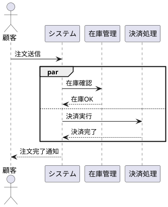
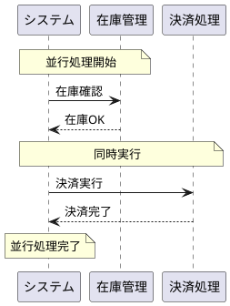

# jp2plantuml - 日本語からPlantUML変換アプリケーション

## 概要
日本語テキストからPlantUMLコードを自動生成し、図として表示するWebアプリケーションです。
自然な日本語表現から、シーケンス図、アクティビティ図、クラス図、ガント図などを作成できます。

## 機能

### 対応図形
- **シーケンス図**: アクター間のメッセージやり取り
- **アクティビティ図**: 処理フローやワークフロー
- **クラス図**: クラス間の関係
- **ガント図**: プロジェクトスケジュール  
- **状態遷移図**: 状態の遷移
- **ユースケース図**: ユースケースとアクターの関係

### 主要機能
- 日本語テキストの自動解析と変換
- Kroki APIを使用したリアルタイムレンダリング
- SVGおよびPNG形式での出力
- 注釈機能（Canvas API）
- 画像解析機能（OCR）

## 使用方法

### Docker環境での起動
```bash
# ビルドと起動
docker-compose build
docker-compose up -d

# アクセス
http://localhost:3001
```

### ローカル環境での起動
```bash
# 依存関係インストール
npm install

# サーバー起動
npm start
# または開発モード
npm run dev

# アクセス
http://localhost:3000
```

## API仕様

### エンドポイント

#### POST /api/convert
日本語テキストをPlantUMLコードに変換

**リクエスト:**
```json
{
  "text": "顧客がECに注文を送る",
  "diagramType": "sequence"
}
```

**レスポンス:**
```json
{
  "plantuml": "@startuml\nparticipant 顧客\nparticipant EC\n顧客 -> EC: 注文\n@enduml",
  "warnings": []
}
```

#### POST /api/render
PlantUMLコードをSVG画像に変換

**リクエスト:**
```json
{
  "plantuml": "@startuml\n...\n@enduml"
}
```

**レスポンス:**
```json
{
  "svg": "<svg>...</svg>"
}
```

## 重要な制限事項 ⚠️

### Kroki APIの並行処理構文の制限
本アプリケーションが使用しているKroki APIは、PlantUML標準仕様の`par/and/end`構文をサポートしていません。
代わりに`par/else/end`構文を使用する必要があります。

**PlantUML標準仕様（Krokiでは動作しない）:**
```plantuml
@startuml
actor 顧客
participant システム
participant 在庫管理
participant 決済処理

顧客 -> システム : 注文送信

par
  システム -> 在庫管理 : 在庫確認
  在庫管理 --> システム : 在庫OK
and
  システム -> 決済処理 : 決済実行
  決済処理 --> システム : 決済完了
end

システム --> 顧客 : 注文完了通知
@enduml
```

**Kroki API対応構文（代替案）:**


この制限はKroki APIの実装によるものであり、PlantUML自体の仕様では`and`が正式な構文です。

### 推奨される回避策
並行処理を表現する場合は、以下の方法を推奨します：

1. **ノートを使用した視覚的表現**


2. **将来的な対応**
- 自社管理のPlantUMLサーバー構築により、完全な仕様サポートを検討中
- Docker版PlantUMLサーバーでは`par/and/end`が正常に動作します

## 技術スタック
- **バックエンド**: Node.js + Express
- **フロントエンド**: Vanilla JavaScript
- **コンテナ**: Docker + Docker Compose
- **レンダリング**: Kroki API
- **OCR**: Tesseract.js
- **画像処理**: Canvas API

## ディレクトリ構造
```
jp2plantuml/
├── Dockerfile
├── docker-compose.yml
├── package.json
├── server.js           # Expressサーバー
├── public/            # フロントエンド
│   ├── index.html
│   ├── main.js
│   ├── styles.css
│   ├── annotation.js  # 注釈機能
│   └── image-analyzer.js # 画像解析
└── src/               # バックエンド処理
    ├── convert.js     # 変換エンジン
    └── parsers/       # 図種別パーサー
        ├── activity.js
        ├── class.js
        ├── gantt.js
        ├── sequence.js
        ├── state.js
        └── usecase.js
```

## ライセンス
MIT License

## 作成者
PlantUML変換ツール開発チーム

---

*最終更新: 2025年8月12日*