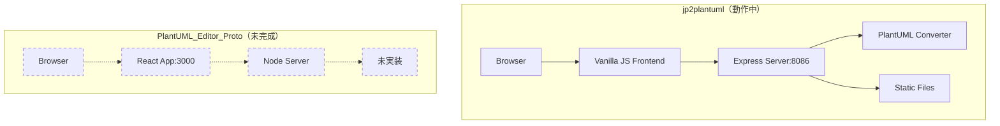
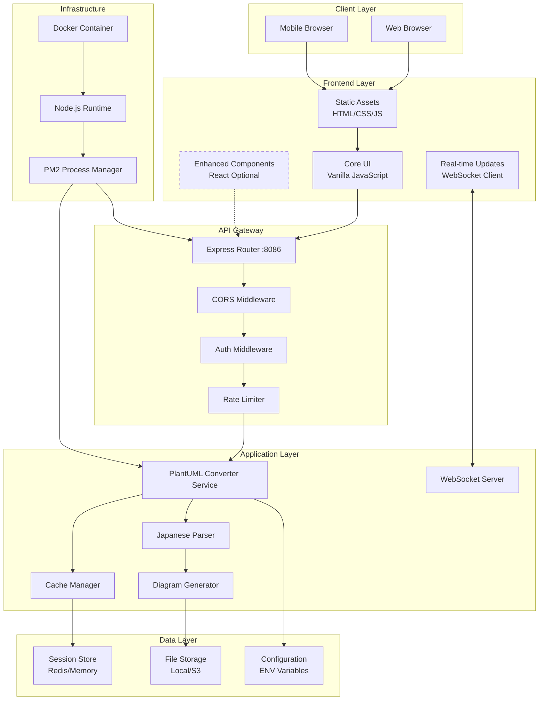
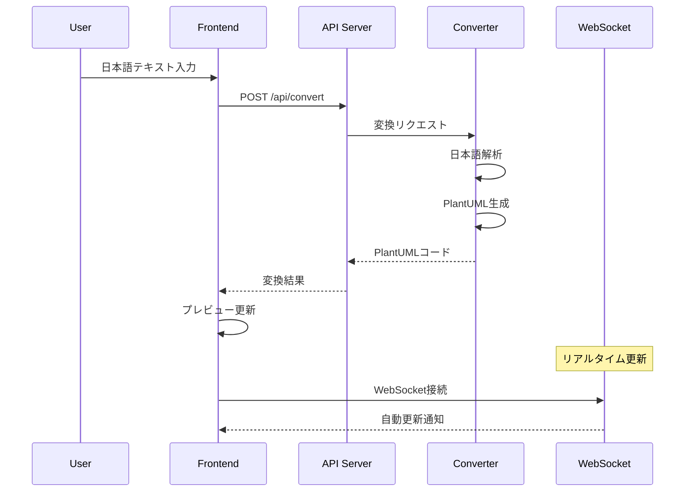
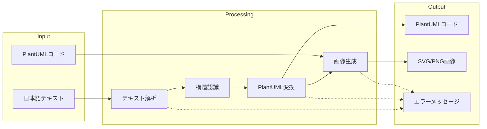
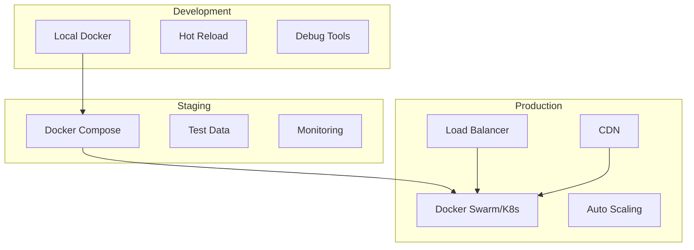
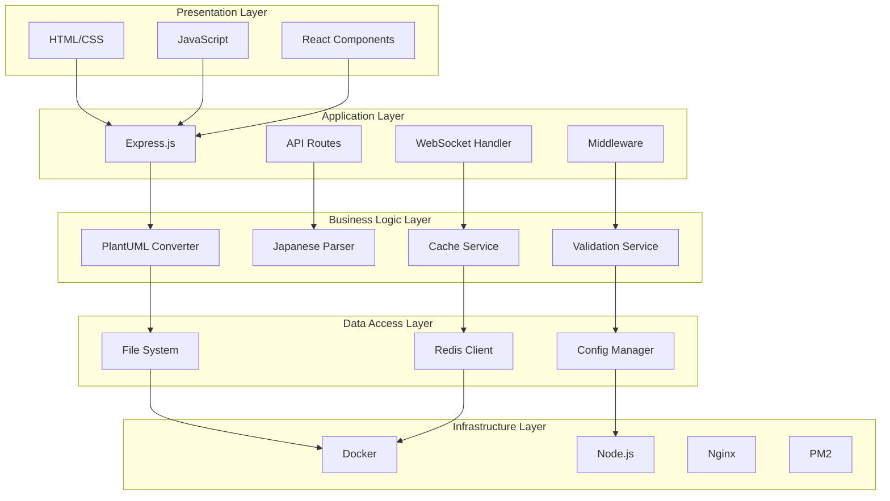
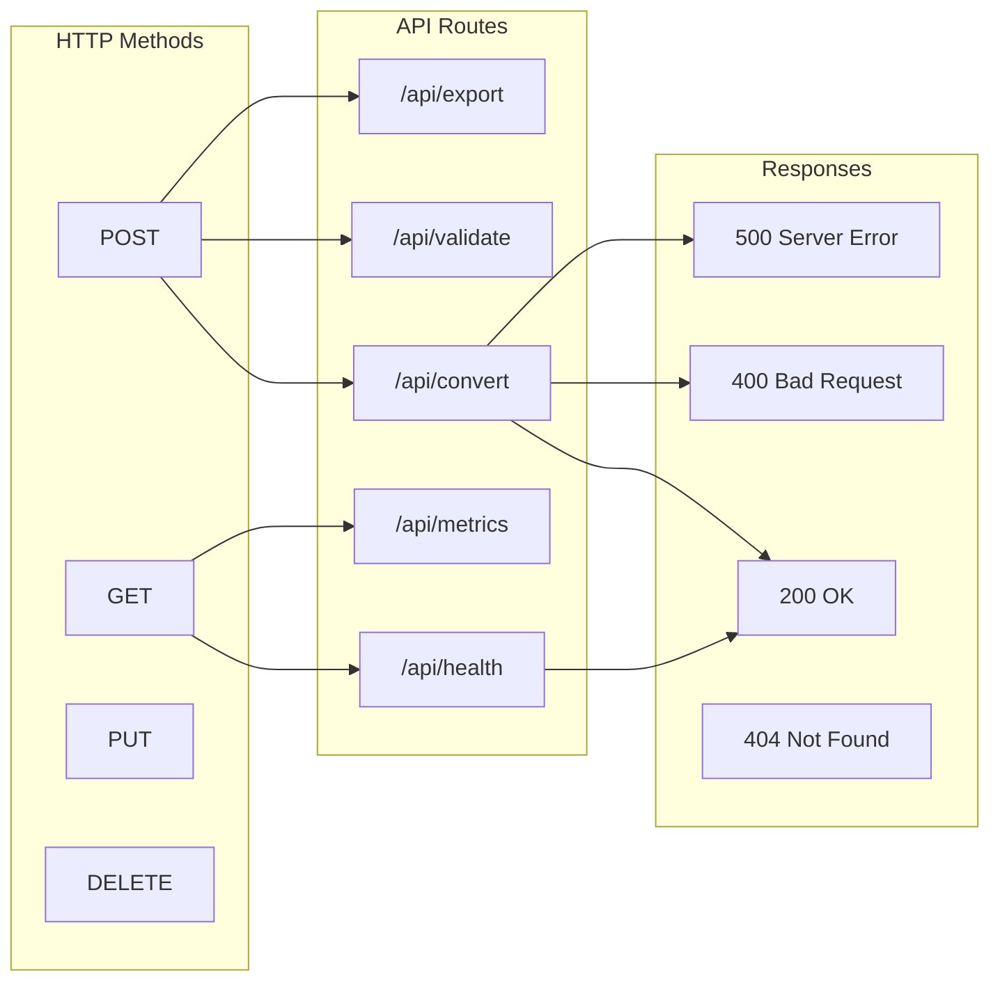
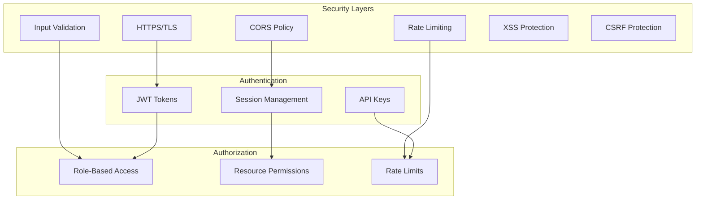
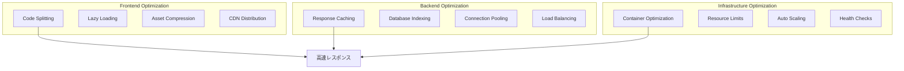
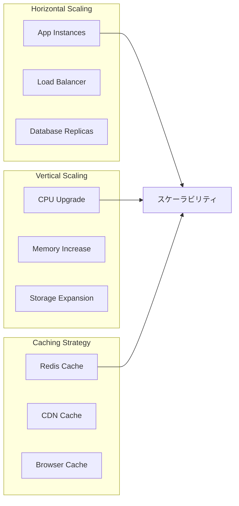

# PlantUML統合アプリケーション アーキテクチャ図

**作成日**: 2025年1月14日  
**バージョン**: 1.0  
**目的**: 統合後のシステムアーキテクチャの可視化

## 現在のアーキテクチャ（As-Is）

## 統合後のアーキテクチャ（To-Be）

## コンポーネント相互作用図

## データフロー図

## デプロイメントアーキテクチャ

## システム層構成

## API エンドポイント構成

## セキュリティアーキテクチャ

## 技術スタック概要

| レイヤー | 技術 | 用途 |
|---------|------|------|
| **Frontend** | Vanilla JS (主) + React (補助) | UI実装 |
| **Backend** | Node.js + Express | APIサーバー |
| **Real-time** | Socket.io / WebSocket | リアルタイム通信 |
| **Container** | Docker + Docker Compose | コンテナ化 |
| **Process** | PM2 | プロセス管理 |
| **Cache** | Redis / In-Memory | キャッシング |
| **Storage** | Local FS / S3 | ファイル保存 |
| **CI/CD** | GitHub Actions | 自動化パイプライン |
| **Testing** | Jest + Playwright | 自動テスト |
| **Monitoring** | Prometheus + Grafana | 監視・可視化 |

## パフォーマンス最適化ポイント

## スケーラビリティ戦略

---

**更新履歴**:
- 2025/01/14: 初版作成
- 統合アーキテクチャの定義
- コンポーネント図の作成
- データフロー図の追加